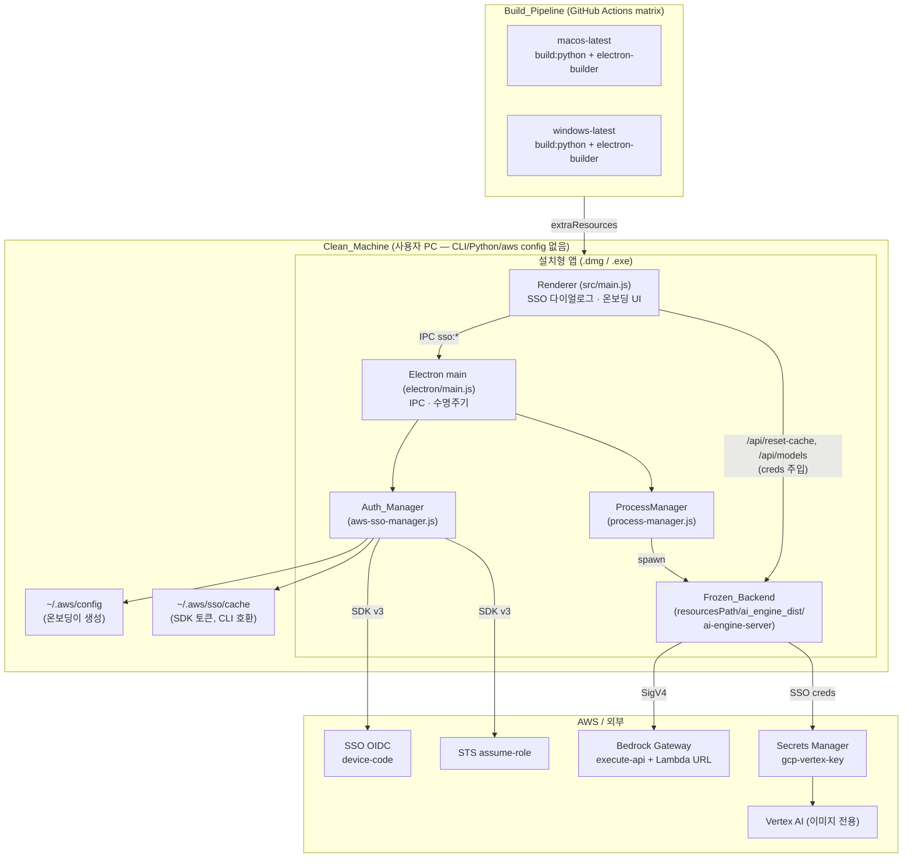
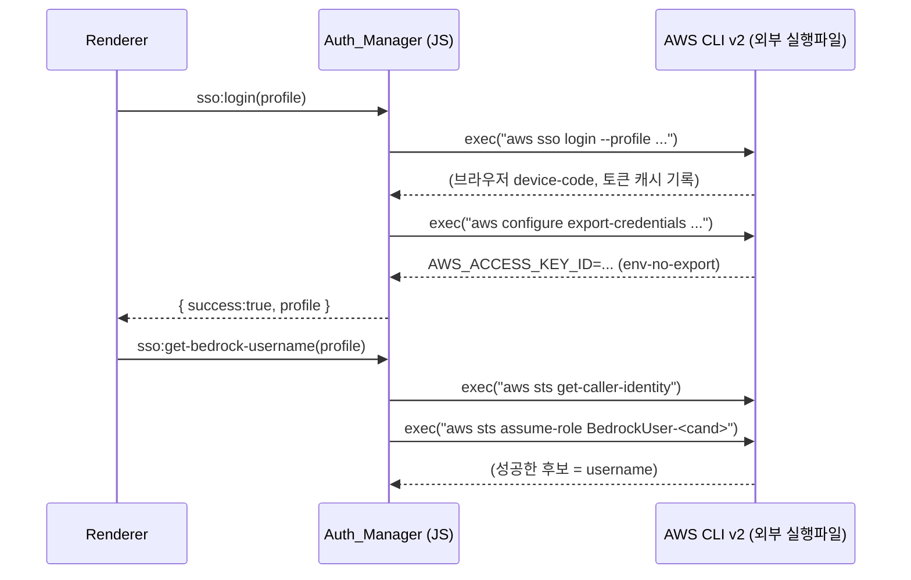
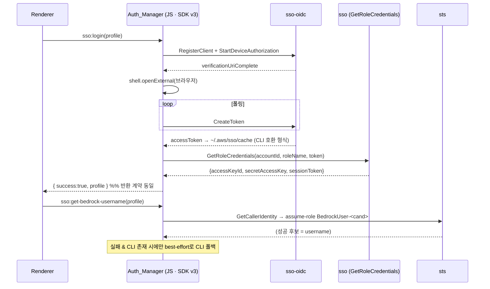

# Design Document

## Overview

이 설계는 `agentic-editor` Electron 앱을 사내 약 25명에게 **설치형 앱**(macOS `.dmg`,
Windows `.exe`)으로 배포하기 위한 하드닝·패키징 설계다. 최상위 원칙은 **보존
(Preservation)** 이다. 인증 → Bedrock Gateway 런타임(SSO 로그인, 자격증명 주입,
SigV4 서명, BedrockUser assume-role, 토큰 만료 3회 재시도, `us.` prefix 폴백, 로그인
시 Secrets Manager 기반 Vertex 자동 활성화)과 모든 에디터 기능(Monaco, 터미널,
파일 작업, 원격 SSH, LLM 채팅, PPTX/다이어그램/이미지 생성, 하이브리드 렌더)의
**기능적 동작은 변경하지 않는다.** 변경 대상은 오직 "클린 설치 배포를 막는 차단
요소"다.

이 설계는 디스크에서 검증한 실제 코드에 근거한다. 참조한 핵심 파일:

- `electron/core/aws-sso-manager.js` — `Auth_Manager`. `aws sso login` /
  `aws configure export-credentials` / `aws sts` 를 `child_process.exec`로 shell-out.
- `electron/core/process-manager.js` — 패키징 시 `process.resourcesPath/ai_engine_dist/
  ai-engine-server/` 동결 바이너리 실행, `AE_GENERATED_ROOT`(userData 하위) 주입,
  node-pty → spawn 폴백.
- `electron/main.js` — IPC 등록·수명주기 단일 진입점. `whenReady`에서 백엔드 기동
  전 `127.0.0.1:8765/health` HEAD 체크.
- `electron/src/ipc-sso-handlers.js` — `sso:list-profiles/login/get-credentials/
  get-bedrock-username/get-expiry` IPC 핸들러.
- `src/main.js` — 렌더러. 로그인 후 `getCredentials` → `/api/reset-cache`,
  `/api/models`(POST)로 자격증명을 백엔드에 직접 주입.
- `ai_engine/gateway_module.py` — `GatewayClient`. `inject_credentials`, botocore
  `SigV4Auth`(execute-api/lambda), assume-role, 3회 재시도, `us.` prefix 폴백,
  `/converse` 300초 타임아웃. Gateway URL 하드코딩(execute-api + Lambda Function URL).
- `ai_engine/vertex_image_module.py` — Secrets Manager(`agentic-editor/gcp-vertex-key`)
  → env → permanent → local cache → userData 순으로 GCP 키 해석, 실패 시 안전 비활성.
- `scripts/start_server.py` — 개발 진입. `aws configure export-credentials` shell-out
  로 자격증명 사전 로드 후 uvicorn 기동.
- `ai_engine/run_server.py` — 동결 진입. reload 없이 `app` 객체 직접 전달,
  `AE_BACKEND_PORT`(기본 8765). 자격증명은 앱이 `/api/reset-cache`로 주입하므로 사전
  로드 선택적.
- `ai-engine-server.spec` — PyInstaller onedir 스펙. `collect_all`로 서드파티 수집.
- `electron-builder.yml` — 패키징 설정. `extraResources`로 `ai_engine_dist` 번들,
  `asarUnpack` node-pty, publish에 `OWNER_PLACEHOLDER`/`REPO_PLACEHOLDER`.
- `.github/workflows/release.yml` — macOS/Windows matrix 빌드→GitHub Releases.

### 요구사항 매핑 (Requirement → 설계 컴포넌트)

| 요구사항 | 설계 대응 |
|----------|-----------|
| R1 동결 백엔드 빌드·스모크 | Build_Pipeline 강화 + Smoke_Harness(신규) + spec hidden-import 감사 |
| R2 botocore 인증 마이그레이션 | Auth_Manager를 AWS SDK for JavaScript v3로 재구현(계약 보존) |
| R3 macOS 서명·공증 | electron-builder.yml mac 서명/notarize + release.yml env 배선 |
| R4 미구성 SSO 온보딩 | Onboarding_Flow(신규 렌더러 UI) + `~/.aws/config` writer |
| R5 에디터 기능 보존 | 무변경 보존 + Smoke_Harness 회귀 확인 |
| R6 문서·설정 정합화 | gateway.md 재작성 + publish placeholder 대체 |
| R7 정직한 검증 | verification.md(신규): in-repo vs clean-machine 분리 게이트 |

### 핵심 설계 결정 요약

- **R2 언어 선택**: `Auth_Manager`는 Electron main(JS)에 있고, 렌더러→IPC→
  자격증명 주입 경로가 모두 JS다. 요구사항 용어집의 "Botocore_Auth"는 Python 라이브러리
  이지만, 이 코드를 Python으로 옮기면 "인증이 Python 백엔드 기동에 의존"하는 닭-달걀
  문제가 생긴다(설계 note: Python 도달 가능성을 전제하지 말 것). 따라서 **CLI shell-out을
  AWS SDK for JavaScript v3(botocore의 JS 등가물)로 대체**하고 인증 계층을 JS에 그대로
  둔다. 이로써 IPC 계약·반환 형태·자격증명 주입 경로를 100% 보존한다. Python 측
  (`gateway_module.py`)은 이미 botocore를 사용하므로 그대로 보존된다. 상세·한계는
  [Components: Auth_Manager](#2-auth_manager-aws-cli--sdk-v3-r2) 참조.
- **보존 우선**: `gateway_module.py`, `process-manager.js`의 런타임 분기, Vertex 자동
  활성화는 **코드 변경 없음**. 검증은 기존 회귀 테스트 + 스모크로 수행.

---

## Architecture

### 시스템 구성 (배포 관점)



### 인증 흐름 — Before / After (R2)

`aws sso login`(대화형 브라우저 device-code)이 가장 어려운 부분이다. AWS CLI는 내부적으로
`sso-oidc`의 `RegisterClient → StartDeviceAuthorization → (브라우저) → CreateToken` 폴링을
수행한다. SDK v3의 `fromSSO`는 **대화형 로그인을 수행하지 않고** 캐시된 토큰만 읽으므로,
device-code 흐름은 `@aws-sdk/client-sso-oidc`로 직접 구현해야 한다.

**Before (현재 — CLI 강한 의존):**



**After (SDK v3 — CLI 불요):**



핵심: **After에서도 렌더러가 보는 반환 계약(`{success, profile}` / env-var 키 형태의
자격증명)과 IPC 채널·자격증명 주입 경로는 Before와 완전히 동일하다.** 렌더러(`src/main.js`)와
Python 주입 경로(`/api/reset-cache`, `/api/models`)는 무변경.

### 배포·기동 시퀀스 (R1/R5 보존)

1. `Build_Pipeline`이 OS별 러너에서 `npm run build:python`(PyInstaller onedir) →
   `ai_engine_dist/ai-engine-server/` 생성 → `electron-builder`가 `extraResources`로 번들.
2. 설치 후 실행: `electron/main.js`가 `127.0.0.1:8765/health` HEAD 체크 → 미기동 시
   `ProcessManager.startPython()` → 패키징 분기에서 동결 바이너리 실행(`run_server.py`
   경유, Python 설치 불요).
3. 렌더러: `SSO_Profile` 없으면 `Onboarding_Flow`, 있으면 로그인 → 자격증명 주입.

---

## Components and Interfaces

### 1. Build_Pipeline + Frozen_Backend (R1)

**변경 대상 파일**: `ai-engine-server.spec`(감사·보강), `.github/workflows/release.yml`
(빌드 실패 게이트·모듈 검증 스텝 추가). `run_server.py`는 무변경.

**hidden-import 감사**: 현재 `_THIRD_PARTY`에 `matplotlib`, `scipy`, `numpy`, `sklearn`,
`pptx`, `langgraph`, `langchain_core` 등이 이미 `collect_all` 대상에 포함되어 있다.
그러나 `collect_all`은 미설치 패키지를 조용히 건너뛴다(`except: pass`). 따라서 R1.3의
필수 4모듈(`matplotlib`, `scipy`, `langgraph`, `pptx`)에 대해 **빌드 시 존재 검증**을
추가한다.

- 빌드 전 검증 스텝(release.yml): `python -c "import matplotlib, scipy, langgraph, pptx"`.
  실패 시 잡을 즉시 실패시키고 누락 모듈명을 로그로 출력(R1.6).
- `matplotlib` 데이터(폰트/`mpl-data`), `scipy` 네이티브 `.so/.pyd`가 onedir에 포함되는지
  `collect_all` 결과를 신뢰하되, 스모크에서 실제 import로 재확인(R1.3).

**Smoke_Harness (신규)**: `scripts/smoke_frozen_backend.py`. 개발 백엔드와 동결
바이너리 **양쪽**에 대해 동일하게 실행 가능해야 한다.

```
smoke_frozen_backend.py --target <dev|frozen> [--binary <path>] [--base http://127.0.0.1:8765]
```

- 대상 기동(동결이면 바이너리 spawn, dev면 `start_server.py`) 후 `/health`를 30초까지
  폴링(R1.4).
- 기능별 대표 경로 1회 실행(R1.5) — 실제 존재하는 엔드포인트에 매핑:

  | 경로 | 검증 방법(실 엔드포인트) |
  |------|--------------------------|
  | 부팅/모듈 | `GET /health` 200 + 응답에 준비 상태 |
  | LLM 채팅 | `POST /api/models`(creds 주입) 200 → `POST /api/agents/run-stream` 짧은 프롬프트 SSE 수신 |
  | PPTX 생성 | `run-stream`/`run-agent`로 pptx 생성 도구 유도 → 산출 `.pptx` 존재 → `POST /api/media/pptx-render` 파싱 성공 |
  | 다이어그램 | `run-*`로 다이어그램 도구 유도 → `.pptx/.png` 산출 확인 |
  | 이미지 생성 | `GET /api/debug/image-gen-status`로 라우팅 상태 확인 → 이미지 도구 유도(성공 또는 네이티브 폴백) |
  | 하이브리드 렌더 | HTML→PNG 브리지 경유 렌더 산출물 존재 확인 |

- 판정: 모든 경로 성공이면 PASS. 하나라도 실패면 실패 경로명·원인을 수집해 리포트하고
  종료 코드 ≠ 0(R1.7). 판정 집계 로직은 순수 함수로 분리(Correctness Property 7).
- 주의: LLM/이미지 경로는 유효 자격증명이 필요하므로, dev/CI에서는 mock 또는
  자격증명 주입 여부에 따라 "skip(사유 기록)" 처리하고, 최종 판정은 클린머신에서 수행
  (R7과 연계).

**인터페이스 (판정 집계 — hermetic 테스트 대상)**:

```python
# scripts/smoke_frozen_backend.py
def evaluate_smoke(results: list[dict]) -> dict:
    """results: [{"path": "LLM 채팅", "ok": bool, "error": str|None}, ...]
    반환: {"passed": bool, "failed_paths": [ {"path","error"} ... ]}
    passed == all(r["ok"] for r in results)
    """
```

### 2. Auth_Manager (AWS CLI → SDK v3) (R2)

**변경 대상 파일**: `electron/core/aws-sso-manager.js` 재구현. IPC 핸들러
(`ipc-sso-handlers.js`)와 렌더러(`src/main.js`)는 **무변경**(계약 보존).

**의존성 추가**(프로덕션 dependency, electron-builder가 자동 번들):
`@aws-sdk/client-sso-oidc`, `@aws-sdk/client-sso`, `@aws-sdk/client-sts`,
`@aws-sdk/credential-providers`. 모두 순수 JS(네이티브 빌드 없음) → 크로스플랫폼 안전.

**메서드별 마이그레이션 (반환 계약 불변)**:

| 메서드 | Before (shell-out) | After (SDK v3) | 반환 계약 |
|--------|--------------------|-----------------|-----------|
| `listProfiles()` | `~/.aws/config` 파싱 | **무변경** — 파일 파싱 + 정렬 유지 | `string[]` (bedrockuser-* 상단) |
| `login(profile)` | `aws sso login` + export | sso-oidc device-code + `GetRoleCredentials` 검증 | `{success:true, profile}` / `{success:false, error}` |
| `getCredentials(profile)` | `aws configure export-credentials` | `fromSSO({profile})().` → env-var 키 매핑 | `{AWS_ACCESS_KEY_ID, AWS_SECRET_ACCESS_KEY, AWS_SESSION_TOKEN, AWS_DEFAULT_REGION}` 또는 `null` |
| `getBedrockUsername(profile)` | `sts get-caller-identity`+`assume-role` | `STSClient` `GetCallerIdentity`+`AssumeRole` | `string` (후보/폴백) |

**`login` device-code 흐름 (SDK v3)**:

1. `~/.aws/config`의 `[profile ...]`에서 `sso_start_url`, `sso_region`, `sso_account_id`,
   `sso_role_name`(또는 `sso_session` 참조) 파싱.
2. `SSOOIDCClient(region=sso_region)`:
   - `RegisterClient({clientName, clientType:"public"})`
   - `StartDeviceAuthorization({clientId, clientSecret, startUrl})`
   - `shell.openExternal(verificationUriComplete)` (Electron)로 브라우저 오픈.
   - `interval` 간격으로 `CreateToken({grantType:"urn:ietf:params:oauth:grant-type:device_code", deviceCode})`
     폴링. `AuthorizationPendingException`이면 대기, 만료 시 실패.
3. 획득 토큰을 **AWS CLI 호환 형식**으로 `~/.aws/sso/cache/<sha1(startUrl)>.json`에 기록
   (`{startUrl, region, accessToken, expiresAt}`). 이로써 (a) 기존 `sso:get-expiry`
   핸들러가 캐시를 계속 읽고, (b) Python `gateway_module.py`의 `boto3.Session(profile)`
   SSO 해석도 동일 캐시를 재사용한다(보존).
4. `SSOClient.GetRoleCredentials`로 자격증명 검증 → 성공 시 `{success:true, profile}`.

**한계·폴백 (정직한 서술)**:

- SDK v3 device-code 흐름은 CLI `aws sso login`의 UX를 기능적으로 재현하지만 100%
  동일하지는 않다(예: 브라우저 자동 오픈 타이밍, 다중 `sso_session` 구성의 엣지).
- **폴백 전략**: SDK 경로가 실패하고 **AWS CLI가 존재할 때에 한해** best-effort로 기존
  `aws sso login` shell-out을 시도한다. CLI가 없으면 폴백 없이 명확한 오류를 반환한다.
  이는 "CLI 강한 의존 제거"(R2.1)를 만족하면서, CLI가 있는 사용자에게는 회귀가 없도록
  한다. CLI 유무는 `which aws`/`where aws` 탐지로 판정.
- `getBedrockUsername`의 후보 생성 규칙(이메일 `first.last` → `first.slice(0,2)+last` 등)과
  폴백은 **로직 그대로 유지**하고 실행 수단만 STS SDK 호출로 바꾼다.

**`start_server.py` (개발 진입) 보조 정리**: `load_credentials`가 `aws configure
export-credentials` shell-out을 사용한다. 이는 **개발 진입 전용**이며 동결 경로
(`run_server.py`)는 사용하지 않는다(자격증명은 앱이 주입). CLI 의존을 완전히 없애기 위해
`start_server.py`의 사전 로드를 `boto3.Session(profile).get_credentials()`(botocore)로
대체한다(선택적·개발 편의, 실패해도 기동 계속 — 주입이 실제 경로).

**Gateway_Client 보존 (R2.8)**: `gateway_module.py`는 **코드 변경 없음**. `inject_credentials`,
`SigV4Auth`(execute-api/lambda), assume-role(`BedrockUser-{name}`), 만료 3회 재시도,
`us.` prefix 폴백, `/converse` 300초 타임아웃 모두 현행 유지. 검증은 기존 회귀 테스트로.

### 3. Packaging_System — 서명·공증 (R3)

**변경 대상 파일**: `electron-builder.yml`(mac 서명/notarize), `.github/workflows/release.yml`
(env 배선 활성화). `Signing_Assets`(Apple Developer ID 인증서)는 **USER-PROVIDED** —
이 스펙은 발급하지 않는다(R3.6).

`electron-builder.yml` `mac` 섹션에 추가:

```yaml
mac:
  hardenedRuntime: true
  gatekeeperAssess: false
  entitlements: build/entitlements.mac.plist
  entitlementsInherit: build/entitlements.mac.plist
  notarize: false   # env로 활성화 — 아래 참조
```

- **서명**: electron-builder는 `CSC_LINK`(인증서 base64/경로) + `CSC_KEY_PASSWORD`
  환경변수가 있으면 자동 서명한다(R3.3). 별도 코드 불요 — env 존재만으로 동작.
- **공증**: `APPLE_ID` + `APPLE_APP_SPECIFIC_PASSWORD` + `APPLE_TEAM_ID` 환경변수로
  공증(R3.2). electron-builder 최신 스키마는 `notarize: true`(또는 `{teamId}`)와 위
  env 조합으로 처리.
- **엔타이틀먼트**: `hardenedRuntime`이 공증 필수 조건이므로 `build/entitlements.mac.plist`
  추가(`com.apple.security.cs.allow-jit`, `allow-unsigned-executable-memory` 등 —
  Electron/PyInstaller 바이너리 실행 허용).
- **미서명 폴백(R3.5)**: `release.yml` 빌드 스텝 앞에 서명 env 존재 여부 체크 스텝 추가.
  없으면 "⚠️ 미서명 빌드(서명 자산 미제공)" 로그 출력 후 빌드 계속(현재도 미서명 시 진행됨).

### 4. Onboarding_Flow (R4)

**변경 대상 파일**: `src/main.js`(온보딩 다이얼로그 추가), 신규 IPC
`aws:write-sso-profile`(`electron/main.js`에 등록, 핸들러는 `Auth_Manager` 또는
신규 모듈). `security.md` 준수: IPC 핸들러는 main.js에서만 등록.

**흐름**:

1. 부팅 시 `listProfiles()`가 빈 배열이면(=`SSO_Profile` 부재) 로그인 다이얼로그 대신
   **온보딩 화면** 표시(R4.1). 현재 `src/main.js`는 `!state.settings?.awsProfile`이면
   `showSSODialog(true)`를 호출하므로, 프로파일 목록이 비었는지 추가 판정해 분기.
2. 사용자가 start URL / region / account id / role name 입력(R4.2).
3. `aws:write-sso-profile` IPC로 `~/.aws/config`에 프로파일 블록 append/생성:

```ini
[profile <name>]
sso_start_url = <startUrl>
sso_region = <region>
sso_account_id = <accountId>
sso_role_name = <roleName>
region = <region>
```

4. 생성 완료 시 로그인 시작 가능 상태로 전환(R4.4) → 기존 `showSSODialog`로 진입.
5. `SSO_Profile` 부재 동안에는 게이트웨이 기능 진입 차단, 온보딩 유지(R4.3).
6. 쓰기 권한 오류 시(R4.5) 실패 사유 + 수동 구성 방법(`~/.aws/config` 예시) 안내.
7. **비밀키 비저장(R4.6)**: 생성 블록은 SSO 메타데이터(프로파일 이름·start URL 등)만
   포함하고 `aws_access_key_id`/`aws_secret_access_key`를 절대 쓰지 않는다. `settings.json`도
   프로파일 이름만 저장(현행 유지).

**인터페이스 (config 생성 — hermetic 테스트 대상)**:

```javascript
// 순수 함수로 분리 — 파일 IO와 무관하게 블록 생성/파싱 왕복 검증 가능
function buildSsoProfileBlock({ name, startUrl, region, accountId, roleName }) // → string(ini block)
function parseSsoProfileBlock(iniText, name) // → { startUrl, region, accountId, roleName }
```

### 5. Preservation 계층 (R5) — 무변경 보존

다음은 **코드 변경 없이 보존**하고 스모크로 회귀만 확인한다.

- `process-manager.js`: 패키징 분기의 `process.resourcesPath/ai_engine_dist/
  ai-engine-server/<bin>` 실행, `AE_GENERATED_ROOT`(userData 하위) 주입, node-pty→spawn
  폴백 모두 유지(R5.2/5.3/5.4).
- Vertex 자동 활성화: `vertex_image_module.py`의 Secrets Manager→env→permanent→cache
  →userData 키 해석, 실패 시 안전 비활성(로그인은 계속) 유지(R5.5).
- `gateway_module.py` 런타임 동작 유지(R5.7).

### 6. Documentation_Set 정합화 (R6)

**변경 대상 파일**: `.kiro/steering/gateway.md`, `electron-builder.yml`(publish).

**gateway.md 드리프트 정정(R6.1/6.2)** — 실제 코드(`gateway_module.py`)와 현재 문서의
불일치:

| 항목 | 현재 gateway.md (드리프트) | 실제 코드 (정정 후) |
|------|----------------------------|----------------------|
| 인증 | `appid` + `apitoken` 헤더 | **botocore SigV4 서명**(`execute-api`; Lambda URL은 `lambda` 서비스) |
| 필수 필드 | requestid/requestdatetime/appid/userid/costcenter/provider | `{modelId, messages, inferenceConfig, system?, toolConfig?}` |
| 엔드포인트 | `/process`, `/streamprocess`, `/embed` | `/converse`, `/invoke`, Lambda Function URL(SSE 스트리밍) |
| 타임아웃 | 120초 | **300초**(`/converse`), 스트림 read 300초/connect 30초 |
| assume-role | (미기재) | `BedrockUser-{name}` STS assume-role |
| Gateway URL | (미기재) | 하드코딩: `https://5l764dh7y9.execute-api.us-west-2.amazonaws.com/v1` + Lambda URL |
| 재시도/폴백 | (미기재) | 토큰 만료 3회 재시도, `us.` prefix 폴백, 모델별 max_tokens 자동 조정 |

> 주의: 이미지 생성 Vertex 예외(사용자 결정)와 자격증명 비저장 원칙은 현행 서술 유지.

**publish placeholder 대체(R6.3/6.4)**: `electron-builder.yml`의
`OWNER_PLACEHOLDER`/`REPO_PLACEHOLDER`를 실제 GitHub owner/repo로 교체.
실제 값은 배포 담당자가 확정해야 하므로, 이 값은 검증 시 사용자 확인이 필요한 항목으로
표시한다(R7과 연계). 교체 후 placeholder 문자열이 잔존하지 않아야 한다.

### 7. Verification 절차 (R7)

**신규 산출물**: `.kiro/specs/app-deployment-readiness/verification.md`. 검증 항목을
두 범주로 명시 분리하고, 클린머신 스모크를 **최종 수용 게이트**로 정의한다.

- **In-repo 검증 가능**: 동결 spec 구성(hidden-import 존재), publish placeholder 부재,
  gateway.md 정합성, botocore/SDK 인증 코드 경로(단위·property 테스트), 스모크 판정
  집계 로직, config 블록 왕복.
- **Clean_Machine에서만 검증 가능**: 코드서명·공증 Gatekeeper 통과, 설치·실행, 동결
  바이너리 런타임 동작, 실제 SSO device-code 로그인, 실제 게이트웨이/Vertex 호출.
- 저장소 내 확인 불가 항목은 "실제 클린 머신 검증 필요"로 표시하고 사유 기록(R7.4).
- 클린머신 스모크 하나라도 불합격이면 배포 미승인·불합격 보고(R7.5).

---

## Data Models

### SSO 프로파일 (온보딩 생성 — `~/.aws/config`)

```
Profile {
  name: string            # 예: "bedrockuser-cgjang"
  sso_start_url: string
  sso_region: string
  sso_account_id: string
  sso_role_name: string
  region: string
  # 자격증명(access key/secret) 필드는 절대 포함하지 않음
}
```

### 자격증명 반환 형태 (Auth_Manager → 렌더러 → 주입) — 보존 계약

```
Credentials {              # getCredentials() 반환 (env-var 키 형태)
  AWS_ACCESS_KEY_ID: string
  AWS_SECRET_ACCESS_KEY: string
  AWS_SESSION_TOKEN: string
  AWS_DEFAULT_REGION: string
}
LoginResult = { success: true, profile: string }
            | { success: false, error: string }
```

이 자격증명은 렌더러가 `/api/reset-cache` / `/api/models`(POST)로 백엔드에 전달하고,
`GatewayClient.inject_credentials`가 botocore `Credentials`로 보관한다. **어떤 파일에도
저장하지 않는다.**

### SSO 토큰 캐시 (SDK가 기록 — CLI 호환)

```
SsoTokenCache {            # ~/.aws/sso/cache/<sha1(startUrl)>.json
  startUrl: string
  region: string
  accessToken: string
  expiresAt: string(ISO8601)   # 기존 sso:get-expiry 핸들러가 읽음
}
```

### 스모크 결과 모델

```
SmokePathResult { path: string, ok: boolean, error: string | null }
SmokeVerdict    { passed: boolean, failed_paths: SmokePathResult[] }
```

---

## Correctness Properties

*프로퍼티(property)는 시스템의 모든 유효한 실행에서 참이어야 하는 특성·동작에 대한
형식적 진술이다. 프로퍼티는 사람이 읽는 명세와 기계로 검증 가능한 정확성 보증 사이의
다리 역할을 한다.*

이 스펙은 상당 부분이 패키징·서명·빌드·문서·클린머신 검증(PBT 부적합, INTEGRATION/SMOKE)
이다. 아래 프로퍼티는 **저장소 내에서 hermetic하게 검증 가능한 순수 로직**에 한정한다.
(서명 Gatekeeper 통과, 실제 SSO/게이트웨이 호출, 동결 빌드 산출 등은 프로퍼티가 아니라
Testing Strategy의 통합/스모크로 다룬다.)

### Property 1: 자격증명 매핑 형태 불변

*For any* SDK가 반환하는 자격증명 객체(`{accessKeyId, secretAccessKey, sessionToken,
region}`)에 대해, `getCredentials`의 매퍼는 항상 정확히
`{AWS_ACCESS_KEY_ID, AWS_SECRET_ACCESS_KEY, AWS_SESSION_TOKEN, AWS_DEFAULT_REGION}`
키를 가진 객체로 변환하며 각 값을 보존한다(누락·손실 없음).

**Validates: Requirements 2.2, 2.4**

### Property 2: 로그인 결과 계약 불변 (성공·실패)

*For any* 로그인 시도에 대해, 성공 시 반환은 정확히 `{success: true, profile}`(profile은
입력 프로파일명과 동일)이고, 실패 시 반환은 정확히 `{success: false, error}`(error는
비어 있지 않은 문자열)이다. 즉 반환은 항상 이 두 형태 중 하나이며 다른 형태를 취하지
않는다.

**Validates: Requirements 2.4, 2.7**

### Property 3: 프로파일 정렬 불변

*For any* `~/.aws/config`에서 파싱된 임의의 프로파일 이름 배열에 대해, `listProfiles`의
정렬 결과는 모든 `bedrockuser`로 시작하는 프로파일이 그렇지 않은 프로파일보다 앞에
오며, 같은 그룹 내에서는 사전순(localeCompare)을 유지한다.

**Validates: Requirements 2.5**

### Property 4: BedrockUser ARN 파싱 불변

*For any* `sts:GetCallerIdentity`가 반환하는 형태의 ARN 문자열에 대해, BedrockUser 후보
추출 로직은 결정적으로 동일한 후보 목록을 생성한다 — 이메일(`first.last@...`)이면
`[first[:2]+last, first[:1]+last, first[:3]+last, first+last]` 규칙을, 이메일이 아니면
원본 식별자를 사용하고, 이름 분해 불가 시 정의된 폴백을 반환한다(예외 없이 항상 문자열
반환).

**Validates: Requirements 2.3**

### Property 5: SSO config 블록 왕복(round-trip)

*For any* 유효한 온보딩 입력(`name, startUrl, region, accountId, roleName`)에 대해,
`buildSsoProfileBlock`로 생성한 ini 블록을 `parseSsoProfileBlock`로 다시 파싱하면
원래 입력값이 그대로 복원된다.

**Validates: Requirements 4.2**

### Property 6: 자격증명 비저장 불변

*For any* 자격증명 객체와 온보딩 입력에 대해, 저장(직렬화)되는 `settings.json`과 생성되는
`~/.aws/config` 프로파일 블록 어디에도 `AWS_ACCESS_KEY_ID`, `AWS_SECRET_ACCESS_KEY`,
`AWS_SESSION_TOKEN`, `accessKeyId`, `secretAccessKey`(및 그 값)가 포함되지 않는다.

**Validates: Requirements 2.6, 4.6**

### Property 7: 스모크 판정 집계 불변

*For any* 기능 경로 결과 리스트에 대해, `evaluate_smoke`의 판정은 모든 경로가 성공일
때에만 `passed=true`이고, 하나라도 실패면 `passed=false`이며 `failed_paths`는 정확히
실패한 경로(경로명·원인 포함)들의 집합과 일치한다.

**Validates: Requirements 1.7**

---

## Error Handling

### 인증 (R2)

- **SDK device-code 실패**: `AuthorizationPendingException`은 폴링 계속, `ExpiredTokenException`/
  `SlowDownException`은 백오프. 최종 만료·거부 시 `{success:false, error}` 반환.
- **CLI 폴백 조건**: SDK 경로 실패 + `aws` 실행파일 탐지 성공일 때만 best-effort 시도.
  CLI 없으면 폴백 없이 명확한 오류 메시지(CLI 미설치 안내 아님 — SDK 오류 사유).
- **자격증명 만료(런타임)**: 보존 — `GatewayClient`가 3회 재시도 + `force_refresh_creds`.
  Auth_Manager는 재로그인 유도(`showSSODialog(true)`), 렌더러 무변경.
- **BedrockUser 탐지 실패**: 후보 assume-role 전부 실패 시 폴백 후보 반환(현행 유지).

### 온보딩 (R4)

- **`~/.aws/config` 쓰기 권한 오류**: 실패 사유 + 수동 구성 예시(ini 블록) 안내(R4.5).
  기존 config 존재 시 append(중복 프로파일명 방지 검사).
- **필수 입력 누락/형식 오류**: 저장 전 검증(start URL 형식, account id 숫자 등),
  통과 전까지 온보딩 유지.

### 빌드·스모크 (R1)

- **필수 모듈 수집 실패**: 빌드 전 import 검증 스텝이 실패 → 잡 실패 + 모듈명 로그(R1.6).
- **스모크 경로 실패**: 실패 경로·원인 수집, 종료 코드 ≠ 0, 리포트 출력(R1.7).
- **자격증명 부재(dev/CI)**: LLM/이미지 경로는 skip(사유 기록) — 최종 판정은 클린머신.

### 서명·공증 (R3)

- **서명 자산 부재**: 미서명 경고 로그 후 빌드 계속(R3.5) — 실패 아님.
- **공증 실패**: CI 잡 실패로 표면화(env는 있으나 자격 오류인 경우) — 로그에 사유.

### Vertex 자동 활성화 (R5.5 보존)

- 키 해석 실패·`google-auth` 미설치·Secrets Manager 권한 오류 → `enabled=False`로 안전
  비활성, **로그인·기타 기능은 정상 진행**(현행 유지).

---

## Testing Strategy

### PBT 적용 판단

이 스펙은 대부분 IaC·패키징·CI·문서·클린머신 검증으로 PBT 부적합이다. 그러나 R2 인증
계약, R4 config 생성, 스모크 판정 집계에는 순수 함수 조각이 있어 **부분적으로 PBT를
적용**한다(Correctness Properties 1~7). 나머지는 단위·통합·스모크로 다룬다.

### 이중 테스트 접근

- **단위 테스트**: 특정 예시·엣지·오류 조건(온보딩 권한 오류, node-pty 폴백, 미서명 로그,
  CLI 폴백 분기, 빌드 모듈 누락).
- **프로퍼티 테스트**: Correctness Properties 1~7. 라이브러리는 기존 저장소 관행에 맞춰
  선택 — JS는 `fast-check`, Python(스모크 집계)은 `hypothesis`. 직접 구현하지 않는다.
  각 프로퍼티 테스트는 **최소 100회 반복**, 설계 프로퍼티를 주석으로 태그:
  `Feature: app-deployment-readiness, Property {n}: {property_text}`.

프로퍼티별 구현 매핑:

| Property | 언어/라이브러리 | 대상 |
|----------|-----------------|------|
| P1 자격증명 매핑 | fast-check | `mapCredentials()` (aws-sso-manager) |
| P2 로그인 결과 계약 | fast-check | `login()` (SDK/CLI mock) |
| P3 프로파일 정렬 | fast-check | `listProfiles()` 정렬부 |
| P4 ARN 파싱 | fast-check | BedrockUser 후보 생성부 |
| P5 config 왕복 | fast-check | `build/parseSsoProfileBlock()` |
| P6 비밀키 비저장 | fast-check | settings 직렬화 + config 블록 |
| P7 스모크 집계 | hypothesis | `evaluate_smoke()` |

### 통합 테스트 (in-repo 가능, 대표 1~3회)

- 동결/개발 백엔드에 대한 `smoke_frozen_backend.py` — 자격증명 있는 환경에서 `/health`
  → `/api/models` → `run-stream` → `pptx-render` 경로(R1.5/5.6). CI에서는 자격증명이
  없으면 해당 경로 skip.
- `gateway_module.py` 보존 회귀 — 기존 테스트 스위트 재사용(R2.8/5.7).

### In-repo vs Clean_Machine 분리 (R7)

| 검증 항목 | 위치 | 방법 |
|-----------|------|------|
| 인증 코드 경로(계약/파싱/정렬) | In-repo | Property 1~4 (mock) |
| config 블록 생성 | In-repo | Property 5 |
| 자격증명 비저장 | In-repo | Property 6 |
| 스모크 판정 집계 | In-repo | Property 7 |
| hidden-import 존재 | In-repo | spec 검증 + 빌드 전 import 체크 |
| publish placeholder 부재 | In-repo | 정적 검사(문자열 부재) |
| gateway.md 정합성 | In-repo | 문서 리뷰 체크리스트 |
| 동결 바이너리 빌드 산출 | Clean_Machine/CI | CI matrix 산출물 확인 |
| 30초 기동·기능 스모크 | Clean_Machine | 설치 앱 스모크 |
| 실제 SSO device-code 로그인 | Clean_Machine | 설치 앱 로그인 |
| 코드서명·공증 Gatekeeper 통과 | Clean_Machine | `spctl -a`, 설치 실행 |
| 실제 게이트웨이/Vertex 호출 | Clean_Machine | 설치 앱 기능 경로 |

**최종 수용 게이트(R7.1/7.5)**: Clean_Machine(AWS CLI·Python·`~/.aws/config` 부재)에서
설치 앱의 인증 + 모든 주요 기능 경로 스모크가 전부 통과해야 배포 승인. 하나라도 불합격
시 미승인 + 불합격 항목 보고. In-repo에서 확인 불가한 항목은 "실제 클린 머신 검증 필요"로
표시하고 사유를 기록한다.

---

## Requirements Traceability

| 요구사항 | 설계 섹션 | 검증 |
|----------|-----------|------|
| R1.1/1.2 동결 빌드(mac/win) | Build_Pipeline | CI 산출물(Clean_Machine/CI) |
| R1.3 필수 모듈 포함 | spec 감사 + 빌드 전 import 체크 | SMOKE |
| R1.4 30초 기동 | Smoke_Harness `/health` 폴링 | Clean_Machine |
| R1.5 기능별 스모크 | Smoke_Harness 경로 표 | INTEGRATION |
| R1.6 모듈 실패 게이트 | release.yml import 체크 | EXAMPLE |
| R1.7 스모크 판정·보고 | `evaluate_smoke` | **Property 7** |
| R2.1 CLI 불요 로그인 | Auth_Manager SDK device-code | INTEGRATION + 폴백 단위 |
| R2.2 임시 자격증명 | `getCredentials` 매핑 | **Property 1** |
| R2.3 BedrockUser/assume-role | STS SDK + 파싱 | **Property 4** + INTEGRATION |
| R2.4 happy-path 계약 | `login` 반환 | **Property 1, 2** |
| R2.5 프로파일 정렬 | `listProfiles` | **Property 3** |
| R2.6 주입 경로·비저장 | 자격증명 주입 | **Property 6** |
| R2.7 실패 계약 | `login` 실패 | **Property 2** |
| R2.8 Gateway_Client 보존 | 무변경 보존 | INTEGRATION(회귀) |
| R3.1/3.2 서명·공증 구성 | electron-builder.yml + release.yml | SMOKE |
| R3.3 자동 서명 | CSC_LINK 배선 | Clean_Machine/CI |
| R3.4 Gatekeeper 통과 | 산출물 | Clean_Machine |
| R3.5 미서명 폴백 | release.yml 분기 | EXAMPLE |
| R3.6 USER-PROVIDED 명시 | 이 문서/verification.md | EXAMPLE |
| R4.1/4.3/4.4 온보딩 상태 | Onboarding_Flow | EXAMPLE |
| R4.2 config 생성 | `buildSsoProfileBlock` | **Property 5** |
| R4.5 권한 오류 안내 | Error Handling | EDGE_CASE |
| R4.6 비밀키 비저장 | Onboarding_Flow | **Property 6** |
| R5.1~5.7 기능 보존 | Preservation 계층 | INTEGRATION/스모크 |
| R6.1/6.2 gateway.md 정정 | Documentation_Set 표 | EXAMPLE(리뷰) |
| R6.3 placeholder 대체 | electron-builder.yml | SMOKE |
| R6.4 publish 업로드 | release.yml | INTEGRATION(CI) |
| R6.5 불일치 보고 | verification.md | EXAMPLE |
| R7.1~7.5 정직한 검증 | Verification 절차 | 프로세스 게이트 |
