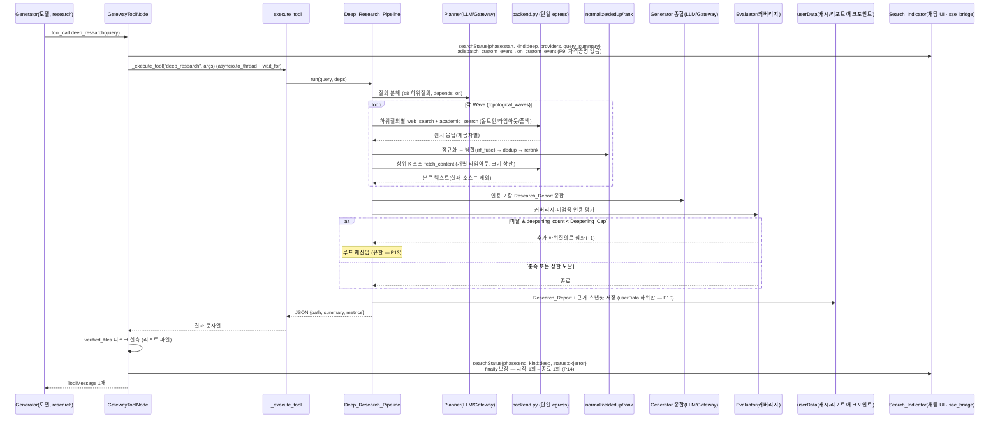
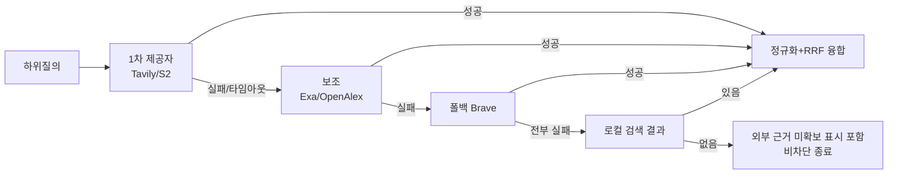

# Design Document

## Overview

이 설계는 Mogam Works 에디터에 **최고 품질 티어의 외부 리서치 능력**(웹 검색 + 논문 검색 +
딥리서치)을 추가한다. 핵심 설계 원칙은 **재사용 우선(재구현 금지)** 과 **무회귀**다. 딥리서치는
"검색 소스를 로컬 파일 → 웹/논문으로 확장"하는 형태로, 기존 검색→융합→재랭크→인용→grounding→
멀티에이전트 종합 파이프라인 **위에** 얹는다.

설계가 확정하는 핵심 결정은 다음과 같다.

1. **검색 제공자 선정(사용자 핵심 요구).** 웹은 **Tavily(1차) + Exa(보조) + Brave(폴백)**,
   논문은 **Semantic Scholar(1차) + OpenAlex(보조)**(+ arXiv/PubMed 도메인 선택)를 권고한다.
   모든 제공자는 **어댑터 인터페이스 뒤**에 두어 교체 가능하며, 다중 제공자 결과는 기존
   `rrf_fuse`(Reciprocal Rank Fusion)로 융합한다.
2. **아키텍처.** 딥리서치를 기존 LangGraph 멀티에이전트(Coordinator→Planner→Generator→
   Evaluator) 위에 설계한다. 기존 `planner`/DAG(`topological_waves`)/`aggregate`/`evaluator`/
   `checkpoint`/`store`를 그대로 재사용한다. 신규 도구(웹검색·논문검색·본문수집·딥리서치)는
   `RESEARCH_TOOLS`에 추가하고 `server.py`의 `_execute_tool`에 등록하며, `GatewayToolNode`의
   `ainvoke`·`ToolMessage 1/호출`·`verified_files` 경로로 실행한다.
3. **보안·정책.** 외부 검색은 옵트인 플래그(`AE_ENABLE_WEB_RESEARCH`)로만 활성화되고, off 시
   기존 로컬 검색만 동작한다(무회귀). LLM 호출은 전부 Bedrock Gateway 경유를 유지하고, 외부
   검색·본문 조회는 **지정된 단일 백엔드 모듈**(`ai_engine/research/backend.py`)에 한정한다.
   제공자 자격증명은 env/시크릿 런타임 주입만, 파일 미저장, `.gitignore` 제외, 로그 앞 4자
   마스킹.
4. **품질의 정의.** "최고 품질"을 관련성(precision@k·MRR)·최신성·출처 신뢰도·인용 정확도·
   커버리지·중복제거의 **측정 가능한 수치**로 규정하고, 기존 `eval_metrics`를 재사용한 평가
   하네스 + baseline 회귀 게이트로 실측·감시한다.
5. **검색 진행 표시(Kiro 스타일 — 요구사항 18).** 웹/논문/딥리서치 검색 도구의 실행 시작·종료를
   기존 SSE 채널(`sse_bridge`)로 방출해 채팅 UI에 진행 인디케이터(`Search_Indicator`)를 표시한다.
   방출은 **도구 실행 경계**(`GatewayToolNode`)에서 `try/finally`로 **시작 1회 → 종료 1회**를
   보장해 인디케이터가 활성 상태로 잔류하지 않게 한다(P14). 이벤트에는 검색 종류·제공자·질의 요약만
   싣고 `Provider_Credential`은 절대 포함하지 않으며(P9), 방출·렌더 실패는 검색·답변 진행을 막지
   않는다(비차단, P8). 신규 SSE 채널·CSP 변경은 없다.

### 스택 제약 준수

- 백엔드: Python 3.11 / FastAPI / **HTTPX**(이미 의존성 — `gateway_module.py`, `server.py`에서
  사용 중). HTML 본문 추출은 기존 의존성 `lxml`을 재사용(신규 무거운 프레임워크 도입 없음).
- 프론트: Electron + Vanilla JS. CSP 변경 불필요(본문 조회는 Python 백엔드에서 수행). 검색 진행
  인디케이터는 기존 SSE 소비 경로와 Vanilla JS Web Component(`customElements.define`)로만 구현하며
  신규 프레임워크·CSP 변경이 없다(steering ui.md 준수 — 요구사항 15.2 / 18.4).
- 신규 외부 벡터DB·대형 런타임 도입 없음. 검색 융합/재랭크/임베딩은 기존 자산 재사용.

---

## Architecture

### 계층 구조 (재사용 자산 매핑)

```mermaid
flowchart TB
    subgraph UI["Electron UI (Vanilla JS)"]
        SET["설정: 옵트인 토글 / 제공자 선택 / 프라이버시 동의"]
        VIEW["리서치 진행·출처·인용 표시"]
        IND["Search_Indicator: 검색 진행 표시(searchStatus 소비)"]
    end

    subgraph API["FastAPI server.py — /graph-stream 라우트"]
        DEPS["GraphDeps 조립 (gateway/model/ckpt/store)"]
        DISP["_execute_tool 디스패치"]
    end

    subgraph LG["LangGraph 오케스트레이션 (agent_system/) — 재사용"]
        SUP["build_parallel_top_graph: planner→Send fan-out→aggregate→evaluator"]
        RSUB["research 서브그래프 (RESEARCH_TOOLS)"]
        TNODE["GatewayToolNode: ainvoke · ToolMessage 1/호출 · verified_files 실측"]
    end

    subgraph RB["research 백엔드 (ai_engine/research/) — 신규"]
        BE["backend.py — 단일 외부 egress(HTTPX): 검색+본문조회, 자격증명 주입/마스킹, 옵트인 게이트"]
        NORM["normalize.py — Result_Normalizer(순수 파서/프린터) + normalize_query"]
        DED["dedup.py — Deduplicator(정규 URL/DOI, 멱등)"]
        RANK["rank.py — RRF/MMR/LLM리랭커 조합 + 관련성/최신성 정렬 + 출처신뢰도"]
        CACHE["cache.py — userData 캐시"]
        DR["deep_research.py — Deep_Research_Pipeline(멀티에이전트)"]
        EVAL["eval_harness.py — 품질 게이트(eval_metrics 재사용)"]
    end

    subgraph RAG["기존 RAG/검증 자산 (rag/) — 재사용"]
        RRF["hybrid_search.rrf_fuse / reranker / retrieval_pipeline"]
        CITE["citation / answer_quality / verifier(local_grounding) / grounding_gate"]
        METR["eval_metrics (recall@k, MRR, precision@k ...)"]
    end

    subgraph EXT["외부 (데이터 조회만 — LLM 아님)"]
        WEB["Tavily · Exa · Brave"]
        ACAD["Semantic Scholar · OpenAlex (+arXiv/PubMed)"]
    end

    GW["Bedrock Gateway (SigV4) — 모든 LLM 호출"]

    UI -->|IPC: 프로파일명/설정만, 자격증명 없음| API
    API -->|SSE searchStatus (sse_bridge)| IND
    API --> LG
    DISP -.->|web_search/search_papers/fetch_content/deep_research| RB
    LG --> TNODE --> DISP
    RSUB --> TNODE
    DR --> NORM & DED & RANK & CACHE
    RANK --> RRF
    DR --> CITE
    EVAL --> METR
    BE --> EXT
    SUP -->|Planner/Generator/Evaluator| GW
    DR -->|Planner/Generator/Evaluator| GW
```

### 두 개의 통합 축

리서치 능력은 **두 축**으로 통합된다. 둘 다 동일한 백엔드·정규화·융합·검증 자산을 공유한다.

**축 A — 에이전트형(도구 기반) 리서치.** `web_search` / `search_papers` / `fetch_content`를
`RESEARCH_TOOLS`에 추가하면, research 서브그래프의 기존 ReAct 루프(`retrieve → model → tools →
verify`)에서 Generator(모델)가 이 도구들을 직접 호출해 가벼운 외부 조사를 수행한다. 요구사항
1·2·3·17을 직접 충족한다.

**축 B — 딥리서치(결정적 멀티스텝) 파이프라인.** `deep_research` 도구가 호출되면 `_execute_tool`이
`Deep_Research_Pipeline`으로 디스패치한다. 이 파이프라인은 **질의 분해 → 다중 소스 검색 → 본문
수집 → 중복제거 → 재랭킹 → 인용 포함 종합 → (커버리지 미달 시) 심화 반복**을 수행하며, 기존
오케스트레이션 프리미티브를 재사용한다(아래 멀티에이전트 매핑). 요구사항 5·6·8·9를 충족한다.

### 멀티에이전트 매핑 (Coordinator → Planner → Generator → Evaluator)

steering(project.md)이 요구하는 4역할을 기존 LangGraph 자산에 1:1 매핑한다. 딥리서치는 **신규
그래프를 만들지 않고** 이 프리미티브들을 재사용한다(요구사항 6.6 / 16.3).

| 역할 | 재사용 기존 자산 | 딥리서치에서의 책임 | 요구사항 |
|---|---|---|---|
| **Coordinator** | `/graph-stream` 라우트 + `build_parallel_top_graph` 진입 + `checkpoint_store`/`store` | 딥리서치 세션 조율, 상태·체크포인트·장기메모리 초기화, 심화 루프 관장 | 6.1, 6.6 |
| **Planner** | `make_planner_node`/`_make_plan` + `dag.sanitize_depends_on`/`topological_waves` | 원 질의 → 하위 조사 질의(subtask) 분해(≤ Max 8), depends_on 웨이브 스케줄 | 5.1, 6.2 |
| **Generator** | 도메인 `make_model_node`(research) + `aggregate_node` 종합 로직 | 재랭킹된 근거로 **인용 포함** Research_Report 종합 생성 | 5.6, 6.3, 8.1 |
| **Evaluator** | `make_evaluator_node`/`evaluator_selector` + `refine_count`(monotonic MAX) | 커버리지(Min_Sources/Min_Providers)·미검증 인용 비율 기준 목표 대비 평가 → 심화(재계획) 결정 | 5.7, 6.4 |

**심화 루프 = evaluator→planner 재계획 루프.** 기존 `refine_count`/`AE_MAX_REFINE`와 동형의
`deepening_count`/`Deepening_Cap`(`AE_MAX_DEEPENING`, 기본 3)으로 유한 종료를 보장한다(P13).
차이점은 판정 근거다: 기존 evaluator는 LLM 종합 판정이지만, 딥리서치 evaluator는 **결정적 커버리지
지표**(고유 소스 수 < Min_Sources, 고유 제공자 수 < Min_Providers, 미검증 인용 비율 > 임계값)로
심화 여부를 결정한다(요구사항 5.7).

### 딥리서치 시퀀스



### 검색 제공자 선정 (사용자 핵심 요구)

제공자 역량은 진화가 빠른 영역이라 최신 공개 자료로 정합화했다(아래 근거는 라이선스 준수를 위해
요약·재구성한 것이다 — Content was rephrased for compliance with licensing restrictions).

#### 웹/딥리서치 제공자

| 제공자 | 성격 | 강점 | 한계 | 역할 |
|---|---|---|---|---|
| **Tavily** | 에이전트/RAG 특화 검색 | 한 번의 호출로 다중 사이트를 자체 랭킹으로 취합, 답변+출처+발행일+원문(`include_raw_content`), `/extract`·`/research` 제공 | 신경망 시맨틱 발견은 Exa 대비 약함 | **1차(primary)** — 인용 근거 종합에 최적 |
| **Exa** | 신경망 임베딩 시맨틱 검색 | 키워드가 아닌 "의미"로 랭킹, 개념적 인접 문서·유사 문서 발견, 리서치 특화 | 순수 키워드 질의에서 접선적 결과 가능 | **보조(secondary)** — recall/의미 다양성 보강 |
| **Brave** | 독립 인덱스 웹 검색 | 자체(비-빅테크) 인덱스, 폭넓은 커버리지·신선도, 고볼륨·저비용 | LLM 답변/원문 취합은 약함(링크 중심) | **폴백(fallback)** — 광범위 커버리지·장애 대비 |

- 근거: [Tavily vs Exa vs Brave 비교(stork.ai)](https://www.stork.ai/blog/best-web-search-apis-for-ai-applications-2026),
  [Tavily vs Exa(coldiq.com)](https://coldiq.com/blog/tavily-vs-exa),
  [Deep Research API 비교(firecrawl.dev)](https://www.firecrawl.dev/blog/best-deep-research-apis),
  [LLM Search API(sona.com)](https://www.sona.com/blog/llm-search-api-best-options-for-developers-in-2026).
- **제외:** Perplexity Sonar 등 "LLM 답변 생성형" API는 외부 LLM 호출에 해당하므로 Gateway-only
  정책(요구사항 10.1/10.5)에 따라 종합/추론 용도로 사용하지 않는다. 우리는 **검색·조회(데이터)**
  제공자만 사용하고, 모든 종합·추론 LLM 호출은 Bedrock Gateway 경유를 유지한다.
- **조합 근거:** Tavily(정답 지향 취합) + Exa(의미 기반 recall)는 상호 보완적이고, RRF는 점수
  스케일이 다른 두 랭커를 순위 기반으로 견고하게 융합한다(기존 `rrf_fuse` 재사용, P가 보장). Brave는
  장애·레이트리밋 시 커버리지 폴백으로 비차단 진행을 보장한다(요구사항 13).

#### 학술/논문 제공자

| 제공자 | 커버리지 | 강점 | 한계 | 역할 |
|---|---|---|---|---|
| **Semantic Scholar** | STEM 전반 ~200M+ | 인용 그래프·피인용수·초록·TLDR·임베딩(SPECTER), 무료 API | 레이트리밋(키 권장) | **1차** — `Paper_Result` 필드(특히 피인용수) 직접 충족 |
| **OpenAlex** | 다분야 ~250M | 개방·광범위(연구 실측 커버리지 최상위 그룹), DOI/ORCID, 피인용수·게재처, 무료 | 초록이 역인덱스(재구성 필요) | **보조** — recall/커버리지 보강, DOI 정합 |
| **arXiv** | 프리프린트(CS/물리/수학) | 최신 프리프린트 신선도 | 피인용수 없음 | 도메인 선택(옵션) |
| **PubMed** | 생의학 ~40M | 권위·MeSH | 생의학 한정 | 도메인 선택(옵션) |

- 근거: [OpenAlex/Semantic Scholar/PubMed 비교(intuitionlabs.ai)](https://intuitionlabs.ai/articles/openalex-semantic-scholar-pubmed-comparison),
  [단일 DB 검색 커버리지 연구(PubMed 40250535)](https://pubmed.ncbi.nlm.nih.gov/40250535/),
  [연구 논문 API 개관(firecrawl.dev)](https://www.firecrawl.dev/glossary/web-search-apis/search-research-papers-api).
- **조합 근거:** Semantic Scholar는 피인용수·초록을 직접 제공해 `Paper_Result`와 정렬 규칙(Req
  2.4의 피인용수 tie-break)에 이상적이고, OpenAlex는 커버리지·DOI 정합을 보강한다. 두 결과는 DOI로
  중복제거(Req 7.1) 후 RRF로 융합한다. arXiv/PubMed는 질의 도메인 힌트에 따라 선택적으로 활성화한다.

### 어댑터 인터페이스 (교체 가능성)

모든 제공자는 아래 인터페이스 뒤에 두어 교체·추가·비활성화가 설정만으로 가능하다(요구사항 4의
Result_Normalizer 정합, 요구사항 16.5). 어댑터는 **원시 응답 → 정규 스키마 매핑(순수)** 만 담당하고,
실제 HTTP egress는 전부 `backend.py`가 수행한다(요구사항 10.4).

```python
# ai_engine/research/providers.py (순수 매핑 — egress 없음)
class WebSearchAdapter(Protocol):
    name: str                          # "tavily" | "exa" | "brave"
    def to_search_results(self, raw: dict) -> list[SearchResult]: ...

class AcademicSearchAdapter(Protocol):
    name: str                          # "semantic_scholar" | "openalex" | "arxiv" | "pubmed" | "europepmc"
    def to_paper_results(self, raw: dict) -> list[PaperResult]: ...
```

---

## Components and Interfaces

### 백엔드 모듈 레이아웃 (신규 — `ai_engine/research/`)

| 모듈 | 책임 | 순수성 | 관련 요구사항 |
|---|---|---|---|
| `backend.py` | **단일 외부 egress.** HTTPX 클라이언트 소유, 웹/논문 검색·본문 조회의 유일한 네트워크 호출 지점, 옵트인 플래그 게이트, 자격증명 env 주입·마스킹, 개별 타임아웃 | 부작용(네트워크) | 3, 10.2, 10.4, 11, 13 |
| `providers.py` | 제공자 어댑터(원시 응답 → 정규 스키마 매핑) | 순수 | 1.2, 2.2, 4.1 |
| `normalize.py` | `Result_Normalizer`(파서) + 캐시 직렬화기(프린터) + `normalize_query` | 순수 | 4.1~4.5, 4.7 |
| `dedup.py` | `Deduplicator`(정규 URL/DOI, 멱등) | 순수 | 7.1~7.4 |
| `rank.py` | 관련성 정렬·최신성 필터·출처 신뢰도 + 기존 RRF/MMR/LLM리랭커 조합 | 순수(+LLM리랭커는 Gateway) | 1.4, 2.3, 7.5, 7.6, 9.2~9.4 |
| `cache.py` | userData 하위 검색 캐시(TTL) + 경로 가드 | 부작용(파일) | 4.6, 12 |
| `deep_research.py` | `Deep_Research_Pipeline`(멀티에이전트 오케스트레이션) | 부작용 | 5, 6, 8 |
| `eval_harness.py` | 품질 게이트(precision@k·MRR·최신성·신뢰도·인용정확도·커버리지·중복제거) + baseline 회귀 | 순수(+평가) | 9.1, 9.5, 9.7 |
| `security.py` | 자격증명 로딩(env)·마스킹 헬퍼 | 순수/부작용 | 11 |

도구 스키마는 `subgraphs/research.py`의 `RESEARCH_TOOLS`에, 디스패치는 `server._execute_tool`에
등록한다(요구사항 17).

### 1) `backend.py` — 단일 외부 egress (요구사항 10.4)

```python
def web_research_enabled(env=None) -> bool:
    """Search_Provider_Flag. AE_ENABLE_WEB_RESEARCH 옵트인 + 사용자 동의(consent) 모두 참일 때만 True."""

async def web_search_raw(provider: str, query: str, *, top_k: int, timeout: float,
                         recency: Optional[str] = None) -> dict:
    """웹 제공자 1곳 원시 검색(HTTPX). 옵트인 off/자격증명 없음/타임아웃/실패 → 구조화 오류 dict(비차단)."""

async def academic_search_raw(provider: str, query: str, *, top_k: int, timeout: float) -> dict:
    """논문 제공자 1곳 원시 검색(HTTPX). 상동."""

async def fetch_url_raw(url: str, *, timeout: float, max_chars: int) -> FetchResult:
    """Content_Fetcher egress. http/https만, 개별 타임아웃, 본문 크기 상한. 실패 → ok=False(예외 없음)."""
```

- **옵트인 게이트:** `web_research_enabled()`가 False면 모든 egress 함수는 즉시 구조화 오류/빈
  결과를 반환하고 네트워크를 호출하지 않는다(요구사항 10.3 / 14.2, 무회귀).
- **자격증명:** `security.load_credential(provider)`로 env에서만 로딩(파일 미저장, 요구사항 11.1/
  11.2). 로그에는 `mask_secret(key)`(앞 4자 + `****`)만 기록(요구사항 11.4). 캐시/리포트에는 절대
  포함하지 않음(P9).
- **타임아웃/폴백:** 모든 호출에 개별 타임아웃(`AE_SEARCH_TIMEOUT` 기본 12s, `AE_FETCH_TIMEOUT`
  기본 10s). `httpx` 예외/타임아웃은 잡아 구조화 오류로 폴백(P8, 요구사항 13).

### 2) `providers.py` — 어댑터(순수 매핑)

각 어댑터는 원시 응답을 정규 스키마로 변환하는 순수 함수만 노출한다. 누락 필드는 빈 값/정렬 가능한
기본값으로 채운다(요구사항 1.3 / 2.6 / 4.5, P8). 매핑 표는 Data Models 절 참조.

### 3) `normalize.py` — Result_Normalizer(파서) + 캐시 직렬화기(프린터)

```python
def normalize_query(q: str) -> str:
    """질의 정규화(trim → 공백 축약 → 소문자 → 유니코드 NFKC). 멱등(P11)."""

def parse_search_result(provider: str, raw_item: dict) -> SearchResult: ...   # 순수 (P8)
def parse_paper_result(provider: str, raw_item: dict) -> PaperResult: ...     # 순수 (P8)

def serialize_result(r: SearchResult | PaperResult) -> dict: ...             # 프린터
def deserialize_result(d: dict) -> SearchResult | PaperResult: ...           # 파서
# 불변: deserialize_result(serialize_result(r)) 는 r 의 정규 필드와 동등 (P1)
```

- 순수 함수(외부 상태 비의존)로 단위/속성 테스트 가능(요구사항 4.3).
- 라운드트립 정보 보존(P1): 직렬화는 모든 정규 필드를 JSON-호환 타입으로 저장하고, 역직렬화는
  타입을 복원한다(예: 발행일 ISO 문자열, 점수 float).

### 4) `dedup.py` — Deduplicator(순수)

```python
def canonical_url(url: str) -> str:
    """URL 정규화: 스킴 소문자, 호스트 소문자, 기본 포트 제거, 추적 쿼리(utm_* 등) 제거, fragment 제거, 말미 슬래시 정리."""

def canonical_doi(doi: str) -> str:
    """DOI 정규화: 소문자, 'https://doi.org/' 프리픽스 제거."""

def source_key(s) -> str:
    """DOI가 있으면 canonical_doi, 없으면 canonical_url 을 dedup 키로 사용."""

def dedup_sources(sources: list) -> list:
    """병합 목록에서 최초 등장 소스를 보존하며 중복 제거. 결과 ⊆ 입력, |결과| ≤ |입력| (P2), 멱등 (P3)."""
```

### 5) `rank.py` — 정렬/필터/신뢰도 (기존 자산 조합)

```python
def sort_by_relevance_web(results: list[SearchResult]) -> list[SearchResult]:
    """관련성 점수 내림차순, 동점은 제공자 반환 순서 보존(안정 정렬 — 결정적, P7 / Req 1.5)."""

def sort_by_relevance_papers(results: list[PaperResult]) -> list[PaperResult]:
    """관련성 내림차순 → 동점 시 피인용수 내림차순 → 동점 시 제공자 순서(P7 / Req 2.4)."""

def apply_recency(results, window, unknown_rule) -> list:
    """최신성 창 필터 + 발행일 내림차순(동점: 관련성 → 제공자순). 발행일 미상은 unknown_rule('exclude'|'last')로 일관 처리(P12 / Req 9.2/9.3)."""

def merge_and_rerank(query, per_provider_ranklists, sources, *, gw=None) -> list:
    """다중 제공자 순위 리스트를 rrf_fuse 로 융합 → dedup → (opt)LLM 리랭커 재정렬. 결과는 입력의 순열(P4 / Req 7.5/7.6)."""

def source_authority(s) -> float:
    """도메인 권위/게재처/피인용수 중 1개 이상으로 신뢰도 신호 산출(Req 9.4). 순위 입력에 반영."""
```

- `rrf_fuse`(`rag/hybrid_search.py`), `reranker.rerank`/`parse_rerank_order`(`rag/reranker.py`),
  `HybridSearcher`의 MMR을 그대로 재사용한다(요구사항 7.5 / 16.1). `parse_rerank_order`는 이미
  "항상 [0,n) 유효 인덱스의 순열"을 보장하므로 P4가 계승된다.

### 6) `deep_research.py` — Deep_Research_Pipeline (멀티에이전트)

```python
async def run_deep_research(query: str, deps, *, session_id: str, config: DeepResearchConfig) -> ResearchReport:
    """Coordinator 진입점. Planner→(Wave별 다중소스 검색+fetch)→dedup→rerank→Generator 종합→Evaluator 심화판정.
       심화는 deepening_count < Deepening_Cap 에서만(P13). 리포트/근거 스냅샷은 userData 하위 저장(P10)."""
```

- **Planner:** `supervisor._make_plan`과 동형의 Gateway 분해(질의 → ≤`AE_RESEARCH_MAX_SUBQUERIES`
  하위질의, `depends_on`). Wave 분할은 `dag.topological_waves`/`sanitize_depends_on` 재사용.
- **Wave 실행:** 각 하위질의에 대해 웹+논문 검색 → 정규화 → RRF 융합 → dedup → rerank →
  상위 K(`AE_RESEARCH_FETCH_PER_SUBQUERY`, 기본 5) 소스 `fetch_content`. Wave 간 의존은 위상 순서로
  처리(선행 Wave 근거를 후속 질의 컨텍스트로 사용).
- **Generator:** research 도메인 model 노드 패턴(GatewayChatModel)으로 인용 포함 종합 생성(요구사항
  8.1). 종합 로직은 `aggregate_node`와 동형.
- **Evaluator:** 커버리지 지표(고유 소스/제공자 수, 미검증 인용 비율)로 심화 여부 판정. `refine_count`
  대응 `deepening_count`(monotonic MAX reducer 개념)로 유한 종료(P13).
- **체크포인트/스토어:** `JsonFileCheckpointSaver`/`JsonFileStore`를 재사용하되 base_dir는 userData
  하위(요구사항 6.6 / 12).
- **실행 seam:** `_execute_tool`은 동기 함수이고 `GatewayToolNode`가 `asyncio.to_thread` +
  `asyncio.wait_for`로 감싸므로, 딥리서치 도구 디스패치는 `retrieval_pipeline.retrieve_evidence_sync`와
  동일한 "실행 중 루프면 별도 스레드+독립 루프" 패턴으로 async 파이프라인을 실행한다(이벤트 루프 내
  `asyncio.run` 안티패턴 회피).

### 7) 인용·근거 검증 (기존 자산 재사용 — 요구사항 8.4 / 16.2)

- `citation.parse_citations`/`verify_citations`/`RetrievedRange`로 리포트 인용을 근거 집합과 대조해
  verified/unverified 분류. dangling citation은 unverified로 표기하되 **차단하지 않음**(요구사항
  8.3, P6).
- 소스 식별자 스킴 정합: 딥리서치 근거 집합은 `citation`의 `파일경로:시작-끝` 규약과 정합하도록,
  각 외부 소스에 안정적 소스 식별자(예: `web:<canonical_url>` / `doi:<canonical_doi>`)를 부여하고,
  인용 검증기가 소스 식별자 존재성으로 판정하도록 `verify_citations`를 소스 식별자 집합 대조 모드로
  사용한다(참조 무결성 = "인용 소스 id ∈ 근거 소스 id 집합", P6).
- 근거성: `answer_quality.enhance_answer`(citation 메타 + `local_grounding_score` + faithfulness) 및
  `grounding_gate` 재사용. 미검증 인용 비율은 응답 메타데이터에 포함(요구사항 9.5).

### 8) 도구 통합 (요구사항 17)

`RESEARCH_TOOLS`에 아래 4개 도구를 추가하고(name은 `_execute_tool` 디스패치와 동일 문자열 — 요구사항
17.4), `GatewayToolNode`가 `ainvoke`로 실행해 호출당 ToolMessage 1개를 반환한다(요구사항 17.3).

| 도구 name | 입력 | 출력(요약) | 디스패치 |
|---|---|---|---|
| `web_search` | `{query, top_k?, recency_days?}` | `{results:[SearchResult...]}` JSON | `research.backend`+`normalize`+`rank` |
| `search_papers` | `{query, top_k?}` | `{results:[PaperResult...]}` JSON | 상동(academic) |
| `fetch_content` | `{url}` | `{url, text, chars, truncated}` JSON | `research.backend.fetch_url_raw` |
| `deep_research` | `{query}` | `{path, summary, metrics, unverified_ratio}` JSON | `deep_research.run_deep_research` |

- `web_search`/`search_papers`/`fetch_content`는 파일 산출물이 없어 verified_files 대상이 아니다.
  `deep_research`는 Research_Report 파일(userData 하위)을 생성하며, `GatewayToolNode`가 디스크 실측
  통과 항목만 verified_files에 포함한다(요구사항 17.5).
- `_execute_tool`은 원격 브리지 도구 집합(`_REMOTE_TOOLS`)과 무관하므로 항상 로컬(백엔드)에서
  실행된다.

### 9) 검색 진행 이벤트 (Search_Status_Event — 요구사항 18)

채팅 UI에 검색 진행을 표시하기 위해, 검색 도구 실행의 **시작·종료**를 기존 SSE 채널로 방출한다.
신규 모듈·신규 SSE 채널·CSP 변경 없이 **기존 자산(`GatewayToolNode`/`sse_bridge`/`main.js` SSE
소비 루프)을 확장**한다. 3계층(방출→중계→소비)으로 구성한다.

| 계층 | 위치 (재사용/확장) | 책임 | 요구사항 |
|---|---|---|---|
| 방출 | `agent_system/nodes/tool_node.py` `GatewayToolNode.__call__`(확장) | 검색 도구 실행 경계에서 start/end 커스텀 이벤트 방출(try/finally) | 18.1, 18.3, 18.6 |
| 중계 | `agent_system/sse_bridge.py`(확장) | `ALLOWED_EVENT_KEYS`에 `searchStatus` 추가 + `on_custom_event` → `{searchStatus}` SSE 매핑 | 18.1, 18.3, 18.4 |
| 소비 | `src/main.js`(`readSSEStream` 확장) + `src/components/search-indicator.js`(신규) + `src/center-views.js`(배선) | `searchStatus` 소비 → `Search_Indicator` 상태 전환 | 18.1, 18.3, 18.4 |

#### 9-1) 방출 — `GatewayToolNode` 경계 (요구사항 18.1/18.3/18.6, P14)

- **방출 메커니즘:** LangChain `adispatch_custom_event("search_status", payload)`를 사용한다. 이
  커스텀 이벤트는 `astream_events(v2)` 스트림에 `on_custom_event`(name=`"search_status"`)로
  표면화되어 `sse_bridge`가 그대로 소비할 수 있다. Python 3.11+에서는 현재 실행 컨텍스트의 콜백
  매니저가 contextvar로 자동 전파되므로, **async 실행 경계인 `GatewayToolNode.__call__`**(astream_events
  run 하위)에서 `config` 명시 전달 없이 방출 가능하다.
- **왜 GatewayToolNode인가:** `_execute_tool`은 **동기** 함수이고 `GatewayToolNode`가
  `asyncio.to_thread`로 분리 실행하므로, 워커 스레드 내부에서는 contextvar(run 컨텍스트) 전파가
  보장되지 않는다. 따라서 방출은 `to_thread` **이전의 async 경계**(각 `tool_call`을
  `asyncio.wait_for(...)`로 감싸는 지점)에서 수행한다. 이 지점은 이미 도구별 성공/타임아웃/예외를
  모두 포착하는 위치라 **시작→종료 짝을 코드로 강제**하기에 최적이다.
- **방출 위치·라이프사이클(P14):** 검색 도구군 `_SEARCH_TOOLS = {"web_search", "search_papers",
  "deep_research"}`에 대해서만 방출한다.
  - 도구 실행 **직전**: `phase="start"` 이벤트 1회.
  - `try/finally`의 **finally**: 도구 실행이 성공하든 타임아웃(`asyncio.TimeoutError`)이든 예외이든
    무관하게 `phase="end"` 이벤트 정확히 1회. 이로써 "시작 1회 → 종료 1회" 불변식이 코드로 보장되어
    `Search_Indicator`가 활성 상태로 잔류하지 않는다(요구사항 18.6, P14).
- **딥리서치 세분화(선택):** `deep_research` 도구 1회는 상위 경계에서 start/end 1쌍(kind=`deep`)을
  방출한다. `Deep_Research_Pipeline` 내부의 Wave별 web/academic 검색 단계는 동일 채널로 **부가
  진행 신호**(kind=`web`/`academic`의 라벨 갱신)를 방출할 수 있으나, **라이프사이클 짝(P14)의 판정
  단위는 "도구 실행 1회"**이며 내부 세부 신호는 무결성 카운트 대상이 아니다.
- **비차단(P8):** 방출 자체(`adispatch_custom_event`)를 `try/except`로 감싸 실패 시 무시하고 도구
  실행·답변 생성을 계속한다(요구사항 18.5).

#### 9-2) 이벤트 페이로드 스키마

```python
# adispatch_custom_event("search_status", payload) 의 payload
{
    "phase": "start" | "end",              # 라이프사이클 (P14: start 1회 → end 1회)
    "kind": "web" | "academic" | "deep",   # 검색 종류 (요구사항 18.2)
    "providers": ["tavily", "exa"],        # 활성 제공자 "이름" 목록 (자격증명 아님 — P9)
    "query_summary": "…",                  # 질의 요약(절단, AE_RESEARCH_QUERY_SUMMARY_MAX)
    "status": "ok" | "error",              # phase=="end" 에서만; 도구 성공/실패 구분
}
# 불변: Provider_Credential(API 키) 원문 미포함 (P9).
# 정합: providers·query_summary 표기 범위 = 프라이버시 고지 범위 (요구사항 18.7 / 14).
```

- `providers`는 `research.backend`의 활성 제공자 설정(`AE_RESEARCH_WEB_PROVIDERS` /
  `AE_RESEARCH_ACADEMIC_PROVIDERS`)에서 **이름만** 취한다(키·시크릿 절대 미포함 — P9).
- `query_summary`는 도구 입력 질의를 `AE_RESEARCH_QUERY_SUMMARY_MAX`(기본 80자)로 절단한 요약이며,
  옵트인·동의가 활성인 경우에만 존재한다(비활성이면 외부 검색 자체가 없어 이벤트도 없음 — P15).

#### 9-3) 중계 — `sse_bridge` 확장 (요구사항 18.4)

- `ALLOWED_EVENT_KEYS`에 `"searchStatus"`를 **추가**한다(기존 키 집합의 확장 — 무회귀).
- `graph_events_to_sse` 매핑에 분기 1개를 추가한다:
  `etype == "on_custom_event" and name == "search_status"` → `{"searchStatus": data}` SSE emit.
- 신규 SSE 채널·엔드포인트를 만들지 않고 기존 `/graph-stream` 스트림에 얹으므로 CSP 변경이 없다
  (요구사항 18.4). 기존 `{text, tool, status, verifiedFiles, ...}` 이벤트 계약은 그대로 보존된다.

#### 9-4) 소비 — SSE 라우터 + Web Component (요구사항 18.1/18.3/18.4)

- **SSE 라우터(`src/main.js` `readSSEStream`):** 기존 `parsed.error/slotId/tool/text` 분기에
  `if (parsed.searchStatus) { onSearchStatus?.(parsed.searchStatus); continue; }` 한 줄을 추가한다.
  기존 `onText`/`onTool` 배선과 동형이라 무회귀다.
- 상세 렌더는 아래 10) 프론트엔드의 `Search_Indicator` 참조.

### 10) 프론트엔드 (Electron + Vanilla JS)

- **설정 UI:** 외부 리서치 옵트인 토글(→ `AE_ENABLE_WEB_RESEARCH` 상당), 제공자 선택(웹/논문),
  프라이버시 동의 체크. 설정은 `userData/settings/settings.json`에 **프로파일/플래그만** 저장(자격증명
  없음 — steering security.md 준수).
- **프라이버시 고지(요구사항 14):** 옵트인 활성 시 "질의가 외부 검색 제공자(선택된 목록)로
  전송됨"과 전송 데이터 범위(질의문)를 고지. 동의가 활성이 아니면 외부 검색 미수행(로컬만).
- 리서치 진행/출처/인용/미검증 표시는 기존 SSE 이벤트 채널로 렌더(신규 CSP 불필요).
- **검색 진행 인디케이터(`src/components/search-indicator.js`, 신규 — 요구사항 18):** Vanilla JS
  Web Component(`customElements.define('search-indicator', ...)`, shadow DOM 미사용 — steering ui.md).
  `onSearchStatus`로 전달된 `searchStatus` payload를 소비해 상태를 전환한다.
  - `phase=="start"` → **활성**: kind별 라벨로 "웹 검색 중… · {providers} · {query_summary}"
    (web=웹 검색, academic=논문 검색, deep=딥리서치). VS Code 다크 미학(`--color-bg-secondary` /
    `--color-accent` / `--color-text-secondary`)과 스피너 마이크로 인터랙션(steering ui.md).
  - `phase=="end" & status=="ok"` → **완료** 표기 후 짧은 페이드로 **해제**.
  - `phase=="end" & status=="error"` → **해제**(간결한 "검색 실패" 표기 후 소멸).
  - 상위(채팅 뷰)와의 통신은 `CustomEvent(detail)`로 수행한다(steering ui.md).
- **채팅 뷰 배선(`src/center-views.js`):** 스트림 시작 시 `<search-indicator>`를 활성 어시스턴트
  메시지 영역에 마운트하고 `onSearchStatus` 콜백을 해당 인스턴스에 연결한다. 렌더 실패는 검색·답변
  진행을 막지 않는다(비차단 — 요구사항 18.5, P8).
- **프라이버시 정합(요구사항 18.7):** 인디케이터가 표기하는 제공자·질의 요약 범위는 위 프라이버시
  고지(요구사항 14) 범위와 일치한다. 옵트인·동의가 비활성이면 외부 검색이 수행되지 않아
  `searchStatus` 이벤트도 발생하지 않으므로 인디케이터가 나타나지 않는다(P15와 정합).

### 환경변수 / 설정 (요구사항 10·13·14 정합)

| 키 | 기본값 | 용도 |
|---|---|---|
| `AE_ENABLE_WEB_RESEARCH` | off | Search_Provider_Flag(옵트인 마스터). off → 로컬만(무회귀) |
| `AE_RESEARCH_CONSENT` | off | 프라이버시 동의(UI 연동). 미동의 시 외부 검색 미수행 |
| `AE_RESEARCH_WEB_PROVIDERS` | `tavily,exa,brave` | 웹 제공자 순서(1차/보조/폴백) |
| `AE_RESEARCH_ACADEMIC_PROVIDERS` | `openalex,europepmc` | 논문 제공자 순서. 기본값은 **키 없이 실제 응답하는 제공자**만 둔다(실측: `semantic_scholar` 는 선택 키 미설정 시 HTTP 429, `arxiv` export API 는 빈번한 TIMEOUT). `europepmc` 는 키리스 생의학(MEDLINE+PMC)이며 `resultType=core` 로 초록을 받는다 |
| `AE_RESEARCH_TOPK` | 10 | 검색 결과 상한(top-k) |
| `AE_RESEARCH_MAX_SUBQUERIES` | 8 | 하위 질의 상한 |
| `AE_RESEARCH_FETCH_PER_SUBQUERY` | 5 | 하위질의당 본문 수집 상한 |
| `AE_MAX_DEEPENING` | 3 | Deepening_Cap(심화 반복 상한, P13) |
| `AE_RESEARCH_MIN_SOURCES` | 5 | Min_Sources |
| `AE_RESEARCH_MIN_PROVIDERS` | 2 | Min_Providers |
| `AE_RESEARCH_UNVERIFIED_THRESHOLD` | 0.2 | 미검증 인용 비율 심화 임계 |
| `AE_SEARCH_TIMEOUT` | 12 | 검색 호출 개별 타임아웃(초) |
| `AE_FETCH_TIMEOUT` | 10 | 본문 조회 개별 타임아웃(초) |
| `AE_FETCH_MAX_CHARS` | 100000 | 소스당 본문 크기 상한 |
| `AE_RESEARCH_CACHE_TTL` | 86400 | 캐시 유효기간(초, 24h) |
| `AE_RESEARCH_RECENCY_UNKNOWN` | `last` | 발행일 미상 처리 규칙(`exclude`|`last`) |
| `AE_RESEARCH_REGRESSION_TOLERANCE` | 0.05 | 품질 게이트 허용 하락폭 |
| `AE_RESEARCH_QUERY_SUMMARY_MAX` | 80 | Search_Status_Event 질의 요약 절단 길이(요구사항 18.2/18.7) |
| `TAVILY_API_KEY` / `EXA_API_KEY` / `BRAVE_API_KEY` / `SEMANTIC_SCHOLAR_API_KEY` | — | 제공자 자격증명(env 전용, 파일 미저장). **전부 선택 사항**: Tavily 는 키리스 모드(`X-Tavily-Access-Mode: keyless`)로, 학술 제공자는 키리스로 호출된다. 키는 요청 한도만 올린다. 키가 **필수**인 것은 Exa·Brave 뿐(`backend._REQUIRES_KEY`) |

---

## Data Models

### Search_Result (웹 검색 정규 스키마 — 요구사항 1.2)

```python
@dataclass
class SearchResult:
    title: str            # 제목 (누락 시 "")
    url: str              # URL (누락 시 "")
    snippet: str          # 발췌문 (누락 시 "")
    published_date: str   # 발행일 ISO8601 (미상 시 "")
    source_domain: str    # 출처 도메인 (url에서 파생, 누락 시 "")
    relevance_score: float  # 관련성 점수 (정렬 가능한 수치, 누락 시 0.0)
    provider: str         # 출처 제공자 name (계측/신뢰도용)
    source_id: str        # "web:<canonical_url>" (인용 참조 무결성 P6)
```

#### 웹 제공자 → Search_Result 매핑 표

| 정규 필드 | Tavily | Exa | Brave |
|---|---|---|---|
| `title` | `results[].title` | `results[].title` | `web.results[].title` |
| `url` | `results[].url` | `results[].url` | `web.results[].url` |
| `snippet` | `results[].content` | `results[].text`/`highlights` | `web.results[].description` |
| `published_date` | `results[].published_date`(있으면) | `results[].publishedDate` | `web.results[].page_age`/`age` |
| `source_domain` | urlparse(url).netloc | urlparse(url).netloc | urlparse(url).netloc |
| `relevance_score` | `results[].score` | `results[].score` | 순위 파생 `1/(rank+1)`(네이티브 점수 부재) |

### Paper_Result (논문 검색 정규 스키마 — 요구사항 2.2)

```python
@dataclass
class PaperResult:
    title: str            # 제목 (누락 시 "")
    authors: list[str]    # 저자 목록 (누락 시 [])
    year: int             # 발행연도 (미상 시 0 — 정렬 가능한 기본값)
    venue: str            # 게재처 (누락 시 "")
    abstract: str         # 초록 (누락 시 "")
    doi_or_url: str       # DOI 또는 URL (누락 시 "")
    citation_count: int   # 피인용수 (미상 시 0 — 정렬 가능한 기본값)
    relevance_score: float
    provider: str
    source_id: str        # "doi:<canonical_doi>" 또는 "web:<canonical_url>"
```

#### 학술 제공자 → Paper_Result 매핑 표

| 정규 필드 | Semantic Scholar | OpenAlex | arXiv | PubMed |
|---|---|---|---|---|
| `title` | `title` | `display_name` | `entry.title` | `ArticleTitle` |
| `authors` | `authors[].name` | `authorships[].author.display_name` | `entry.author[].name` | `AuthorList[].` |
| `year` | `year` | `publication_year` | `published`(연도) | `PubDate.Year` |
| `venue` | `venue` | `primary_location.source.display_name` | `"arXiv"` | `Journal.Title` |
| `abstract` | `abstract` | `abstract_inverted_index`(재구성) | `entry.summary` | `Abstract.AbstractText` |
| `doi_or_url` | `externalIds.DOI` / `url` | `doi` / `id` | `entry.id`(arXiv URL) | `ELocationID(doi)` / PMID URL |
| `citation_count` | `citationCount` | `cited_by_count` | 0(미제공) | 0(미제공) |
| `relevance_score` | 검색 순위/스코어 | `relevance_score` | 순위 파생 | 순위 파생 |

### Research_Report (딥리서치 산출물 — 요구사항 5.6 / 8)

```python
@dataclass
class ResearchReport:
    query: str
    report_markdown: str          # 인용 포함 종합 본문 (Generator 산출)
    citations: dict               # {"verified":[source_id...], "unverified":[raw...]}
    evidence_snapshot: list[EvidenceSource]  # 수집·중복제거·재랭킹된 근거 소스
    metrics: ResearchMetrics      # 품질 지표(아래)
    deepening_count: int          # 수행된 심화 반복 횟수 (≤ Deepening_Cap, P13)
    unverified_ratio: float       # 미검증 인용 비율 [0,1] (요구사항 9.5)
    created_at: str

@dataclass
class EvidenceSource:
    source_id: str                # "web:<url>" | "doi:<doi>"
    title: str
    url_or_doi: str
    provider: str
    content: str                  # 수집 본문(크기 상한 적용)
    published_date: str
    authority: float              # 출처 신뢰도 신호 (요구사항 9.4)

@dataclass
class ResearchMetrics:            # 요구사항 9.7 / 평가 하네스
    precision_at_k: float
    mrr: float
    recency_score: float
    authority_score: float
    citation_accuracy: float      # 1 - unverified_ratio
    coverage_sources: int
    coverage_providers: int
    dedup_ratio: float
```

### 캐시 엔트리 스키마 (요구사항 4.6 / 12)

```python
# userData/research_cache/{sha1(normalize_query(q)+provider_set)}.json
{
  "query_normalized": str,       # normalize_query 결과 (P11)
  "provider_set": [str],
  "kind": "web" | "academic",
  "results": [ serialize_result(r) ... ],   # 프린터 출력 (P1)
  "cached_at": float,            # epoch; TTL 검사
  "ttl": int
}
# 불변: 자격증명 원문 미포함 (P9). 경로는 userData 루트 하위 (P10).
```

### Search_Status_Event (검색 진행 이벤트 — 요구사항 18)

`adispatch_custom_event("search_status", ...)`로 방출되어 `sse_bridge`가 `{searchStatus: payload}`로
중계하는 진행 표시 전용 이벤트다. LLM 컨텍스트가 아니라 UI 표시용이며 GraphState에 저장하지 않는다.

```python
@dataclass
class SearchStatusEvent:              # payload 스키마 (요구사항 18.2)
    phase: str                        # "start" | "end" (P14: start 1회 → end 1회)
    kind: str                         # "web" | "academic" | "deep"
    providers: list[str]              # 활성 제공자 "이름"만 (자격증명 아님 — P9)
    query_summary: str                # 질의 요약(AE_RESEARCH_QUERY_SUMMARY_MAX 절단)
    status: str = ""                  # phase=="end" 에서만 "ok" | "error"
# 불변: Provider_Credential 원문 미포함 (P9). 표기 범위 = 프라이버시 고지 범위 (18.7 / Req 14).
```

### 상태 확장 (GraphState 정합)

딥리서치 파이프라인은 자체 상태 dataclass(`DeepResearchState`)를 내부적으로 사용하되, 도구 결과는
기존 `GraphState` 채널로 환원된다. 신규 GraphState 채널은 추가하지 않고, 딥리서치 산출물은
`verified_files`(리포트 파일)와 `citations`/`answer_quality` 채널로 병합해 기존 리듀서와 정합한다
(무회귀). 자격증명 필드는 상태·체크포인트 어디에도 두지 않는다(요구사항 11 / graph_state.py 보안 주석
정합).

---

## Correctness Properties

*속성(property)이란 시스템의 모든 유효한 실행에서 참이어야 하는 특성·행동으로, 시스템이 무엇을
해야 하는지에 대한 형식적 진술이다. 속성은 사람이 읽는 명세와 기계로 검증 가능한 정확성 보장
사이의 다리 역할을 한다.*

아래 속성은 요구사항 문서의 정확성 속성 P1~P15를 형식화하고, prework 분석의 분류·통합 결과를
반영해 각 속성을 검증할 **컴포넌트**와 **테스트 전략**에 매핑한다. 여러 수용 기준이 동일 속성으로
수렴하므로(예: 9개 오류조건 AC → P8, 4개 경로 AC → P10) 속성 집합은 이미 중복 제거된 상태다.
P14는 요구사항 18(채팅 UI 검색 진행 표시)의 **인디케이터 라이프사이클 무결성**(시작 1회 → 종료
1회)을 형식화한 것이고, P15는 고가치·결정적 무회귀 불변식인 **옵트인 게이트**다(요구사항 문서의
P14 정의와 정합하도록 기존 옵트인 게이트 속성을 P15로 리넘버링했다).

### Property 1: 정규화 결과 직렬화 라운드트립

*For any* 정규화된 `SearchResult` 또는 `PaperResult` `r`에 대해, `deserialize_result(serialize_result(r))`는
`r`의 모든 정규 필드 값과 동등하다. 파서(`Result_Normalizer`)와 프린터(캐시 직렬화기)의 왕복이
정보를 보존한다.

**Validates: Requirements 4.4**
- 검증 컴포넌트: `research/normalize.py`(serialize_result/deserialize_result)
- 테스트: `scripts/test_research_normalize_roundtrip_pbt.py` — 임의 정규 결과 생성 → 라운드트립 동등.

### Property 2: 중복제거 크기·부분집합 불변식

*For any* 소스 목록 `xs`에 대해, `len(dedup_sources(xs)) <= len(xs)`이고 `dedup_sources(xs)`의 모든
항목은 `xs`에 존재한다(소스 창작 없음). 또한 결과에는 동일한 정규 URL 또는 DOI(`source_key`)를 가진
서로 다른 두 소스가 존재하지 않으며, 각 키에 대해 `xs`에서 최초로 등장한 소스가 보존된다.

**Validates: Requirements 7.1, 7.2, 7.3**
- 검증 컴포넌트: `research/dedup.py`(dedup_sources/source_key/canonical_url/canonical_doi)
- 테스트: `scripts/test_research_dedup_invariants_pbt.py` — 중복 포함 임의 소스 → 크기·부분집합·키 유일성·first-wins.

### Property 3: 중복제거 멱등성

*For any* 소스 목록 `xs`에 대해, `dedup_sources(dedup_sources(xs)) == dedup_sources(xs)`.

**Validates: Requirements 7.4**
- 검증 컴포넌트: `research/dedup.py`
- 테스트: `scripts/test_research_dedup_idempotent_pbt.py` — 2회 적용 == 1회 적용.

### Property 4: 재랭킹 순열 불변식

*For any* 질의와 소스 집합 `sources`에 대해, `merge_and_rerank(query, ..., sources)`의 결과는 입력
`sources`의 순열이다(소스 창작·누락 없음). 기존 `parse_rerank_order`의 "항상 [0,n) 유효 인덱스 순열"
규약을 계승한다.

**Validates: Requirements 7.5, 7.6**
- 검증 컴포넌트: `research/rank.py`(merge_and_rerank) + 재사용 `rag/reranker.parse_rerank_order`
- 테스트: `scripts/test_research_rerank_permutation_pbt.py` — 범위밖/중복/누락 인덱스를 내는 리랭커 mock으로도 결과가 입력의 순열임을 검증.

### Property 5: 커버리지 단조성(준동형)

*For any* 소스 집합 `A`, `B`에 대해, 제공자·소스를 추가로 병합해도 고유 소스 커버리지는 감소하지
않는다: `len(dedup_sources(A + B)) >= len(dedup_sources(A))`.

**Validates: Requirements 5, 9**
- 검증 컴포넌트: `research/dedup.py`(병합 후 dedup)
- 테스트: `scripts/test_research_coverage_monotonic_pbt.py` — 임의 A,B → 병합 커버리지 비감소.

### Property 6: 인용 참조 무결성

*For any* Research_Report와 수집 근거 소스 식별자 집합 `S`에 대해, "검증됨"으로 분류된 모든 인용은
`S`에 존재하는 소스 식별자를 참조한다(dangling verified citation 없음). 또한 모든 인용은 검증됨/미검증
중 정확히 하나로 분류된다(분류 누락 없음).

**Validates: Requirements 8.2, 8.5**
- 검증 컴포넌트: 재사용 `rag/citation.verify_citations` + `research/deep_research.py`(소스 id 대조 모드)
- 테스트: `scripts/test_research_citation_integrity_pbt.py` — 임의 인용/근거 id 집합 → verified ⊆ S, verified∪unverified == 전체 인용.

### Property 7: 관련성 정렬(결정적 내림차순)

*For any* 검색 결과 목록에 대해, 관련성 정렬 결과는 관련성 점수 내림차순이다(모든 `i < j`에 대해
`score[i] >= score[j]`). 웹 결과의 동점은 제공자 반환 순서를 보존하고, 논문 결과의 동점은 피인용수
내림차순 → 피인용수도 동점이면 제공자 순서로 배치하여, 동일 입력에 항상 동일한 정렬 결과를 산출한다.

**Validates: Requirements 1.4, 1.5, 2.3, 2.4**
- 검증 컴포넌트: `research/rank.py`(sort_by_relevance_web/sort_by_relevance_papers)
- 테스트: `scripts/test_research_relevance_sort_pbt.py` — 동점 다수 포함 임의 리스트 → 내림차순 + tie-break 결정성(재정렬 안정).

### Property 8: 오류조건 비차단 폴백

*For any* 유효하지 않은 질의(빈/공백/과길이), 제공자 호출 실패·타임아웃, 형식 오류 응답, 부분 필드
누락 원시 응답에 대해, 시스템은 예외를 전파하거나 그래프 실행을 중단하지 않고 구조화된 오류 또는 빈
결과(또는 추출 가능한 필드만 채운 정규 결과)로 폴백한다.

**Validates: Requirements 1.3, 1.8, 2.6, 3.5, 4.5, 8.3, 13.2, 13.3, 13.4, 18.5**
- 검증 컴포넌트: `research/backend.py`(egress 폴백), `research/normalize.py`(부분 파싱), `research/deep_research.py`(비차단 진행), `agent_system/nodes/tool_node.py`(Search_Status_Event 방출 실패 비차단)
- 테스트: `scripts/test_research_error_conditions_pbt.py` — 임의 실패 유형·부분 응답·불량 질의 → 예외 없음, 구조화 오류/빈 결과/부분 정규 결과.

### Property 9: 자격증명 비노출

*For any* 캐시 엔트리·Research_Report·로그 산출물에 대해, `Provider_Credential` 원문이 포함되지
않는다(로그는 `mask_secret`의 앞 4자 마스킹만 허용). 마스킹 함수는 임의 키에 대해 앞 4자만 남기고
나머지를 마스킹 문자로 대체한다.

**Validates: Requirements 11.1, 11.4, 11.5**
- 검증 컴포넌트: `research/security.py`(mask_secret/load_credential), `research/cache.py`, `research/deep_research.py`
- 테스트: `scripts/test_research_credential_masking_pbt.py` — 임의 키를 주입한 직렬화/로그 산출 → 원문 부재, 마스킹 규칙 성립.

### Property 10: 영속 경로 불변식

*For any* Research_Engine이 기록하는 산출물(캐시·리포트·근거 스냅샷)의 파일 경로는 userData 루트
하위로 정규화된 경로다(경로 이스케이프 `..`·절대경로 주입 방지 포함).

**Validates: Requirements 12.1, 12.2, 12.3, 12.4**
- 검증 컴포넌트: `research/cache.py`, `research/deep_research.py`(경로 가드)
- 테스트: `scripts/test_research_userdata_path_pbt.py` — 임의 파일명/질의 키(`..`, 절대경로, 특수문자 포함) → 산출 경로가 항상 userData 루트 하위.

### Property 11: 질의 정규화 멱등성

*For any* 질의 문자열 `q`에 대해, `normalize_query(normalize_query(q)) == normalize_query(q)`.

**Validates: Requirements 4.7, 5**
- 검증 컴포넌트: `research/normalize.py`(normalize_query)
- 테스트: `scripts/test_research_query_normalize_idempotent_pbt.py` — 공백/대소문자/유니코드/제어문자 포함 임의 질의 → 멱등.

### Property 12: 최신성 필터(준동형)

*For any* 검색 결과 목록과 최신성 창 `W`에 대해, `apply_recency` 결과의 모든 항목은 `W` 이내의
발행일을 갖는다. 발행일 미상 항목은 구성된 단일 규칙(`exclude` 또는 `last`)으로 일관 처리되어, 동일
입력에 항상 동일한 정렬 결과를 산출한다(발행일 내림차순 → 관련성 → 제공자순).

**Validates: Requirements 9.2, 9.3**
- 검증 컴포넌트: `research/rank.py`(apply_recency)
- 테스트: `scripts/test_research_recency_filter_pbt.py` — 발행일 미상/경계값 포함 임의 결과 → 창 이내 보장 + 결정성.

### Property 13: 심화 반복 유한 종료

*For any* 초기 상태에 대해, 딥리서치 심화 반복 횟수는 `Deepening_Cap`(`AE_MAX_DEEPENING`) 이하로
유지되어 유한 시간에 종료한다. 심화 결정은 `deepening_count < Deepening_Cap`일 때만 참이 될 수 있다.

**Validates: Requirements 5.7, 5.8, 9.6**
- 검증 컴포넌트: `research/deep_research.py`(should_deepen/루프 카운터)
- 테스트: `scripts/test_research_deepening_cap_pbt.py` — 임의 (커버리지 지표, deepening_count) → cap 도달 시 should_deepen False, 파이프라인(mock) 심화 횟수 ≤ cap.

### Property 14: 인디케이터 라이프사이클 무결성

*For any* 검색 도구 실행(`web_search` / `search_papers` / `deep_research`)에 대해, 시작
`Search_Status_Event`(phase=start)가 정확히 1회 방출된 뒤 종료 `Search_Status_Event`(phase=end)가
정확히 1회 방출된다(고아 시작 없음, 미종료 없음). 도구 실행이 성공·타임아웃·예외 중 무엇으로
끝나든 종료 이벤트는 `try/finally`로 보장되므로, `Search_Indicator`는 검색 종료 후 활성 상태로
잔류하지 않는다.

**Validates: Requirements 18.1, 18.3, 18.6**
- 검증 컴포넌트: `agent_system/nodes/tool_node.py`(GatewayToolNode 검색 경계 방출), `agent_system/sse_bridge.py`(searchStatus 중계)
- 테스트: `scripts/test_research_search_indicator_lifecycle_pbt.py` — 임의 검색 도구 시퀀스와 임의 종료 유형(성공/타임아웃/예외)에 대해 방출 이벤트 로그를 수집 → 실행마다 (start, end) 카운트가 정확히 (1, 1)이고 순서가 항상 start→end.

### Property 15: 옵트인 게이트 무회귀

*For any* 질의에 대해, `Search_Provider_Flag`(옵트인) 또는 프라이버시 동의가 비활성이면 외부 검색·
본문 조회 egress 호출 수는 0이고, 기존 로컬 검색 동작만 수행된다(외부 리서치 미도입 상태와 동등).

**Validates: Requirements 10.3, 10.5, 14.2**
- 검증 컴포넌트: `research/backend.py`(web_research_enabled 게이트)
- 테스트: `scripts/test_research_optin_gate_pbt.py` — 플래그/동의 off + 임의 질의 → egress mock 호출 카운트 0.

### 속성 매핑 요약(P1~P15 → 컴포넌트)

| 속성 | 유형 | 핵심 컴포넌트 | 요구사항 |
|---|---|---|---|
| P1 | 라운드트립 | normalize.py | 4.4 |
| P2 | 불변식 | dedup.py | 7.1~7.3 |
| P3 | 멱등성 | dedup.py | 7.4 |
| P4 | 불변식(순열) | rank.py + reranker | 7.5, 7.6 |
| P5 | 준동형 | dedup.py(병합) | 5, 9 |
| P6 | 불변식(참조무결성) | citation + deep_research | 8.2, 8.5 |
| P7 | 불변식(정렬) | rank.py | 1.4, 1.5, 2.3, 2.4 |
| P8 | 오류조건 | backend/normalize/deep_research/tool_node | 1.3, 1.8, 2.6, 3.5, 4.5, 8.3, 13.2~13.4, 18.5 |
| P9 | 불변식(비노출) | security/cache/deep_research | 11.1, 11.4, 11.5 |
| P10 | 불변식(경로) | cache/deep_research | 12.1~12.4 |
| P11 | 멱등성 | normalize.py | 4.7, 5 |
| P12 | 준동형(최신성) | rank.py | 9.2, 9.3 |
| P13 | 유한종료 | deep_research.py | 5.7, 5.8, 9.6 |
| P14 | 불변식(라이프사이클) | tool_node.py + sse_bridge.py | 18.1, 18.3, 18.6 |
| P15 | 불변식(무회귀) | backend.py | 10.3, 10.5, 14.2 |

---

## Error Handling

모든 외부 상호작용은 **비차단·유한 종료**를 최우선으로 설계한다(기존 가용성 원칙 계승 —
`tool_node.py`/`retrieval_pipeline.py`의 폴백 패턴과 정합).

### 타임아웃 계층

| 계층 | 상한(기본) | env | 초과 시 |
|---|---|---|---|
| 검색 호출(제공자 1곳) | 12s | `AE_SEARCH_TIMEOUT` | 해당 제공자 결과 빈 목록, 다음 제공자로 폴백 |
| 본문 조회(소스 1건) | 10s | `AE_FETCH_TIMEOUT` | 해당 소스 제외, 나머지 계속(요구사항 3.5) |
| 도구 1회 실행 | 120s | `AE_TOOL_NODE_TIMEOUT`(기존) | `GatewayToolNode`가 `[도구 시간 초과]` ToolMessage 반환 |
| LLM 노드(분해/종합/평가) | 300s | `AE_MODEL_NODE_TIMEOUT`(기존) | 폴백(단일 하위질의/현 근거로 종합/achieved 판정) |

- `backend.py`의 egress는 `httpx` 타임아웃 + `try/except`로 감싸 **예외를 전파하지 않는다**(P8).
  타임아웃/연결오류/HTTP 4xx·5xx/JSON 파싱 실패는 모두 구조화 오류 dict(`{"error": code, "detail":
  ...}`)로 환원한다.

### 폴백 체인 (요구사항 13)



- **부분 실패(요구사항 13.2):** 일부 제공자만 실패해도 확보된 결과로 파이프라인을 계속 진행한다.
- **전면 실패(요구사항 13.3):** 모든 외부 제공자 실패 시 로컬 검색 결과로 폴백하고, 로컬 결과도
  없으면 "외부 근거 미확보" 표시를 포함한 응답으로 비차단 종료한다.
- **그래프 진행 차단 금지(요구사항 13.4, P8):** 어떤 외부 실패도 `GatewayToolNode` 상위 그래프로
  예외를 전파하지 않는다.

### 유한 종료 (요구사항 5.8, P13)

- 심화 반복은 `deepening_count < Deepening_Cap`에서만 재진입한다. 카운터는 단조 증가하며(기존
  `refine_count`의 monotonic MAX reducer 개념 계승), Wave 수는 하위질의 수 이하이므로 전체 파이프라인은
  유한 종료한다.
- 하위질의 수(≤ `AE_RESEARCH_MAX_SUBQUERIES`), 하위질의당 수집 수(≤ `AE_RESEARCH_FETCH_PER_SUBQUERY`),
  top-k(≤ `AE_RESEARCH_TOPK`) 상한으로 fan-out·비용을 유계로 유지한다.

### 입력 검증 (요구사항 1.8, P8)

- 질의는 `strip()` 후 비어있지 않아야 하고, 최대 길이(예: 2,048자) 이하여야 한다. 위반 시 제공자를
  호출하지 않고 검증 실패 사유를 담은 구조화 오류를 반환한다(예외 없음).

### 자격증명 보호 (요구사항 11, P9)

- `load_credential(provider)`는 env에서만 읽고, 값은 메모리에만 유지한다. 로그에는 `mask_secret`
  (앞 4자 + `****`)만 기록한다. 캐시·리포트 직렬화 결과는 자격증명 값 패턴을 포함하지 않도록
  검증한다(기존 `checkpoint_store`의 자격증명 유출 방어 패턴과 동일 철학).

### 옵트인/동의 게이트 (요구사항 10.3, 14.2, P15)

- `web_research_enabled()`가 False면 egress 함수는 네트워크를 호출하지 않고 즉시 로컬 경로로
  폴백한다. 이 경로는 외부 리서치 미도입 상태와 **바이트 동등**하게 동작한다(무회귀).

### 검색 진행 이벤트 방출 (요구사항 18.5/18.6, P8/P14)

- **비차단 방출:** `GatewayToolNode`의 `Search_Status_Event` 방출(`adispatch_custom_event`)은
  `try/except`로 감싸 실패해도 무시하고 도구 실행·답변 생성을 계속한다(요구사항 18.5, P8).
- **라이프사이클 보장:** 검색 도구 실행 경계에서 시작 이벤트를 1회 방출하고, 종료 이벤트는
  `finally`에서 방출한다. 도구가 성공·타임아웃(`asyncio.TimeoutError`)·예외 중 무엇으로 끝나든
  종료 이벤트가 정확히 1회 방출되어 `Search_Indicator`가 활성 상태로 잔류하지 않는다(요구사항
  18.6, P14). 방출 실패로 종료 이벤트가 유실되더라도 검색·그래프 진행은 막지 않는다.

---

## Testing Strategy

### 이중 테스트 접근

- **속성 테스트(property-based):** 보편 속성(P1~P15)을 임의 입력으로 검증. 이 기능은
  파서/정규화기/중복제거/재랭킹/정렬/필터 등 **순수 함수 비중이 높아 PBT에 이상적**이며,
  방출 라이프사이클(P14)·게이트 무회귀(P15)도 결정적 불변식이라 속성 테스트로 검증한다.
- **단위·예시 테스트:** 특정 예시·엣지 케이스(도구 등록, name 정합, HTML 추출 정확성, 캐시 히트).
- **통합 테스트:** 실제 제공자 호출·타임아웃·LLM 분해/종합은 대표 예시 1~3건으로 검증(고비용이므로
  100회 반복 부적합 — mock으로 PBT, 실호출은 소수 통합 테스트).
- **정적 가드:** Gateway-only·단일 egress·의존성 제약을 import 스캔으로 검증(기존
  `test_native_layout_render_units.py`의 forbidden import 패턴 재사용).

### 속성 테스트 라이브러리·규약

- **라이브러리:** Hypothesis(Python) — 기존 `scripts/test_*_pbt.py` 관례를 그대로 따른다(신규 PBT
  프레임워크 도입 없음).
- **최소 반복:** 각 속성 테스트는 `@settings(max_examples=...)`로 **최소 100회** 반복한다(무작위성
  기반 커버리지).
- **태그 형식:** 각 테스트 파일 상단에 다음 주석을 부착한다.
  `# Feature: deep-research-engine, Property {번호}: {속성 텍스트}` + 본문에 `**Validates:
  Requirements X.Y**`.
- **1 속성 = 1 속성 테스트:** 각 정확성 속성은 단일 property-based 테스트로 구현한다.
- **생성기 엣지 케이스:** 빈 입력, 공백/유니코드/제어문자 질의, 필드 누락 원시 응답, 중복 URL/DOI,
  범위밖 리랭커 인덱스, 발행일 미상, 경로 이스케이프(`..`/절대경로), 과길이 입력을 생성기에 포함한다.

### 속성 테스트 목록 (P1~P15)

| 파일 | 속성 | 대상 |
|---|---|---|
| `test_research_normalize_roundtrip_pbt.py` | P1 | serialize/deserialize 라운드트립 |
| `test_research_dedup_invariants_pbt.py` | P2 | 크기·부분집합·유일성·first-wins |
| `test_research_dedup_idempotent_pbt.py` | P3 | dedup 멱등성 |
| `test_research_rerank_permutation_pbt.py` | P4 | 재랭킹 순열 |
| `test_research_coverage_monotonic_pbt.py` | P5 | 병합 커버리지 단조 |
| `test_research_citation_integrity_pbt.py` | P6 | 인용 참조 무결성 |
| `test_research_relevance_sort_pbt.py` | P7 | 결정적 관련성 정렬 |
| `test_research_error_conditions_pbt.py` | P8 | 무예외/비차단 폴백 |
| `test_research_credential_masking_pbt.py` | P9 | 자격증명 비노출 |
| `test_research_userdata_path_pbt.py` | P10 | userData 경로 불변식 |
| `test_research_query_normalize_idempotent_pbt.py` | P11 | 질의 정규화 멱등 |
| `test_research_recency_filter_pbt.py` | P12 | 최신성 필터 결정성 |
| `test_research_deepening_cap_pbt.py` | P13 | 심화 유한 종료 |
| `test_research_search_indicator_lifecycle_pbt.py` | P14 | 인디케이터 라이프사이클(시작 1회→종료 1회) |
| `test_research_optin_gate_pbt.py` | P15 | 옵트인 게이트 무회귀 |

### 예시·통합·정적 테스트

- **예시/단위:** 도구 등록·name 유일성(1.6/2.5/17.1), `_execute_tool` 디스패치 인지(17.2/17.4),
  HTML 본문 추출 정확성(3.2), 캐시 히트로 재호출 0(4.6), 품질 게이트 회귀 판정(9.7), UI 고지·동의
  표기(14.1/14.3), `sse_bridge`의 `on_custom_event`→`{searchStatus}` 매핑과 `searchStatus`의
  `ALLOWED_EVENT_KEYS` 부분집합 유지(18.4), `main.js` SSE 라우터의 `searchStatus` 분기(18.1/18.3).
- **UI 컴포넌트 테스트(Playwright — steering webapp-testing):** `Search_Indicator`의 start→활성 /
  end(ok)→해제 / end(error)→해제 상태 전환과 제공자·질의 요약 표기 범위(18.1/18.3/18.7)를 검증.
- **통합(소수):** 각 제공자 실호출 1~2건(옵트인 on + 실키 필요 — CI에서는 기본 skip/mocked),
  개별 타임아웃(지연 mock 서버), 딥리서치 e2e(mock 제공자로 분해→검색→종합 1건).
- **정적 가드:** `research/` 패키지에 `boto3`/`anthropic`/`openai` 직접 import 부재(10.1/10.5),
  외부 `httpx` egress가 `backend.py`에만 존재(10.4), 신규 의존성이 기존 `httpx`/`lxml`만이고 외부
  벡터DB 미도입(15.3).
- **재사용 스모크:** `rrf_fuse`/`reranker`/`citation`/`answer_quality`/`grounding_gate`/`eval_metrics`/
  `dag`/`checkpoint_store`/`store` import·호출 경로 확인(6.6/7.5/8.4/16.x).

### 품질 평가 하네스 + baseline 회귀 게이트 (요구사항 9)

- `research/eval_harness.py`는 golden 질의 세트에 대해 **precision@k·MRR·최신성·출처 신뢰도·인용
  정확도·커버리지·중복제거**를 산출한다. precision@k·MRR·recall@k는 기존 `rag/eval_metrics.py`를
  재사용한다(재구현 금지 — 요구사항 9.1).
- **회귀 게이트:** 각 지표가 baseline 대비 허용 하락폭(`AE_RESEARCH_REGRESSION_TOLERANCE`, 기본 5%)을
  초과해 낮아지면 회귀로 판정한다(요구사항 9.7). golden 세트·baseline은 `scripts/`에 스냅샷으로
  보관하고, 평가 실행 스크립트(`scripts/eval_research_quality.py`)로 재현한다.
- **인용 정확도 = 1 − 미검증 인용 비율**, **커버리지 = 고유 소스/제공자 수**, **중복제거 = 병합 대비
  dedup 감소율**로 각각 수치화한다(요구사항 9.5/9.7, P6/P2와 정합).

### 실행 방법(로컬)

속성/단위 테스트는 단발 실행을 권장한다(워치 모드 금지). 예:

```bash
python scripts/test_research_dedup_invariants_pbt.py
python -m pytest scripts/test_research_normalize_roundtrip_pbt.py -q
python scripts/eval_research_quality.py --golden scripts/golden_research.json
```
