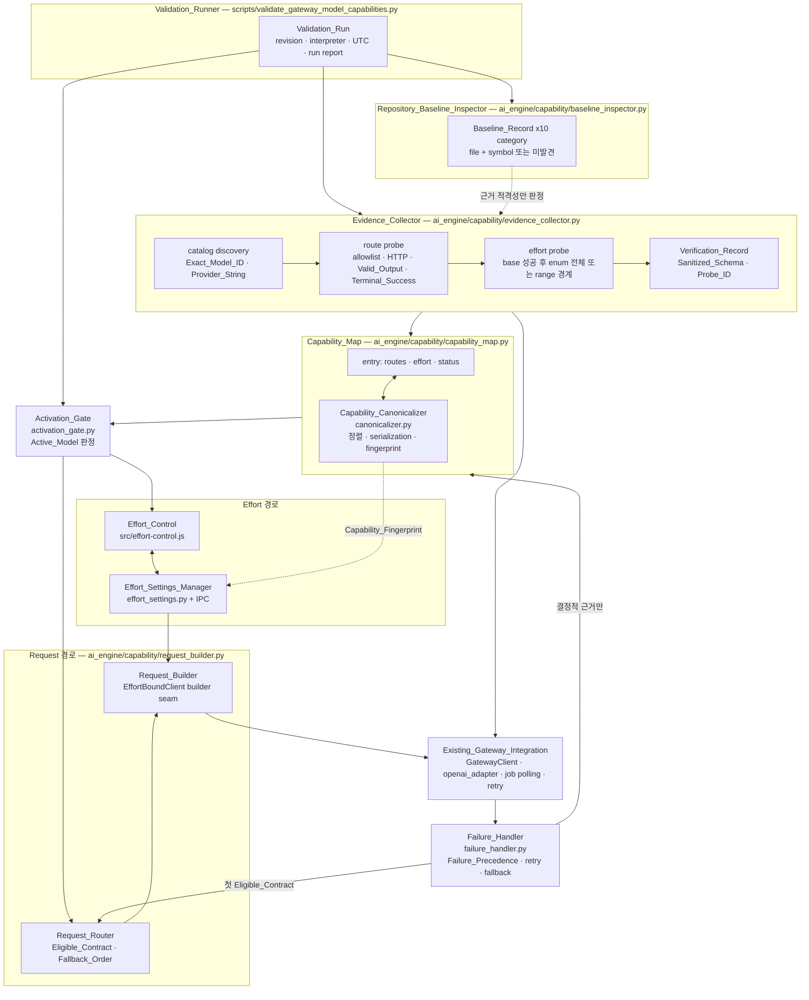
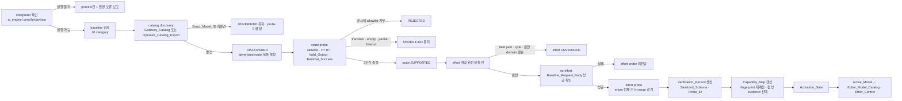
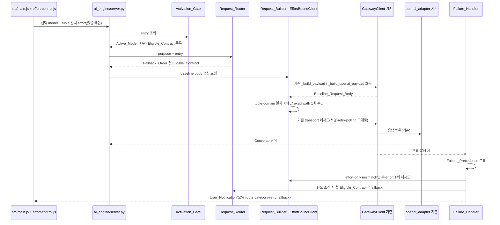
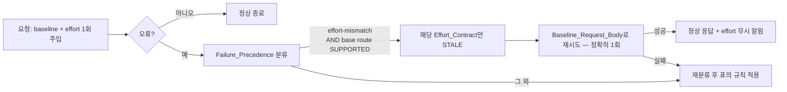

# Design Document

설계 문서: Gateway 모델 활성화 게이트와 effort capability 지원 (`gateway-models-effort-support`)

## Overview

이 설계는 완료된 `gateway-openai-models`의 통합 표면을 **재구현하지 않고 확장**한다. 추가하는 것은 두 가지다.

1. **근거 기반 활성화(Activation)** — 실제 Gateway catalog와 production request path 성공만을 근거(Authoritative_Evidence)로 삼아 모델을 노출한다. Candidate_Label(`opus 5`, `sonnet 5`, `gpt 5.6`, `sol`, `terra`, `luna`)은 검색 라벨일 뿐이며, 라벨 표기에서 model ID·provider·모델 계열·route·effort field path·effort value를 유추하지 않는다.
2. **exact model·route별 effort capability** — effort의 field path, value type, 완전한 domain은 오직 evidence로만 채워지는 자리이며, 이 문서는 그 자리를 채우는 **규칙과 구조**만 정의한다.

### 설계의 세 가지 불변 원칙

| 원칙 | 내용 | 구현 수단 |
|---|---|---|
| 미확정 값 금지 | model ID, provider, route 지원 여부, effort field path, effort 허용값은 이 문서에 확정 값으로 존재하지 않는다. 모두 `evidence로 채움` 자리다. | `Capability_Map` 스키마의 nullable 계약 필드 + `Verification_Status` 초기값 `UNVERIFIED` |
| 비침습 확장 | 기존 SigV4 서명, credential 캐시, retry, prefix 교정, job polling, 응답 변환, 모델 목록/선택 UI는 **호출·재사용**하고 복제하지 않는다. | 신규 패키지 `ai_engine/capability/*` + 기존 클래스의 builder seam 상속 오버라이드 |
| 무회귀 | effort 미선택 시 생성 body는 Baseline_Request_Body와 구조적으로 동일하고, 기존 모델·route 동작은 바이트 수준으로 보존된다. | `EffortBoundClient`가 baseline body를 먼저 만들고 조건 충족 시에만 복사본에 1회 주입 |

### Editor_Model_Catalog의 두 segment (명시적 해석)

Requirement 6.14(“Active_Model만 선택 가능 목록에 포함”)와 Requirement 1.13·12.1~12.3(기존 모델·route 무회귀)을 동시에 만족시키기 위해 모델 목록을 두 segment로 분리한다. 이 분리는 설계 결정이며 문서화된 해석이다.

| Segment | 구성 | Capability_Map 관리 | Activation_Gate 적용 |
|---|---|---|---|
| `Baseline_Catalog_Segment` | 기존 `/api/models` 경로가 반환하는 control-plane 결과 + 기존 denylist·uninvokable 필터 결과 | 아니오 | 아니오(기존 동작 그대로, 바이트 보존) |
| `Managed_Segment` | Candidate_Model entry와 Seed_Entry 출처 entry | 예 | 예(Active_Model만 노출) |

`Managed_Segment`가 비어 있으면 `/api/models` 응답과 프론트 동작은 이번 기능 도입 이전과 동일하다. Seed_Entry는 `Managed_Segment`에 속하므로 Current_Evidence 없이는 노출되지 않는다(Requirement 6.13).

### Steering 준수

- **project.md** — Electron + Vanilla JS + FastAPI/HTTPX 유지. 신규 프레임워크·TypeScript 없음. 모든 영속 데이터는 `userData` 하위. LLM generation과 effort 검증은 Bedrock Gateway route만 사용.
- **gateway.md** — `execute-api`/`lambda` SigV4 구분, 5분 credential 캐시, 403/422/5xx/만료 처리와 prefix 교정 1회 한도를 기존 구현에서 그대로 상속.
- **security.md** — credential·authorization·cookie·signature 비저장, IPC 핸들러는 `electron/main.js` 등록, `contextIsolation: true` 유지, preload 화이트리스트만 노출.
- **ui.md** — effort UI는 Web Component 1파일(`src/effort-control.js`), 기존 다크 산업풍 토큰·드롭다운 규약 재사용, shadow DOM 미사용.

## Architecture

### 구성요소 관계도



### 검증 파이프라인 (validation 순서)



핵심 규칙:

- 모든 probe body는 **production Request_Builder**가 생성하고, 판정은 **production response adapter·job polling**으로 한다. diagnostic code나 수동 body의 결과는 activation evidence에서 제외한다(Requirement 4.2~4.4).
- **성공 generation은 조합당 1회**다. 조합의 단위는 `(Exact_Model_ID, Known_Route, effort value)`이며 effort 미주입 baseline은 `effort value = ∅`로 하나의 조합이다(Requirement 4.24, 11.15).
- **명시적이고 교정 가능한 validation error**에만 동일 조합 교정 요청을 **최대 1회** 전송한다. prefix 형태 교정도 동일 route에서 최대 1회다(Requirement 2.16, 4.25, 11.16).
- Minimal_Request는 고정된 짧은 비민감 입력(Probe_ID로만 기록)과 Route_Contract가 허용하는 최소 output/token bound를 사용한다.

### 런타임 요청 경로



## Components and Interfaces

신규 파일은 모두 **순수 add**이며, 기존 파일 수정은 표에 명시한 seam 최소 변경으로 제한한다.

### 통합 지점 요약 (파일·심볼 수준)

| 구분 | 파일 | 심볼 | 이 기능에서의 취급 |
|---|---|---|---|
| 서명 | `ai_engine/gateway_module.py` | `GatewayClient._sign`(execute-api), `stream_sse_realtime` 내부 `BotocoreSigV4(creds, "lambda", region)` | 재사용. 신규 서명 코드 없음 |
| credential | 동 파일 | `_get_creds`(5분 캐시), `force_refresh_creds`, `inject_credentials`, `_is_expired_error` | 재사용. `EffortBoundClient`가 base 인스턴스로 위임해 캐시 단일화 |
| retry | 동 파일 | `converse` 루프, `converse_stream_live`, `stream_sse_realtime`(max_tokens 축소), `_openai_post_with_retry`(403/422/5xx/backoff) | 재사용. Transient retry 한도는 기존 값을 그대로 적용 |
| prefix 교정 | 동 파일 | `_is_prefix_form_error`, `_has_region_prefix`, `_strip_region_prefix`, `converse`의 `_prefix_fallback_used` | 재사용. Invocation_Model_ID 기록에만 관측값 사용 |
| job polling | 동 파일 | `_poll_job_data`, `_poll_job_result`, `_poll_invoke_job`, `_is_async_accepted`, `_openai_poll_job`, `_extract_job_id`, `_extract_job_status` | 재사용. Terminal_Success 판정의 유일한 근거 |
| request builder seam | 동 파일 | `_build_payload`, `_build_openai_payload`, `openai_responses_job_submit` | seam 유지. jobs의 `modelId` 부착 한 줄을 `_apply_jobs_model_id(body, model_id)`로 추출(기본 구현은 현재 동작과 바이트 동일) |
| 임의 body 전송 | 동 파일 | `openai_responses_call(body, timeout)` | 이미 존재 → 동기 Responses 계약 검증에 그대로 사용 |
| 응답 변환 | `ai_engine/openai_adapter.py` | `to_converse`, `extract_text`, `extract_tool_calls`, `extract_usage`, `extract_function_calls`, `_unwrap_gateway_envelope`, `InvalidOpenAIResponse` | 재사용. Valid_Output 판정기로 그대로 사용 |
| catalog | `ai_engine/server.py` | `list_models`(`/api/models`), `_update_gateway_model_cache`, `_filter_uninvokable` | `Baseline_Catalog_Segment` 그대로 유지. `Managed_Segment` 병합만 뒤에 추가 |
| catalog source | `ai_engine/openai_catalog.py` | `get_catalog_source`, `FileCatalogSource`, `GatewayListSource`, `merge_openai_into_catalog`, `DEFAULT_SEED_MODELS` | 재사용. 단, 그 산출물은 Seed_Entry로 표시되어 `Managed_Segment` 게이트를 통과해야 노출 |
| route 분기 | `ai_engine/server.py` | `is_openai_model`, `_openai_model_ids`, `route_openai_chat`, `_resolve_callable_model_id` | `Baseline_Catalog_Segment`에서는 불변. `Managed_Segment`에서는 Request_Router가 Capability_Map만 참조 |
| denylist | `ai_engine/server.py` | `_model_is_denied`, `_record_denied_model`, `_maybe_record_denied_from_error`, `_extract_denied_model_from_error`, `_normalize_model_key` | 재사용. `Failure_Handler`가 explicit allowlist denial 판정에 동일 신호를 사용하고 기존 등록 함수를 호출 |
| 모델 목록 UI | `src/main.js` | `MODEL_CATALOG`, `ALL_MODELS`, `rebuildModelList`, `_fetchFilteredModelCatalog`, `refreshModelsPreservingSelection`, `catalogSignature`, `resolveSelection`, `renderModelList`, `startModelRefreshScheduler`, `state.selectedModel`, `#model-dropdown-btn/-menu/-list` | 재사용·확장. capability payload가 없으면 기존 코드 경로와 동일 |
| 설정 영속화 | `electron/src/ipc-store-handlers.js`, `electron/src/ipc-fs-handlers.js` | `store:load-settings`, `store:save-settings`, `fs:get-user-data-path` | 재사용. Effort_Settings는 별도 파일로 분리해 settings 스키마 무변경 |
| IPC 등록 | `electron/main.js` | `registerAllIpcHandlers()` | 신규 `registerCapabilityHandlers(dataStore)` 1행 추가(등록은 main에서만) |
| preload | `electron/preload.js` | `contextBridge.exposeInMainWorld('electronAPI', …)` | 화이트리스트 3개 메서드만 추가 |

신규 파일:

| 파일 | 역할 |
|---|---|
| `ai_engine/capability/__init__.py` | 패키지 진입점(외부 import 부작용 없음) |
| `ai_engine/capability/baseline_inspector.py` | Repository_Baseline_Inspector |
| `ai_engine/capability/contracts.py` | enum·Route_Contract·Effort_Contract·Verification_Record 스키마와 검증기 |
| `ai_engine/capability/canonicalizer.py` | Capability_Canonicalizer(정렬·canonical serialization·fingerprint) |
| `ai_engine/capability/capability_map.py` | Capability_Map 로드/갱신/활성 evidence 선택/STALE 전이 |
| `ai_engine/capability/activation_gate.py` | Activation_Gate(순수 함수) |
| `ai_engine/capability/request_builder.py` | Request_Router + Request_Builder(`EffortBoundClient`) |
| `ai_engine/capability/effort_settings.py` | Effort_Settings 정규화·무효화(순수 로직) |
| `ai_engine/capability/failure_handler.py` | Failure_Precedence 분류·상태 전이·fallback 결정 |
| `ai_engine/capability/evidence_collector.py` | Evidence_Collector(probe 오케스트레이션·정제) |
| `ai_engine/capability/store.py` | `userData` 하위 영속화 경로 해석과 원자적 쓰기 |
| `scripts/validate_gateway_model_capabilities.py` | Validation_Runner CLI |
| `src/effort-control.js` | Effort_Control Web Component |
| `electron/src/ipc-capability-handlers.js` | capability/effort 설정 IPC 핸들러 |

### 1. Repository_Baseline_Inspector

```python
# ai_engine/capability/baseline_inspector.py
BASELINE_TARGETS = [
    # (Baseline_Category, 파일 경로, 확인할 심볼 이름들)
    ("catalog",         "ai_engine/server.py",         ["list_models", "_update_gateway_model_cache"]),
    ("catalog",         "ai_engine/openai_catalog.py", ["get_catalog_source", "FileCatalogSource", "GatewayListSource"]),
    ("allowlist",       "ai_engine/server.py",         ["_model_is_denied", "_record_denied_model",
                                                        "_maybe_record_denied_from_error"]),
    ("gateway-client",  "ai_engine/gateway_module.py", ["GatewayClient", "_get_creds", "inject_credentials", "_sign"]),
    ("route",           "ai_engine/server.py",         ["is_openai_model", "route_openai_chat",
                                                        "_resolve_callable_model_id"]),
    ("request-builder", "ai_engine/gateway_module.py", ["_build_payload", "_build_openai_payload",
                                                        "openai_responses_job_submit"]),
    ("model-selection", "src/main.js",                 ["rebuildModelList", "_fetchFilteredModelCatalog",
                                                        "refreshModelsPreservingSelection", "resolveSelection"]),
    ("response-adapter","ai_engine/openai_adapter.py", ["to_converse", "extract_text", "extract_tool_calls",
                                                        "extract_usage"]),
    ("job-polling",     "ai_engine/gateway_module.py", ["_poll_job_data", "_poll_job_result", "_openai_poll_job"]),
    ("retry",           "ai_engine/gateway_module.py", ["converse", "converse_stream_live",
                                                        "stream_sse_realtime", "_openai_post_with_retry"]),
    ("error-handling",  "ai_engine/gateway_module.py", ["QuotaExceededError", "OpenAISurfaceError", "SyncTimeout",
                                                        "JobTimeout", "JobFailed", "OpenAIModelUnsupported"]),
]

def inspect(repo_root: str) -> dict:
    """10개 Baseline_Category 전체의 Baseline_Record를 생성한다.

    반환: {"revision": str, "inspectedAt": <UTC ISO 8601>, "records": [
             {"category": str, "file": str, "symbol": str|None,
              "found": bool, "line": int|None, "reason": str|None}, ...]}
    - .py 는 ast.parse 로 top-level/클래스 멤버 심볼을 확인한다.
    - .js 는 선언 패턴 스캔으로 확인한다(Vanilla JS — 파서 의존 추가 없음).
    - 미발견은 오류가 아니라 `found: False` + `reason` 으로 기록한다.
    - 10 category 중 하나라도 결과가 비면 `evidenceEligible: False` 를 함께 기록한다.
    """
```

Baseline_Record 자체는 Authoritative_Evidence가 아니다. `evidenceEligible: False`이면 Evidence_Collector는 해당 baseline을 근거 집합에서 제외한다(Requirement 1.16).

### 2. Evidence_Collector

```python
# ai_engine/capability/evidence_collector.py
class EvidenceCollector:
    def __init__(self, gw, env_identity: dict, revision: str, run_id: str, budget): ...

    def discover(self, candidate_labels: list[str]) -> list[dict]:
        """Same_Gateway_Environment catalog 조회 → Candidate_Label별 discovery 결과.
        catalog endpoint 부재 시 Operator_Catalog_Export만 대체 근거로 허용하며,
        environment identity·region 일치, UTC 시각 순서, Catalog_Fingerprint 재계산 일치,
        sanitization manifest가 credential 관련 field만 제거했는지를 모두 검증한다.
        Exact_Model_ID / Provider_String 은 문자 변경 없이 기록한다.
        미발견·검증 실패 → UNVERIFIED 유지, probe 미생성."""

    def probe_route(self, model: dict, route_key: str) -> dict:
        """production Request_Builder로 Minimal_Request 생성 → 기존 transport 호출 →
        production adapter/job polling으로 판정.
        반환: {"http": bool, "validOutput": bool, "terminalSuccess": bool,
               "allowlist": "ALLOWED"|"REJECTED"|"UNVERIFIED",
               "invocationModelId": str|None, "sanitizedSchema": {...},
               "probeId": str, "status": Route_Support_Status}"""

    def probe_effort(self, model: dict, route_key: str, contract: dict) -> dict:
        """base(no-effort) 성공 확인 후 enum 전체 또는 range 경계만 검증한다.
        부분 검증·transient·invalid value → UNVERIFIED. unknown field → UNSUPPORTED.
        effort 실패는 base Route_Support_Status를 강등하지 않는다."""

    def to_verification_record(self, ...) -> dict:
        """정제된 Verification_Record 생성 + Evidence_Record_ID 계산."""
```

초기화·격리·승격 규칙:

- **초기화** — 여섯 Candidate_Label 각각에 정확히 하나의 entry를 만들고 `verificationStatus = UNVERIFIED`, 모든 계약 필드를 `null`로 둔다. 라벨만 주어진 상태에서는 modelId·provider·route·effort가 모두 미확정으로 남는다.
- **라벨 간 격리** — `gpt 5.6`, `sol`, `terra`, `luna`는 Authoritative_Evidence가 관계를 명시하기 전까지 네 개의 독립 entry로 유지한다. 한 라벨의 evidence는 다른 라벨의 provider·model family·route·effort 필드에 절대 전파되지 않는다(`upsert`는 `candidateLabel` 단위로만 기록한다).
- **승격** — `Exact_Model_ID`와 `Provider_String`이 채워지고 `SUPPORTED` route가 1개 이상이며 Complete_Record가 Current_Evidence(Same_Gateway_Environment · Current_Revision · 현재 Catalog_Fingerprint · 현재 Capability_Fingerprint)와 일치할 때만 `VERIFIED`로 기록한다. 그 외에는 `DISCOVERED` 또는 `UNVERIFIED`를 유지한다.

effort probe 예산(요구 probe 수는 domain이 결정한다):

| Effort_Contract domain | 필요한 성공 probe | 부분 검증 시 |
|---|---|---|
| 계약 불완전(field path·value type·domain 중 결손) | 0 (전송하지 않음) | `UNVERIFIED` |
| no-effort baseline 실패 | 0 (전송하지 않음) | effort 상태 변경 없음 |
| `ENUM` | 광고된 enum value 각 1회 | 하나라도 미검증이면 `UNVERIFIED` |
| `RANGE`, 하한 ≠ 상한 | 하한 1회 + 상한 1회 | 하나라도 미검증이면 `UNVERIFIED` |
| `RANGE`, 하한 == 상한 | 그 경계 1회 | 미검증이면 `UNVERIFIED` |

route별 판정 근거는 아래 표의 기존 심볼만 사용한다. 어떤 route가 지원되는지는 이 문서가 확정하지 않는다.

| Known_Route | 요청 생성 | Valid_Output 판정 | Terminal_Success 판정 |
|---|---|---|---|
| `CONVERSE` | `GatewayClient._build_payload` | Converse content 블록 비어 있지 않음 | `decision == ALLOW` 즉시 충족, `ACCEPTED`면 `_poll_job_data` terminal + Valid_Output |
| `INVOKE` | `GatewayClient.invoke_model` 경로의 payload | production adapter가 소비 가능한 output | 동기 결과 즉시 충족, async handoff면 `_poll_invoke_job` terminal + Valid_Output |
| `OPENAI_RESPONSES` | `_build_openai_payload` → `openai_responses_call` | `openai_adapter.to_converse` 성공 | 동기 완료 응답 |
| `OPENAI_RESPONSES_JOBS` | `openai_responses_job_submit`(seam `_apply_jobs_model_id`) | `to_converse` 성공 | 제출 성공 + job ID + `_openai_poll_job` terminal |
| `SSE_STREAM` | `_build_payload` + `stream_sse_realtime` | content event 1건 이상 | terminal event 수신 |

Gateway_Catalog 또는 검증된 route advertisement에 없는 Known_Route는 `NOT_ADVERTISED`로 기록하고 probe를 전송하지 않는다(Requirement 4.16, 4.17).

### 3. Capability_Map / Capability_Canonicalizer

```python
# ai_engine/capability/canonicalizer.py
SET_LIKE_PATHS = (  # 집합 의미 → 정렬·중복 제거
    "invocationModelIds", "routes.*.contract.optionalFields",
    "effort.*.contract.enumValues", "evidence",
)
ORDER_BEARING_PATHS = (  # 순서 의미 → 원 순서 보존
    "routes.*.contract.modelIdFieldPath", "routes.*.contract.messageFieldPath",
    "routes.*.contract.inferenceConfigFieldPath", "effort.*.contract.fieldPath",
)

def canonical(value) -> object: ...          # dict key 정렬, set-like 정렬·dedup, 순서형 보존
def serialize(entry_or_map) -> str: ...      # json.dumps(sort_keys=True, ensure_ascii=False, separators=(",", ":"))
def deserialize(text: str) -> dict: ...      # 의미 보존 역직렬화(의미 손실 시 Malformed_Entry)
def capability_fingerprint(entry) -> str: ...
def catalog_fingerprint(catalog_snapshot) -> str: ...
def evidence_record_id(record) -> str: ...
```

```python
# ai_engine/capability/capability_map.py
def load(user_data_root: str) -> dict: ...
def upsert(map_obj: dict, record: dict) -> dict:
    """Verification_Record를 반영하고 fingerprint를 재계산한다.
    동일 modelId + 동일 Capability_Fingerprint의 evidence가 복수면
    최신 verifiedAt → 동시각이면 Evidence_Record_ID 오름차순 첫 record를 활성으로 선택."""
def mark_stale(map_obj: dict, reason: str, selector: dict) -> dict: ...
def derive_mode_support(routes: dict) -> dict:
    """syncSupport/asyncSupport/streamingSupport를 execution mode별 route 상태에서 유도.
    우선순위: SUPPORTED > UNVERIFIED > UNSUPPORTED > NOT_ADVERTISED."""
def valid_entries(map_obj: dict) -> tuple[list, list]:
    """(유효 entry, Malformed_Entry) 분리. Malformed는 activation 입력에서 제외."""
```

STALE 전이 트리거: Exact_Model_ID가 현재 catalog에서 제거, Provider_String 변경, Route_Contract 변경, Effort_Contract 변경, Verification_Record revision ≠ Current_Revision. 재검증이 현재 production probe를 모두 통과하면 새 Capability_Fingerprint와 UTC 시각으로 `VERIFIED`로 갱신하고, 미완료면 `STALE`을 유지한다.

### 4. Activation_Gate

```python
# ai_engine/capability/activation_gate.py
def is_active(entry: dict, ctx: dict) -> tuple[bool, str]:
    """ctx = {"revision", "catalogFingerprint", "catalogModelIds", "nowUtc"}
    통과 조건(전부 AND):
      1) verificationStatus == "VERIFIED"
      2) modelId 비어 있지 않음
      3) provider 비어 있지 않음
      4) capabilityFingerprint == canonicalizer.capability_fingerprint(entry)
      5) Complete_Record(필수 schema · 모든 Known_Route 상태 · SUPPORTED 계약 evidence · 현재 identity/revision/fingerprint)
      6) Eligible_Contract >= 1
      7) Current_Evidence 보유
      8) Malformed_Entry 아님, Seed_Entry 아님(sourceKind != "SEED")
    반환: (활성 여부, 탈락 이유 코드)"""

def active_models(map_obj: dict, ctx: dict) -> list[dict]:
    """유효 entry만 평가하고, canonical serialization이 같은 duplicate를 1개로 축약한다.
    동일 modelId 다중 entry: 최신 verifiedAt 단일 entry만 노출.
    최신 entry들의 fingerprint 불일치 또는 verifiedAt tie → 해당 modelId 미노출."""
```

`Eligible_Contract` 판정: `status == SUPPORTED` AND Current_Evidence 보유 AND 요청 목적(purpose: chat/stream/image 등 Route_Contract의 `purposes`) 충족 AND `allowlist == ALLOWED`.

서버 노출: `list_models`의 마지막 단계에 `Managed_Segment` 병합을 추가한다. 아래는 삽입 위치와 조건을 보여주는 예시이며 변수명은 구현 시점의 `list_models` 지역 변수에 맞춘다.

```python
# ai_engine/server.py — list_models 내부, _filter_uninvokable 이후 · 응답 dict 구성 직전
try:
    from ai_engine.capability import capability_map as _cm, activation_gate as _ag
    _managed = _ag.active_models(_cm.load(_user_data_root()), _ctx)
    if _managed:                       # 비면 응답 바이트 baseline 동일
        catalog = _cm.merge_active_into_catalog(catalog, _managed)
        payload["capabilities"] = _cm.to_ui_payload(_managed)   # 신규 최상위 키
except Exception as _e:
    print(f"[Capability] Managed_Segment 병합 생략: {str(_e)[:200]}")
```

`Managed_Segment`가 비면 `catalog`도 `payload`도 변경되지 않는다(무회귀).

### 5. Request_Router / Request_Builder

```python
# ai_engine/capability/request_builder.py
def select_contract(entry: dict, purpose: str, ctx: dict) -> dict | None:
    """Fallback_Order(정수 rank 오름차순)에서 첫 Eligible_Contract를 반환한다.
    Candidate_Label 문자열 패턴과 Provider_String 문자열 패턴은 입력으로 사용하지 않는다.
    Eligible_Contract가 없으면 None → 호출자는 Gateway 전송을 생성하지 않는다."""

class EffortBoundClient(GatewayClient):
    """기존 GatewayClient를 상속해 builder seam만 오버라이드하는 요청 단위 클라이언트.

    - credential 상태는 base 인스턴스에 위임 → 5분 캐시·강제 갱신 단일화
    - 서명·retry·prefix 교정·job polling·응답 변환은 상속받은 기존 구현 그대로
    - 주입은 오직 아래 두 오버라이드에서만 발생
    """
    def __init__(self, base: GatewayClient, contract: dict, effort_selection: dict | None):
        self.gateway_url, self.region = base.gateway_url, base.region
        self.aws_profile, self.bedrock_user = base.aws_profile, base.bedrock_user
        self._base, self._contract, self._effort = base, contract, effort_selection

    def _get_creds(self):        return self._base._get_creds()
    def force_refresh_creds(self): return self._base.force_refresh_creds()

    def _build_payload(self, *a, **kw):
        return _inject_effort(super()._build_payload(*a, **kw), self._contract, self._effort)

    def _build_openai_payload(self, *a, **kw):
        return _inject_effort(super()._build_openai_payload(*a, **kw), self._contract, self._effort)

    def _apply_jobs_model_id(self, body: dict, model_id: str) -> dict:
        """verified jobs Route_Contract를 따른다.
        modelIdRequired=True  → contract.modelIdFieldPath에 Invocation_Model_ID 정확히 1회
        modelIdRequired=False → body 전체에서 modelId key 0회"""

def _inject_effort(baseline_body: dict, contract: dict, selection: dict | None) -> dict:
    """다음 중 하나라도 불일치하면 baseline_body를 **그대로**(동일 객체) 반환한다.
      - selection 없음
      - selection.modelId != contract.modelId
      - selection.route != contract.routeKey
      - selection.capabilityFingerprint != contract.capabilityFingerprint
      - contract.effort.status != "SUPPORTED"
      - selection.value ∉ verified domain(enum 멤버십 또는 inclusive range)
    모두 일치하면 baseline_body의 deep copy에 contract.effort.fieldPath 경로로
    값을 정확히 1회 기록하고, 그 외 어떤 경로도 추가·삭제·변형하지 않는다."""
```

route별 body 생성 규칙:

| Known_Route | model ID 기록 | 메시지·설정 schema | 선택 field |
|---|---|---|---|
| `CONVERSE` | verified Route_Contract의 `modelIdFieldPath` (기존 `_build_payload`가 만드는 위치와 동일해야 한다) | 계약의 `messageFieldPath`·`inferenceConfigFieldPath` | 계약 `optionalFields`만 |
| `OPENAI_RESPONSES` | `model`에 Exact_Model_ID, body 전체 `modelId` key 0개 | 계약이 정의한 `input` | 계약 `optionalFields`만 |
| `OPENAI_RESPONSES_JOBS` | `modelIdRequired`가 참일 때 계약 path에 Invocation_Model_ID 1회, 거짓이면 0회 | 동기 경로와 동일 정규화 재사용 | 계약 `optionalFields`만 |
| `INVOKE`, `SSE_STREAM` | 기존 builder가 만드는 위치 그대로 | 기존 schema 그대로 | 계약 `optionalFields`만 |

동기 Responses body는 어떤 중첩 경로에도 `modelId` key를 만들지 않는다. 기존 `_build_openai_payload`가 `model`/`input`/`instructions`만 구성하고, `_inject_effort`는 verified 경로 1곳만 기록하므로 이 성질이 구조적으로 유지된다. verified Route_Contract가 열거한 선택 field 외에는 추가하지 않는다.

서버 seam(예: `run_agent_stream`)은 다음 형태로만 확장한다.

```python
_effort = body.get("effort")            # 없으면 None → 기존 경로와 완전히 동일
_client, _contract = capability_client_for(gw, model, purpose="chat", effort=_effort)
gw_for_call = _client or gw             # Managed_Segment 아니면 기존 gw 그대로
```

### 6. Effort_Control / Effort_Settings_Manager

```javascript
// src/effort-control.js — Web Component 1파일, shadow DOM 미사용
class EffortControl extends HTMLElement {
  // 표시 조건: (modelId, route, capabilityFingerprint) tuple의 effort.status === 'SUPPORTED'
  // 표시 내용: verified domain만. enum → 항목 버튼, range → 경계 포함 슬라이더/스텝 입력
  // 비지원·tuple 불일치 → 렌더 트리 미생성(숨김)
  // 변경 시 CustomEvent('effort-change', {detail:{modelId, route, capabilityFingerprint, value}})
}
customElements.define('effort-control', EffortControl);
```

`src/main.js` 확장 지점(모두 조건부, capability payload 없으면 무동작):

- `_fetchFilteredModelCatalog()` — 응답의 신규 `capabilities` 키를 `state.capabilities`에 보관(없으면 미설정).
- `renderModelList()` / `#model-dropdown-item` 클릭 핸들러 — 선택 확정 후 `<effort-control>`에 tuple 전달.
- `refreshModelsPreservingSelection()` — `resolveSelection` 결과 적용 직후 Model_Selection_Manager 규칙으로 Effort_Settings를 정리한다. 카탈로그 시그니처가 동일하면 기존과 같이 아무 것도 변경하지 않는다.
- 요청 payload — tuple 일치 검증을 통과한 경우에만 `effort` 필드를 추가한다.

```python
# ai_engine/capability/effort_settings.py  (순수 로직 — DOM·IO 없음)
def prune(settings: dict, ctx: dict) -> dict:
    """다음 조건에서 저장된 value를 request 생성 전에 제거한다.
       modelId 불일치 · route 불일치 · capabilityFingerprint 불일치 ·
       verified domain 이탈 · entry 삭제 · entry STALE · route가 SUPPORTED 상실"""
def restore(settings: dict, tuple_key: dict) -> dict | None:
    """새 tuple과 정확히 일치하는 항목만 복원. 그 외에는 None(미선택)."""
```

영속화는 `electron/src/ipc-capability-handlers.js`가 담당한다.

```javascript
// electron/src/ipc-capability-handlers.js
function registerCapabilityHandlers(dataStore) {
  ipcMain.handle('capability:load-effort-settings', () => dataStore.readJson('capability/effort_settings.json'));
  ipcMain.handle('capability:save-effort-settings', (_e, data) => dataStore.writeJson('capability/effort_settings.json', data));
  ipcMain.handle('capability:load-map', () => dataStore.readJson('capability/capability_map.json'));
}
```

`electron/main.js::registerAllIpcHandlers()`에 `registerCapabilityHandlers(dataStore)` 1행을 추가하고, `electron/preload.js`에는 위 3개 채널만 화이트리스트로 노출한다. `ipcRenderer`는 노출하지 않고 `contextIsolation: true`를 유지한다.

### 7. Failure_Handler / User_Notification

```python
# ai_engine/capability/failure_handler.py
PRECEDENCE = ("authentication", "allowlist", "effort-mismatch", "route-capability-mismatch",
              "quota", "transient", "request-validation", "unknown")

def classify(signals: dict) -> str:
    """여러 신호가 겹치면 PRECEDENCE 순서의 첫 일치 범주를 반환한다(결정론적)."""

def apply(entry: dict, category: str, ctx: dict) -> dict:
    """범주별 상태 전이 — Error Handling 절의 표와 1:1 대응."""

def plan_recovery(entry: dict, category: str, ctx: dict) -> dict:
    """반환: {"retryWithoutEffort": bool,   # effort-only mismatch에서만 True, 최대 1회
             "fallbackContract": dict|None, # Fallback_Order 첫 Eligible_Contract
             "terminate": bool}"""

def notification(ctx: dict) -> dict:
    """{"modelId", "route", "category", "retryCount", "fallback"} —
    credential·authorization·cookie·signature·raw response body 제외."""
```

`allowlist` 판정 신호는 기존 `ai_engine/server.py::_maybe_record_denied_from_error`가 사용하는 문자열 신호를 공유하고, 판정 시 기존 `_record_denied_model`을 호출해 denylist 동작을 유지한다.

### 8. Validation_Runner

```bash
ai_engine/.venv/bin/python scripts/validate_gateway_model_capabilities.py \
  --labels "opus 5" "sonnet 5" "gpt 5.6" "sol" "terra" "luna" \
  --report userData/capability/runs/{runId}.json
```

- interpreter가 `ai_engine/.venv/bin/python`으로 실행 가능하지 않으면 Gateway_Probe를 0건으로 유지하고 interpreter 환경 오류만 보고한다.
- 보고서 헤더: Current_Revision, interpreter absolute path, 시작 UTC ISO 8601, Same_Gateway_Environment identity, PBT seed.
- 보고서 본문: 6개 Candidate_Label discovery 결과, Exact_Model_ID/Provider_String, Known_Route별 상태·evidence reference, model·route별 Effort_Support_Status·evidence reference, Verification_Status·fingerprint, probe별 Sanitized_Schema, usage/cost는 Gateway가 제공한 값만(미제공은 `notProvided`).
- 신규/변경 Active_Model은 Current_Evidence·revision·fingerprint 일치를 확인하고, 불일치면 activation 결과에서 제외한다.

## Data Models

### enum 정의 (닫힌 집합)

| enum | 허용값 |
|---|---|
| `Verification_Status` | `UNVERIFIED`, `DISCOVERED`, `VERIFIED`, `REJECTED`, `STALE` |
| `Route_Support_Status` | `SUPPORTED`, `UNSUPPORTED`, `UNVERIFIED`, `NOT_ADVERTISED` |
| `Effort_Support_Status` | `SUPPORTED`, `UNSUPPORTED`, `UNVERIFIED`, `STALE` |
| `Allowlist_Result` | `ALLOWED`, `REJECTED`, `UNVERIFIED` |
| `Known_Route` | `CONVERSE`, `INVOKE`, `OPENAI_RESPONSES`, `OPENAI_RESPONSES_JOBS`, `SSE_STREAM` |
| `Execution_Mode` | `SYNC`, `ASYNC`, `STREAMING` |
| `Signing_Service` | `execute-api`, `lambda` |
| `Domain_Kind` | `ENUM`, `RANGE` |
| `Value_Type` | `STRING`, `INTEGER`, `NUMBER`, `BOOLEAN` |
| `Source_Kind` | `CATALOG`, `OPERATOR_EXPORT`, `SEED` |
| `Failure_Category` | `authentication`, `allowlist`, `effort-mismatch`, `route-capability-mismatch`, `quota`, `transient`, `request-validation`, `unknown` |

`Value_Type`은 저장 표현의 닫힌 집합일 뿐이며, 특정 모델·route의 실제 value type은 evidence가 지정한다.

### Capability_Map entry

| 필드 | 타입 | 필수 | 설명 |
|---|---|---|---|
| `schemaVersion` | int | 예 | 스키마 버전. fingerprint 입력 포함 |
| `candidateLabel` | str | 예 | 검색 라벨. fingerprint 입력 **제외** |
| `modelId` | str | 예 | Exact_Model_ID. catalog 문자 그대로 |
| `invocationModelIds` | list[str] | 예 | production prefix 교정으로 실제 전송된 ID들(집합 의미) |
| `provider` | str | 예 | Provider_String. catalog 문자 그대로 |
| `displayName` | str \| null | 아니오 | 표시용. fingerprint 입력 **제외** |
| `sourceKind` | `Source_Kind` | 예 | `SEED`는 Active_Model 후보에서 제외 |
| `catalogFingerprint` | str | 예 | catalog 변경 감지값 |
| `routes` | dict[`Known_Route`, Route_Entry] | 예 | 모든 Known_Route 키가 존재해야 Complete_Record |
| `syncSupport` | `Route_Support_Status` | 예 | `SYNC` route 상태에서 유도 |
| `asyncSupport` | `Route_Support_Status` | 예 | `ASYNC` route 상태에서 유도 |
| `streamingSupport` | `Route_Support_Status` | 예 | `STREAMING` route 상태에서 유도 |
| `effort` | dict[`Known_Route`, Effort_Entry] | 예 | route별 effort 상태·계약 |
| `verifiedAt` | str | 예 | UTC ISO 8601. fingerprint 입력 **제외** |
| `revision` | str | 예 | Verification_Record revision. fingerprint 입력 **제외** |
| `evidence` | list[str] | 예 | Evidence_Record_ID 목록. fingerprint 입력 **제외** |
| `verificationStatus` | `Verification_Status` | 예 | 초기값 `UNVERIFIED` |
| `capabilityFingerprint` | str | 예 | 아래 규칙으로 계산 |

`Route_Entry` = `{"status": Route_Support_Status, "allowlist": Allowlist_Result, "contract": Route_Contract|null, "evidenceRef": str|null}`
`Effort_Entry` = `{"status": Effort_Support_Status, "contract": Effort_Contract|null, "evidenceRef": str|null}`

### Route_Contract

| 필드 | 타입 | 설명 |
|---|---|---|
| `routeKey` | `Known_Route` | 계약 대상 route |
| `endpointRef` | str | 기존 클라이언트의 endpoint 참조자(`gateway_url` 상대 경로 또는 stream route 식별자). 신규 URL 하드코딩 없음 |
| `httpMethod` | str | 기존 구현이 사용하는 method |
| `executionMode` | `Execution_Mode` | derived 모드 상태 계산에 사용 |
| `signingService` | `Signing_Service` | execute-api / lambda 구분 |
| `modelIdRequired` | bool \| null | `null`은 미확정 → jobs route는 `UNVERIFIED` 유지 |
| `modelIdFieldPath` | list[str] \| null | 순서 의미 경로. evidence로 채움 |
| `messageFieldPath` | list[str] \| null | evidence로 채움 |
| `inferenceConfigFieldPath` | list[str] \| null | evidence로 채움 |
| `optionalFields` | list[str] | verified하게 열거된 선택 field(집합 의미) |
| `outputValidatorRef` | str | Valid_Output 판정 함수 참조자(production adapter 심볼) |
| `terminalConditionRef` | str | Terminal_Success 판정 참조자(production polling 심볼) |
| `retryPolicyRef` | str | 기존 retry 구현 참조자 |
| `fallbackRank` | int | Fallback_Order 정렬 키 |
| `purposes` | list[str] | 요청 목적 집합(집합 의미) |
| `minOutputBound` | dict | Minimal_Request의 최소 output/token bound |
| `evidenceRef` | str \| null | Current_Evidence reference |

### Effort_Contract

| 필드 | 타입 | 설명 |
|---|---|---|
| `modelId` | str | 계약이 결속된 Exact_Model_ID |
| `routeKey` | `Known_Route` | 계약이 결속된 route |
| `fieldPath` | list[str] | exact field path(순서 의미). **evidence로만 채움** |
| `valueType` | `Value_Type` | exact value type. evidence로만 채움 |
| `domainKind` | `Domain_Kind` | `ENUM` 또는 `RANGE` |
| `enumValues` | list \| null | `ENUM`일 때 광고된 complete enum(집합 의미) |
| `rangeLowerInclusive` | number \| null | `RANGE`의 inclusive 하한 |
| `rangeUpperInclusive` | number \| null | `RANGE`의 inclusive 상한 |
| `verifiedValues` | list | 실제 성공 probe로 확인된 value 목록(집합 의미) |
| `evidenceRef` | str \| null | Current_Evidence reference |

`fieldPath`, `valueType`, `enumValues`, `rangeLowerInclusive`, `rangeUpperInclusive` 중 하나라도 비면 `Effort_Support_Status`는 `UNVERIFIED`를 유지한다. Candidate_Label, Provider_String, 다른 Candidate_Model의 evidence에서 이 값을 생성하지 않는다.

### Verification_Record

| 필드 | 타입 | 설명 |
|---|---|---|
| `evidenceRecordId` | str | 정제 record의 불변 필드로 계산 |
| `runId` | str | Validation_Run ID |
| `verifiedAt` | str | UTC ISO 8601 |
| `revision` | str | Current_Revision |
| `interpreterPath` | str | 사용한 interpreter absolute path |
| `environment` | dict | `{gatewayEnvironmentId, endpointIdentity, region}` |
| `candidateLabel` | str | 검색 라벨 |
| `modelId` / `provider` | str | catalog 문자 그대로 |
| `invocationModelIds` | list[str] | prefix 교정 결과 |
| `catalogFingerprint` / `capabilityFingerprint` | str | 계약·catalog 변경 감지값 |
| `routeResults` | list[dict] | `{routeKey, http, validOutput, terminalSuccess, allowlist, status, probeId, sanitizedSchema, correctionUsed}` |
| `effortResults` | list[dict] | `{routeKey, fieldPath, value, status, probeId, sanitizedSchema, baselineSucceeded}` |
| `usage` / `cost` | dict \| `"notProvided"` | Gateway가 제공한 값만 |
| `routeCompleteness` | bool | 모든 Known_Route 상태 채움 여부 |

Sanitized_Schema는 field name·type·cardinality와 필요한 status만 보존하고 credential·authorization·cookie·signature·raw prompt·raw response body를 포함하지 않는다. raw prompt 자리에는 Probe_ID만 기록한다.

### Effort_Settings

```json
{
  "schemaVersion": 1,
  "entries": [
    {
      "modelId": "<Exact_Model_ID>",
      "route": "<Known_Route>",
      "capabilityFingerprint": "<현재 fingerprint>",
      "value": "<verified domain 내 값>",
      "valueType": "<Value_Type>",
      "updatedAt": "<UTC ISO 8601>"
    }
  ]
}
```

tuple 키는 `(modelId, route, capabilityFingerprint)`이며 세 값이 모두 일치할 때만 복원한다. 하나라도 다르면 request 생성 전에 제거한다.

### canonical serialization과 fingerprint 계산 규칙

1. **정규화** — `dict`는 key를 UTF-8 바이트 순으로 정렬한다. 집합 의미 collection(`SET_LIKE_PATHS`)은 canonical 표현 기준으로 정렬·중복 제거한다. 순서 의미 collection(`ORDER_BEARING_PATHS`, 대표적으로 field path)은 원 순서를 보존한다. `null`은 제거하지 않고 명시적으로 유지한다(미확정과 미존재를 구분).
2. **직렬화** — `json.dumps(value, sort_keys=True, ensure_ascii=False, separators=(",", ":"))`. 동일 의미 입력은 동일 UTF-8 바이트를 만든다.
3. **Capability_Fingerprint 입력** — `schemaVersion`, `modelId`, `provider`, `catalogFingerprint`, 모든 Known_Route의 `{status, allowlist, contract}`, 모든 effort entry의 `{status, contract}`.
4. **Capability_Fingerprint 제외 입력** — `candidateLabel`, `displayName`, 모든 UTC 시각, `revision`, evidence 저장 위치, `evidenceRecordId`/`evidence`, 로그, Sanitized_Schema.
5. **계산** — `"cfp1:sha256:" + sha256(canonical_bytes).hexdigest()`.
6. **Catalog_Fingerprint** — 입력은 catalog snapshot의 model identity, provider, advertised route, capability 필드. 수집 시각·수집자·로그는 제외. 형식 `"cat1:sha256:<hex>"`.
7. **Evidence_Record_ID** — 입력은 정제 Verification_Record의 불변 필드(`runId`, `environment`, `revision`, `modelId`, `provider`, `catalogFingerprint`, `capabilityFingerprint`, `routeResults`의 판정 결과, `effortResults`의 판정 결과, `verifiedAt`). 형식 `"evr1:sha256:<hex>"`.
8. **멱등성** — `canonical(canonical(x)) == canonical(x)`, `serialize(deserialize(serialize(x))) == serialize(x)`.

### 영속 경로 (userData 하위 한정)

| 경로 | 내용 |
|---|---|
| `userData/capability/capability_map.json` | Capability_Map(`{schemaVersion, updatedAt, entries}`) |
| `userData/capability/effort_settings.json` | Effort_Settings |
| `userData/capability/baseline/{revision}.json` | Baseline_Record 집합 |
| `userData/capability/evidence/{evidenceRecordId}.json` | 정제 Verification_Record |
| `userData/capability/catalog/{catalogFingerprint}.json` | 정제 catalog snapshot |
| `userData/capability/runs/{runId}.json` | Validation_Run 보고서 |
| `userData/settings/settings.json` | 기존 파일. AWS profile name만 credential reference로 유지(스키마 무변경) |

`ai_engine/capability/store.py`는 모든 경로를 `userData` 루트 기준으로 해석하고, 루트 밖 경로는 읽기·쓰기를 거부하며, 임시 파일 + `os.replace` 원자적 쓰기를 사용한다.

## Correctness Properties

*속성(property)은 시스템의 모든 유효한 실행에서 참이어야 하는 특성 또는 동작이다. 시스템이 무엇을 해야 하는지에 대한 형식적 진술로서, 사람이 읽는 명세와 기계가 검증하는 정확성 보장 사이의 다리 역할을 한다.*

아래 property는 모두 **순수 로직**(capability 판정, canonical serialization, request 생성, 선택 정리)에 대한 것이다. 실제 Gateway 정책·route 지원·effort 지원은 property로 주장하지 않으며 최소 비용 integration probe로만 확정한다.

### Property 1: Activation subset

*For any* Capability_Map(모든 Verification_Status, Malformed_Entry, Seed_Entry, mock 출처 evidence, 미발견 Candidate_Label을 섞어 생성한 임의 입력)에 대해, Activation_Gate가 산출한 Active_Model 집합은 항상 `{유효 entry ∧ verificationStatus == VERIFIED ∧ non-empty modelId ∧ non-empty provider ∧ 현재 Capability_Fingerprint 일치 ∧ Complete_Record ∧ Eligible_Contract ≥ 1 ∧ Current_Evidence 보유 ∧ sourceKind ≠ SEED}`의 부분집합이며, Managed_Segment 노출 집합은 Active_Model 집합과 정확히 같다. Candidate_Label 문자열은 어떤 경우에도 모델 항목으로 노출되지 않는다.

**Validates: Requirements 1.15, 1.17, 6.1, 6.2, 6.3, 6.4, 6.5, 6.6, 6.7, 6.9, 6.10, 6.11, 6.12, 6.13, 6.14, 6.26, 12.9, 12.22**

### Property 2: Malformed 제외

*For any* entry에 대해 필수 필드 삭제, 타입 변형, enum 이탈, Capability_Fingerprint 불일치, evidence 참조 무결성 실패 중 하나 이상을 임의로 주입하면, 해당 entry는 항상 Malformed_Entry로 판정되어 activation 입력에서 제외되고 Active_Model 집합과의 교집합은 공집합이다.

**Validates: Requirements 3.1, 3.2, 3.3, 3.4, 3.5, 3.6, 3.7, 3.8, 3.9, 3.10, 3.11, 3.17, 6.8, 12.10**

### Property 3: unsupported effort 비주입

*For any* Exact_Model_ID, Known_Route, 사용자 입력과 임의의 effort 설정에 대해, 다음 중 하나라도 성립하면(effort 미선택, effort UI 숨김, Effort_Support_Status ≠ `SUPPORTED`, 선택 value가 verified domain 이탈, 저장된 Capability_Fingerprint가 현재 값과 불일치) 생성 body는 Baseline_Request_Body와 구조적으로 동일하며, body의 모든 중첩 경로에서 Effort_Contract field 발생 횟수는 0이다.

**Validates: Requirements 7.15, 7.16, 7.17, 8.17, 8.18, 8.19, 12.3, 12.11**

### Property 4: supported effort exact-once

*For any* `Effort_Support_Status == SUPPORTED`인 계약과 그 verified domain(enum 멤버 또는 inclusive range 내 값)에서 뽑은 임의 value에 대해, 생성 body에는 Effort_Contract의 exact field path에 그 value가 정확히 1회 기록되고, 그 경로를 제외한 나머지 body는 Baseline_Request_Body와 동일하다.

**Validates: Requirements 8.16, 12.12**

### Property 5: canonicalization 멱등성

*For any* Capability_Map entry에 대해, Capability_Canonicalizer를 반복 적용한 결과는 첫 적용 결과와 동일하다. 즉 `canonical(canonical(x)) == canonical(x)`이고 `serialize(canonical(x)) == serialize(x)`이며, 반복 적용은 Capability_Fingerprint를 변화시키지 않는다.

**Validates: Requirements 3.14, 3.16, 12.13**

### Property 6: serialization round-trip

*For any* Capability_Map에 대해, serialize한 뒤 deserialize하면 model identity, provider, 모든 Known_Route의 계약·상태, effort 계약·상태, evidence reference의 의미가 보존되고, 다시 serialize한 바이트열은 최초 serialize 결과와 동일하다.

**Validates: Requirements 3.15, 12.14**

### Property 7: ordering invariance

*For any* catalog 입력 순서, entry 순서, object key 순서, 집합 의미 collection의 원소 순서 치환에 대해, 산출된 Active_Model 집합과 Capability_Fingerprint는 변하지 않는다. 또한 fingerprint 제외 입력(Candidate_Label, display name, UTC 시각, revision, evidence 저장 위치, Evidence_Record_ID, 로그, Sanitized_Schema)만 변경해도 fingerprint는 불변이며, 동일 Exact_Model_ID의 중복·다중 entry 축약 결과(최신 `verifiedAt` 단일 노출, fingerprint 불일치·시각 tie 미노출, 동시각 tie는 Evidence_Record_ID 오름차순 첫 record 선택)도 입력 순서와 무관하다.

**Validates: Requirements 3.12, 3.13, 3.18, 3.19, 6.22, 6.23, 6.24, 6.25, 12.15**

### Property 8: selection validity

*For any* catalog 또는 capability 변경 시퀀스에 대해, 변경 후 model 선택 결과는 Active_Model 중 하나이거나 명시적 미선택 상태이며, 선택된 tuple과 정확히 일치하지 않는 Effort_Settings(modelId 불일치, route 불일치, Capability_Fingerprint 불일치, verified domain 이탈, entry 삭제, entry `STALE`, route의 `SUPPORTED` 상실)는 request 생성 전에 제거된다. 복원은 새 tuple의 세 요소가 모두 일치할 때만 일어난다.

**Validates: Requirements 7.7, 7.8, 7.9, 7.10, 7.11, 7.12, 7.13, 7.14, 12.16**

### Property 9: sync Responses `modelId` 부재

*For any* 사용자 입력, system 지시문, 선택 field 조합 및 임의 effort 주입 상태에 대해, `/openai/responses` body 전체를 재귀 탐색했을 때 `modelId` key의 개수는 0이고, `model`에는 Exact_Model_ID가 기록되며 `input`이 존재하고, verified Route_Contract가 열거한 선택 field 외의 key는 존재하지 않는다.

**Validates: Requirements 8.4, 8.5, 8.6, 8.7, 12.17**

### Property 10: jobs `modelId` 계약 일치

*For any* verified `/openai/responses-jobs` Route_Contract에 대해, 계약이 `modelId`를 요구하면 생성 body의 exact field path에 Invocation_Model_ID가 정확히 1회 존재하고 그 외 경로에는 `modelId` key가 없으며, 계약이 요구하지 않으면 body 전체에서 `modelId` key 개수는 0이다.

**Validates: Requirements 8.11, 8.12, 12.18**

## Error Handling

### Failure_Precedence 기반 분류표

여러 신호가 겹치면 아래 표의 **위에서 아래 순서**로 첫 일치 범주를 선택한다(결정론적). 신호 컬럼은 기존 구현이 이미 판별하는 예외·문자열 신호를 재사용한다.

| 순위 | Failure_Category | 판정 신호(기존 심볼 재사용) | capability 상태 전이 | retry | fallback | 사용자 표시 |
|---|---|---|---|---|---|---|
| 1 | `authentication` | `GatewayClient._is_expired_error`, credential 획득 실패 | **변경 없음**(Verification / Route / Effort 모두 불변) | 기존 강제 갱신 정책(최대 3회) | 없음 | 인증 갱신 필요 안내 |
| 2 | `allowlist` | `_maybe_record_denied_from_error` 신호, `OpenAIModelUnsupported`의 명시적 allowlist 거부 | entry `REJECTED`, 해당 route `allowlist = REJECTED`, Editor_Model_Catalog에서 Exact_Model_ID 제거, 기존 `_record_denied_model` 호출 | 없음 | Fallback_Order 첫 Eligible_Contract | 모델·route·거부 사실 |
| 3 | `effort-mismatch` | Gateway가 effort field를 unknown field로 거부, effort value를 invalid/out-of-range로 거부 | **해당 Effort_Contract만** `STALE`. base Route_Support_Status와 Verification_Status는 유지 | effort field 제거한 Baseline_Request_Body로 **최대 1회** | 재시도 성공 시 fallback 불필요 | effort 무시 후 재시도 사실 |
| 4 | `route-capability-mismatch` | Gateway가 이전 검증된 route를 명시적으로 거부(unknown model/unsupported route) | 해당 route `UNSUPPORTED`, entry는 다른 `SUPPORTED` route가 있으면 유지 | 없음 | Fallback_Order 첫 Eligible_Contract | 원 route 실패 + fallback 결과 |
| 5 | `quota` | `QuotaExceededError`(403 권한·쿼터) | 변경 없음 | 없음 | 없음 | 쿼터 초과 안내(기존 403 흐름 연결) |
| 6 | `transient` | timeout(`SyncTimeout`, `JobTimeout`), 연결 실패, HTTP 429, HTTP 5xx, empty/partial output | **강등 없음**(Verification / Route / Effort 유지, `UNVERIFIED`는 `UNVERIFIED` 유지) | Existing_Gateway_Integration 한도 그대로(지수 백오프 1s/2s/4s, 최대 3회, SSE max_tokens 축소 최대 2회) | 한도 소진 후 Eligible_Contract만 평가해 첫 항목 | 재시도 횟수 + fallback 결과 |
| 7 | `request-validation` | `OpenAISurfaceError` 등 명시적이고 교정 가능한 request validation | 변경 없음 | 동일 조합 교정 요청 **최대 1회**(prefix 형태 교정도 동일 route 최대 1회) | 없음 | 교정 시도 사실과 원인(≤200자) |
| 8 | `unknown` | 위 어느 신호에도 맞지 않음 | **변경 없음**(entry canonical serialization 불변) | 없음 | 없음 | 분류 불가 안내 |

### effort-only mismatch의 무-effort 단일 재시도



재시도 body는 Property 3에 의해 Baseline_Request_Body와 구조적으로 동일하다(effort field 0회). 재시도 횟수는 1을 넘지 않는다.

### 상태 보존 불변식

| 조건 | Verification_Status | Route_Support_Status | Effort_Support_Status | Editor_Model_Catalog |
|---|---|---|---|---|
| `transient` 오류 | 불변 | 불변 | 불변 | 불변 |
| `unknown` 오류 | 불변 | 불변 | 불변 | 불변 |
| credential 획득·인증 실패 | 불변 | 불변 | 불변 | 불변 |
| effort만 Capability_Mismatch | 불변 | 불변 | 해당 계약만 `STALE` | 불변 |
| explicit allowlist denial | `REJECTED` | 해당 route `allowlist = REJECTED` | 변경 없음 | Exact_Model_ID 제거 |
| route capability mismatch | 다른 `SUPPORTED` route 있으면 불변 | 해당 route `UNSUPPORTED` | 해당 route effort는 참조 무효 → `STALE` | Eligible_Contract 없으면 제외 |

### verified fallback 규칙

1. fallback 후보는 `Eligible_Contract`(현재 `SUPPORTED` + Current_Evidence + 요청 목적 충족 + allowlist `ALLOWED`)로만 구성한다.
2. `Fallback_Order`(`fallbackRank` 오름차순)의 **첫 항목만** 사용한다. 두 번째 후보로 연쇄 이동하지 않는다.
3. 후보가 없으면 Gateway fallback 전송을 생성하지 않고 현재 작업을 오류 상태로 종료한다.
4. 미지원 route에 대한 Gateway 전송 건수는 항상 0이다.

### User_Notification 필드

| 필드 | 내용 | 비고 |
|---|---|---|
| `modelId` | 원 Exact_Model_ID | 라벨이 아니라 실제 ID |
| `route` | 원 Known_Route | 계약 route key |
| `category` | Failure_Category | 표의 8개 값 중 하나 |
| `retryCount` | 실제 수행한 retry 횟수 | 무-effort 재시도 포함 |
| `fallback` | `{modelId, route}` 또는 `"none"` | fallback 미수행도 명시 |

제외 필드: credential, authorization, cookie, signature, raw request/response body. 원인 문자열은 기존 규칙대로 200자 이내로 절단하고, API 토큰류는 기존 `mask_token`으로 마스킹한다.

## Testing Strategy

### 이중 접근 (실행은 모두 `ai_engine/.venv/bin/python`)

| 계층 | 목적 | 대상 |
|---|---|---|
| Property-based test (Hypothesis) | 순수 capability 로직과 request 생성의 보편 성질 | Capability_Map, Canonicalizer, Activation_Gate, Request_Router/Builder, Effort_Settings, Failure_Handler |
| 기존 무회귀 테스트 | 기존 model·route·body·signature·adapter·polling·retry 보존 | `ai_engine/gateway_module.py`, `ai_engine/openai_adapter.py`, `ai_engine/server.py` |
| Playwright UI 테스트 | effort UI 표시·숨김·선택 반영, 모델 목록 무회귀 | `src/main.js`, `src/effort-control.js` |
| 실제 Gateway integration probe | Gateway 정책·route·effort 지원의 유일한 근거 | `scripts/validate_gateway_model_capabilities.py` |

Property-based test는 외부 Gateway를 호출하지 않는다. 반대로 unit·mock·PBT 결과는 Gateway 지원 근거로 사용하지 않는다(Requirement 12.22).

### acceptance criteria 테스트 유형 배분

| 유형 | 대상 criteria(대표) | 검증 수단 |
|---|---|---|
| PROPERTY | Correctness Properties 1~10에 매핑된 criteria | 10개 Hypothesis 테스트 파일 |
| PROPERTY(생성기 전제조건으로 흡수) | 2.2~2.17, 3.20~3.23, 4.1~4.8, 4.16~4.28, 5.1~5.20, 6.15~6.21, 7.1~7.6, 8.1~8.3, 8.13~8.15, 8.20~8.22, 9.1~9.20, 10.7~10.18, 11.4~11.24 | 위 10개 테스트의 전제조건·불변식 단정과 `scripts/test_capability_*` 단위 테스트 |
| EXAMPLE | 1.1~1.14, 10.4~10.6, 10.19, 12.1~12.2, 12.4~12.8, 12.19~12.21 | baseline 검사 1회 실행, 시간 mock, signature/import introspection, 기존 회귀 자산 |
| INTEGRATION | 2.1, 4.9~4.15, 8.8~8.10, 12.23~12.24 | `scripts/validate_gateway_model_capabilities.py` 최소 probe |
| SMOKE | 11.1~11.3 | interpreter 확인 실행 1회 |

criteria가 property로 직접 매핑되지 않더라도 위 표의 수단 중 하나로 반드시 검증된다. Gateway 지원 주장은 INTEGRATION 행에서만 확정된다.

### PBT 구성 규칙

```python
# 모든 property 테스트 공통 헤더 (scripts/test_*_pbt.py)
from hypothesis import given, settings, seed, strategies as st

AE_PBT_SEED = 20260803  # 보고서에 기록되는 재현 seed. AE_PBT_SEED env로 오버라이드 가능

# Feature: gateway-models-effort-support, Property 1: Activation subset
@seed(AE_PBT_SEED)
@settings(max_examples=100, deadline=None, database=None, print_blob=True)
@given(capability_maps())
def test_activation_subset(map_obj): ...
```

- `max_examples`는 최소 100. 경계값(빈 map, 단일 entry, 동시각 tie, 빈 문자열 ID, enum 단일값, range 상·하한 동일, 최대 중첩 body)은 생성기에서 명시적으로 포함한다.
- `@seed(AE_PBT_SEED)`로 실행을 재현 가능하게 고정하고, Validation_Runner 보고서에 seed를 기록한다.
- 실패 시 Hypothesis가 최소화한 counterexample(`print_blob`의 재현 blob 포함)을 보고서 `pbt.counterexamples`에 기록한다.
- 각 테스트 파일 최상단 주석에 `Feature: gateway-models-effort-support, Property {번호}: {property 문장}` 태그를 남긴다.
- 각 correctness property는 **정확히 하나의** property 테스트로 구현한다.

공통 생성기(`scripts/_capability_strategies.py`)는 status enum 전수, malformed mutation, 순서 치환, effort domain(enum/range), 중첩 body를 생성하되 **model ID·provider·effort field path·effort value를 확정 상수로 두지 않고 전부 무작위 심볼로 생성**한다. 실제 값은 evidence만이 채운다.

### property ↔ 테스트 파일 매핑

| Property | 테스트 파일 | 핵심 단정 |
|---|---|---|
| 1. Activation subset | `scripts/test_capability_activation_subset_pbt.py` | `active ⊆ 유효 VERIFIED`, seed·mock·미발견 라벨 제외 |
| 2. Malformed 제외 | `scripts/test_capability_malformed_exclusion_pbt.py` | mutation 주입 entry는 항상 active 제외 |
| 3. unsupported effort 비주입 | `scripts/test_effort_injection_baseline_preservation_pbt.py` | 생성 body == Baseline_Request_Body, effort key 0회 |
| 4. supported effort exact-once | `scripts/test_effort_injection_exact_once_pbt.py` | exact path 1회, 그 외 경로 불변 |
| 5. canonicalization 멱등성 | `scripts/test_capability_canonicalizer_idempotence_pbt.py` | `canonical∘canonical == canonical` |
| 6. serialization round-trip | `scripts/test_capability_serialization_roundtrip_pbt.py` | 의미 보존 + 재직렬화 바이트 동일 |
| 7. ordering invariance | `scripts/test_capability_ordering_invariance_pbt.py` | 순서 치환·제외 필드 변경 시 fingerprint·active 불변 |
| 8. selection validity | `scripts/test_capability_selection_validity_pbt.py` | 선택 ∈ active ∪ {미선택}, 불일치 effort 제거 |
| 9. sync Responses `modelId` 부재 | `scripts/test_openai_sync_body_no_modelid_pbt.py` | 재귀 탐색 `modelId` 개수 0 |
| 10. jobs `modelId` 계약 일치 | `scripts/test_openai_jobs_modelid_contract_pbt.py` | 계약 요구 시 1회/미요구 시 0회 |

### 무회귀 테스트

| 대상 | 테스트 | 방식 |
|---|---|---|
| 기존 model ID·provider·route 선택 | `scripts/test_gateway_converse_signature_contract.py`(기존), `scripts/test_nonopenai_chat_preserved.py`(기존) | 스냅샷 비교 |
| 5개 route body 기준선 | `scripts/test_capability_baseline_body_equality.py`(신규) | `_build_payload`/`_build_openai_payload`/jobs/SSE body를 effort 미선택 상태에서 바이트 비교 |
| GatewayClient public signature | `scripts/test_gateway_signature_introspection.py`(기존) + `EffortBoundClient` 오버라이드 화이트리스트 검사 추가 | `inspect.signature` 스냅샷 |
| 응답 adapter 계약 | `scripts/test_openai_adapter_property.py`, `scripts/test_openai_adapter_schema_examples.py`(기존) | 기존 자산 그대로 |
| Converse job polling terminal | `scripts/test_gateway_async_job_tooluse_preservation.py`(기존) | 기존 자산 그대로 |
| OpenAI jobs polling terminal | `scripts/test_gateway_openai_methods.py`(기존) | 상태 매핑 예시 |
| retry·prefix 교정 한도 | `scripts/test_gateway_prefix_fallback.py`(기존) | 호출 카운트 단정 |
| 모델 ID passthrough | `scripts/test_openai_model_id_passthrough.py`(기존) | 기존 자산 그대로 |

`Managed_Segment`가 비었을 때 `/api/models` 응답과 프론트 렌더가 기준선과 동일한지도 무회귀 테스트에 포함한다.

### Playwright UI 테스트

`tests/e2e/test_effort_control_ui.py` (pytest + Playwright, 기존 `tests/e2e` 관행 재사용)

1. capability payload 없음 → `<effort-control>` 미표시, 모델 드롭다운 항목 수·표시가 기준선과 동일.
2. `Effort_Support_Status == SUPPORTED` tuple 주입 → effort UI 표시, 선택 후보가 verified domain과 정확히 일치.
3. 모델 변경으로 tuple 불일치 → effort UI 즉시 숨김 + 저장 값 제거(요청 payload에 effort 필드 부재).
4. `STALE` 전이 주입 → 선택이 Active_Model 또는 명시적 미선택으로 복구.
5. 스크린샷 저장으로 다크 산업풍 토큰 적용 확인.

### 최소 비용 실제 Gateway integration probe

```bash
ai_engine/.venv/bin/python scripts/validate_gateway_model_capabilities.py --dry-run     # 전송 0건, 예산 계획만 출력
ai_engine/.venv/bin/python scripts/validate_gateway_model_capabilities.py --labels …    # 실제 probe 실행
```

| 항목 | 규칙 |
|---|---|
| 입력 | 고정된 짧은 비민감 입력. 기록은 Probe_ID로만 |
| output bound | Route_Contract가 허용하는 최소 output/token bound |
| 성공 generation | `(modelId, route, effort value)` 조합당 1회 |
| 교정 | 명시적·교정 가능 오류에만 동일 조합 1회, prefix 교정도 동일 route 1회 |
| advertised 아님 | 전송 0건, `NOT_ADVERTISED` 기록 |
| interpreter 부재 | 전송 0건 + interpreter 환경 오류 보고 |
| 근거 채택 | production Request_Builder + production adapter/polling 결과만 |
| usage/cost | Gateway 제공값만, 미제공은 `notProvided` |
| 미완료 조합 | 해당 Gateway 지원 주장을 `UNVERIFIED`로 보고 |

## 보안

| 항목 | 설계 |
|---|---|
| SigV4 구분 | Gateway execute-api route(`CONVERSE`, `INVOKE`, `OPENAI_RESPONSES`, `OPENAI_RESPONSES_JOBS`)는 기존 `GatewayClient._sign`의 `execute-api` 서명, `SSE_STREAM`은 기존 `stream_sse_realtime`의 `lambda` 서명을 사용한다. 신규 서명 코드는 추가하지 않는다 |
| runtime credential only | runtime 주입 credential 또는 `BedrockUser-{name}` assume-role credential만 사용한다. 어떤 파일에도 저장하지 않는다 |
| 5분 캐시·만료 갱신 | 기존 `_get_creds`의 300초 캐시를 그대로 사용하고, `EffortBoundClient`는 base 인스턴스에 위임해 캐시를 이중화하지 않는다. 만료 신호는 기존 `force_refresh_creds` 정책을 적용한다 |
| secrets 비저장 | settings, Capability_Map, Verification_Record, 로그에 credential·authorization·cookie·signature 값을 기록하지 않는다. settings에는 AWS profile name만 credential reference로 남긴다 |
| 정제 | 영속화 전에 credential·authorization·cookie·signature field를 제거한다. raw prompt는 Probe_ID로, raw request/response body는 Sanitized_Schema(field name·type·cardinality·필요 status)로 대체한다 |
| 로깅 | probe 로그는 Probe_ID와 Sanitized_Schema만 남긴다. 토큰류는 기존 `mask_token`(앞 4자 + `****`)으로 마스킹한다 |
| IPC | `capability:load-effort-settings`, `capability:save-effort-settings`, `capability:load-map` 3개만 `electron/main.js`에서 등록하고, `electron/preload.js` 화이트리스트로만 노출한다. `ipcRenderer`는 렌더러에 노출하지 않고 `contextIsolation: true` / `nodeIntegration: false`를 유지한다 |
| 영속 범위 | 이 기능의 모든 파일은 `userData` 하위에만 쓴다. `store.py`가 루트 밖 경로를 거부하고 원자적 쓰기를 사용한다 |
| Gateway 전용 | generation과 effort 검증은 Bedrock Gateway route로만 수행한다. 신규 패키지는 OpenAI/Anthropic SDK를 import하지 않고 bedrock-runtime을 직접 호출하지 않는다 |

## 요구사항 커버리지

| Requirement | 설계 반영 위치 |
|---|---|
| 1. 기준선·연속성 | Components 1(`baseline_inspector.py`, 10 category 표), 통합 지점 요약 표, Property 1 |
| 2. 동일 환경 발견·allowlist | Components 2(`discover`, Operator_Catalog_Export 검증), 검증 파이프라인, Data Models(`Allowlist_Result`, `invocationModelIds`) |
| 3. Capability_Map·fingerprint | Data Models(entry·계약 표, canonical/fingerprint 규칙), Components 3, Property 2·5·6·7 |
| 4. production path route 검증 | Components 2 route 판정 표, 검증 파이프라인 예산 규칙, Testing Strategy integration probe |
| 5. effort 계약 검증 | Components 2 `probe_effort`, Data Models(Effort_Contract), 검증 파이프라인 effort 단계 |
| 6. 활성화 | Components 4(`activation_gate.py`), Editor_Model_Catalog 두 segment, Property 1·2·7 |
| 7. effort UI·설정 정리 | Components 6(`effort-control.js`, `effort_settings.py`, IPC), Property 3·8 |
| 8. request 생성 | Components 5(`request_builder.py`, `EffortBoundClient`, `_apply_jobs_model_id`), Property 3·4·9·10 |
| 9. 오류·retry·fallback | Error Handling 전 절(분류표·재시도 흐름·불변식·fallback·알림) |
| 10. 보안 | 보안 절, Data Models 영속 경로, Components 5 credential 위임 |
| 11. validation run | Components 8(`validate_gateway_model_capabilities.py`), Testing Strategy integration probe 표 |
| 12. 무회귀·property | Testing Strategy 전 절(PBT 구성·매핑 표·무회귀·Playwright), Correctness Properties 1~10 |
