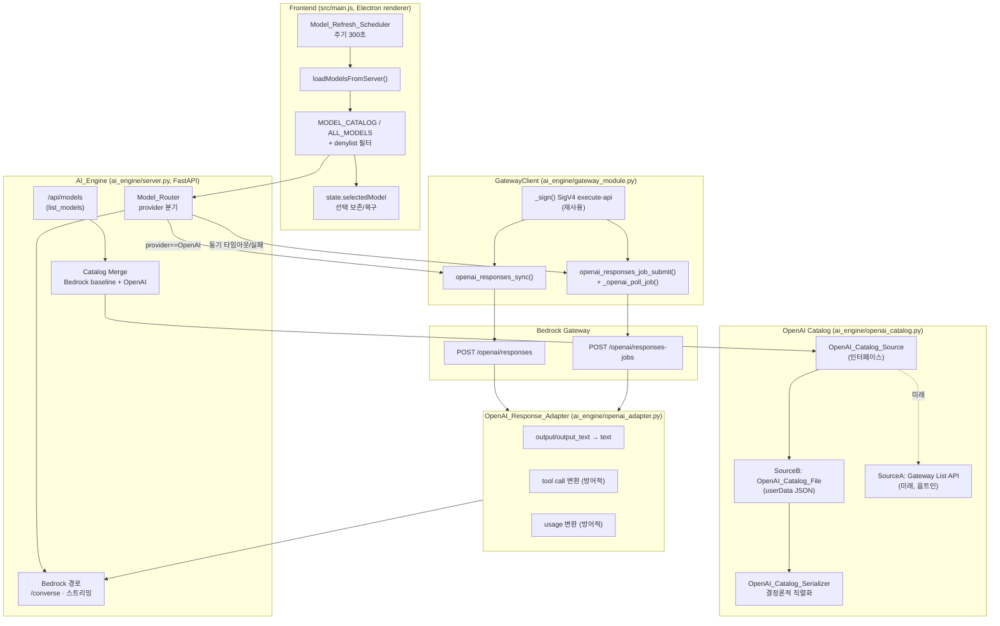
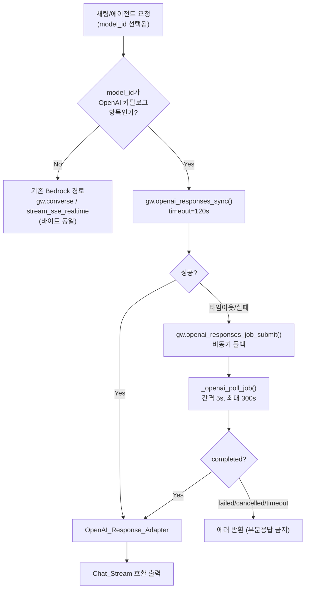
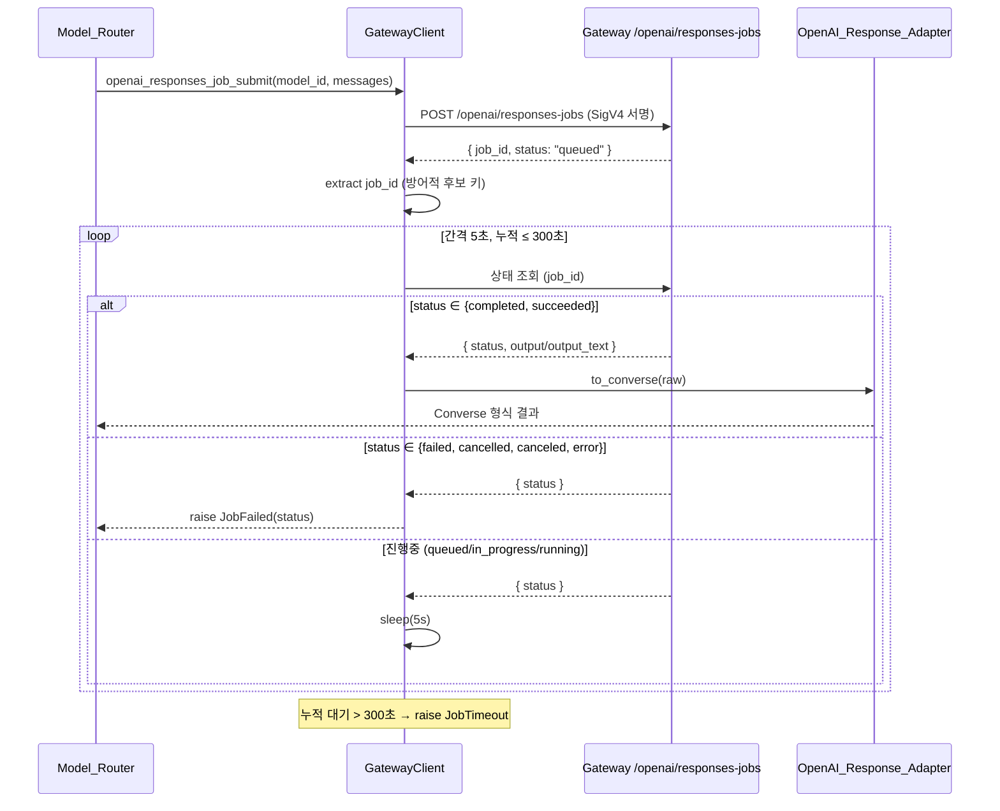

# Design Document

설계 문서: 게이트웨이 OpenAI 모델 통합 (gateway-openai-models)

## Overview

이 설계는 게이트웨이에 추가된 OpenAI Responses 라우트 모델(`openai.gpt-5.5`, `openai.gpt-5.4`)을 에디터에 통합한다. 통합은 세 축으로 이뤄진다.

1. **발견(Discovery)** — `OpenAI_Catalog_Source` 추상화를 통해 OpenAI 모델 목록을 얻고, 기존 Bedrock 카탈로그와 병합해 `/api/models`가 반환한다. 1차 구현은 소스 B(에디터 측 `userData` 하위 카탈로그 파일)이며, 게이트웨이 목록 API가 생기면 소스 A로 무중단 전환 가능하도록 인터페이스를 분리한다.
2. **라우팅(Routing)** — `Model_Router`가 선택 모델의 provider를 보고 OpenAI 모델은 `POST /openai/responses`(동기) 또는 `POST /openai/responses-jobs`(비동기)로, 그 외는 기존 `/converse`·스트리밍 경로로 보낸다. `GatewayClient`에 OpenAI 전용 메서드를 신규 추가하되 기존 메서드 시그니처는 불변으로 유지한다.
3. **흡수(Adaptation)** — `OpenAI_Response_Adapter`가 OpenAI Responses 응답(`output`/`output_text`)을 기존 Bedrock Converse 형식(`{output:{message:{content:[{text}]}}}`)으로 변환해 채팅/도구/사용량 흐름이 변경 없이 동작하게 한다. 게이트웨이 확정 스키마가 표준과 다를 수 있으므로 어댑터가 방어적 필드 추출로 차이를 흡수한다.

핵심 설계 원칙은 **하위 호환 보존**이다. OpenAI 모델이 0개로 구성된 환경에서는 `/api/models` 응답과 프론트 동작이 통합 도입 이전과 바이트 단위로 동일해야 한다.

### 확정 게이트웨이 스펙 반영

| 항목 | 확정 값 |
| --- | --- |
| 모델 ID | `openai.gpt-5.5`, `openai.gpt-5.4` (provider="OpenAI", 표시명 "GPT 5.5"/"GPT 5.4") |
| 동기 라우트 | `POST {gateway_url}/openai/responses` |
| 비동기 라우트 | `POST {gateway_url}/openai/responses-jobs` (제출→job_id→상태 폴링→결과) |
| 인증 | 기존 `GatewayClient._sign`의 botocore SigV4(`execute-api`) 재사용 |
| 모델 목록 | 게이트웨이 목록 API 미확인 → 소스 B 확정. 위 두 모델을 기본 시드. 소스 A 전환 가능하도록 추상화 유지 |
| 요청 스키마 | `{"model": "...", "input": <메시지/문자열>, ...}` (OpenAI Responses 표준 가정) |
| 응답 스키마 | `output`/`output_text` 추출 (어댑터가 방어적 처리) |
| 비동기 폴링 | 폴링 간격 기본 5초, 최대 대기 300초 |
| 동기 폴백 | 동기 타임아웃 120초 초과/실패 시 jobs 경로로 폴백 |

### Steering 준수

- **project.md**: Vanilla JS + FastAPI/HTTPX 스택 유지, 신규 JS 프레임워크 없음. 모든 LLM 호출은 게이트웨이 경유(OpenAI SDK 미사용). 모든 영속 데이터는 `userData` 하위.
- **gateway.md**: 403→QuotaExceededError, 422→로그+표시, 500→지수 백오프 3회(1s/2s/4s), 타임아웃 처리. apitoken은 앞 4자만 남기고 마스킹.
- **security.md**: contextIsolation 유지, IPC 핸들러는 main 프로세스에만 등록, 자격증명 미저장.
- **ui.md**: 모델 드롭다운/카운트 표시는 기존 다크 산업풍 UI 토큰·컴포넌트 규약 그대로.

## Architecture

### 구성요소 관계도



### 라우팅 결정 흐름



provider 분기 판정은 **모델 식별자가 현재 카탈로그의 OpenAI 항목 집합에 속하는지**로 한다. 문자열 prefix(`openai.`) 매칭이 아니라 카탈로그 멤버십을 기준으로 하므로, 게이트웨이가 향후 다른 형식의 OpenAI ID를 노출해도 카탈로그만 갱신하면 라우팅이 정확히 따라간다. (단, 카탈로그 조회 불가 상황의 안전망으로 `openai.` prefix를 보조 판정으로 둔다.)

## Components and Interfaces

### 1. OpenAI_Catalog_Source (신규 — ai_engine/openai_catalog.py)

소스 A/B를 추상화하는 단일 인터페이스. 활성 소스와 무관하게 동일한 `OpenAI_Model_Entry` 구조를 반환한다 (요구사항 2).

```python
class OpenAIModelEntry(TypedDict):
    id: str            # "openai.gpt-5.5"
    name: str          # "GPT 5.5"
    provider: str      # 항상 "OpenAI"
    capabilities: dict # {"chat": True}
    mode: str          # "sync" | "async" | "auto"  (기본 "auto")

class OpenAICatalogSource(Protocol):
    def list_models(self) -> list[OpenAIModelEntry]:
        """OpenAI 모델 항목 목록 반환. 조회 불가 시 [] 반환(예외 아님)."""
        ...

def get_catalog_source(settings: dict) -> OpenAICatalogSource:
    """게이트웨이 목록 엔드포인트가 구성되면 SourceA, 아니면 SourceB 반환.
    구성 키: settings['openai_list_endpoint'] (없으면 소스 B).
    """

class FileCatalogSource:           # 소스 B (1차 구현)
    def __init__(self, catalog_path: str): ...
    def list_models(self) -> list[OpenAIModelEntry]:
        # OpenAI_Catalog_File 읽기 → Serializer.deserialize → 목록 반환
        # 파일 부재 시 기본 시드를 반환(아래 Data Models 참조)

class GatewayListSource:           # 소스 A (미래, 옵트인)
    def __init__(self, gw: "GatewayClient", endpoint: str): ...
    def list_models(self) -> list[OpenAIModelEntry]:
        # 게이트웨이 목록 엔드포인트 조회 → 동일 구조로 정규화
```

### 2. OpenAI_Catalog_Serializer (신규 — ai_engine/openai_catalog.py)

결정론적 직렬화/역직렬화. 왕복 보존(요구사항 3) 보장이 핵심.

```python
class CatalogError(Exception):
    code: str   # "invalid-json" | "invalid-model-entry"
    detail: str # 항목 식별자 등 (최대 200자)

def deserialize(json_str: str) -> list[OpenAIModelEntry]:
    # 1) json.loads 실패 → CatalogError("invalid-json")
    # 2) 각 항목 검증: id/name 필수, 1<=len(id)<=256
    #    위반 → CatalogError("invalid-model-entry", detail=문제 id)
    #    부분 목록 생성 금지 — 전부 유효해야 반환
    # 3) provider 기본 "OpenAI", capabilities 기본 {"chat":True}, mode 기본 "auto" 보정

def serialize(entries: list[OpenAIModelEntry]) -> str:
    # 결정론적: sort_keys=True, 항목은 id 기준 정렬,
    # ensure_ascii=False(UTF-8), separators=(",", ":") 고정,
    # 키 집합 정규화(id,name,provider,capabilities,mode) 후 직렬화
    # → serialize ∘ deserialize ∘ serialize == serialize (바이트 항등)
```

정규화(normalize)를 `deserialize` 단계에서 한 번 수행해, 누락 필드 보정이 첫 직렬화 이후 안정되도록 한다. 이로써 `serialize(deserialize(serialize(x))) == serialize(x)`가 바이트 단위로 성립한다.

### 3. Catalog Merge (수정 — ai_engine/server.py `list_models`)

기존 Bedrock 카탈로그 조립 직후, OpenAI 목록을 병합한다 (요구사항 1).

```python
def merge_openai_into_catalog(bedrock_catalog: dict, openai_entries: list) -> dict:
    """bedrock_catalog: {provider: [{id, name}, ...]} (기존 구조 불변).
    반환: 동일 구조에 "OpenAI" provider 키 추가.
    규칙:
      - openai_entries가 [] → bedrock_catalog를 변경 없이 반환 (baseline 보존)
      - 각 entry는 provider "OpenAI" 그룹에 추가, capabilities.chat=True 보장
      - 기존 카탈로그의 어떤 provider에든 동일 id가 이미 있으면 그 entry는 스킵
        (Bedrock 항목 보존, 중복 추가 금지 — 요구사항 1.5)
    """
```

`list_models`는 OpenAI 병합을 try/except로 감싸, 소스 조회 예외 시 원인(≤200자) 로그 후 Bedrock-only 카탈로그를 반환한다 (요구사항 1.7, 7-graceful). 반환 JSON의 `count`는 병합 후 총합으로 갱신한다.

### 4. Model_Router (신규 로직 — ai_engine/server.py)

provider 분기 판정과 OpenAI 호출 오케스트레이션.

```python
def is_openai_model(model_id: str, openai_ids: set[str]) -> bool:
    """카탈로그 멤버십 우선, 보조로 prefix 판정.
    return model_id in openai_ids or model_id.startswith("openai.")
    """

async def route_chat(gw, model_id, messages, system_prompt, tool_config,
                     openai_ids: set[str]):
    if not is_openai_model(model_id, openai_ids):
        # 기존 경로 — 호출부 변경 없음(바이트 동일)
        return await gw.converse(model_id, messages, system_prompt, tool_config)
    # OpenAI 경로: 동기 우선 → 실패/타임아웃 시 비동기 폴백
    try:
        raw = await gw.openai_responses_sync(
            model_id, messages, system_prompt=system_prompt, timeout=120)
    except (SyncTimeout, SyncFailure) as e:
        raw = await gw.openai_responses_job_submit_and_poll(
            model_id, messages, system_prompt=system_prompt,
            poll_interval=5, max_wait=300)
    return openai_adapter.to_converse(raw)   # OpenAI_Response_Adapter
```

스트리밍 경로(`/api/agents/run-stream`, `run-agent`)에서는 OpenAI 모델일 때 `route_chat` 결과(완성 텍스트)를 단일 `content_block_delta`+`message_stop` 이벤트열로 감싸 기존 SSE 소비 코드와 호환시킨다. (OpenAI Responses 동기/잡은 토큰 스트리밍이 아닌 완성형 응답으로 가정.)

### 5. GatewayClient OpenAI 메서드 (수정 — ai_engine/gateway_module.py)

기존 `_sign`, `_get_creds`, `force_refresh_creds`, `_is_expired_error`를 재사용한다. 기존 메서드 시그니처는 변경하지 않는다 (요구사항 8.3).

```python
async def openai_responses_sync(
    self, model_id: str,
    messages: list | str,          # 메시지 배열 또는 input 문자열
    system_prompt: str = "",
    timeout: int = 120,
) -> dict:
    """POST {gateway_url}/openai/responses (동기).
    - body: _build_openai_payload(model_id, messages, system_prompt)
    - headers: self._sign("POST", url, body_bytes)  # SigV4 execute-api 재사용
    - 403 → raise QuotaExceededError
    - 422 → raise OpenAISurfaceError(원인 ≤200자)
    - 500 → 1s/2s/4s 지수 백오프 최대 3회
    - 토큰 만료(_is_expired_error) → force_refresh_creds 후 최대 3회 재시도
    - httpx 타임아웃 → raise SyncTimeout (라우터가 jobs로 폴백)
    - 모델 미지원 응답 → raise OpenAIModelUnsupported(model_id)
    반환: 게이트웨이 원본 응답 dict (어댑터가 후처리)
    """

async def openai_responses_job_submit(
    self, model_id, messages, system_prompt="", timeout=30,
) -> str:
    """POST {gateway_url}/openai/responses-jobs 제출 → job_id 반환.
    제출 응답에서 job_id를 방어적으로 추출(아래 어댑터의 후보 키 사용).
    동일한 403/422/500/토큰만료 처리 규칙 적용.
    """

async def _openai_poll_job(
    self, job_id: str, poll_interval: int = 5, max_wait: int = 300,
) -> dict:
    """상태 폴링. 경과 max_wait 초과 시 raise JobTimeout.
    - 상태 조회 경로/필드명 미확정 → 어댑터의 후보 키로 방어적 판정
    - status ∈ {completed, succeeded} → 결과 dict 반환
    - status ∈ {failed, cancelled, canceled, error} → raise JobFailed(status)
    - 그 외(queued/in_progress/running) → poll_interval 만큼 sleep 후 재조회
    """

async def openai_responses_job_submit_and_poll(
    self, model_id, messages, system_prompt="", poll_interval=5, max_wait=300,
) -> dict:
    job_id = await self.openai_responses_job_submit(model_id, messages, system_prompt)
    return await self._openai_poll_job(job_id, poll_interval, max_wait)
```

`_build_openai_payload`는 OpenAI Responses 표준 본문을 구성한다.

```python
def _build_openai_payload(self, model_id, messages, system_prompt=""):
    body = {"model": model_id}
    if isinstance(messages, str):
        body["input"] = messages
    else:
        # Bedrock 스타일 messages([{role, content:[{text}]}])를
        # OpenAI input 메시지로 정규화. system_prompt가 있으면 선두 instructions로.
        body["input"] = _to_openai_input(messages)
    if system_prompt:
        body["instructions"] = system_prompt
    return body
```

### 6. OpenAI_Response_Adapter (신규 — ai_engine/openai_adapter.py)

OpenAI Responses 응답을 기존 Converse 형식으로 변환. 미확정 스키마를 방어적으로 흡수 (요구사항 6).

```python
# 텍스트 추출 후보 키 (우선순위)
_TEXT_KEYS = ["output_text", "output", "content", "text", "message"]
# job_id 추출 후보 키
_JOBID_KEYS = ["job_id", "jobId", "id", "job", "task_id"]
# 상태 추출 후보 키
_STATUS_KEYS = ["status", "state", "job_status"]
# usage 추출 후보 키
_USAGE_KEYS = ["usage", "token_usage", "usageMetadata"]

def extract_text(raw: dict) -> str:
    """output_text 최우선. 없으면 output 배열을 순회하며
    content[].text 를 모은다. 문자열/배열/중첩 dict 모두 방어적 처리.
    추출 결과가 비면 호출자에게 신호(아래 to_converse가 에러로 변환)."""

def to_converse(raw: dict) -> dict:
    """반환: {"decision":"ALLOW",
             "output":{"message":{"content":[{"text": <추출 텍스트>}, <tool blocks>]}},
             "remaining_quota": {...}, "estimated_cost_krw": ...}
    - 텍스트 추출 실패 → raise InvalidOpenAIResponse(원인 ≤200자) (부분 텍스트 미전달)
    - tool call 존재 시 Converse toolUse 블록으로 변환(방어적)
    - usage 존재 시 기존 사용량/비용 표현으로 매핑(방어적)
    """

def extract_tool_calls(raw: dict) -> list[dict]:
    """OpenAI tool/function call → [{"toolUse":{"toolUseId","name","input"}}]."""

def extract_usage(raw: dict) -> dict:
    """input_tokens/output_tokens 등 → 기존 usage 표현."""
```

### 7. Model_Refresh_Scheduler (수정 — src/main.js)

```javascript
// 기본 주기 300초, 허용 범위 60~3600초 (settings에서 조정 가능)
const MODEL_REFRESH_DEFAULT = 300, MODEL_REFRESH_MIN = 60, MODEL_REFRESH_MAX = 3600;
let _modelRefreshTimer = null;

function startModelRefreshScheduler() {
  const sec = clamp(getSetting('modelRefreshSec', MODEL_REFRESH_DEFAULT),
                    MODEL_REFRESH_MIN, MODEL_REFRESH_MAX);
  if (_modelRefreshTimer) clearInterval(_modelRefreshTimer);
  _modelRefreshTimer = setInterval(() => {
    if (!state.authenticated) return;            // 인증 상태에서만
    refreshModelsPreservingSelection();
  }, sec * 1000);
}

async function refreshModelsPreservingSelection() {
  const prevId = state.selectedModel?.id;
  const prevSig = catalogSignature(MODEL_CATALOG);   // 비교용 시그니처
  try {
    const merged = await fetchModels();              // /api/models
    const filtered = applyDenylist(merged);          // 기존 denylist 재사용
    if (catalogSignature(filtered) === prevSig) return; // 동일 → 선택/표시 불변 (4.3)
    replaceCatalog(filtered); rebuildModelList();
    // 선택 보존/복구 (4.5/4.6)
    const stillThere = ALL_MODELS.find(m => m.id === prevId);
    if (stillThere) state.selectedModel = stillThere;
    else {
      const chat = ALL_MODELS.filter(m => m.capabilities?.chat);
      state.selectedModel = chat[0] || ALL_MODELS[0] || null;
    }
    renderModelList(''); updateModelCountBadge();
  } catch (e) {
    // 실패 → 직전 성공 목록 유지, 다음 주기 재시도 (4.4)
    console.warn('[ModelRefresh] 유지 — 다음 주기 재시도:', e?.message || e);
  }
}
```

denylist는 기존 `_deniedModels`/필터 로직을 그대로 재사용해 OpenAI 항목에도 적용한다 (요구사항 1.6).

### 8. IPC / preload (필요 시 — electron)

소스 B 카탈로그 파일 경로는 `userData/openai/openai_catalog.json`. 백엔드(Python)가 `AE_GENERATED_ROOT`처럼 주입된 `userData` 경로를 통해 직접 읽고 쓴다. 프론트가 카탈로그 파일을 편집해야 하는 경우에만 IPC를 추가하며, 핸들러는 `electron/main.js`(또는 등록 모듈)에만 등록하고 preload는 화이트리스트 메서드만 노출한다 (요구사항 9.6). 기본 시드만으로 동작하는 1차 범위에서는 신규 IPC 없이 백엔드 파일 I/O로 충분하다.

## Data Models

### OpenAI_Model_Entry

| 필드 | 타입 | 필수 | 기본값 | 설명 |
| --- | --- | --- | --- | --- |
| `id` | string | 예 | — | 게이트웨이 모델 식별자. 1~256자. 예: `openai.gpt-5.5` |
| `name` | string | 예 | — | 표시명. 예: `GPT 5.5` |
| `provider` | string | 아니오 | `"OpenAI"` | 항상 `"OpenAI"`로 정규화 |
| `capabilities` | object | 아니오 | `{"chat": true}` | 채팅 가능 플래그 |
| `mode` | string | 아니오 | `"auto"` | `"sync"`/`"async"`/`"auto"` 호출 모드 |

### OpenAI_Catalog_File 스키마 (소스 B)

경로: `userData/openai/openai_catalog.json` (요구사항 5/9 — userData 하위에만 영속).

```json
{
  "version": 1,
  "models": [
    {
      "id": "openai.gpt-5.4",
      "name": "GPT 5.4",
      "provider": "OpenAI",
      "capabilities": { "chat": true },
      "mode": "auto"
    },
    {
      "id": "openai.gpt-5.5",
      "name": "GPT 5.5",
      "provider": "OpenAI",
      "capabilities": { "chat": true },
      "mode": "auto"
    }
  ]
}
```

**기본 시드**: 파일이 없으면 `FileCatalogSource`가 위 두 모델(`openai.gpt-5.5`, `openai.gpt-5.4`)을 시드로 반환한다. (게이트웨이가 확정한 두 라우트 모델.)

**결정론적 직렬화 규칙**:
- `models`는 `id` 오름차순 정렬 (위 예시는 `5.4` → `5.5` 순)
- `json.dumps(..., sort_keys=True, ensure_ascii=False, separators=(",", ":"))`
- 각 항목은 정규화된 키 집합(`id,name,provider,capabilities,mode`)만 포함
- 동일 입력 → 동일 바이트 출력

### Merged_Catalog 반환 구조 (`/api/models`)

기존 구조를 보존하며 `models`에 `"OpenAI"` provider 키가 추가될 뿐이다.

```json
{
  "models": {
    "Anthropic": [ { "id": "...", "name": "..." } ],
    "OpenAI":    [ { "id": "openai.gpt-5.4", "name": "GPT 5.4", "capabilities": {"chat": true} },
                   { "id": "openai.gpt-5.5", "name": "GPT 5.5", "capabilities": {"chat": true} } ]
  },
  "image_models": { "...": "..." },
  "count": 0
}
```

OpenAI 0개일 때는 `"OpenAI"` 키 자체가 추가되지 않으며 `count`·구조가 baseline과 동일하다 (요구사항 8.1).

### 비동기 잡 상태 모델 (방어적)

| 개념 | 후보 필드 | 판정 |
| --- | --- | --- |
| job_id | `job_id`/`jobId`/`id`/`job`/`task_id` | 첫 존재 키 채택 |
| status | `status`/`state`/`job_status` | 첫 존재 키 채택 |
| 완료 | `completed`/`succeeded` | 결과 추출 진행 |
| 실패 | `failed`/`cancelled`/`canceled`/`error` | `JobFailed` |
| 진행중 | `queued`/`in_progress`/`running`/기타 | 폴링 지속 |

### 비동기 폴링 시퀀스



## Correctness Properties

*속성(property)은 시스템의 모든 유효한 실행에서 참이어야 하는 특성·동작으로, 시스템이 무엇을 해야 하는지에 대한 형식적 진술이다. 속성은 사람이 읽는 명세와 기계가 검증 가능한 정확성 보장 사이의 다리 역할을 한다.*

이 기능에는 순수 함수 성격의 핵심 로직(카탈로그 직렬화, 카탈로그 병합, provider 라우팅 판정, 응답 어댑터 텍스트 추출, 토큰 마스킹)이 있어 속성 기반 테스트(PBT)가 적합하다. 아래 속성은 prework 분석에서 testable=property로 분류되고 중복 제거(reflection)를 거친 항목이다. UI 타이머/렌더링, 상태코드 매핑, 폴백 제어 흐름, 보안 구조 검사 등은 예제·통합 테스트로 다룬다(Testing Strategy 참조).

### Property 1: 병합은 중복이 아닌 모든 OpenAI 항목을 OpenAI provider로 포함한다

*For any* 임의의 Bedrock 카탈로그와 임의의 OpenAI_Model_Entry 목록에 대해, 병합 결과는 Bedrock에 동일 id가 없는 모든 OpenAI entry를 provider `"OpenAI"` 그룹에 포함해야 한다.

**Validates: Requirements 1.1, 1.2**

### Property 2: 정규화된 모든 OpenAI 항목은 chat capability를 가진다

*For any* 임의의 OpenAI_Model_Entry 목록에 대해, 정규화 후 모든 항목의 `capabilities.chat`은 `true`이고 `provider`는 `"OpenAI"`여야 한다.

**Validates: Requirements 1.3**

### Property 3: 빈 OpenAI 목록 병합은 Bedrock baseline을 보존한다

*For any* 임의의 Bedrock 카탈로그 `b`에 대해, OpenAI 항목이 0개인 병합 `merge(b, [])`의 결과는 `b`와 모델 구성·provider 분류·capability가 동일해야 한다(baseline 바이트 보존).

**Validates: Requirements 1.4, 8.1**

### Property 4: 중복 식별자는 Bedrock 항목을 보존하고 OpenAI를 추가하지 않는다

*For any* Bedrock 카탈로그와 그 안의 어떤 식별자와 동일한 id를 가진 OpenAI_Model_Entry를 포함한 목록에 대해, 병합 결과에서 해당 id는 Bedrock 항목만 유지되고 동일 id의 OpenAI 항목은 추가되지 않아야 한다.

**Validates: Requirements 1.5**

### Property 5: 카탈로그 직렬화 왕복 보존

*For any* 유효한 OpenAI_Model_Entry 목록 `x`에 대해, `serialize(deserialize(serialize(x)))`는 `serialize(x)`와 바이트 단위로 동일해야 한다.

**Validates: Requirements 3.1, 3.3**

### Property 6: 직렬화는 결정론적이다

*For any* 의미상 동등한 두 OpenAI_Model_Entry 목록(항목 순서·누락 가능한 선택 필드만 다른 경우 포함)에 대해, 직렬화 결과는 동일한 UTF-8 바이트열이어야 한다.

**Validates: Requirements 3.2**

### Property 7: 유효하지 않은 항목은 부분 목록 없이 거부된다

*For any* 필수 필드(id, name)가 누락되었거나 id 길이가 1자 미만 또는 256자 초과인 항목을 하나 이상 포함하는 입력에 대해, 역직렬화는 항상 `"invalid-model-entry"` 에러를 반환하고 어떤 부분 목록도 생성하지 않아야 한다.

**Validates: Requirements 3.5**

### Property 8: 모델 갱신은 선택 상태를 보존하거나 유효하게 복구한다

*For any* 임의의 직전 선택 모델과 임의의 갱신된 카탈로그에 대해, 갱신 후 `selectedModel`은 항상 갱신된 목록의 멤버여야 한다. 직전 선택이 갱신된 목록에 존재하면 그대로 유지되고, 존재하지 않으면 채팅 가능한 모델(있으면)이 선택되어야 한다. 갱신된 카탈로그가 직전과 동일하면 선택은 변경되지 않아야 한다.

**Validates: Requirements 4.3, 4.5, 4.6**

### Property 9: provider에 따른 라우팅 분기 정확성

*For any* 임의의 모델 식별자와 카탈로그에 대해, 식별자가 OpenAI 모델이면 요청은 OpenAI 라우트(`/openai/responses` 또는 `/openai/responses-jobs`)로, 그렇지 않으면 기존 Bedrock 경로(`/converse`)로 라우팅되어야 한다.

**Validates: Requirements 5.1, 5.2, 8.2**

### Property 10: 어댑터는 출력 텍스트를 정확히 추출해 Converse 구조로 변환한다

*For any* 임의의 텍스트 `t`를 담은 유효한 OpenAI Responses 성공 응답(`output_text` 또는 `output[].content[].text` 형태)에 대해, `to_converse`의 결과는 `output.message.content`를 가진 Converse 구조이며 추출된 텍스트가 `t`와 동일해야 한다.

**Validates: Requirements 6.1, 6.2**

### Property 11: 토큰 마스킹은 앞 4자만 남기고 원문을 노출하지 않는다

*For any* 임의의 API 토큰 문자열에 대해, 마스킹 결과는 앞 4자 + `"****"` 형태이며 4자 초과 토큰의 전체 원문 문자열을 포함하지 않아야 한다.

**Validates: Requirements 9.4**

## Error Handling

게이트웨이 에러 처리는 steering(gateway.md)과 요구사항 7을 따른다. OpenAI 경로는 기존 Bedrock 경로와 동일한 정책을 적용한다.

| 상황 | 처리 | 근거 |
| --- | --- | --- |
| 403 (권한/쿼터) | `QuotaExceededError`로 전달 → 프론트 ApprovalRequestDialog | 7.1, gateway.md |
| 422 (요청 오류) | 원인(≤200자) 로그 + `OpenAISurfaceError`로 사용자 표시 | 7.2 |
| 500 (서버 오류) | 1초·2초·4초 지수 백오프 최대 3회 재시도 | 7.3, gateway.md |
| 토큰 만료 | `force_refresh_creds()` 후 최대 3회 재시도 | 5.7 |
| 동기 타임아웃(120s) | `SyncTimeout` → 비동기 jobs 경로로 폴백 | 5.4 |
| 잡 폴링 초과(300s) | `JobTimeout` 에러 반환 | 5.5 |
| 잡 실패/취소 | `JobFailed(status)` 에러 반환 | 5.5, 7.4 |
| 동기+비동기 모두 실패 | 원인(≤200자) 에러 반환, **부분 응답 Chat_Stream 미전달** | 7.4 |
| 미지원 모델 거부 | `OpenAIModelUnsupported(model_id)` 반환 | 7.5 |
| 카탈로그 소스 예외 | 원인(≤200자) 로그 + Bedrock-only 카탈로그 반환 | 1.7 |
| 응답 스키마 불일치 | `InvalidOpenAIResponse`(≤200자), **부분 텍스트 미전달** | 6.5 |
| 잘못된 카탈로그 JSON | `CatalogError("invalid-json")`, 부분 목록 미생성 | 3.4 |

**부분 응답 금지 원칙**: 동기/비동기 폴백이 모두 실패하거나 응답 스키마가 불일치하면, 어떤 부분 텍스트도 Chat_Stream에 흘려보내지 않고 에러로 종결한다. 이는 잘린 응답이 정상 완료처럼 보이는 것을 막는다.

**예외 타입 정의** (신규, `ai_engine/openai_adapter.py` 또는 `gateway_module.py`):
`QuotaExceededError`(기존 재사용), `OpenAISurfaceError`, `SyncTimeout`, `JobTimeout`, `JobFailed`, `OpenAIModelUnsupported`, `InvalidOpenAIResponse`, `CatalogError`.

## Testing Strategy

### 이중 테스트 접근

- **속성 테스트(PBT)**: 위 11개 Correctness Properties를 각각 단일 속성 테스트로 구현. Python은 **Hypothesis**(레포에 `.hypothesis/` 존재 — 기존 사용 중) 사용. 프론트(Property 8) 로직은 순수 함수로 추출해 **fast-check**(JS) 또는 Python으로 포팅된 선택 로직으로 검증.
- **예제/통합 테스트**: prework에서 EXAMPLE/EDGE_CASE/INTEGRATION으로 분류된 항목(상태코드 매핑 403/422/500, 토큰 만료 재시도, 동기→비동기 폴백, 폴링 시퀀스, denylist 필터, 소스 분기, 보안 구조 검사, 회귀 보존)을 대표 1~3개 예제로 커버.

### 속성 테스트 구성 규칙

- 각 속성 테스트는 최소 **100회 반복**(Hypothesis 기본 충족).
- 외부 호출(게이트웨이 HTTP)은 **모킹**해 비용·비결정성 제거. 라우팅(Property 9)·어댑터(Property 10)는 게이트웨이 응답을 모킹.
- 각 테스트에 설계 속성 참조 태그를 주석으로 단다.
- 태그 형식: **Feature: gateway-openai-models, Property {번호}: {속성 텍스트}**

### 속성 ↔ 테스트 파일 매핑(제안)

| 속성 | 대상 모듈 | 테스트 파일(제안) |
| --- | --- | --- |
| 1, 2, 3, 4 | 카탈로그 병합/정규화 | `scripts/test_openai_catalog_merge_property.py` |
| 5, 6, 7 | 카탈로그 직렬화 | `scripts/test_openai_catalog_serialize_property.py` |
| 8 | 프론트 선택 보존 로직 | `scripts/test_model_selection_property.*` |
| 9 | Model_Router 분기 | `scripts/test_openai_routing_property.py` |
| 10 | OpenAI_Response_Adapter | `scripts/test_openai_adapter_property.py` |
| 11 | 토큰 마스킹 | `scripts/test_token_mask_property.py` |

### 회귀 보존 테스트 (요구사항 8)

- OpenAI 0개 카탈로그로 `/api/models` 호출 → baseline 응답과 구조·count 동일 (Property 3 + 통합 테스트).
- 비-OpenAI 모델 채팅 → 기존 `gw.converse`/`stream_sse_realtime` 경로·본문 그대로 (Property 9 + 회귀).
- 기존 `converse`/`invoke`/스트리밍 메서드 시그니처 introspection 검사.
- **webapp-testing 스킬**: 프론트 모델 드롭다운/카운트/주기 새로고침 동작에 Playwright 테스트 추가(steering project.md).

## 모듈/파일 매핑

| 파일 | 신규/수정 | 내용 |
| --- | --- | --- |
| `ai_engine/openai_catalog.py` | **신규** | `OpenAICatalogSource`(Protocol), `FileCatalogSource`(소스 B), `GatewayListSource`(소스 A 스텁), `OpenAICatalogSerializer`(serialize/deserialize), 기본 시드, `get_catalog_source()`, `merge_openai_into_catalog()` |
| `ai_engine/openai_adapter.py` | **신규** | `to_converse`, `extract_text`, `extract_tool_calls`, `extract_usage`, 후보 키 상수, 예외 타입(`InvalidOpenAIResponse` 등) |
| `ai_engine/gateway_module.py` | **수정** | `openai_responses_sync`, `openai_responses_job_submit`, `_openai_poll_job`, `openai_responses_job_submit_and_poll`, `_build_openai_payload`, `_to_openai_input` 추가. **기존 메서드 시그니처 불변** |
| `ai_engine/server.py` | **수정** | `list_models`에 OpenAI 병합(try/except graceful), `is_openai_model`/`route_chat` 추가, 채팅·에이전트 엔드포인트(run-stream/run-agent 등)에서 OpenAI provider 분기 호출 |
| `src/main.js` | **수정** | `Model_Refresh_Scheduler`(주기 300초, 60~3600), `refreshModelsPreservingSelection`, 선택 보존/복구, denylist 재사용. 기존 미구성 시 동작 불변 |
| `electron/*` (IPC/preload) | **조건부** | 프론트가 카탈로그 파일을 편집해야 할 때만 main 등록 IPC 추가. 1차 범위(백엔드 파일 I/O)에서는 변경 없음 |

## 보안 (요구사항 9)

- **게이트웨이 경유만**: 모든 OpenAI LLM 호출은 `gateway_url`의 `/openai/*` 경로로만 수행. OpenAI SDK·직접 외부 호출 없음 (9.1).
- **자격증명 미저장**: `_get_creds`/`inject_credentials`로 받은 Runtime_Credentials만 사용하고 어떤 파일에도 저장하지 않음 (9.2). settings.json은 프로파일명·게이트웨이 설정·모델 식별자만 저장 (9.3).
- **토큰 마스킹**: 로그 출력 시 `token[:4] + "****"` (9.4, Property 11).
- **userData 영속화**: `OpenAI_Catalog_File`은 `userData/openai/openai_catalog.json` 하위에만 (9.5, 3.6).
- **IPC/보안 모델**: 추가 IPC는 main 프로세스에만 등록, contextIsolation 유지, ipcRenderer를 렌더러에 노출하지 않음, preload 화이트리스트만 (9.6, security.md).
- **SigV4 재사용**: OpenAI 라우트도 기존 `_sign`의 `execute-api` SigV4 서명 사용. cgjang 등 `BedrockUser-*` 역할에 두 경로 `execute-api:Invoke` grant가 IaC로 부여됨(확인됨).

---

검토 후 가이드: 미확정 지점(게이트웨이 OpenAI 응답/잡 폴링의 정확한 필드명, 모델 목록 API 존재 여부)은 어댑터의 방어적 후보 키 처리와 `OpenAI_Catalog_Source` 추상화로 흡수하도록 설계했습니다. 게이트웨이 확정 스키마가 공개되면 어댑터 후보 키와 소스 구현만 조정하면 됩니다. 요구사항에 누락·모호한 점이 발견되면 요구사항 단계로 돌아가 보완할 수 있습니다.
