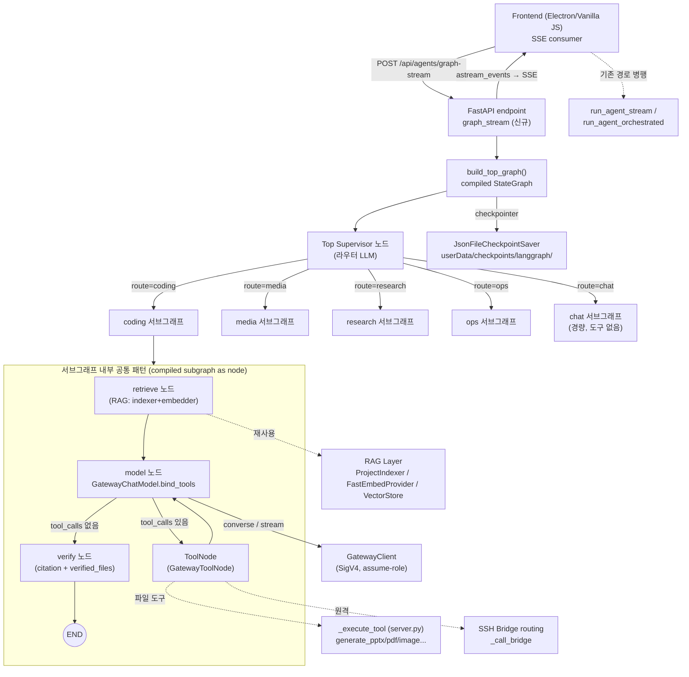
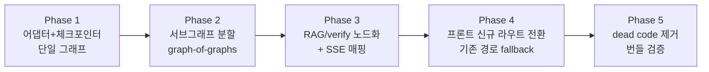
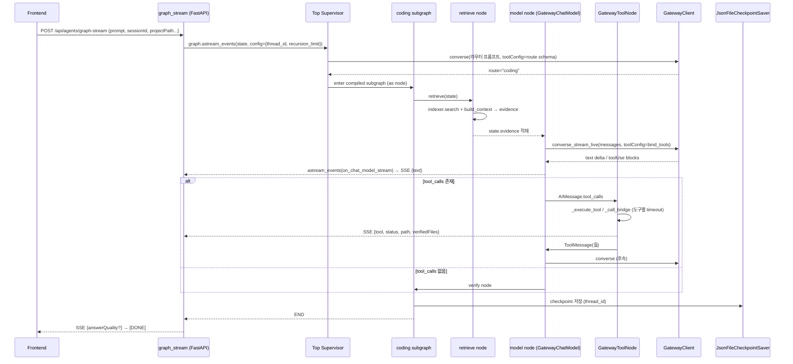

# Design Document: LangGraph Hierarchical Orchestrator

## Overview

현재 챗의 실행 경로는 `ai_engine/server.py` 안의 커스텀 asyncio 파이프라인
(`run_agent_stream` / `run_agent_orchestrated` / `run_agent_parallel`)과 Bedrock
Gateway converse 스트리밍으로 구현되어 있다. `agent_system/agent_graph.py`는 이름만
"LangGraph"일 뿐 실제 `langgraph.StateGraph` / `ToolNode` / checkpointer를 쓰지 않는
수동 `while` 루프이고, 이를 호출하는 `/api/agents/workflow`(`run_workflow`)를 프론트가
호출하지 않아 dead code다. `agent_system/checkpoint_store.py`의 `CheckpointStore`도
server.py에서 참조되지 않는 dead code다.

이 설계는 **정식 LangGraph 런타임 기반의 계층적 오케스트레이션(supervisor-of-supervisors,
graph-of-graphs)** 을 도입한다. Top Supervisor(라우터)가 도메인별 서브그래프(coding /
media / research / ops)로 라우팅하고, 각 서브그래프는 내부에 `retrieve(RAG) → model →
ToolNode` 루프를 갖는 compiled subgraph로서 상위 그래프의 노드로 add되어 graph-of-graphs를
구성한다. LLM 호출은 전부 Bedrock Gateway 경유를 유지하며, 이를 위해
`GatewayChatModel`을 정식 LangChain `BaseChatModel`로 재구현한다(`bind_tools` /
`tool_calls` 지원). RAG는 프롬프트 주입 방식에서 **그래프 노드(retrieve + verify)** 로
승격하고, 스트리밍은 LangGraph `astream_events`를 기존 SSE 이벤트 계약으로 매핑한다.

**핵심 제약(steering 실측):** SQLite 금지 → checkpointer는 JSON 파일 기반 커스텀
`BaseCheckpointSaver`. 자격증명은 어떤 파일에도 저장 금지(런타임 주입/assume-role). 모든
데이터는 `app.getPath('userData')` 하위. 과거 10시간 hang 이력 때문에 **모든 노드에 타임아웃 +
그래프에 `recursion_limit`** 를 강제한다. 잘 동작하는 기존 자산(verified_files 디스크 검증,
강제 생성 폴백, 원격 SSH 브리지 tool routing, 합의 교차검증, ConversationMemory 요약
체크포인트)은 노드로 이식하되 **한 번에 교체하지 않고 단계적 마이그레이션 + 기존 경로 병행**
으로 진행한다.

---

## Architecture

> High-Level Design. 전체 아키텍처, 계층 구조, 컴포넌트 책임, 서브그래프 분할 기준,
> 기존 경로와의 병행/마이그레이션 단계를 다룬다.

### 아키텍처 전체 다이어그램



### 계층 구조 요약

```
Top Supervisor (라우터 그래프, StateGraph)
├─ coding  서브그래프  (retrieve → model[+tools] → verify)   ← 코드 이해/수정/파일 생성
├─ media   서브그래프  (retrieve → model[+tools] → verify)   ← pptx/pdf/image/docx/xlsx
├─ research 서브그래프 (retrieve → model[+tools] → verify)   ← 웹/문서 리서치, 요약
├─ ops     서브그래프  (retrieve → model[+tools] → verify)   ← run_command, git, 원격 SSH
└─ chat    서브그래프  (model만)                               ← 일반 대화(도구 불필요)
```

각 서브그래프는 `graph.compile()` 결과(Runnable)이며, Top 그래프에
`top.add_node("coding", coding_subgraph)`처럼 **컴파일된 서브그래프를 노드로 add**하여
graph-of-graphs가 성립한다. Top Supervisor는 재라우팅(멀티 도메인 작업)을 위해 `route` 상태
필드를 갱신하고 conditional edge로 순환할 수 있으나 `recursion_limit`과 `visited_routes` cap으로
무한 순환을 차단한다.

## Components and Interfaces

### 컴포넌트 책임

| 컴포넌트 | 파일(신규/수정) | 책임 |
|---|---|---|
| `GatewayChatModel` | `agent_system/chat_model_adapter.py` (재구현) | LangChain `BaseChatModel`. `_generate`/`_agenerate`/`_astream`/`bind_tools`. Bedrock converse `toolUse` ↔ LangChain `ToolCall` 매핑. Gateway converse/stream 경유만. |
| `GraphState` | `agent_system/graph_state.py` (신규) | LangGraph 공유 상태(TypedDict). messages(add_messages), route, evidence, verified_files, citations, iteration 등. |
| Top Supervisor | `agent_system/supervisor.py` (신규) | 라우터 LLM 노드 + conditional edge. 사용자 의도 → 도메인 route 결정. |
| 서브그래프 빌더 | `agent_system/subgraphs/*.py` (신규) | 도메인별 `build_*_subgraph(deps)` → compiled Runnable. |
| `retrieve` 노드 | `agent_system/nodes/retrieve.py` (신규) | 기존 `context_builder.build_context`/indexer/embedder 재사용. 근거를 state.evidence에 적재. |
| `verify` 노드 | `agent_system/nodes/verify.py` (신규) | `citation.parse/verify_citations` + verified_files 디스크 검증 + answer_quality. |
| `GatewayToolNode` | `agent_system/nodes/tool_node.py` (신규) | LangGraph `ToolNode` 역할. server.py `_execute_tool`/브리지 라우팅을 LangChain `ToolMessage`로 래핑. 도구별 타임아웃. |
| `JsonFileCheckpointSaver` | `agent_system/checkpoint_store.py` (재활용/확장) | LangGraph `BaseCheckpointSaver` 구현. JSON 파일. `userData/checkpoints/langgraph/`. |
| SSE 매퍼 | `agent_system/sse_bridge.py` (신규) | `astream_events` → 기존 SSE 이벤트(text/tool/verifiedFiles/agent_*/heartbeat/[DONE]) 매핑. |
| 그래프 엔드포인트 | `server.py` `graph_stream` (신규 라우트) | `/api/agents/graph-stream`. 기존 라우트와 병행. |

## Data Models

### State 스키마

LangGraph의 상태는 `TypedDict` + reducer(add_messages)로 정의한다. 기존
`agent_system/state.py`의 `AgentState`(dataclass)는 dead-code 경로 전용이므로 유지하되,
새 그래프는 아래 `GraphState`를 사용한다.

```python
from typing import TypedDict, Annotated, Literal, Optional
from langgraph.graph.message import add_messages
from langchain_core.messages import BaseMessage

RouteName = Literal["coding", "media", "research", "ops", "chat", "done"]

class Evidence(TypedDict):
    context: str                       # RAG 컨텍스트 문자열
    chunks: list                       # [(chunk, score), ...] citation 검증용

class VerifiedFile(TypedDict):
    path: str                          # 프로젝트 상대 경로 (.generated/...)
    absPath: str                       # 절대 경로 (디스크 존재 검증용)
    tool: str                          # 생성 도구 이름

class GraphState(TypedDict, total=False):
    # ── 입력 컨텍스트 ──
    prompt: str
    session_id: str
    project_path: str
    open_file: str
    open_file_content: str
    aws_profile: str
    bedrock_user: str
    template_id: str
    system_prompt: str
    is_remote: bool

    # ── 대화/추론 ──
    messages: Annotated[list[BaseMessage], add_messages]  # reducer로 누적
    route: RouteName                   # Top Supervisor 결정
    visited_routes: list[str]          # 재라우팅 순환 방지 cap
    iteration: int                     # 서브그래프 내 model↔tool 반복 카운터

    # ── RAG / 검증 ──
    evidence: Optional[Evidence]
    citations: dict                    # {"verified": [...], "unverified": [...]}
    answer_quality: dict               # answer_quality metadata

    # ── 산출물 ──
    verified_files: list[VerifiedFile] # 디스크 실측된 생성물
    final_text: str
    error: str
```

**설계 결정 근거:** `messages`에 `add_messages` reducer를 붙여 노드마다 부분 메시지를
반환하면 LangGraph가 병합하도록 한다(수동 append 제거). `verified_files`는 리스트 병합
reducer(커스텀 `operator.add` 또는 dedup)를 적용해 여러 도구 호출의 결과를 누적한다.

### 서브그래프 분할 기준

라우팅은 Top Supervisor LLM이 사용자 프롬프트 + 첨부/열린 파일 컨텍스트를 보고 결정한다.
분할 기준은 **도구 집합의 응집도**다.

| route | 트리거 기준 | 도구 집합 | 모델 |
|---|---|---|---|
| `coding` | 코드 이해/수정/리팩터/디버그, `_is_code_related(prompt)` true | read_file, write_file, search_files, run_command | sonnet-4-5 |
| `media` | pptx/pdf/이미지/docx/xlsx/슬라이드 생성 의도(`_infer_file_intent_from_prompt`) | generate_pptx, generate_pdf, generate_image, generate_docx, generate_xlsx, edit_image, generate_native_diagram | sonnet-4-5 (필요시 planner=opus) |
| `research` | 웹 검색/문서 요약/조사 | search_web(향후), read_file | sonnet-4-5 |
| `ops` | 명령 실행/git/원격 SSH 작업 | run_command, git 도구, 브리지 라우팅 | sonnet-4-5 |
| `chat` | 도구 불필요한 일반 대화 | (없음) | 사용자 선택 모델 그대로 |

멀티 도메인(예: "코드 분석 후 PPT로 요약")은 Top Supervisor가 `coding → media` 순으로
재라우팅한다. `visited_routes`가 도메인당 1회를 넘거나 총 `MAX_ROUTE_HOPS`(기본 4)를 넘으면
강제로 `done`으로 종료한다.

### 기존 자산의 노드 이식 매핑

| 기존 자산 (server.py 등) | 이식 대상 노드 | 병행 전략 |
|---|---|---|
| verified_files 디스크 검증 (`os.path.isfile` + size>0) | `verify` 노드 / `GatewayToolNode` 후처리 | 동일 로직 재사용, SSE `verifiedFiles` 그대로 emit |
| 강제 생성 폴백 (`_force_generate_from_text`) | `verify` 노드에서 파일 의도 있으나 산출물 0건이면 호출 | server.py 함수 그대로 호출(재구현 X) |
| 원격 SSH 브리지 tool routing (`_call_bridge`, `_bridge_is_remote`) | `GatewayToolNode` 내부 분기 | `is_remote` state 플래그로 분기, 기존 함수 재사용 |
| 합의 교차검증(멀티에이전트 Evaluator) | `verify` 노드의 품질 게이트 + 재라우팅 조건 | Phase 2 이후 media/coding 서브그래프에 옵션 노드로 |
| ConversationMemory 요약 체크포인트 | 그래프 진입 전 `_build_messages`/종료 후 `_maybe_summarize` | 그래프 밖 pre/post hook로 유지(변경 최소화) |
| answer_quality (citation/faithfulness) | `verify` 노드 | 기존 `answer_quality.enhance_answer`/`run_deferred_verification` 호출 |

### 단계적 마이그레이션 계획 (기존 경로 병행)



- **Phase 1 — 기반**: `GatewayChatModel`을 `BaseChatModel`로 재구현 + `JsonFileCheckpointSaver`
  (`BaseCheckpointSaver`) 구현. 단일 서브그래프(coding) `retrieve→model→ToolNode` 컴파일.
  기존 `run_agent_stream`은 그대로. 신규 라우트는 feature flag(`AE_LANGGRAPH=1`)로만 노출.
- **Phase 2 — 계층화**: Top Supervisor + media/research/ops/chat 서브그래프 추가. 컴파일된
  서브그래프를 Top 노드로 add. 재라우팅 conditional edge + `MAX_ROUTE_HOPS`.
- **Phase 3 — RAG/검증 노드화**: `build_system_prompt` 주입 대신 `retrieve` 노드로 승격,
  `verify` 노드에서 citation + verified_files + answer_quality. `astream_events` → SSE 매핑
  (`sse_bridge`)로 기존 이벤트 계약 재현.
- **Phase 4 — 전환**: 프론트가 `AE_LANGGRAPH` on일 때 `/api/agents/graph-stream` 사용,
  실패 시 기존 라우트로 자동 fallback. 실측 안정화까지 병행.
- **Phase 5 — 정리**: dead code(`agent_graph.py` 수동 while, `run_workflow` 구버전) 제거,
  PyInstaller 번들에 langgraph/langchain_core hidden import 검증(이미 spec에 존재), 회귀 테스트.

---

## Low-Level Design

> 언어: Python 3.11+ (사용자 프롬프트에서 명시). LLM 호출은 전부 `GatewayClient`
> (`ai_engine/gateway_module.py`) 경유 — 직접 boto3/Anthropic/OpenAI SDK 금지.

### 메인 워크플로우 (시퀀스)



### 1. GatewayChatModel — 정식 BaseChatModel 어댑터

기존 어댑터는 `ainvoke`만 있는 흉내였다. LangGraph의 `ToolNode`/`bind_tools`/`astream_events`
와 정합하려면 `langchain_core.language_models.chat_models.BaseChatModel`을 상속하고
Bedrock converse의 `toolUse` ↔ LangChain `ToolCall` 매핑을 구현해야 한다.

```python
# agent_system/chat_model_adapter.py (재구현)
from typing import Any, AsyncIterator, Optional, Sequence, Callable
from langchain_core.language_models.chat_models import BaseChatModel
from langchain_core.messages import (
    BaseMessage, AIMessage, AIMessageChunk, HumanMessage, SystemMessage, ToolMessage,
)
from langchain_core.outputs import ChatResult, ChatGeneration, ChatGenerationChunk
from langchain_core.tools import BaseTool
from langchain_core.runnables import Runnable
from langchain_core.callbacks import AsyncCallbackManagerForLLMRun

class GatewayChatModel(BaseChatModel):
    """Bedrock Gateway를 경유하는 LangChain 채팅 모델.

    Precondition:  gateway_client는 converse/converse_stream_live/stream_sse_realtime
                   메서드를 제공한다. model_id는 비어있지 않다.
    Postcondition: _generate/_agenerate는 ChatResult(하나 이상 ChatGeneration)를 반환.
                   반환된 AIMessage는 tool_calls를 정확히 반영(Bedrock toolUse ↔ ToolCall).
    Invariant:     LLM 호출은 반드시 self.gateway 경유(직접 SDK 금지).
    """
    gateway: Any                       # GatewayClient
    model_id: str
    request_timeout: float = 300.0     # gateway converse read timeout과 정합
    _bound_tools: Optional[list[dict]] = None   # Bedrock toolConfig["tools"]

    @property
    def _llm_type(self) -> str:
        return "bedrock-gateway"

    # ── 도구 바인딩: LangChain tool → Bedrock toolConfig ──
    def bind_tools(
        self,
        tools: Sequence[dict | type | Callable | BaseTool],
        **kwargs: Any,
    ) -> Runnable[Any, BaseMessage]:
        """LangChain 도구 정의를 Bedrock toolConfig 형식으로 변환해 바인딩.

        Precondition:  tools의 각 항목은 name/description/args_schema(JSON schema)로
                       변환 가능하다.
        Postcondition: 반환된 Runnable은 매 호출 시 toolConfig={"tools":[...],
                       "toolChoice":{"auto":{}}}를 gateway.converse에 전달한다.
        """
        bedrock_tools = [_lc_tool_to_bedrock_toolspec(t) for t in tools]
        return self.bind(_bedrock_tool_config={
            "tools": bedrock_tools,
            "toolChoice": {"auto": {}},
        }, **kwargs)

    # ── 동기 경로(LangGraph는 async 사용이 기본이나 인터페이스 충족) ──
    def _generate(
        self, messages: list[BaseMessage], stop=None, run_manager=None, **kwargs,
    ) -> ChatResult:
        import asyncio
        return asyncio.get_event_loop().run_until_complete(
            self._agenerate(messages, stop, None, **kwargs)
        )

    # ── 비동기 non-stream ──
    async def _agenerate(
        self,
        messages: list[BaseMessage],
        stop: Optional[list[str]] = None,
        run_manager: Optional[AsyncCallbackManagerForLLMRun] = None,
        **kwargs: Any,
    ) -> ChatResult:
        bedrock_msgs, system_text = _lc_messages_to_bedrock(messages)
        tool_config = kwargs.get("_bedrock_tool_config") or self._bound_tools

        result = await self.gateway.converse(
            model_id=self.model_id,
            messages=bedrock_msgs,
            system_prompt=system_text,
            tool_config=tool_config,      # gateway_module가 body["toolConfig"]로 전달
        )
        # gateway 반환: {"decision":"ALLOW"|"ERROR"|"DENY", "output":{"message":{"content":[...]}}, ...}
        if result.get("decision") not in ("ALLOW", None) or result.get("error"):
            raise GatewayModelError(result.get("error") or result.get("denial_reason") or "gateway error")

        ai_message = _bedrock_output_to_ai_message(result["output"]["message"])
        return ChatResult(generations=[ChatGeneration(message=ai_message)])

    # ── 비동기 스트리밍: astream_events가 소비 ──
    async def _astream(
        self,
        messages: list[BaseMessage],
        stop: Optional[list[str]] = None,
        run_manager: Optional[AsyncCallbackManagerForLLMRun] = None,
        **kwargs: Any,
    ) -> AsyncIterator[ChatGenerationChunk]:
        bedrock_msgs, system_text = _lc_messages_to_bedrock(messages)
        tool_config = kwargs.get("_bedrock_tool_config") or self._bound_tools

        async for evt in self.gateway.stream_sse_realtime(
            model_id=self.model_id,
            messages=bedrock_msgs,
            system_prompt=system_text,
            tool_config=tool_config,
        ):
            etype = evt.get("type", "")
            if etype == "content_block_delta":
                delta = evt.get("delta", {})
                if "text" in delta:
                    chunk = AIMessageChunk(content=delta["text"])
                    if run_manager:
                        await run_manager.on_llm_new_token(delta["text"], chunk=ChatGenerationChunk(message=chunk))
                    yield ChatGenerationChunk(message=chunk)
                elif "toolUse" in delta:
                    # 부분 toolUse(input JSON 조각) → tool_call_chunks로 누적
                    yield ChatGenerationChunk(message=_tooluse_delta_to_chunk(delta["toolUse"]))
            elif etype == "heartbeat":
                # 무응답 방지용 keep-alive. 상위(sse_bridge)에서 heartbeat SSE로 변환.
                yield ChatGenerationChunk(message=AIMessageChunk(content=""),
                                          generation_info={"heartbeat": True})
            elif etype == "error":
                raise GatewayModelError(evt.get("message", "stream error"))
```

#### toolUse ↔ ToolCall 매핑 헬퍼 (시그니처 + 형식 규약)

```python
def _lc_messages_to_bedrock(messages: list[BaseMessage]) -> tuple[list[dict], str]:
    """LangChain 메시지 → Bedrock converse messages + system text.

    Postcondition:
      - SystemMessage는 병합되어 system_text로 반환(messages에는 미포함).
      - HumanMessage.content(str) → {"role":"user","content":[{"text":...}]}
      - HumanMessage에 이미지 첨부 → content에 {"image":{"format","source":{"bytes"}}}
      - AIMessage.tool_calls → {"role":"assistant","content":[{"toolUse":{"toolUseId","name","input"}}]}
      - ToolMessage → {"role":"user","content":[{"toolResult":{"toolUseId","content":[{"text"|"json"}]}}]}
      - user/assistant 교대 규칙 준수(ConversationMemory._clean_messages와 동일 규칙).
    """

def _lc_tool_to_bedrock_toolspec(tool) -> dict:
    """LangChain 도구 → Bedrock toolSpec.

    반환 형식: {"toolSpec": {"name": str, "description": str,
                             "inputSchema": {"json": <JSON Schema>}}}
    """

def _bedrock_output_to_ai_message(message: dict) -> AIMessage:
    """Bedrock converse output message → LangChain AIMessage(+tool_calls).

    Precondition:  message = {"role":"assistant","content":[{"text"?}, {"toolUse"?}, ...]}
    Postcondition:
      - 모든 {"text"} 블록을 이어붙여 content(str).
      - 각 {"toolUse":{"toolUseId","name","input"}} → ToolCall(id=toolUseId, name, args=input).
      - tool_calls가 하나라도 있으면 AIMessage.tool_calls 채움(→ ToolNode가 소비).
    """

def _tooluse_delta_to_chunk(partial: dict) -> AIMessageChunk:
    """스트리밍 toolUse 조각 → tool_call_chunks 누적용 AIMessageChunk."""

class GatewayModelError(RuntimeError):
    """Gateway 레벨 오류(DENY/ERROR/타임아웃)를 그래프로 전파."""
```

### 2. GraphState + reducer

```python
# agent_system/graph_state.py
import operator
from typing import TypedDict, Annotated
# (상단 High-Level의 GraphState 정의를 여기서 실제 코드로 둔다)

def _merge_verified_files(left: list, right: list) -> list:
    """verified_files 병합 reducer — absPath 기준 dedup."""
    seen = {vf["absPath"] for vf in left}
    return left + [vf for vf in right if vf["absPath"] not in seen]

# GraphState 내 필드:
#   messages:        Annotated[list, add_messages]
#   verified_files:  Annotated[list, _merge_verified_files]
#   visited_routes:  Annotated[list, operator.add]
```

### 3. Top Supervisor + StateGraph 조립 (graph-of-graphs)

```python
# agent_system/supervisor.py
from langgraph.graph import StateGraph, START, END
from ai_engine.agent_system.graph_state import GraphState

MAX_ROUTE_HOPS = 4

async def top_router_node(state: GraphState) -> dict:
    """라우터 LLM 노드 — 사용자 의도를 도메인 route로 분류.

    Precondition:  state["prompt"]는 비어있지 않다.
    Postcondition: {"route": RouteName, "visited_routes": [route]} 반환.
                   MAX_ROUTE_HOPS 초과 또는 재방문이면 route="done".
    Invariant:     LLM 호출은 GatewayChatModel(sonnet-4-5) 경유. 타임아웃 적용.
    """
    if len(state.get("visited_routes", [])) >= MAX_ROUTE_HOPS:
        return {"route": "done"}
    # 도구 형태의 강제 스키마(toolChoice)로 단일 라벨을 얻는다.
    route = await _classify_route(state)          # 내부에서 GatewayChatModel 호출
    return {"route": route, "visited_routes": [route]}

def route_selector(state: GraphState) -> str:
    """conditional edge 함수 — state["route"] → 다음 노드 이름."""
    return state["route"]        # "coding" | "media" | "research" | "ops" | "chat" | "done"

def build_top_graph(deps) -> "CompiledGraph":
    """Top Supervisor + 서브그래프들을 조립해 compile.

    Postcondition: 반환 그래프는 checkpointer가 바인딩되고, 각 서브그래프는
                   컴파일된 Runnable로 노드에 add되어 graph-of-graphs를 이룬다.
    """
    g = StateGraph(GraphState)
    g.add_node("router", top_router_node)

    # ── 컴파일된 서브그래프를 노드로 add (graph-of-graphs 핵심) ──
    g.add_node("coding",   build_coding_subgraph(deps))
    g.add_node("media",    build_media_subgraph(deps))
    g.add_node("research", build_research_subgraph(deps))
    g.add_node("ops",      build_ops_subgraph(deps))
    g.add_node("chat",     build_chat_subgraph(deps))

    g.add_edge(START, "router")
    g.add_conditional_edges("router", route_selector, {
        "coding": "coding", "media": "media", "research": "research",
        "ops": "ops", "chat": "chat", "done": END,
    })
    # 서브그래프 종료 후 재라우팅(멀티 도메인) — 다시 router로. hop cap이 무한 순환 차단.
    for name in ("coding", "media", "research", "ops", "chat"):
        g.add_edge(name, "router")

    return g.compile(
        checkpointer=deps.checkpointer,                 # JsonFileCheckpointSaver
    )
```

### 4. 서브그래프 공통 패턴 (retrieve → model → ToolNode → verify)

```python
# agent_system/subgraphs/coding.py (media/research/ops도 도구 집합만 다름)
from langgraph.graph import StateGraph, START, END
from langgraph.prebuilt import ToolNode   # 또는 커스텀 GatewayToolNode

MODEL_NODE_TIMEOUT   = 300.0   # 초 — gateway converse read와 정합
TOOL_NODE_TIMEOUT    = 120.0   # 초 — 도구 1회 실행 상한(브리지/파일생성 포함)
RETRIEVE_NODE_TIMEOUT = 30.0   # 초 — RAG 검색 상한(indexer TF-IDF는 빠름)
SUBGRAPH_RECURSION_LIMIT = 25  # model↔tool 왕복 상한

def build_coding_subgraph(deps) -> "CompiledGraph":
    sg = StateGraph(GraphState)
    sg.add_node("retrieve", make_retrieve_node(deps, domain="coding"))
    sg.add_node("model",    make_model_node(deps, tools=CODING_TOOLS, model_id=deps.model_coding))
    sg.add_node("tools",    GatewayToolNode(CODING_TOOLS, deps=deps, timeout=TOOL_NODE_TIMEOUT))
    sg.add_node("verify",   make_verify_node(deps))

    sg.add_edge(START, "retrieve")
    sg.add_edge("retrieve", "model")
    sg.add_conditional_edges("model", tools_condition_or_verify, {
        "tools": "tools", "verify": "verify",
    })
    sg.add_edge("tools", "model")     # ToolNode 결과를 다시 model로 (표준 ReAct 루프)
    sg.add_edge("verify", END)
    # 서브그래프 자체는 checkpointer 상속(부모가 주입). recursion_limit는 invoke config로.
    return sg.compile()

def tools_condition_or_verify(state: GraphState) -> str:
    """마지막 AIMessage에 tool_calls가 있으면 'tools', 없으면 'verify'.

    Invariant: state["iteration"]가 SUBGRAPH_RECURSION_LIMIT 근접 시 강제 'verify'
               (무한 도구 루프 차단 — 과거 hang 이력 대응).
    """
    last = state["messages"][-1]
    if getattr(last, "tool_calls", None) and state.get("iteration", 0) < SUBGRAPH_RECURSION_LIMIT:
        return "tools"
    return "verify"
```

#### model 노드 (타임아웃 래핑)

```python
def make_model_node(deps, tools, model_id):
    llm = GatewayChatModel(gateway=deps.gateway, model_id=model_id).bind_tools(tools)

    async def model_node(state: GraphState) -> dict:
        """LLM 1턴 호출. astream_events가 토큰 스트림을 노출.

        Precondition:  state["messages"]는 비어있지 않다(retrieve가 시스템/근거 주입).
        Postcondition: {"messages":[AIMessage], "iteration": state.iteration+1} 반환.
        Invariant:     asyncio.wait_for(MODEL_NODE_TIMEOUT)로 감싸 무응답 차단.
        """
        import asyncio
        msgs = _compose_messages(state)      # system_prompt + evidence + history
        try:
            ai = await asyncio.wait_for(llm.ainvoke(msgs), timeout=MODEL_NODE_TIMEOUT)
        except asyncio.TimeoutError:
            return {"messages": [AIMessage(content="[모델 응답 시간 초과]")],
                    "error": "model_timeout"}
        return {"messages": [ai], "iteration": state.get("iteration", 0) + 1}
    return model_node
```

#### GatewayToolNode (server.py 도구 재사용 + 브리지 라우팅)

```python
# agent_system/nodes/tool_node.py
from langchain_core.messages import ToolMessage

class GatewayToolNode:
    """LangGraph ToolNode 역할 — 마지막 AIMessage.tool_calls를 실행하고 ToolMessage 반환.

    server.py의 _execute_tool / _call_bridge를 재사용(재구현 금지).
    도구별 타임아웃 + verified_files 디스크 검증을 이 노드에서 수행한다.
    """
    def __init__(self, tools, deps, timeout: float = 120.0):
        self.deps = deps
        self.timeout = timeout
        self.tool_names = {t["name"] if isinstance(t, dict) else t.name for t in tools}

    async def __call__(self, state: GraphState) -> dict:
        """
        Precondition:  state["messages"][-1].tool_calls 존재.
        Postcondition: 각 tool_call 당 ToolMessage 1개 생성.
                       파일 생성 도구는 디스크 실측(os.path.isfile & size>0) 후
                       verified_files에 append(reducer가 dedup 병합).
        Invariant:     원격(state["is_remote"]) 이면 _call_bridge로 라우팅, 아니면 로컬.
                       각 도구 실행은 asyncio.wait_for(self.timeout).
        """
        import asyncio, os
        last = state["messages"][-1]
        tool_messages, new_files = [], []
        for tc in last.tool_calls:                       # tc = {"id","name","args"}
            try:
                if state.get("is_remote") and _bridge_is_remote():
                    raw = await asyncio.wait_for(
                        _run_bridge_tool(tc["name"], tc["args"], self.deps), self.timeout)
                else:
                    raw = await asyncio.wait_for(
                        _run_local_tool(tc["name"], tc["args"], state, self.deps), self.timeout)
            except asyncio.TimeoutError:
                raw = f"[도구 시간 초과: {tc['name']} ({self.timeout}s)]"
            # verified_files 디스크 검증
            vf = _extract_verified_file(tc["name"], raw)
            if vf and os.path.isfile(vf["absPath"]) and os.path.getsize(vf["absPath"]) > 0:
                new_files.append(vf)
            tool_messages.append(ToolMessage(content=str(raw), tool_call_id=tc["id"]))
        return {"messages": tool_messages, "verified_files": new_files}

# _run_local_tool은 server.py의 _execute_tool(tool_name, tool_input, project_path,
#   aws_profile, bedrock_user, template_id)을 스레드풀에서 호출(동기 함수이므로).
# _run_bridge_tool은 server.py의 _call_bridge(endpoint, payload, timeout)을 재사용.
```

#### retrieve 노드 (RAG 승격)

```python
# agent_system/nodes/retrieve.py
def make_retrieve_node(deps, domain: str):
    async def retrieve_node(state: GraphState) -> dict:
        """RAG 근거를 state.evidence에 적재(프롬프트 주입 대체).

        Precondition:  domain=="coding" 등 코드 관련이며 project_path가 있으면 검색 수행.
        Postcondition: {"evidence": {"context": str, "chunks": [(chunk,score)...]},
                        "system_prompt": <근거 포함 시스템 프롬프트>} 반환.
                        검색 불가/비코드면 evidence=None, 기존 system_prompt 유지.
        Invariant:     기존 context_builder.build_context / ProjectIndexer(TF-IDF) /
                       FastEmbedProvider(384dim) / VectorStore 재사용. 재인덱싱 금지 조건 준수
                       (needs_reindex시에만). asyncio.wait_for(RETRIEVE_NODE_TIMEOUT).
        """
        import asyncio
        if not state.get("project_path") or domain == "chat":
            return {"evidence": None}
        try:
            from ai_engine.rag.context_builder import build_system_prompt
            sys_prompt, evidence = await asyncio.wait_for(
                asyncio.to_thread(
                    build_system_prompt,
                    project_path=state["project_path"], query=state["prompt"],
                    open_file=state.get("open_file"), open_file_content=state.get("open_file_content"),
                    base_system_prompt=state.get("system_prompt", ""),
                    aws_profile=state.get("aws_profile", ""), bedrock_user=state.get("bedrock_user", ""),
                    gateway_client=deps.gateway, return_evidence=True,
                ), timeout=RETRIEVE_NODE_TIMEOUT)
            return {"system_prompt": sys_prompt, "evidence": evidence}
        except (asyncio.TimeoutError, Exception):
            return {"evidence": None}     # RAG 실패는 비차단(가용성 우선)
    return retrieve_node
```

#### verify 노드 (citation + verified_files + answer_quality + 강제 생성 폴백)

```python
# agent_system/nodes/verify.py
def make_verify_node(deps):
    async def verify_node(state: GraphState) -> dict:
        """산출물/답변 검증 노드.

        Postcondition:
          - final_text = 마지막 AIMessage 텍스트.
          - citations = citation.verify_citations(parse_citations(final_text),
                        evidence.chunks → RetrievedRange) 결과({verified, unverified}).
          - answer_quality = answer_quality.enhance_answer(...)의 metadata(플래그 on일 때).
          - 파일 생성 의도가 있었으나 verified_files == [] 이면
            server.py._force_generate_from_text 호출 후 결과를 verified_files에 병합.
        Invariant:  answer는 절대 차단하지 않음(가용성 우선). 모든 검증 실패는 비차단.
        """
        from ai_engine.rag.citation import parse_citations, verify_citations, RetrievedRange
        final = _last_ai_text(state["messages"])
        report = {"verified": [], "unverified": []}
        ev = state.get("evidence")
        if ev and ev.get("chunks"):
            ranges = [RetrievedRange(c.file_path, c.start_line, c.end_line) for c, _ in ev["chunks"]]
            r = verify_citations(parse_citations(final), ranges)
            report = {"verified": [c.raw for c in r.verified],
                      "unverified": [c.raw for c in r.unverified]}
        out = {"final_text": final, "citations": report}
        # 강제 생성 폴백(기존 자산 재사용)
        if _wanted_files(state) and not state.get("verified_files"):
            forced = await _invoke_force_generate(state, deps)   # _force_generate_from_text 래핑
            out["verified_files"] = forced
        return out
    return verify_node
```

### 5. JsonFileCheckpointSaver — LangGraph BaseCheckpointSaver (JSON, SQLite 금지)

기존 `checkpoint_store.CheckpointStore`(단순 save/load)를 LangGraph
`BaseCheckpointSaver` 인터페이스로 감싼다. 저장 위치는 `app.getPath('userData')/checkpoints/langgraph/`
(Electron이 `AE_USERDATA`/`AE_CHECKPOINT_DIR` 환경변수로 주입, project.md 데이터 영속 규칙 준수).

```python
# agent_system/checkpoint_store.py (BaseCheckpointSaver 추가)
from langgraph.checkpoint.base import (
    BaseCheckpointSaver, Checkpoint, CheckpointMetadata, CheckpointTuple,
)
from langgraph.checkpoint.serde.jsonplus import JsonPlusSerializer
from typing import Optional, Any, Iterator, AsyncIterator

class JsonFileCheckpointSaver(BaseCheckpointSaver):
    """JSON 파일 기반 LangGraph checkpointer. SQLite 미사용.

    파일 레이아웃: {base_dir}/{thread_id}/{checkpoint_ns}/{checkpoint_id}.json
    각 파일: {"checkpoint": <serde>, "metadata": {...}, "parent_id": str|None,
             "pending_writes": [...]}
    Invariant: base_dir는 userData 하위. 자격증명 등 민감정보는 저장 금지
               (state에서 aws creds는 애초에 담지 않음 — profile name만).
    """
    def __init__(self, base_dir: str):
        super().__init__()
        self.base_dir = base_dir            # userData/checkpoints/langgraph
        self.serde = JsonPlusSerializer()
        os.makedirs(self.base_dir, exist_ok=True)

    # ── 동기 인터페이스 ──
    def put(self, config: dict, checkpoint: Checkpoint,
            metadata: CheckpointMetadata, new_versions: dict) -> dict:
        """체크포인트 1건 저장.
        Postcondition: {thread_id}/{ns}/{checkpoint_id}.json 생성. 반환 config에
                       configurable.checkpoint_id 포함."""

    def put_writes(self, config: dict, writes: list[tuple[str, Any]], task_id: str) -> None:
        """중간 pending write 저장(노드 부분 결과)."""

    def get_tuple(self, config: dict) -> Optional[CheckpointTuple]:
        """thread_id(+checkpoint_id) 로 최신/특정 체크포인트 로드.
        Postcondition: 없으면 None. 있으면 CheckpointTuple(config, checkpoint,
                       metadata, parent_config, pending_writes)."""

    def list(self, config: Optional[dict], *, filter=None, before=None,
             limit: Optional[int] = None) -> Iterator[CheckpointTuple]:
        """thread의 체크포인트 이력을 최신순 반복."""

    # ── 비동기 인터페이스(async 그래프용) — to_thread 위임 ──
    async def aput(self, config, checkpoint, metadata, new_versions) -> dict:
        import asyncio; return await asyncio.to_thread(self.put, config, checkpoint, metadata, new_versions)
    async def aput_writes(self, config, writes, task_id) -> None:
        import asyncio; await asyncio.to_thread(self.put_writes, config, writes, task_id)
    async def aget_tuple(self, config) -> Optional[CheckpointTuple]:
        import asyncio; return await asyncio.to_thread(self.get_tuple, config)
    async def alist(self, config, *, filter=None, before=None, limit=None) -> AsyncIterator[CheckpointTuple]:
        import asyncio
        for t in await asyncio.to_thread(lambda: list(self.list(config, filter=filter, before=before, limit=limit))):
            yield t
```

> **serde 주의:** `JsonPlusSerializer`가 `bytes`를 낼 수 있으므로 파일에는
> base64/`msgpack`이 아닌 JSON-safe 인코딩으로 저장(값을 base64 문자열로 감싼 뒤 JSON dump).
> 이는 SQLite 없이 순수 파일로 완결하기 위한 것.

### 6. SSE 이벤트 매핑 (astream_events → 기존 계약)

프론트가 이미 소비하는 이벤트 계약을 그대로 재현하여 무회귀 전환한다.

| 기존 SSE (run_agent_stream / orchestrated) | LangGraph astream_events 소스 | 매핑 |
|---|---|---|
| `{"text": ...}` | `on_chat_model_stream` (AIMessageChunk.content) | delta content → `{text}` |
| `{"thinking": ...}` | `on_chat_model_stream` delta.reasoningContent | → `{thinking}` |
| `{"tool","status":"running",...}` | `on_tool_start` / `on_chain_start`(GatewayToolNode) | → `{tool,status:'running',input}` |
| `{"tool",...,"status":"done","path","durationMs"}` | `on_tool_end` | → `{tool,status:'done',path,output,durationMs}` |
| `{"verifiedFiles":[...]}` | GatewayToolNode/verify가 state.verified_files 갱신 → `on_chain_end` | 디스크 실측된 path만 emit |
| `{"agent_start"/"agent_done"/"agent_delta"}` | 서브그래프 `on_chain_start`/`on_chain_end` (name=route) | 서브그래프 진입/종료 → agent_* |
| `{"heartbeat":true,"elapsed","phase"}` | GatewayChatModel `_astream` heartbeat chunk / 주기 타이머 | → `{heartbeat}` (5분 무응답 방지) |
| `{"answerQuality":{...}}` / `{"qualityPending":id}` | verify 노드 결과 | 최종 이벤트로 emit |
| `{"error": ...}` | 노드 예외 / GatewayModelError | → `{error}` |
| `[DONE]` | 그래프 스트림 종료 | → `data: [DONE]` |

```python
# agent_system/sse_bridge.py
async def graph_events_to_sse(compiled_graph, state, config):
    """astream_events(v2)를 기존 SSE 문자열로 변환하는 async generator.

    Precondition:  config = {"configurable": {"thread_id": session_id},
                            "recursion_limit": GRAPH_RECURSION_LIMIT}
    Postcondition: 'data: {...}\\n\\n' 청크를 yield하고 마지막에 'data: [DONE]\\n\\n'.
    Invariant:     heartbeat 타이머로 HEARTBEAT_INTERVAL(기본 20s)마다 keep-alive.
                   그래프 전체는 asyncio.wait_for(GRAPH_TOTAL_TIMEOUT)로 감싼다.
    """
    import json, asyncio
    async for event in compiled_graph.astream_events(state, config=config, version="v2"):
        kind = event["event"]
        if kind == "on_chat_model_stream":
            chunk = event["data"]["chunk"]
            if chunk.content:
                yield f"data: {json.dumps({'text': chunk.content}, ensure_ascii=False)}\n\n"
        elif kind == "on_tool_start":
            yield f"data: {json.dumps({'tool': event['name'], 'status': 'running', 'input': event['data'].get('input')}, ensure_ascii=False)}\n\n"
        elif kind == "on_tool_end":
            yield f"data: {json.dumps({'tool': event['name'], 'status': 'done', 'output': str(event['data'].get('output'))[:500]}, ensure_ascii=False)}\n\n"
        elif kind == "on_chain_start" and event["name"] in ("coding","media","research","ops","chat"):
            yield f"data: {json.dumps({'type':'agent_start','taskId':event['name']}, ensure_ascii=False)}\n\n"
        elif kind == "on_chain_end" and event["name"] in ("coding","media","research","ops","chat"):
            # verified_files/answerQuality를 여기서 함께 flush
            out = event["data"].get("output") or {}
            vf = [f["path"] for f in out.get("verified_files", []) if f.get("path")]
            if vf:
                yield f"data: {json.dumps({'verifiedFiles': vf}, ensure_ascii=False)}\n\n"
            yield f"data: {json.dumps({'type':'agent_done','taskId':event['name']}, ensure_ascii=False)}\n\n"
    yield "data: [DONE]\n\n"
```

### 7. 타임아웃 / recursion_limit 설정값 (무한대기 원천 차단)

과거 10시간 hang 이력 대응. 모든 값은 환경변수로 오버라이드 가능(기존 `AE_*` 관례 유지).

| 설정 | 기본값 | 환경변수 | 근거 |
|---|---|---|---|
| retrieve 노드 timeout | 30s | `AE_RETRIEVE_TIMEOUT` | TF-IDF 검색은 빠름 |
| model 노드 timeout | 300s | `AE_MODEL_NODE_TIMEOUT` | gateway converse read 300s와 정합 |
| tool 노드 timeout(도구 1회) | 120s | `AE_TOOL_NODE_TIMEOUT` | 파일 생성/브리지 상한 |
| 서브그래프 model↔tool 왕복 cap | 25 | `AE_SUBGRAPH_RECURSION` | ReAct 루프 폭주 차단(기존 max_tool_calls=8보다 여유) |
| Top 그래프 recursion_limit | 50 | `AE_GRAPH_RECURSION` | `compile().astream(config=recursion_limit)` |
| 재라우팅 hop cap | 4 | `AE_MAX_ROUTE_HOPS` | 도메인 순환 방지 |
| 그래프 전체 timeout | 1800s | `AE_GRAPH_TOTAL_TIMEOUT` | 기존 AE_AGENT_TIMEOUT=1800 계승 |
| SSE heartbeat 간격 | 20s | `AE_HEARTBEAT_INTERVAL` | Lambda 5분 무응답 끊김 회피 |

```python
GRAPH_RECURSION_LIMIT = int(os.environ.get("AE_GRAPH_RECURSION", "50"))
config = {
    "configurable": {"thread_id": session_id, "checkpoint_ns": ""},
    "recursion_limit": GRAPH_RECURSION_LIMIT,     # 초과 시 GraphRecursionError → SSE error
}
# 그래프 전체를 asyncio.wait_for(GRAPH_TOTAL_TIMEOUT)로 감싸 상한 강제.
```

### 8. 모델 배정

- Top Supervisor 라우터 / 서브그래프 model: `us.anthropic.claude-sonnet-4-5-20250929-v1:0`
  (현재 라이브 활성 모델, agent_graph.py 실측과 동일).
- 멀티에이전트 원칙(Coordinator→Planner(Opus)→Generator(Sonnet)→Evaluator(Opus), 최대 3회)은
  Phase 2+에서 media/coding 서브그래프의 옵션 노드(planner/evaluator)로 편입. Opus 계열이
  게이트웨이에서 활성일 때만 사용하고, 비활성이면 `_specialized_model_for_task` 라우팅으로
  Sonnet 폴백(기존 로직 재사용).
- 모델 ID `us.` prefix / DENY 재시도 / max_tokens 자동조정은 `gateway_module`이 이미 처리하므로
  어댑터에서 중복 구현하지 않는다.

### 9. PyInstaller 번들 / 안정성

- `ai-engine-server.spec`의 `collect_all` 대상에 이미 `langgraph`, `langchain_core`,
  `fastembed`, `onnxruntime`, `tokenizers`, `huggingface_hub`가 존재(RELEASE-CRITICAL). 신규
  서브모듈(`langgraph.checkpoint.base`, `langgraph.checkpoint.serde.jsonplus`,
  `langgraph.prebuilt`, `langchain_core.language_models` 등)이 `collect_submodules`로 수집되는지
  빌드 후 import smoke test로 검증.
- 무한대기 차단: 7절의 모든 타임아웃/recursion_limit을 필수 적용. 어떤 노드도 무한 대기 불가.

## Error Handling

| 시나리오 | 조건 | 노드/컴포넌트 응답 | 복구 |
|---|---|---|---|
| Gateway DENY/ERROR | `converse` 결과 `decision ∈ {ERROR,DENY}` 또는 `error` | `GatewayModelError` raise → SSE `{error}` | `gateway_module`이 토큰만료 갱신·`us.` prefix·max_tokens 자동 재시도 후에도 실패 시 종료 |
| 모델 노드 무응답 | `MODEL_NODE_TIMEOUT`(300s) 초과 | `asyncio.TimeoutError` 캐치 → `AIMessage("[모델 응답 시간 초과]")`, `error="model_timeout"` | 그래프는 verify로 진행(부분 결과 보존), 사용자에게 timeout 통지 |
| 도구 실행 시간 초과 | `TOOL_NODE_TIMEOUT`(120s) 초과 | `ToolMessage("[도구 시간 초과: ...]")` | model이 다음 턴에 대안 시도 or verify로 종료 |
| ReAct 도구 루프 폭주 | `iteration >= SUBGRAPH_RECURSION`(25) | 강제로 `verify`로 라우팅 | 무한 루프 차단(과거 hang 대응) |
| 재라우팅 순환 | `visited_routes >= MAX_ROUTE_HOPS`(4) | route=`done` → END | 강제 종료 |
| 그래프 recursion 초과 | LangGraph `GraphRecursionError` | SSE `{error}` 후 `[DONE]` | thread checkpoint는 보존되어 재개 가능 |
| RAG 검색 실패 | `RETRIEVE_NODE_TIMEOUT` 초과 또는 예외 | `evidence=None` (비차단) | 근거 없이 진행, 가용성 우선 |
| 파일 생성 0건인데 의도 있음 | `_wanted_files(state)` and `verified_files==[]` | verify가 `_force_generate_from_text` 호출 | 강제 생성 폴백(기존 자산 재사용) |
| citation 미검증 | unverified citation 존재 | 표기만, 답변 차단 안 함 | 가용성 우선 |
| checkpoint 쓰기 실패 | 디스크 오류 등 | 로깅 후 비차단 진행(기존 `CheckpointStore` 관례) | 다음 노드에서 재시도 |
| SSE 연결 무응답 | Lambda 5분 무응답 위험 | `HEARTBEAT_INTERVAL`(20s)마다 `{heartbeat}` emit | 연결 유지 |

## Correctness Properties

### Property 1: LLM 호출은 항상 Gateway 경유 (직접 SDK 금지)

**Validates: Requirements 2.2, 8.4**

```python
assert all(call.via == "gateway_client" for call in llm_calls)   # boto3/anthropic/openai import 없음
```

### Property 2: toolUse ↔ ToolCall 왕복 보존

**Validates: Requirements 2.3, 2.4**

```python
for msg in bedrock_output_messages_with_tooluse:
    ai = _bedrock_output_to_ai_message(msg)
    assert len(ai.tool_calls) == count_tooluse_blocks(msg)
    assert all(tc["id"] and tc["name"] for tc in ai.tool_calls)
```

### Property 3: verified_files는 반드시 디스크에 실재

**Validates: Requirements 3.7, 3.8**

```python
for vf in final_state["verified_files"]:
    assert os.path.isfile(vf["absPath"]) and os.path.getsize(vf["absPath"]) > 0
```

### Property 4: 그래프는 유한 시간에 종료 (무한대기 없음)

**Validates: Requirements 6.4, 6.5, 6.6, 6.7**

```python
assert graph_run_duration <= AE_GRAPH_TOTAL_TIMEOUT
assert route_hops <= AE_MAX_ROUTE_HOPS
assert subgraph_model_tool_roundtrips <= AE_SUBGRAPH_RECURSION
```

### Property 5: checkpointer는 JSON 파일만 사용 (SQLite 금지)

**Validates: Requirements 4.2, 4.3**

```python
assert no_sqlite_import(checkpoint_module)
assert all(p.endswith(".json") for p in checkpoint_files)
assert checkpoint_base_dir.startswith(userdata_dir)
```

### Property 6: SSE 이벤트 계약 호환 (기존 프론트 무회귀)

**Validates: Requirements 5.5, 5.6**

```python
emitted_event_keys ⊆ {"text","thinking","tool","status","verifiedFiles",
                       "type","taskId","heartbeat","answerQuality","qualityPending","error"}
assert stream_ends_with("data: [DONE]\n\n")
```

### Property 7: citation 검증은 답변을 차단하지 않음 (가용성 우선)

**Validates: Requirements 3.5**

```python
assert verify_node_never_raises_on_unverified_citation
```

### Property 8: 자격증명은 state/checkpoint 어디에도 저장되지 않음

**Validates: Requirements 8.2, 8.3**

```python
assert "accessKeyId" not in serialize(final_state)
assert "secretAccessKey" not in serialize(any_checkpoint_file)
```

## Testing Strategy

### 단위 테스트
- `_lc_messages_to_bedrock` / `_bedrock_output_to_ai_message` / `_lc_tool_to_bedrock_toolspec`:
  라운드트립·엣지(이미지 첨부, toolResult, user/assistant 교대) — Gateway mock.
- `JsonFileCheckpointSaver`: put→get_tuple→list 라운드트립, 존재하지 않는 thread None 반환,
  parent 체인 복원.
- `GatewayToolNode`: 타임아웃 발동, verified_files 디스크 검증, 원격/로컬 분기.

### Property-Based 테스트
- **라이브러리**: `hypothesis` (Python).
- P2(toolUse 라운드트립), P3(verified_files 실재), P5(JSON-only 체크포인트), P8(무자격증명)를
  생성 입력으로 검증. Gateway/파일시스템은 fake로 대체.

### 통합 테스트
- feature flag `AE_LANGGRAPH=1`로 `/api/agents/graph-stream` E2E: coding/media 라우팅, SSE
  이벤트 시퀀스가 기존 계약과 일치하는지(`text`→`tool`→`verifiedFiles`→`[DONE]`).
- 기존 `run_agent_stream` 경로와 병행 동작(회귀 없음) 확인.
- 무한대기 회귀 방지: 도구가 계속 tool_calls를 내는 악성 시나리오에서 recursion_limit/timeout이
  유한 시간 종료를 보장하는지.

## Dependencies

- `langgraph`, `langchain-core` (requirements.txt에 이미 존재 / spec RELEASE-CRITICAL).
- `langgraph.checkpoint.base.BaseCheckpointSaver`, `langgraph.checkpoint.serde.jsonplus`.
- 기존 재사용: `gateway_module.GatewayClient`, `rag/{context_builder,indexer,embedder,citation,answer_quality}`,
  `rag/conversation_memory`, `server.py`의 `_execute_tool`/`_call_bridge`/`_force_generate_from_text`.
- `hypothesis` (테스트 전용).

## Security Considerations

- 자격증명은 `GraphState`/checkpoint에 절대 포함하지 않는다 — profile name / bedrock_user
  문자열만 전달, 실제 키는 `GatewayClient`가 런타임 assume-role/주입으로 획득(steering 준수).
- checkpoint 파일은 `userData/checkpoints/langgraph/` 하위에만 기록(project.md 데이터 영속 규칙).
- 원격 SSH 브리지 도구 실행은 기존 `_call_bridge` 경로를 그대로 사용해 신뢰 경계 유지.
