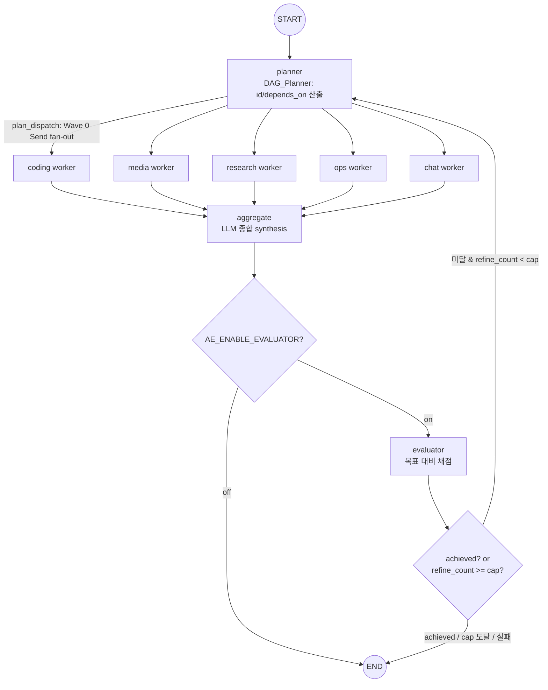

# Design Document

## Overview

이 설계는 이미 배포된 LangGraph 계층적 오케스트레이터(`ai_engine/agent_system/`) 위에 세
가지 고도화를 **재구현 없이 얹는다**:

1. **Evaluator 재계획 루프** — 병렬 그래프의 `aggregate` 이후 `evaluator` 노드를 추가하여
   원래 목표 대비 산출물 달성 여부를 채점하고, 미달 시 유한 횟수(`AE_MAX_REFINE`, 기본 2)
   안에서 `planner`로 되돌려 교정 실행한다.
2. **진짜 종합(synthesis) aggregate** — 현재 no-op(`return {}`)인 `make_aggregate_node`를
   GatewayChatModel 종합 호출로 승격하여 병렬 워커 산출물을 하나의 일관된 최종 답변으로
   합친다. verified_files는 보존하고, 워커가 1개면 LLM을 스킵한다.
3. **의존성 인식 DAG 병렬 플래너** — `_PLAN_TOOL` 스키마에 `id`/`depends_on[]`을 추가하고,
   위상정렬로 Wave를 분할하여 Wave별 Send fan-out을 수행한다. 순환 감지 시 단일 Wave로
   폴백한다.

### 설계 원칙 (steering + 요구사항 정합)

- **무회귀 우선**: 기존 `build_top_graph`(순차 멀티홉)와 `build_parallel_top_graph`(병렬
  fan-out)의 진입점·SSE 계약을 보존한다. 신규 동작은 모두 env 플래그(`AE_ENABLE_EVALUATOR`,
  `AE_ENABLE_DAG_PLANNER`)로 토글되며, off 시 기존 노드/엣지 구성과 동일하다(Req 6).
- **무한 종료 보장**: 신규 LLM 호출은 `llm.ainvoke` 개별 await 하나만 `asyncio.wait_for`로
  감싼다. 스트림 소비 루프(`async for`)는 절대 감싸지 않는다(과거 Python hang 이력 대응).
  모든 루프는 유한 cap(`refine_count ≤ AE_MAX_REFINE`, Wave 수 ≤ 서브태스크 수,
  `route_hops ≤ MAX_ROUTE_HOPS`)을 가진다(Req 8).
- **Gateway 경유만**: 모든 신규 LLM 호출은 `GatewayChatModel`을 재사용한다. boto3/Anthropic
  SDK/OpenAI SDK 직접 호출 금지(Req 7).
- **자격증명 미저장**: 신규 상태 채널(evaluation / refine_count / plan 확장)에 자격증명을
  담지 않는다. 문자열 식별자(aws_profile, bedrock_user)만 전달한다(Req 10).
- **기존 자산 재사용**: GatewayChatModel, GraphState/reducer, 컴파일된 Domain_Subgraph,
  verify 노드, verified_files 디스크 실측 로직을 그대로 재사용한다(Req 11).
- **모델 역할 배분**: Planner=Opus, Generator=Sonnet, Evaluator=Opus(steering `project.md`).
  GraphDeps로 주입 가능(Req 9).

### 순수 함수 분리 전략

DAG 스케줄링과 평가 결과 파싱의 핵심 로직은 **부작용 없는 순수 함수**로 분리하여 단위/속성
테스트를 용이하게 한다:

- `topological_waves(subtasks) -> list[list[subtask]]` — 위상정렬 + Wave 분할
- `detect_cycle(subtasks) -> bool` — 순환 의존 감지
- `sanitize_depends_on(subtasks) -> subtasks` — 존재하지 않는 id 참조 제거
- `parse_evaluation(ai_message, valid_domains) -> Evaluation` — 평가 결과 파싱

이 함수들은 LLM/네트워크에 의존하지 않으므로 100+ 반복의 속성 테스트에 이상적이다.

## Architecture

### 현재 구조 (실측)

```
build_top_graph (순차 멀티홉):
  START → router → conditional{coding/media/research/ops/chat/done}
        → 도메인 서브그래프 → router (재라우팅, route_hops cap)

build_parallel_top_graph (병렬 fan-out):
  START → planner → plan_dispatch(Send fan-out) → 도메인 워커 → aggregate(no-op) → END
```

### 고도화 후 구조

Evaluator 루프와 DAG Wave 스케줄링은 **병렬 그래프(`build_parallel_top_graph`)에만** 추가된다.
순차 그래프(`build_top_graph`)는 변경하지 않는다(무회귀).



### 흐름 상세

- **DAG Wave 스케줄링** (`AE_ENABLE_DAG_PLANNER=on`): `planner`가 `depends_on`을 포함한 plan을
  산출하면, `plan_dispatch`가 순수 함수 `topological_waves`로 Wave를 계산하고 **현재 Wave만**
  Send로 fan-out한다. 남은 Wave는 상태(`plan` + 완료 표시)에 남겨두고, aggregate 이후 다시
  planner로 돌아와 다음 Wave를 실행하거나(재-dispatch), Wave 소진 시 종료한다.
- **Evaluator 재계획** (`AE_ENABLE_EVALUATOR=on`): aggregate가 종합 답변을 만든 뒤 evaluator가
  달성 여부를 채점한다. 미달이고 `refine_count < AE_MAX_REFINE`이면 부족한 도메인/사유를
  교정 지시로 planner에 되돌리고 `refine_count`를 1 증가시킨다. 달성/cap 도달/호출 실패면 END.

> **설계 결정 — DAG Wave의 순환 구조**: LangGraph에서 다중 Wave를 표현하는 방식은 두 가지다.
> (A) planner ↔ aggregate 사이를 conditional edge로 순환시키며 Wave를 하나씩 소비, (B) 각
> Wave를 별도 노드로 펼침. (A)를 채택한다 — 이미 존재하는 planner/aggregate 노드를 재사용하고,
> Wave 수(≤ 서브태스크 수)를 유한 cap으로 삼아 순환을 유한 종료할 수 있으며, evaluator 루프와
> 동일한 conditional 복귀 패턴을 공유하기 때문이다. planner는 상태의 `plan`/`completed_waves`를
> 보고 "다음 Wave dispatch" 또는 "종료"를 결정한다.

## Components and Interfaces

모든 신규 코드는 기존 파일에 추가한다(신규 파일 최소화). 순수 함수는 테스트 용이성을 위해
`supervisor.py` 내 별도 섹션 또는 `agent_system/dag.py`(신규, 순수 함수 전용)로 분리한다.

### 1. 순수 함수 — DAG 스케줄링 (`agent_system/dag.py`, 신규)

부작용·네트워크 의존이 전혀 없는 순수 함수 모듈. 단위/속성 테스트 대상.

```python
# 서브태스크 정규화 타입 (dict 기반, GraphState.plan 항목과 동일 형태)
# {"id": str, "domain": RouteName, "subtask": str, "depends_on": list[str]}

def sanitize_depends_on(subtasks: list[dict]) -> list[dict]:
    """존재하지 않는 id를 참조하는 depends_on 항목을 제거(Req 5.3).

    Precondition:  subtasks는 dict 리스트(각 항목 id/domain/subtask 보유, depends_on 선택).
    Postcondition: 반환 리스트의 모든 depends_on 원소는 subtasks 내 실재 id만 포함.
                   id 누락 항목은 인덱스 기반 id("t{i}")로 보정.
    Invariant:     입력을 변경하지 않는다(새 리스트 반환). 서브태스크 개수는 보존.
    """

def detect_cycle(subtasks: list[dict]) -> bool:
    """depends_on 그래프에 순환이 존재하면 True(Req 5.1).

    Kahn 알고리즘 또는 DFS 방문색으로 판정. sanitize_depends_on 이후 호출 가정.
    """

def topological_waves(subtasks: list[dict]) -> list[list[dict]]:
    """depends_on을 위상정렬하여 Wave 목록으로 분할(Req 4.2).

    Precondition:  subtasks는 sanitize_depends_on을 통과한 상태.
    Postcondition: 각 Wave의 서브태스크는 선행 depends_on이 모두 이전 Wave에 존재.
                   순환이 있으면([detect_cycle True]) 전체를 단일 Wave로 반환(Req 5.2).
                   반환 Wave 수는 서브태스크 총 개수 이하(Req 5.4 / 4.2).
    Invariant:     모든 서브태스크는 정확히 하나의 Wave에 속한다(분할 = partition).
    """
```

### 2. 순수 함수 — 평가 결과 파싱 (`agent_system/supervisor.py`)

```python
def parse_evaluation(ai_message: Any, valid_domains: tuple[str, ...]) -> dict:
    """Evaluator LLM 응답(tool_calls 우선, 텍스트 폴백)을 Evaluation dict로 파싱.

    Postcondition: {"achieved": bool, "reason": str, "missing_domains": list[str]} 반환.
                   missing_domains는 valid_domains에 속한 라벨만 포함(무효 라벨 제거).
                   파싱 불가/무효 시 achieved=True(비차단 종료 지향 — Req 1.6/6.6).
    Invariant:     어떤 예외도 전파하지 않는다(비차단).
    """
```

### 3. Evaluator 노드 팩토리 (`agent_system/supervisor.py`, 신규)

```python
# 평가 강제 스키마 — GatewayChatModel toolChoice로 단일 구조 강제
_EVAL_TOOL: dict = {
    "name": "submit_evaluation",
    "description": "원래 요청 대비 현재 산출물의 달성 여부를 평가한다.",
    "inputSchema": {"json": {"type": "object", "properties": {
        "achieved": {"type": "boolean", "description": "원래 요청이 모두 충족되었는가"},
        "reason": {"type": "string", "description": "판정 사유(한국어)"},
        "missing_domains": {"type": "array", "items":
            {"type": "string", "enum": list(_ROUTE_LABELS)},
            "description": "미달 시 보완이 필요한 도메인 목록"},
    }, "required": ["achieved"]}},
}

AE_MAX_REFINE: int = _env_int("AE_MAX_REFINE", 2)
AE_EVALUATOR_TIMEOUT: float = _env_float("AE_EVALUATOR_TIMEOUT", 300.0)

def make_evaluator_node(deps: Any):
    """evaluator 노드 팩토리 → async evaluator_node(state) -> dict.

    Precondition:  aggregate 이후 실행. state["prompt"], messages, verified_files 존재.
    Postcondition:
      - refine_count >= AE_MAX_REFINE 이면 LLM 호출 없이 {"evaluation": {achieved:True,...}}
        반환 → END (Req 2.2).
      - Evaluator_Model(Opus) 호출로 평가. 달성이면 {"evaluation": {...achieved:True}} → END.
      - 미달 & refine_count < cap 이면 {"evaluation": {...achieved:False, missing_domains},
        "refine_count": refine_count+1, "messages":[HumanMessage(교정지시)]} → planner (Req 1.4).
      - 호출 실패/타임아웃이면 achieved=True 간주 → END (Req 1.6 / 6.6, 비차단).
    Invariant:     LLM 호출은 GatewayChatModel(gateway 경유)만. ainvoke 개별 await 하나만
                   asyncio.wait_for(AE_EVALUATOR_TIMEOUT). refine_count는 last-wins reducer로
                   echo 증폭 없이 정확히 집계(Req 2.3).
    """

def evaluator_selector(state: GraphState) -> str:
    """conditional edge — evaluation.achieved / refine_count 기준 'planner' | 'done' 반환."""
```

교정 지시는 evaluator가 다음 planner 턴에서 부족 도메인만 재계획하도록, `missing_domains`와
`reason`을 담은 HumanMessage로 messages에 추가한다(supervisor→planner 지시). Evaluator_Model은
`deps.model_evaluator`(기본 Opus)를 사용한다.

### 4. Aggregate 노드 승격 (`agent_system/supervisor.py`, 변경)

```python
AE_AGGREGATE_TIMEOUT: float = _env_float("AE_AGGREGATE_TIMEOUT", 300.0)

_AGGREGATE_SYSTEM_PROMPT = (
    "너는 여러 도메인 워커의 산출물을 하나의 일관된 최종 답변으로 종합하는 편집자다. "
    "각 워커 결과를 통합해 사용자 원래 요청에 대한 완결된 한국어 답변을 작성한다. "
    "생성된 파일 목록은 보존하되 답변 본문에 자연스럽게 언급한다."
)

def make_aggregate_node(deps: Any):
    """aggregate(fan-in) 노드 — no-op에서 LLM 종합으로 승격 (Req 3).

    Postcondition:
      - 병렬 워커가 1개면(plan 길이 <=1 또는 워커 산출 messages가 단일 도메인) LLM 스킵,
        기존 결과를 그대로 통과 {} 반환 (Req 3.7).
      - 워커가 여러 개면 GatewayChatModel(Generator 또는 전용 모델)로 messages+verified_files
        요약을 입력해 일관된 final_text를 생성 → {"final_text":..., "messages":[AIMessage(...)]}
        반환 (Req 3.1/3.2/3.3).
      - verified_files는 입력을 그대로 보존(reducer가 dedup 병합, 삭제 없음) (Req 3.4/3.6).
      - LLM 실패/타임아웃이면 {} 반환(기존 병합 유지, 비차단) (Req 3.5/3.8).
    Invariant:     ainvoke 개별 await 하나만 asyncio.wait_for(AE_AGGREGATE_TIMEOUT).
    """
```

> **설계 결정 — verified_files 보존**: aggregate는 `verified_files`를 반환하지 않아도 된다.
> 워커들이 이미 상태에 병합했고 `_merge_verified_files` reducer가 유지하기 때문이다. 만약
> aggregate가 명시적으로 반환하려면 입력 verified_files를 그대로 반환하여 dedup 병합 후에도
> 동일 집합이 유지된다. 실패 경로에서는 아무것도 반환하지 않아(`{}`) 기존 집합을 건드리지
> 않는다 — 이것이 "삭제하지 않음"(Req 3.6)을 보장하는 가장 안전한 방법이다.

### 5. DAG Planner 스키마 확장 (`agent_system/supervisor.py`, 변경)

`_PLAN_TOOL`의 `subtasks[].items.properties`에 `id`, `depends_on`을 추가한다:

```python
"properties": {
    "id": {"type": "string", "description": "서브태스크 고유 식별자(예: t1)"},
    "domain": {"type": "string", "enum": list(_ROUTE_LABELS)},
    "subtask": {"type": "string", "description": "해당 도메인이 수행할 구체적 작업(한국어)"},
    "depends_on": {"type": "array", "items": {"type": "string"},
        "description": "이 작업 시작 전 완료되어야 할 선행 서브태스크 id 목록"},
},
"required": ["id", "domain", "subtask"],
```

`_make_plan`은 파싱 시 `id`(누락 시 `t{i}` 보정)와 `depends_on`(기본 `[]`)을 포함하여 반환한다.
`AE_ENABLE_DAG_PLANNER=off`면 depends_on을 무시하고 기존 단일 Wave 동작을 유지한다(Req 4.7).

### 6. plan_dispatch Wave 인식 (`agent_system/supervisor.py`, 변경)

```python
def plan_dispatch(state: GraphState):
    """conditional edge — 현재 Wave의 서브태스크만 Send로 fan-out.

    - AE_ENABLE_DAG_PLANNER off: 기존 동작(전체 plan을 단일 Wave로 fan-out) 유지 (Req 4.7).
    - on: sanitize_depends_on → topological_waves 계산. state["completed_waves"](기본 0)
      인덱스의 Wave만 Send. 순환 감지 시 단일 Wave 폴백 (Req 5.2).
    - 어느 경우든 동시 Send 수 <= MAX_PARALLEL_TASKS (Req 4.6).
    - 후속 Wave 컨텍스트 전달 실패(선행 messages 부재 등) 시 빈 Send로 종료(Req 4.5).
    """
```

### 7. GraphDeps 모델 역할 필드 (`agent_system/deps.py`, 변경)

```python
_DEFAULT_PLANNER_MODEL   = "us.anthropic.claude-opus-4-1-20250805-v1:0"   # Planner=Opus
_DEFAULT_GENERATOR_MODEL = "us.anthropic.claude-sonnet-4-5-20250929-v1:0" # Generator=Sonnet
_DEFAULT_EVALUATOR_MODEL = "us.anthropic.claude-opus-4-1-20250805-v1:0"   # Evaluator=Opus

@dataclass
class GraphDeps:
    gateway: Any = None
    model_coding: str = _DEFAULT_CODING_MODEL
    model_planner: str = _DEFAULT_PLANNER_MODEL      # 신규 (Req 9.1/9.2)
    model_generator: str = _DEFAULT_GENERATOR_MODEL  # 신규 (Req 9.1/9.4)
    model_evaluator: str = _DEFAULT_EVALUATOR_MODEL  # 신규 (Req 9.1/9.3)
    checkpointer: Optional[Any] = None
    store: Optional[Any] = None
    mcp_tools: Optional[Any] = None
    mcp_tool_map: Optional[Any] = None
```

> 기존 `model_coding` 필드는 하위 호환을 위해 유지한다. planner/evaluator는 신규 필드를 우선
> 사용하되, 미주입(기본값) 시 위 기본 model_id로 폴백한다(Req 9.2/9.3/9.4). deps에 주입되면
> 해당 model_id를 사용한다(Req 9.5).

### 8. 그래프 조립 변경 (before / after)

**Before** (`build_parallel_top_graph`):
```python
g.add_edge(START, "planner")
g.add_conditional_edges("planner", plan_dispatch, list(_SUBGRAPH_ROUTES))
for name in _SUBGRAPH_ROUTES:
    g.add_edge(name, "aggregate")
g.add_edge("aggregate", END)
```

**After**:
```python
g.add_edge(START, "planner")
g.add_conditional_edges("planner", plan_dispatch, list(_SUBGRAPH_ROUTES))
for name in _SUBGRAPH_ROUTES:
    g.add_edge(name, "aggregate")

_evaluator_on = _env_flag("AE_ENABLE_EVALUATOR", default=True)
if _evaluator_on:
    g.add_node("evaluator", make_evaluator_node(deps))
    g.add_edge("aggregate", "evaluator")
    g.add_conditional_edges("evaluator", evaluator_selector,
                            {"planner": "planner", "done": END})
else:
    g.add_edge("aggregate", END)   # 기존 동작 보존 (Req 6.2)
```

`build_top_graph`(순차)와 SSE 브리지(`graph_events_to_sse`), Graph_Endpoint의 `AE_LANGGRAPH`/
`AE_LANGGRAPH_PARALLEL` 플래그 계약은 변경하지 않는다(Req 6.1/6.4). server.py의 조립 분기도
그대로 유지된다.

## Data Models

### GraphState 채널 변경 (`agent_system/graph_state.py`)

기존 채널은 유지하고 신규 채널을 reducer와 함께 추가한다. 모든 신규 채널은 자격증명을 담지
않는다(Req 10.1).

```python
class Evaluation(TypedDict, total=False):
    """Evaluator_Node 채점 결과. 자격증명 없음."""
    achieved: bool              # 원래 요청 달성 여부
    reason: str                 # 판정 사유
    missing_domains: List[str]  # 미달 시 보완 필요 도메인

class GraphState(TypedDict, total=False):
    # ... 기존 채널 유지 ...

    # ── 신규: Evaluator 재계획 루프 ──
    evaluation: Annotated[Optional[Evaluation], _take_right]   # 평가 결과 (last-wins)
    refine_count: Annotated[int, _take_right]                  # 재계획 횟수 (last-wins, echo 면역)

    # ── 신규: DAG Wave 스케줄링 ──
    completed_waves: Annotated[int, _take_right]               # 완료된 Wave 수 (last-wins)
```

`plan` 채널은 기존 `Annotated[List[dict], _take_right]`를 유지하되, 각 dict가 `id`/`depends_on`을
추가로 담는다(스키마 변경만, reducer 불변):

```python
# plan 항목 형태 (확장):
# {"id": str, "domain": RouteName, "subtask": str, "depends_on": List[str]}
```

> **reducer 선택 근거**: `refine_count`/`completed_waves`는 병렬 fan-out에서 여러 워커가
> 동시에 쓰지 않는 스칼라 카운터이므로 `_take_right`(last-wins)를 사용한다. 이는 기존
> `route_hops`와 동일한 echo 면역 패턴이다(Req 2.3). `evaluation`도 evaluator 단일 노드만
> 쓰므로 last-wins가 안전하다.

### VerifiedFile / Evidence

기존 정의를 그대로 재사용한다(변경 없음 — Req 11.2/11.4). aggregate/evaluator는
`_merge_verified_files` reducer가 관리하는 verified_files를 읽기만 하거나 그대로 반환한다.

### 신규 환경변수

| 변수 | 기본값 | 용도 |
|------|--------|------|
| `AE_ENABLE_EVALUATOR` | on | Evaluator_Node + Refine_Loop 활성 (Req 1/6.2) |
| `AE_ENABLE_DAG_PLANNER` | on | 의존성 DAG Wave 스케줄링 활성 (Req 4/6.3) |
| `AE_MAX_REFINE` | 2 | Refine_Loop 상한 (Req 2.1) |
| `AE_EVALUATOR_TIMEOUT` | 300 | evaluator ainvoke 타임아웃 (Req 8.1) |
| `AE_AGGREGATE_TIMEOUT` | 300 | aggregate ainvoke 타임아웃 (Req 8.2) |
| `AE_MAX_PARALLEL_TASKS` | 4 | 동시 워커 수 상한 (기존, Req 4.6) |

## Correctness Properties

*속성(property)이란 시스템의 모든 유효한 실행에 대해 참이어야 하는 특성 또는 행동으로,
시스템이 무엇을 해야 하는지에 대한 형식적 진술이다. 속성은 사람이 읽는 명세와 기계가 검증
가능한 정확성 보증 사이의 다리 역할을 한다.*

아래 속성들은 prework 분석과 중복 제거(Property Reflection)를 거쳐 도출되었다. 각 속성은
LLM/네트워크에 의존하지 않는 **순수 함수** 또는 **결정론적 라우팅/reducer 로직**을 대상으로
하며, 100회 이상의 무작위 입력 반복으로 검증한다. LLM 응답 품질·아키텍처 정적 제약·조립
구성은 property가 아니라 example/smoke 테스트로 다룬다(Testing Strategy 참조).

### Property 1: 유한 종료 (Refine / Wave / Route 상한)

*For any* 서브태스크 목록과 임의의 초기 refine_count에 대해, 하나의 그래프 실행에서
수행되는 Refine_Loop 복귀 횟수는 `AE_MAX_REFINE` 이하이고, `topological_waves`가 생성하는
Wave 수는 서브태스크 총 개수 이하이며, 재라우팅 hop은 `MAX_ROUTE_HOPS` 이하이다.

**Validates: Requirements 2.4, 4.2, 5.4, 8.5**

### Property 2: 무회귀 구성 (플래그 off)

*For any* 플래그 조합에서 `AE_ENABLE_EVALUATOR`와 `AE_ENABLE_DAG_PLANNER`가 모두 off이면,
`build_parallel_top_graph`가 조립한 그래프의 노드/엣지 구성은 evaluator 노드 없이
`aggregate → END`로 끝나고, plan_dispatch는 depends_on을 무시한 단일 Wave fan-out으로
동작하여 기존 그래프와 동일하다.

**Validates: Requirements 6.2, 6.3, 4.7**

> 검증 방식: 이 속성은 조립 구성(노드/엣지 집합)의 동치성을 검사하므로 무작위 입력보다
> 플래그 조합에 대한 스냅샷 비교(example-like)로 구현한다.

### Property 3: 신규 채널 자격증명 미저장

*For any* `evaluation` / `refine_count` / `completed_waves` / 확장된 `plan`(id/depends_on
포함) 채널 값에 대해, 해당 값과 그 직렬화 결과 어디에도 `accessKeyId`, `secretAccessKey`,
`sessionToken` 키가 존재하지 않는다.

**Validates: Requirements 10.1, 10.2**

### Property 4: 비차단 종합 및 verified_files 보존

*For any* 임의의 사전 상태와 임의의 verified_files 목록에 대해, aggregate/evaluator의 LLM
호출이 성공하든 실패/타임아웃하든, 그래프는 예외를 전파하지 않고 진행하며 결과 상태의
verified_files의 absPath 집합은 입력 verified_files의 absPath 집합을 포함한다(삭제 없음).

**Validates: Requirements 3.4, 3.5, 3.6, 3.8, 7.3**

### Property 5: 위상정렬 정확성

*For any* 순환이 없는 서브태스크 목록에 대해, `topological_waves`가 생성한 Wave 분할에서
각 서브태스크의 모든 `depends_on` 선행 항목은 그 서브태스크보다 앞선 Wave에 속하며, 모든
서브태스크는 정확히 하나의 Wave에 속한다(분할 = partition).

**Validates: Requirements 4.2**

### Property 6: 순환 감지 및 단일 Wave 폴백

*For any* 순환 의존을 포함하는 서브태스크 목록에 대해, `detect_cycle`은 True를 반환하고
`topological_waves`는 모든 서브태스크를 담은 길이 1의 Wave 목록(단일 Wave 폴백)을 반환한다.

**Validates: Requirements 5.1, 5.2**

### Property 7: 무효 의존 참조 제거

*For any* 존재하지 않는 id를 참조하는 `depends_on`을 포함한 서브태스크 목록에 대해,
`sanitize_depends_on` 이후 모든 `depends_on` 원소는 목록 내 실재하는 서브태스크 id만
포함하며, 서브태스크 총 개수는 보존된다.

**Validates: Requirements 5.3**

### Property 8: 평가 결과 파싱 견고성

*For any* Evaluator LLM 응답 형태(tool_calls dict, 텍스트, 필드 누락, 무효 타입)에 대해,
`parse_evaluation`은 항상 `{achieved: bool, reason: str, missing_domains: list[str]}` 형태를
반환하며, `missing_domains`는 유효 도메인 라벨의 부분집합이고, 파싱 불가 시 achieved=True로
안전 종료를 지향한다.

**Validates: Requirements 1.2, 1.6**

### Property 9: 계획 파싱 스키마 견고성

*For any* DAG_Planner LLM 응답의 subtasks 배열에 대해, `_make_plan` 파싱 결과의 각 항목은
비어있지 않은 `id`(누락 시 인덱스 기반 보정), 유효 `domain`, 문자열 `subtask`, 리스트
`depends_on`을 항상 보유한다.

**Validates: Requirements 4.1**

### Property 10: fan-out 상한 및 Wave 선택

*For any* 임의 크기의 plan과 임의의 `completed_waves` 인덱스에 대해, `plan_dispatch`가
생성하는 Send 수는 `AE_MAX_PARALLEL_TASKS` 이하이며, 각 Send의 도메인은 유효한 서브그래프
라우트이고, DAG 활성 시 현재 Wave에 속한 서브태스크만 dispatch된다.

**Validates: Requirements 4.3, 4.4, 4.6**

### Property 11: Evaluator 라우팅 및 재계획 카운트 정확성

*For any* 임의의 evaluation 결과와 refine_count에 대해, `evaluator_selector`는
achieved=True이거나 refine_count가 cap에 도달하면 "done"을, achieved=False이고 refine_count가
cap 미만이면 "planner"를 반환한다. "planner"로 라우팅되는 경우 evaluator_node가 반환하는
refine_count는 입력값 + 1이다.

**Validates: Requirements 1.3, 1.4, 2.2**

### Property 12: SSE 이벤트 키 부분집합

*For any* 신규 노드(evaluator/aggregate/planner)가 반환하는 상태 dict에 대해, 그 키 집합은
SSE_Bridge가 이벤트로 변환할 수 있는 기존 GraphState 채널 집합의 부분집합이며, 결과적으로
emit되는 SSE 이벤트 키는 기존 집합
`{text, thinking, tool, status, verifiedFiles, type, taskId, heartbeat, answerQuality, qualityPending, error}`의
부분집합이다.

**Validates: Requirements 6.5**

### Property 13: last-wins reducer 정확성 (echo 면역)

*For any* 정수/값 시퀀스에 대해, `_take_right` reducer를 순차 적용한 결과는 마지막 non-None
값이며(모두 None이면 초기값 유지), 병렬 fan-out에서 동일 값이 여러 번 echo되어도 값이
증폭되지 않는다. 따라서 refine_count/completed_waves는 정확한 카운트를 유지한다.

**Validates: Requirements 2.3**

## Error Handling

모든 신규 노드는 **가용성 우선(비차단)** 원칙을 따른다 — 어떤 실패도 answer를 차단하지
않으며, 그래프는 항상 유한 시간에 종료된다.

### Evaluator 노드

| 실패 유형 | 처리 |
|-----------|------|
| Evaluator_Model 타임아웃(`asyncio.TimeoutError`) | achieved=True 간주 → END (Req 1.6/8.1) |
| `GatewayModelError` / 기타 예외 | achieved=True 간주 → END (Req 7.3) |
| tool_calls 없음 / 파싱 실패 | `parse_evaluation`이 achieved=True 반환 → END (Req 1.6) |
| refine_count >= cap | LLM 호출 없이 즉시 END (Req 2.2) |

### Aggregate 노드

| 실패 유형 | 처리 |
|-----------|------|
| 종합 LLM 타임아웃 | `{}` 반환 → 기존 messages/verified_files 유지 (Req 3.5/8.2) |
| `GatewayModelError` / 기타 예외 | `{}` 반환 → 비차단 진행 (Req 3.8/7.3) |
| 워커 1개 | LLM 스킵 → 기존 결과 통과 (Req 3.7) |
| gateway=None | LLM 스킵 → 기존 결과 통과 |

### DAG Planner / plan_dispatch

| 실패 유형 | 처리 |
|-----------|------|
| Planner LLM 타임아웃/오류 | 단일 휴리스틱 폴백 plan(기존 `_make_plan` 동작, Req 8.3) |
| 순환 의존 감지 | 단일 Wave 폴백(`topological_waves` 내부, Req 5.2) |
| 존재하지 않는 id 참조 | `sanitize_depends_on`이 제거 후 계속 (Req 5.3) |
| 후속 Wave 컨텍스트 부재 | 빈 Send 반환 → 후속 Wave 미실행 종료 (Req 4.5) |
| plan 비어있음 | chat 단일 폴백(기존 동작) |

### 타임아웃 전략 (Req 8 — 무한대기 차단)

- 모든 신규 LLM 호출은 **`llm.ainvoke(...)` 개별 await 하나만** `asyncio.wait_for`로 감싼다.
  스트림 소비 루프(`async for`)는 절대 감싸지 않는다(과거 hang 이력 대응).
- Evaluator: `AE_EVALUATOR_TIMEOUT`(300s), Aggregate: `AE_AGGREGATE_TIMEOUT`(300s),
  DAG_Planner: `AE_ROUTER_TIMEOUT`(60s, 기존 재사용).
- SSE 중계 루프(`graph_events_to_sse`)는 변경하지 않으며 `wait_for`로 감싸지 않는다(Req 8.4).

### 루프 유한 종료 (Req 8.5)

- Refine_Loop: `refine_count`가 cap 도달 시 planner 복귀 없이 END. evaluator_selector가
  cap 검사를 강제한다.
- Wave 스케줄링: `completed_waves`가 전체 Wave 수에 도달하면 evaluator/END로 진행. Wave
  수는 서브태스크 수 이하로 유한.
- 재라우팅: 기존 `route_hops` cap 유지(순차 그래프, 변경 없음).

## Testing Strategy

### 이중 테스트 접근

- **속성 테스트(PBT)**: 위 13개 Correctness Property를 순수 함수와 결정론적 로직에 대해
  무작위 입력 100회 이상 반복으로 검증한다. PBT가 적합한 이유는 DAG 스케줄링/파싱/reducer가
  명확한 입출력을 가진 순수 함수이고, 입력 공간이 크며(임의 그래프/응답 구조), 라운드트립·
  불변식·분할 등 보편 속성이 존재하기 때문이다.
- **단위/예시 테스트**: LLM 종합·평가의 반환 계약(gateway mock 성공/실패), 조립 구성(플래그
  on/off 노드 집합), 기본 모델값 등 구체 시나리오를 검증한다.
- **smoke 테스트**: 아키텍처 정적 제약(GatewayChatModel만 사용, 직접 SDK 부재, `wait_for(
  ainvoke)` 패턴, GraphDeps 필드 존재)을 1회 검증한다.

### PBT 라이브러리 및 설정

- Python이므로 **Hypothesis**를 사용한다(직접 구현 금지 — 기존 스크립트도 Hypothesis 사용).
- 각 속성 테스트는 **최소 100회 반복**(`@settings(max_examples=100)`)한다.
- 각 테스트는 대응 설계 속성을 주석으로 태깅한다:
  `# Feature: langgraph-reasoning-upgrade, Property {번호}: {속성 텍스트}`

### 속성별 테스트 매핑

| 속성 | 대상 | 생성기(전략) |
|------|------|-------------|
| P1 유한 종료 | 시뮬레이션 루프 + topological_waves | 임의 subtasks, 임의 초기 카운트 |
| P2 무회귀 구성 | build_parallel_top_graph 조립 | 플래그 조합(example-like 스냅샷) |
| P3 자격증명 미저장 | 신규 채널 값 직렬화 | 임의 evaluation/plan/카운트 값 |
| P4 비차단 보존 | aggregate/evaluator + gateway mock | 임의 verified_files + 성공/실패 주입 |
| P5 위상정렬 | topological_waves | 임의 DAG(비순환) 생성 |
| P6 순환 폴백 | detect_cycle + topological_waves | 순환 포함 그래프 생성 |
| P7 무효참조 제거 | sanitize_depends_on | 임의 무효 id 참조 포함 |
| P8 평가 파싱 | parse_evaluation | 임의 응답 형태(tool_calls/텍스트/무효) |
| P9 계획 파싱 | _make_plan 파싱부 | 임의 subtasks 배열(누락/무효 포함) |
| P10 fan-out 상한 | plan_dispatch | 임의 크기 plan + 임의 completed_waves |
| P11 라우팅/카운트 | evaluator_selector + evaluator_node | 임의 evaluation + refine_count |
| P12 SSE 키 | 신규 노드 반환 키 집합 | 임의 반환 dict 시뮬레이션 |
| P13 last-wins | _take_right | 임의 값 시퀀스 |

### 생성기 설계 노트 (DAG 관련)

- **비순환 DAG 생성**: 노드에 정수 순서를 부여하고 depends_on을 "더 작은 순서 노드만
  참조"하도록 제한하여 순환 없는 그래프를 생성한다(P5).
- **순환 그래프 생성**: 위 DAG에 역방향 엣지 하나 이상을 강제 삽입하여 순환을 만든다(P6).
- **무효 참조**: 실재 id 집합 밖의 랜덤 문자열을 depends_on에 섞는다(P7).

### 단위/예시 테스트 (비-PBT)

- `test_evaluator_node_timeout_returns_achieved` — gateway mock 타임아웃 → achieved=True/done (1.6)
- `test_aggregate_llm_failure_preserves_state` — mock 예외 → `{}` 반환, verified_files 보존 (3.5)
- `test_aggregate_single_worker_skips_llm` — 워커 1개 → LLM 미호출 (3.7)
- `test_build_parallel_graph_flags_on_off` — 플래그 조합별 노드/엣지 스냅샷 (6.2)
- `test_graphdeps_default_model_roles` — 기본값 Opus/Sonnet/Opus (9.2/9.3/9.4)
- `test_no_direct_sdk_imports` — 신규 소스에 boto3/anthropic/openai import 부재 (7.2/8.4)
- `test_endpoint_flag_contract_preserved` — server.py 조립 분기 미변경 (6.4)

### 검증 실행

- 속성/단위 테스트는 `scripts/` 하위에 `test_*_pbt.py` / `test_*.py`로 배치하고(기존 관례),
  `pytest --run` 단발 실행으로 검증한다(watch 모드 금지).
- LLM 호출이 포함된 노드 테스트는 gateway를 mock하여 네트워크 없이 결정론적으로 실행한다.

## 기존 코드 재사용 매핑 (Req 11)

| 신규/변경 | 재사용 자산 | 위치 |
|-----------|-------------|------|
| evaluator/aggregate/planner LLM | `GatewayChatModel.bind_tools(tool_choice=...)` | `chat_model_adapter.py` |
| 신규 상태 채널 | `GraphState`, `_take_right`, `_merge_verified_files` | `graph_state.py` |
| 도메인 워커 실행 | `build_{coding,media,research,ops,chat}_subgraph` | `subgraphs/` |
| verify 노드 | `make_verify_node` (변경 없음) | `nodes/verify.py` |
| verified_files 디스크 실측 | `_invoke_force_generate` 내 os.path 실측 | `nodes/verify.py` |
| 플래너 골격 | `_make_plan`, `make_planner_node`, `plan_dispatch` (확장) | `supervisor.py` |
| aggregate 골격 | `make_aggregate_node` (no-op → 승격) | `supervisor.py` |
| hop/iteration cap 패턴 | `MAX_ROUTE_HOPS`, `SUBGRAPH_RECURSION_LIMIT` | `supervisor.py`, `_common.py` |
| 타임아웃 패턴 | `asyncio.wait_for(llm.ainvoke(...))` | `_common.py`, `verify.py` |
| SSE 계약 | `graph_events_to_sse` (변경 없음) | `sse_bridge.py` |
| 모델 역할 주입 | `GraphDeps` (필드 추가) | `deps.py` |
