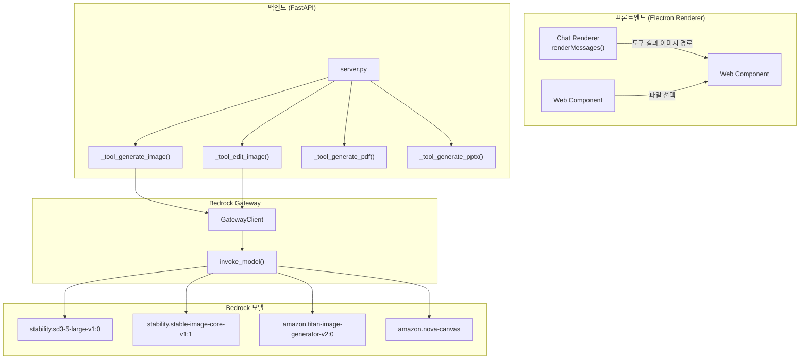
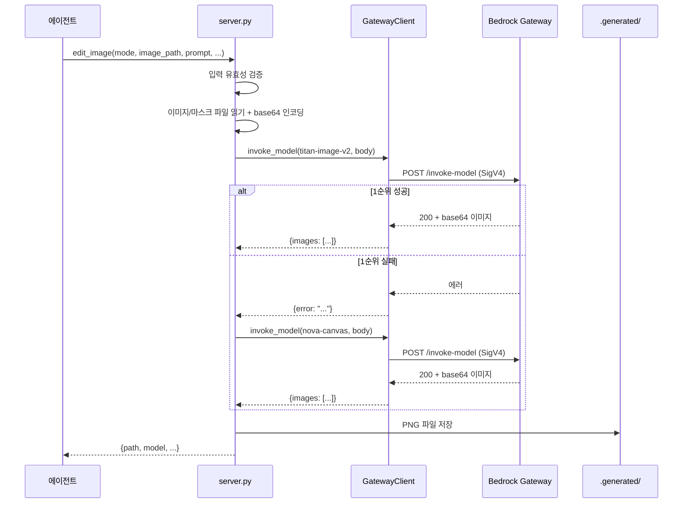

# 설계 문서: 미디어 생성·편집 기능

## 개요

이 설계는 AI 에디터의 미디어 생성·편집 파이프라인을 정의한다. 핵심 구성요소는 다음과 같다:

1. **이미지 생성 폴백 체인** — SD3.5 → Stable Image Core → Titan Image v2 순서로 시도
2. **이미지 편집 (inpaint/outpaint)** — Titan Image v2 → Nova Canvas 폴백 체인
3. **PDF/PPTX 생성** — reportlab/python-pptx 기반 문서 생성
4. **채팅 인라인 이미지 표시** — 에이전트 결과의 이미지를 썸네일로 렌더링
5. **파일 미리보기/다운로드 UI** — `.generated/` 폴더 파일 관리 Web Component
6. **edit_image 에이전트 도구 등록** — AGENT_TOOLS에 편집 도구 스키마 추가

모든 모델 호출은 Bedrock Gateway를 경유하며, 프론트엔드는 Vanilla JS Web Component로 구현한다.

## 아키텍처



### 데이터 흐름



## 컴포넌트 및 인터페이스

### 1. GatewayClient.invoke_model() — 이미지 모델 호출

`gateway_module.py`의 `GatewayClient`에 `invoke_model` 메서드를 추가한다. 기존 `converse`는 텍스트 모델용이고, `invoke_model`은 이미지 생성/편집 모델용이다.

```python
async def invoke_model(self, model_id: str, body: dict, timeout: int = 30) -> dict:
    """Bedrock InvokeModel API 호출 (이미지 모델용).
    
    Args:
        model_id: Bedrock 모델 ID
        body: 모델별 요청 본문
        timeout: 요청 타임아웃 (초)
    
    Returns:
        dict: {"images": [...]} 성공 시, {"error": "..."} 실패 시
    """
```

**설계 결정:** `converse` API와 분리하는 이유는 이미지 모델이 Converse API를 지원하지 않고 InvokeModel API를 사용하기 때문이다. SigV4 서명과 자격증명 관리는 기존 `_get_creds()`/`_sign()` 메서드를 재사용한다.

### 2. _tool_edit_image() — 이미지 편집 도구

`server.py`에 새로운 도구 함수를 추가한다.

```python
async def _tool_edit_image(tool_input: dict, project_path: str) -> str:
    """이미지 편집 (inpaint/outpaint). 
    
    Args:
        tool_input: {
            "mode": "inpaint" | "outpaint",
            "image_path": str,       # 원본 이미지 경로
            "prompt": str,           # 편집 프롬프트 (1~512자)
            "mask_path": str,        # inpaint 전용: 마스크 이미지 경로
            "direction": list[str],  # outpaint 전용: ["left","right","top","bottom"]
            "extend_pixels": int,    # outpaint 전용: 확장 크기 (1~1024)
        }
        project_path: 프로젝트 루트 경로
    
    Returns:
        JSON 문자열: 성공 시 {"path", "model", "width", "height"}
                    실패 시 {"error", "detail"?}
    """
```

**폴백 체인:** `amazon.titan-image-generator-v2:0` → `amazon.nova-canvas`

**Inpaint 요청 본문 (Titan Image v2):**
```json
{
  "taskType": "INPAINTING",
  "inPaintingParams": {
    "image": "<base64>",
    "maskImage": "<base64>",
    "text": "<prompt>"
  },
  "imageGenerationConfig": {
    "numberOfImages": 1,
    "quality": "standard"
  }
}
```

**Outpaint 요청 본문 (Titan Image v2):**
```json
{
  "taskType": "OUTPAINTING",
  "outPaintingParams": {
    "image": "<base64>",
    "text": "<prompt>",
    "maskPrompt": "",
    "outPaintingMode": "DEFAULT"
  },
  "imageGenerationConfig": {
    "numberOfImages": 1,
    "quality": "standard"
  }
}
```

### 3. edit_image AGENT_TOOLS 등록

`AGENT_TOOLS["tools"]` 배열에 추가할 toolSpec:

```python
{
    "toolSpec": {
        "name": "edit_image",
        "description": "기존 이미지를 편집합니다. inpaint(부분 수정) 또는 outpaint(확장) 모드를 지원합니다.",
        "inputSchema": {
            "json": {
                "type": "object",
                "properties": {
                    "mode": {
                        "type": "string",
                        "enum": ["inpaint", "outpaint"],
                        "description": "편집 모드"
                    },
                    "image_path": {
                        "type": "string",
                        "description": "원본 이미지 경로"
                    },
                    "prompt": {
                        "type": "string",
                        "minLength": 1,
                        "maxLength": 1000,
                        "description": "편집 프롬프트"
                    },
                    "mask_path": {
                        "type": "string",
                        "description": "마스크 이미지 경로 (inpaint 모드 필수)"
                    },
                    "direction": {
                        "type": "array",
                        "items": {"type": "string", "enum": ["up","down","left","right"]},
                        "minItems": 1,
                        "maxItems": 4,
                        "description": "확장 방향 (outpaint 모드 필수)"
                    },
                    "extend_pixels": {
                        "type": "integer",
                        "minimum": 1,
                        "maximum": 1024,
                        "description": "확장 크기 픽셀 (outpaint 모드 필수)"
                    }
                },
                "required": ["mode", "image_path", "prompt"]
            }
        }
    }
}
```

### 4. Chat Inline Image Renderer

`renderMessages()` 함수 내에서 도구 결과에 이미지 경로가 포함된 경우 인라인 썸네일을 렌더링한다.

```javascript
// 도구 결과에서 이미지 경로 감지
function renderToolResultImages(toolResult) {
  const imagePaths = extractImagePaths(toolResult); // .generated/*.png 패턴 매칭
  if (!imagePaths.length) return '';
  
  const maxDisplay = 4;
  const displayed = imagePaths.slice(0, maxDisplay);
  const overflow = imagePaths.length - maxDisplay;
  
  let html = '<div class="tool-images">';
  for (const img of displayed) {
    html += `
      <div class="tool-image-thumb" data-path="${img.path}">
        
        <div class="tool-image-meta">${img.model} · ${img.width}×${img.height}</div>
      </div>`;
  }
  if (overflow > 0) {
    html += `<a class="tool-images-more" href="#">+${overflow}개 더보기</a>`;
  }
  html += '</div>';
  return html;
}
```

**설계 결정:** Shadow DOM을 사용하지 않고 기존 `renderMessages()` 함수에 통합한다. 이유: 채팅 메시지 렌더링은 이미 인라인 HTML로 구성되어 있으며, 별도 Web Component로 분리하면 이벤트 버블링과 스타일 일관성 유지가 복잡해진다.

### 5. `<file-preview-panel>` Web Component

```javascript
// src/components/file-preview-panel.js
class FilePreviewPanel extends HTMLElement {
  connectedCallback() { /* 초기화, 파일 목록 로드, fs.watch 설정 */ }
  disconnectedCallback() { /* watcher 해제 */ }
  
  async loadFileList() { /* .generated/ 폴더 스캔, 최신순 정렬, 최대 100개 */ }
  renderFileList(files) { /* 파일명, 시간, 크기 표시 */ }
  onFileSelect(file) { /* 확장자별 뷰어 디스패치 */ }
  onDownload(file) { /* Electron 저장 다이얼로그 */ }
  
  formatFileSize(bytes) {
    if (bytes < 1024) return `${bytes} bytes`;
    if (bytes < 1024 * 1024) return `${(bytes / 1024).toFixed(1)} KB`;
    return `${(bytes / (1024 * 1024)).toFixed(1)} MB`;
  }
}
customElements.define('file-preview-panel', FilePreviewPanel);
```

**파일 감시:** `window.electronAPI.watchDirectory('.generated/')` IPC를 통해 파일 변경을 감지하고, 변경 시 `loadFileList()`를 재호출한다. 폴링 대신 `fs.watch`를 사용하여 2초 이내 갱신을 보장한다.

## 데이터 모델

### 이미지 편집 요청/응답

```typescript
// 요청 (tool_input)
interface EditImageInput {
  mode: "inpaint" | "outpaint";
  image_path: string;
  prompt: string;              // 1~512자 (inpaint), 1~512자 (outpaint)
  mask_path?: string;          // inpaint 필수
  direction?: ("left"|"right"|"top"|"bottom")[];  // outpaint 필수
  extend_pixels?: number;      // outpaint 필수, 1~1024
}

// 성공 응답
interface EditImageSuccess {
  path: string;       // ".generated/inpaint_1234567890.png"
  model: string;      // "amazon.titan-image-generator-v2:0"
  width?: number;     // outpaint 시 최종 너비
  height?: number;    // outpaint 시 최종 높이
}

// 에러 응답
interface EditImageError {
  error: "file-not-found" | "mask-not-found" | "mask-dimension-mismatch" 
       | "invalid-image" | "invalid-parameter" | "invalid-mode"
       | "model-unavailable" | "model-error";
  detail?: string;    // 최대 200자
  path?: string;      // 문제가 된 파일 경로
}
```

### 파일 목록 항목

```typescript
interface GeneratedFile {
  name: string;           // "inpaint_1234567890.png"
  path: string;           // 절대 경로
  relativePath: string;   // ".generated/inpaint_1234567890.png"
  size: number;           // 바이트
  mtime: number;          // Unix timestamp (ms)
  extension: string;      // "png" | "pdf" | "pptx"
}
```

### 입력 유효성 검증 규칙

| 필드 | 조건 | 에러 코드 |
|------|------|-----------|
| mode | "inpaint" \| "outpaint" 외 | invalid-mode |
| image_path | 파일 미존재 | file-not-found |
| image_path | PNG/JPEG 외 (inpaint) 또는 PNG/JPEG/WEBP 외 (outpaint) | invalid-image / invalid-input |
| image_path | 5MB 초과 (inpaint) 또는 4096px 초과 (outpaint) | invalid-image / invalid-input |
| mask_path | 파일 미존재 | mask-not-found |
| mask_path | 원본과 해상도 불일치 | mask-dimension-mismatch |
| prompt | 빈 문자열 또는 512자 초과 | invalid-parameter |
| direction | 허용 목록 외 값 | invalid-parameter |
| extend_pixels | 1~1024 범위 외 | invalid-parameter |

## 정확성 속성 (Correctness Properties)

*속성(property)이란 시스템의 모든 유효한 실행에서 참이어야 하는 특성 또는 동작이다. 속성은 사람이 읽을 수 있는 명세와 기계가 검증할 수 있는 정확성 보장 사이의 다리 역할을 한다.*

### Property 1: 이미지 생성 폴백 체인 정확성

*임의의* 모델 실패/성공 조합에 대해, generate_image 폴백 체인은 정의된 순서(SD3.5 → Stable Image Core → Titan Image v2)에서 첫 번째로 성공한 모델의 결과를 반환해야 하며, 이전 모델의 결과를 반환해서는 안 된다.

**Validates: Requirements 1.1**

### Property 2: generate_image 입력 유효성 검증

*임의의* 크기 문자열과 프롬프트 문자열에 대해, 크기가 허용 목록(512x512, 1024x1024, 1024x1536, 1536x1024, 2048x2048)에 포함되고 프롬프트가 1~2000자이면 생성을 시도하고, 그렇지 않으면 적절한 에러를 반환해야 한다.

**Validates: Requirements 1.4, 1.7**

### Property 3: 이미지 생성 성공 시 응답 구조 완전성

*임의의* 유효한 프롬프트와 크기로 이미지 생성이 성공하면, 응답 JSON에는 반드시 path(`.generated/`로 시작하는 문자열), model(비어있지 않은 문자열), size(요청한 크기와 동일) 필드가 포함되어야 한다.

**Validates: Requirements 1.3**

### Property 4: edit_image inpaint 입력 유효성 검증

*임의의* 입력 조합에 대해, mode가 "inpaint"일 때 image_path가 존재하는 PNG/JPEG 파일(5MB 이하)이고, mask_path가 존재하며 원본과 동일한 해상도이고, prompt가 1~512자이면 편집을 시도하고, 어느 하나라도 위반하면 해당 에러 코드를 반환해야 한다.

**Validates: Requirements 2.2, 2.8, 2.9**

### Property 5: edit_image outpaint 입력 유효성 검증

*임의의* 입력 조합에 대해, mode가 "outpaint"일 때 image_path가 존재하는 PNG/JPEG/WEBP 파일(한 변 4096px 이하)이고, direction이 허용 목록의 부분집합(1~4개)이고, extend_pixels가 1~1024 범위이고, prompt가 1~512자이면 편집을 시도하고, 어느 하나라도 위반하면 해당 에러 코드를 반환해야 한다.

**Validates: Requirements 3.2, 3.5, 3.7**

### Property 6: 이미지 편집 폴백 체인 정확성

*임의의* 모델 실패/성공 조합에 대해, edit_image 폴백 체인은 Titan Image v2를 먼저 시도하고, 실패(타임아웃 30초 초과 또는 에러) 시 Nova Canvas로 재시도해야 하며, 첫 번째 성공 모델의 결과를 반환해야 한다.

**Validates: Requirements 2.6, 3.6**

### Property 7: PDF 생성 라운드트립

*임의의* 유효한 title(비어있지 않은 문자열)과 sections 배열(1개 이상, 각 항목에 heading과 body 포함)에 대해, generate_pdf는 `.generated/` 폴더에 유효한 PDF 파일을 생성하고, 응답에 path, pageCount(양의 정수), sizeBytes(양의 정수)를 포함해야 한다.

**Validates: Requirements 4.1, 4.3**

### Property 8: PPTX 생성 슬라이드 수 정확성

*임의의* 유효한 title과 slides 배열(1개 이상)에 대해, generate_pptx는 slideCount가 항상 `len(slides) + 1`(표지 슬라이드 포함)이어야 하며, 이미지 생성 실패가 발생해도 slideCount는 변하지 않아야 한다.

**Validates: Requirements 5.1, 5.3, 5.4**

### Property 9: 파일 크기 포맷팅 정확성

*임의의* 양의 정수 바이트 값에 대해, formatFileSize 함수는 1024 미만이면 "{n} bytes", 1024 이상 1048576 미만이면 "{n.n} KB", 1048576 이상이면 "{n.n} MB" 형식을 반환해야 한다.

**Validates: Requirements 7.2**

### Property 10: 채팅 이미지 표시 개수 제한

*임의의* 이미지 경로 배열(길이 1~20)에 대해, 렌더링된 썸네일 수는 min(배열 길이, 4)이어야 하며, 배열 길이가 4를 초과하면 "+{초과분}개 더보기" 링크가 표시되어야 한다.

**Validates: Requirements 6.6**

### Property 11: edit_image mode 유효성 검증

*임의의* 문자열 mode 값에 대해, "inpaint" 또는 "outpaint"가 아니면 "invalid-mode" 에러를 반환해야 하며, 유효한 mode 값이면 에러 없이 다음 검증 단계로 진행해야 한다.

**Validates: Requirements 8.5**

### Property 12: 파일 목록 정렬 및 제한

*임의의* 파일 목록(0~200개)에 대해, File_Preview_Panel은 수정 시간 기준 내림차순(최신순)으로 정렬하고 최대 100개까지만 표시해야 한다.

**Validates: Requirements 7.1**

## 에러 처리

### 백엔드 에러 처리 전략

| 에러 유형 | 처리 방식 | 사용자 피드백 |
|-----------|-----------|---------------|
| 모델 호출 실패 | 폴백 체인 다음 모델로 재시도 | 최종 실패 시 에러 JSON 반환 |
| 파일 미존재 | 즉시 에러 반환 (폴백 없음) | `file-not-found` / `mask-not-found` |
| 입력 유효성 위반 | 즉시 에러 반환 | 구체적 에러 코드 + 허용 값 목록 |
| 의존성 미설치 | ImportError 캐치 | `missing-dep` + 설치 힌트 |
| 타임아웃 (30초) | 다음 모델로 폴백 | 최종 실패 시 `model-unavailable` |
| 파일 저장 실패 | 예외 캐치 | `*-generation-failed` + detail |

### 프론트엔드 에러 처리

| 에러 유형 | 처리 방식 |
|-----------|-----------|
| 이미지 로드 실패 | `onerror` → 에러 플레이스홀더 (경로 텍스트 표시) |
| 50MB 초과 파일 | 미리보기 차단, 다운로드만 허용 |
| 다운로드 실패 | Electron 다이얼로그 에러 메시지 표시 |
| `.generated/` 미존재 | "생성된 파일이 없습니다" 안내 |

### Gateway 에러 코드 매핑

- **403** → QuotaExceededError → 사용자에게 할당량 초과 알림
- **422** → InvalidPayloadError → 요청 본문 오류 로깅
- **500** → 3회 지수 백오프 재시도 (1s, 2s, 4s)
- **타임아웃 (30초)** → 폴백 체인 다음 모델로 전환

## 테스팅 전략

### Property-Based Testing (PBT)

**라이브러리:** Python — `hypothesis`, JavaScript — `fast-check`

**설정:**
- 최소 100회 반복 per property
- 각 테스트에 설계 문서 property 번호 태그
- 태그 형식: `Feature: media-generation-editing, Property {N}: {title}`

### 백엔드 테스트 (Python / pytest + hypothesis)

| Property | 테스트 대상 | 생성기 |
|----------|-------------|--------|
| 1 | 폴백 체인 로직 | 모델별 성공/실패 boolean 조합 |
| 2 | 크기/프롬프트 검증 | 임의 문자열 (크기: `\d+x\d+` 패턴, 프롬프트: 0~3000자) |
| 3 | 성공 응답 구조 | 유효한 프롬프트 + 허용 크기 |
| 4 | inpaint 입력 검증 | 파일 존재/미존재, 형식, 크기, 해상도 조합 |
| 5 | outpaint 입력 검증 | 방향/크기/형식 조합 |
| 6 | 편집 폴백 체인 | 모델별 성공/실패/타임아웃 조합 |
| 7 | PDF 생성 | 임의 title + sections (1~10개) |
| 8 | PPTX slideCount | 임의 slides (1~20개) + 이미지 실패 시뮬레이션 |
| 11 | mode 검증 | 임의 문자열 |

### 프론트엔드 테스트 (JavaScript / vitest + fast-check)

| Property | 테스트 대상 | 생성기 |
|----------|-------------|--------|
| 9 | formatFileSize | 임의 양의 정수 (0~10GB) |
| 10 | 이미지 표시 개수 | 임의 길이 배열 (1~20) |
| 12 | 파일 목록 정렬/제한 | 임의 파일 목록 (0~200개, 임의 mtime) |

### Unit Tests (Example-Based)

- 채팅 인라인 이미지 렌더링 (6.1~6.4): DOM 구조 검증
- AGENT_TOOLS 스키마 검증 (8.1~8.4): 정적 구조 확인
- PDF 스타일 적용 (4.2): 특정 섹션으로 생성 후 검증
- 파일 뷰어 디스패치 (7.3~7.5): 확장자별 올바른 뷰어 선택

### Integration Tests

- PPTX imagePrompt 이미지 삽입 (5.2): 모킹된 generate_image 호출 검증
- 파일 감시 자동 갱신 (7.10): fs.watch 이벤트 후 2초 이내 갱신
- Electron 다운로드 다이얼로그 (7.7): IPC 호출 검증
