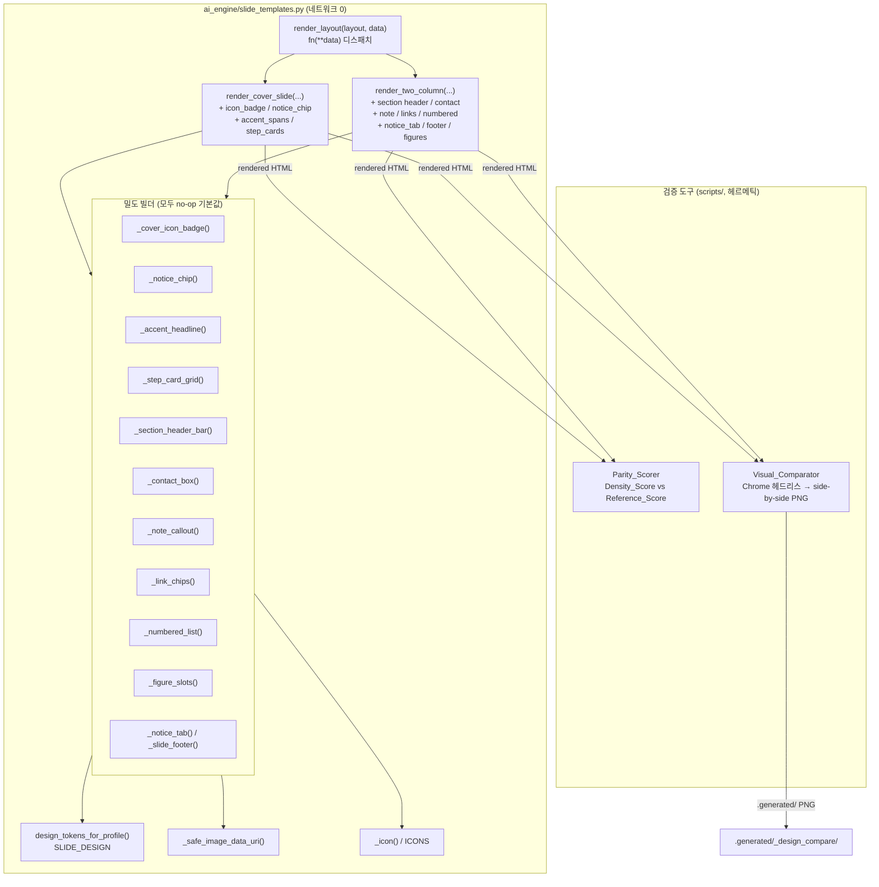

# Design Document

설계 문서: PPTX 디자인 밀도 패리티 (pptx-design-density-parity)

## Overview

이 기능은 `ai_engine/slide_templates.py`의 두 렌더 함수(`render_cover_slide`,
`render_two_column`)에 **가산적(additive)·바이트 보존(byte-preserving)** 방식으로 디자인 밀도
요소를 추가한다. 목표는 우리 슬라이드 출력이 Genspark 참조("신규 입사자 노트북 세팅 온보딩
매뉴얼", 표지 1 + 본문 3)와 **디자인 밀도에서 최소 동률 이상**이 되도록 하는 것이며, 이를
주관이 아니라 기계 판정 가능한 점수(`Parity_Scorer`)로 검증한다.

핵심 설계 원칙은 다음과 같다.

- **가산성/바이트 보존 (요구사항 4 전체):** 새 기능은 모두 무동작(no-op) 기본값을 가진 선택적
  키워드 인자로만 추가한다. 새 인자를 생략하면(또는 명시적으로 no-op 기본값을 넘기면) 출력은
  기존과 0바이트 차이로 동일하다. 이는 기존 회귀 테스트와 산출물이 깨지지 않게 보장한다.
- **밀도 마커 (Density_Marker, 요구사항 4.5):** 각 밀도 요소는 활성화될 때만 출력에 존재하는
  고유한 `class="..."` 마커를 갖는다. 이 마커는 `Parity_Scorer`의 기계 판정 기준이자
  `scripts/test_slide_templates_density.py`의 검증 대상이다.
- **스타일 토큰 일관성 (요구사항 7):** 모든 색·폰트는 `design_tokens_for_profile` /
  `SLIDE_DESIGN`에서만 가져오며, 디자인 토큰을 경유하지 않는 하드코딩 색을 두지 않는다.
- **보안/헤르메틱 (요구사항 6):** 렌더러는 네트워크 호출이 전혀 없고, 외부 URL을 참조하지
  않으며, 이미지는 `_safe_image_data_uri`로 로컬/`data:`만 인라인한다. SVG 기능 아이콘만
  사용하고 데코 이모지는 0건이다.

### 설계 결정 → 요구사항 매핑 요약

| 설계 결정 | 근거 요구사항 |
| --- | --- |
| 새 필드는 모두 optional kwarg + no-op 기본값 | 4.1, 4.2, 4.3, 4.6 |
| 요소별 고유 `class="..."` 밀도 마커 | 4.5, 5.2 |
| `render_layout`이 `fn(**data)`로 새 필드 그대로 전달 | 4.4, 4.7 |
| 색/폰트는 `design`/`SLIDE_DESIGN` 토큰에서만 취득 | 7.1, 7.2, 7.3 |
| 토큰별 폴백(`design_tokens_for_profile`) | 7.4 |
| 이미지 인라인은 `_safe_image_data_uri` 단일 경유 | 3.4, 3.5, 3.6, 6.2 |
| Cover/Body Parity_Checklist + 고정 Reference_Score | 5.1~5.8 |
| Chrome 헤드리스 side-by-side PNG | 5.7, 5.9, 6.1 |

## Architecture

전체 데이터 흐름은 기존 파이프라인(Python → HTML → Chrome 헤드리스 → 1920×1080 PNG)을 그대로
유지하며, 렌더 함수 내부에 밀도 요소 빌더(helper)를 추가하고, 검증 측에 `Parity_Scorer`와
`Visual_Comparator`를 신설한다.



### 구성요소 책임

1. **Cover_Renderer (`render_cover_slide`)** — 표지 밀도 요소(아이콘 배지, 공지 칩, 부분
   강조 제목, STEP 카드 그리드, 푸터)를 선택적으로 임베드한다. (요구사항 1)
2. **Two_Column_Renderer (`render_two_column`)** — 컬럼별 섹션 카드 밀도 요소(섹션 헤더 바,
   Contact_Box, Note_Callout, Link_Chip, Numbered_List_Item)와 슬라이드 단위 요소(Notice_Tab,
   Slide_Footer, Figure_Slot)를 선택적으로 임베드한다. (요구사항 2, 3)
3. **밀도 빌더 헬퍼** — 각 요소를 만드는 순수 함수. 입력이 없으면 빈 문자열("")을 반환해
   바이트 보존을 보장하고, 활성 시 고유 마커를 포함한 HTML 조각을 반환한다. (요구사항 4)
4. **Parity_Scorer** — 렌더 HTML을 입력받아 Parity_Checklist 마커 존재 수(Density_Score)를
   세고 고정 Reference_Score와 비교해 합격/불합격과 미충족 항목을 보고한다. (요구사항 5)
5. **Visual_Comparator** — 우리 출력과 참조 출력을 Chrome 헤드리스로 PNG 렌더해 나란히 합성한
   비교 PNG를 `.generated/`에 생성한다. (요구사항 5.7, 5.9)

### 스택/스티어링 제약 준수

- Python → HTML → Chrome 헤드리스 → PNG. React/TS 불사용 (project.md STRICT).
- 한글 CJK 폰트 스택은 `SLIDE_DESIGN['font_heading']/['font_body']` 그대로 사용 (요구사항 6.3).
- 게이트웨이는 LLM 호출 전용이며, 렌더러/검증 도구는 네트워크 0으로 동작 (gateway.md, 요구사항 6.1, 6.8).
- 데코 이모지 금지, SVG 기능 아이콘만 (`_icon`/`ICONS`) (요구사항 6.7, 2.9).

## Components and Interfaces

### 1. Cover_Renderer 추가 시그니처

기존 `render_cover_slide` 시그니처 끝에 다음 선택적 키워드 인자를 가산한다. 모든 기본값은
no-op이며, 생략 시 출력은 바이트 동일하다.

```python
def render_cover_slide(
    title: str,
    subtitle: str = "",
    accent_color: Optional[str] = None,
    eyebrow: str = "",
    footer: str = "",
    design: Optional[dict] = None,
    heroImage: str = "",
    # --- 신규 밀도 필드 (모두 no-op 기본값) ---
    icon_badge: Optional[Any] = None,      # dict {"icon": "<name>"} 또는 str "<name>"
    notice_chip: str = "",                 # eyebrow 칩 텍스트 (≤40자 + 말줄임)
    accent_spans: Optional[List[str]] = None,  # title 내 강조할 부분 문자열들
    step_cards: Optional[List[Dict[str, str]]] = None,  # [{label, description}] 1~6
) -> str:
```

요소별 동작과 마커:

- **`icon_badge`** (요구사항 1.1, 1.10) — dict `{"icon": "name"}` 또는 문자열 `"name"`을 받아
  `_icon(name)`으로 SVG를 해석한다. 틴트 원 안에 SVG를 넣은 원형 배지를 제목 위에 렌더한다.
  마커: `class="cover-icon-badge"`. **IF-THEN(1.10):** `icon_badge`는 제공됐으나 `_icon`이
  해석할 수 있는 SVG가 없으면(아래 _icon 폴백 처리 참고) 배지 마크업을 생성하지 않는다.
- **`notice_chip`** (요구사항 1.2) — eyebrow 위치에 알약(pill) 칩을 렌더한다. 40자 초과 시
  40자까지만 표시하고 `…` 말줄임을 덧붙인다. 마커: `class="notice-chip"`.
- **`accent_spans`** (요구사항 1.3, 1.8) — `title`의 부분 문자열 목록. 각 부분 문자열이 제목에
  존재하면 그 구간만 `<span class="accent-span">`으로 감싸 강조색(`accent`)으로 표시한다.
  **IF-THEN(1.8):** 강조 대상이 제목 본문에 존재하지 않으면 그 span은 강조 마크업 없이 평문으로
  렌더한다(즉 미존재 span은 무시). 모든 span이 미존재면 제목 전체가 평문이고 `accent-span`
  마커는 없다. 마커: `class="accent-span"`.
- **`step_cards`** (요구사항 1.4, 1.7) — `[{"label","description"}]` 목록. 1~6개를 2×2-ish
  격자로 표지 안에 임베드한다. 6개 초과분은 잘라낸다(clamp). **IF-THEN(1.7):** 목록이 없거나
  0개면 격자 마크업을 생성하지 않는다. 마커: `class="step-card-grid"`(컨테이너), `class="step-card"`(항목).
- **`footer`** (요구사항 1.5, 기존 필드 강화) — 기존 footer를 80자 초과 시 80자까지만 표시 +
  `…` 말줄임으로 처리하고 라벨로 렌더한다. 마커: 기존 `class="footer"` 유지.
- **좌측 강조 바 + 코너 글로우** (요구사항 1.6, 1.9) — 기존 `.accent-bar`/`.corner-glow`가 항상
  렌더된다. 1.9의 "정확히 1개" 보장을 위해 `accent-bar`는 표지당 1회만 출력한다.

### 2. Two_Column_Renderer 추가 시그니처

기존 `render_two_column` 시그니처 끝에 좌/우 대칭 컬럼 필드와 슬라이드 단위 필드를 가산한다.

```python
def render_two_column(
    title: str,
    left_content: str,
    right_content: str,
    subtitle: str = "",
    design: Optional[dict] = None,
    image: str = "",
    left_badge: str = "",
    right_badge: str = "",
    left_metric: str = "",
    right_metric: str = "",
    # --- 신규 밀도 필드 (좌/우 대칭, 모두 no-op 기본값) ---
    left_section_no: str = "", left_section_title: str = "",
    right_section_no: str = "", right_section_title: str = "",
    left_contact: Optional[Dict[str, Any]] = None,
    right_contact: Optional[Dict[str, Any]] = None,
    left_note: str = "", right_note: str = "",
    left_links: Optional[List[Dict[str, str]]] = None,
    right_links: Optional[List[Dict[str, str]]] = None,
    left_numbered: Optional[List[str]] = None,
    right_numbered: Optional[List[str]] = None,
    left_figures: Optional[List[Dict[str, str]]] = None,
    right_figures: Optional[List[Dict[str, str]]] = None,
    # --- 슬라이드 단위 필드 ---
    notice_tab: str = "",
    footer_title: str = "", footer_page: str = "",
) -> str:
```

요소별 동작과 마커(좌/우는 동일 규칙, `left_*`/`right_*` 대칭):

- **`*_section_no` + `*_section_title`** (요구사항 2.1) — 둘 다 제공되면 컬럼 상단에 번호 배지 +
  섹션 제목의 다크 헤더 바를 렌더한다. 제목은 공백 제외 1~40자(초과 시 잘림 + `…`).
  마커: `class="section-header-bar"`.
- **`*_contact`** (요구사항 2.2) — `{"items": [{"label","value"}]}`. 틴트 배경 + 좌측 강조
  보더의 Contact_Box. 라벨 ≤30자, 항목 최대 5개(초과분 잘림). 마커: `class="contact-box"`.
- **`*_note`** (요구사항 2.3) — 1~300자 멀티라인 문자열. 노랑 계열 틴트 배경 + 좌측 강조 보더의
  Note_Callout. 300자 초과 시 잘림 + `…`. 마커: `class="note-callout"`.
- **`*_links`** (요구사항 2.4, 2.9) — `[{"label"}]` 1~6개(초과분 잘림). 각 칩은 SVG 링크/첨부
  아이콘 + 라벨(≤30자) + 진행 화살표 글리프(`_icon("arrow_right")`)로 구성. 데코 이모지 미사용.
  마커: `class="link-chip"`.
- **`*_numbered`** (요구사항 2.5) — 문자열 리스트 1~8개(초과분 잘림). 각 항목은 원형 번호 배지
  (1..n 순차) + 본문. 마커: `class="numbered-item"`.
- **`notice_tab`** (요구사항 2.6) — ≤20자(초과 시 잘림 + `…`). 슬라이드 우상단 코너 탭.
  마커: `class="notice-tab"`.
- **`footer_title` / `footer_page`** (요구사항 2.7) — 하단 러닝 타이틀(≤40자) + 페이지 번호.
  `footer_page`는 "현재/전체"(예: `1/3`) 형식 문자열을 그대로 표시. 마커: `class="slide-footer"`.
- **`*_figures`** (요구사항 3 전체) — `[{"image","caption"}]` 1~10개(초과분 잘림). 이미지는
  `_safe_image_data_uri`로 인라인. 외부 참조(`http(s)://`, `//`, `file://`)는 거부되어
  이미지를 생략하고 나머지(캡션 등)는 정상 렌더. 카드는 서로 0px 겹침(겹침 없음), 캡션은 해당
  이미지에 인접. 마커: `class="figure-slot"`.

#### 밀도 마커 표 (Density_Marker)

| 요소 | 위치 | 마커 | 활성 조건 | 요구사항 |
| --- | --- | --- | --- | --- |
| Icon_Badge | Cover | `class="cover-icon-badge"` | `icon_badge` 제공 & SVG 해석됨 | 1.1, 1.10 |
| Notice_Chip | Cover | `class="notice-chip"` | `notice_chip` 비어있지 않음 | 1.2 |
| Accent_Headline | Cover | `class="accent-span"` | `accent_spans` 중 ≥1개가 title에 존재 | 1.3, 1.8 |
| Step_Card_Grid | Cover | `class="step-card-grid"`, `class="step-card"` | `step_cards` 1개 이상 | 1.4, 1.7 |
| Section_Header | Body | `class="section-header-bar"` | `*_section_no` + `*_section_title` | 2.1 |
| Contact_Box | Body | `class="contact-box"` | `*_contact.items` 비어있지 않음 | 2.2 |
| Note_Callout | Body | `class="note-callout"` | `*_note` 비어있지 않음 | 2.3 |
| Link_Chip | Body | `class="link-chip"` | `*_links` 1개 이상 | 2.4, 2.9 |
| Numbered_List_Item | Body | `class="numbered-item"` | `*_numbered` 1개 이상 | 2.5 |
| Notice_Tab | Body | `class="notice-tab"` | `notice_tab` 비어있지 않음 | 2.6 |
| Slide_Footer | Body | `class="slide-footer"` | `footer_title` 또는 `footer_page` | 2.7 |
| Figure_Slot | Body | `class="figure-slot"` | `*_figures` 1개 이상 | 3.1 |

모든 마커는 요소가 비활성일 때 출력에 존재하지 않으며, 활성 시 동일 출력 내 고유하다(요구사항
4.5, 5.2). 빌더 헬퍼는 입력이 no-op일 때 `""`를 반환해 `extra_css`/body에 어떤 바이트도
추가하지 않는다(요구사항 4.1, 4.2).

### 3. 밀도 빌더 헬퍼 인터페이스

각 헬퍼는 순수 함수로, `(입력, 디자인 토큰 d)`를 받아 HTML 조각 문자열을 반환한다. no-op 입력 시
빈 문자열을 반환한다. 대표 시그니처:

```python
def _cover_icon_badge(icon_badge, d) -> str: ...        # "" or '<div class="cover-icon-badge">…</div>'
def _notice_chip(text, d) -> str: ...                   # 40자 클램프 + …
def _accent_headline(title, accent_spans, d) -> str: ... # title을 escape 후 부분 강조 span 삽입
def _step_card_grid(step_cards, d) -> str: ...          # 1~6 clamp, 2x2-ish grid
def _section_header_bar(no, title, d) -> str: ...       # 40자 클램프
def _contact_box(contact, d) -> str: ...                # items≤5, label≤30
def _note_callout(text, d) -> str: ...                  # 300자 클램프
def _link_chips(links, d) -> str: ...                   # 1~6 clamp, label≤30, SVG only
def _numbered_list(items, d) -> str: ...                # 1~8 clamp, 1..n 순차
def _figure_slots(figures, d) -> str: ...               # 1~10 clamp, _safe_image_data_uri
def _notice_tab(text, d) -> str: ...                    # 20자 클램프
def _slide_footer(footer_title, footer_page, d) -> str: ...  # title≤40
```

**CSS 가산 규칙(바이트 보존):** 각 밀도 CSS 블록은 해당 요소가 1개 이상 활성일 때만
`extra_css`에 결합된다(기존 `col_density_css`/`img_css` 패턴과 동일). 어떤 밀도 요소도 활성이
아니면 `<head>`는 기존과 바이트 동일하다.

### 4. Parity_Scorer 인터페이스

`scripts/parity_scorer.py`(또는 인테스트 헬퍼). 입력 HTML 문자열에서 고정 체크리스트 마커의
존재 여부를 세어 Density_Score를 계산하고 고정 Reference_Score와 비교한다.

```python
COVER_CHECKLIST = [
    ("icon_badge",   'class="cover-icon-badge"'),
    ("notice_chip",  'class="notice-chip"'),
    ("accent_head",  'class="accent-span"'),
    ("step_grid",    'class="step-card-grid"'),
    ("accent_bar",   'class="accent-bar"'),
    ("corner_glow",  'class="corner-glow"'),
    ("footer",       'class="footer"'),
]   # 총 7항목
BODY_CHECKLIST = [
    ("section_header", 'class="section-header-bar"'),
    ("contact_box",    'class="contact-box"'),
    ("note_callout",   'class="note-callout"'),
    ("link_chip",      'class="link-chip"'),
    ("numbered_item",  'class="numbered-item"'),
    ("notice_tab",     'class="notice-tab"'),
    ("slide_footer",   'class="slide-footer"'),
    ("figure_slot",    'class="figure-slot"'),
]   # 총 8항목

COVER_REFERENCE_SCORE = 6   # Genspark 표지 충족 항목 수 (고정)
BODY_REFERENCE_SCORE  = 6   # Genspark 본문 충족 항목 수 (고정)

def score(html: str, category: str) -> dict:
    """category in {"cover","body"}. 반환:
      {density_score:int, reference_score:int, total:int,
       passed:bool, items:[{name, present:bool}], missing:[name,...]}.
    입력 누락/빈 문자열 → ValueError (요구사항 5.9 인접 정책)."""
```

- Density_Score는 `0 ≤ score ≤ 총항목수` 정수(요구사항 5.2).
- Reference_Score는 카테고리별 고정 기준값, `0 ≤ ref ≤ 총항목수`(요구사항 5.3).
- `passed = density_score >= reference_score`(요구사항 5.4, 5.5).
- `items`는 각 항목 충족 여부, `missing`은 미충족 목록(요구사항 5.6, 5.8).
- HTML 입력이 비었거나 None이면 오류(요구사항 5.9 패턴, 누락 입력 → error).

### 5. Visual_Comparator 인터페이스

`scripts/demo_design_ceiling_vs_genspark.py`의 `_html_to_png` 패턴(Chrome `--headless=new`,
`--window-size=1920,1080`, `--screenshot`)을 재사용한다.

```python
def compare(ours_html: str, reference_png: str, out_png: str) -> str:
    """우리 HTML을 PNG로 렌더 후, 참조 PNG와 가로로 나란히 합성해 out_png(.generated/)에 저장.
    ours_html 또는 reference_png가 누락되면 PNG를 생성하지 않고 오류 반환 (요구사항 5.9)."""
```

- 출력 위치는 `Generated_Folder`(`.generated/`, 예: `.generated/_design_compare/`) (요구사항 5.7).
- 우리 출력 또는 참조 입력 누락 시 PNG 미생성 + 오류(요구사항 5.9).
- side-by-side 합성은 Pillow(이미 의존성에 존재)로 두 PNG를 가로 결합.

## Data Models

밀도 필드의 입력 스키마(모두 JSON 직렬화 가능한 primitive로 구성, `render_layout`의 `fn(**data)`
호출과 호환).

### Cover 입력 스키마

```text
icon_badge   : str | {"icon": str}                 # 예: "shield" 또는 {"icon":"shield"}
notice_chip  : str                                  # ≤40자(초과 클램프+…)
accent_spans : list[str]                            # title의 부분 문자열들
step_cards   : list[{"label": str, "description": str}]   # 1~6 (초과 클램프)
footer       : str                                  # ≤80자(초과 클램프+…)
```

### Body(Two_Column) 입력 스키마

```text
left_section_no / left_section_title (+right) : str / str(공백제외 1~40자)
left_contact / right_contact : {"items": list[{"label": str(≤30), "value": str}]}  # 항목 ≤5
left_note / right_note       : str                                  # 1~300자(초과 클램프+…)
left_links / right_links     : list[{"label": str(≤30)}]            # 1~6 (초과 클램프)
left_numbered / right_numbered : list[str]                          # 1~8 (초과 클램프), 1..n
left_figures / right_figures : list[{"image": str, "caption": str}] # 1~10 (초과 클램프)
notice_tab   : str                                                  # ≤20자(초과 클램프+…)
footer_title : str                                                  # ≤40자(초과 클램프+…)
footer_page  : str                                                  # "현재/전체" 예: "1/3"
```

### Parity_Scorer 보고 모델

```text
ScoreResult = {
  category: "cover" | "body",
  density_score: int,        # 0..total
  reference_score: int,      # 0..total (고정)
  total: int,
  passed: bool,              # density_score >= reference_score
  items: list[{name: str, present: bool}],
  missing: list[str],
}
```

### 이미지 참조 해석 규칙 (요구사항 3.4~3.6)

`_safe_image_data_uri(src)`(기존 함수 재사용)의 반환을 그대로 따른다.
- 로컬 파일 경로 또는 `data:image/...` → 인라인 data URI(임베드).
- `http://`, `https://`, `//`, `file://` → `""` 반환 → 이미지 생략, 나머지 슬롯/슬라이드는 정상.
- 빈 값/읽기 불가 → `""` 반환 → 이미지 생략.

## Correctness Properties

*속성(property)이란 시스템의 모든 유효한 실행에서 참이어야 하는 특성 또는 동작으로, 시스템이
무엇을 해야 하는지에 대한 형식적 진술이다. 속성은 사람이 읽는 명세와 기계가 검증 가능한 정확성
보증 사이의 다리 역할을 한다.*

prework 분류 결과, 본 기능의 렌더 함수는 순수 함수(HTML 문자열 반환)이고 바이트 보존·클램프·
순차성·라운드트립 등 보편 속성이 명확하므로 property-based testing이 적합하다. 픽셀 측정이
필요한 인수 조건(2.11, 3.2, 3.3, 3.7, 3.8, 6.4, 6.6)과 외부 렌더(5.7, 6.8, 6.9)는 속성이 아닌
통합/스모크 테스트로 다룬다(Testing Strategy 참고).

### Property 1: 바이트 보존 (밀도 필드 미제공 = 명시 no-op 호출)

*For any* 유효한 표지/본문 콘텐츠에 대해, 새 밀도 필드를 전혀 넘기지 않은 `render_*` 호출은 모든
밀도 필드를 문서화된 no-op 기본값으로 명시한 호출과 0바이트 차이로 동일한 출력을 생성하며, 그
출력에는 어떤 Density_Marker도 존재하지 않는다.

**Validates: Requirements 4.1, 4.2**

### Property 2: 렌더 결정성 (반복 호출 동일 바이트)

*For any* 동일한 입력 인자에 대해, 같은 `render_*` 함수를 여러 번 호출하면 매번 동일한 바이트
시퀀스 출력을 생성한다.

**Validates: Requirements 4.6**

### Property 3: 밀도 요소 독립 활성과 고유 마커

*For any* 밀도 필드의 임의 on/off 부분집합에 대해, 활성화한 요소의 Density_Marker만 출력에
존재하고(동일 출력 내 고유) 비활성 요소의 마커는 존재하지 않는다.

**Validates: Requirements 2.8, 4.5**

### Property 4: 항목 수 클램프 (상한 보장)

*For any* 밀도 리스트 입력(step_cards, contact items, links, numbered, figures)에 대해, 렌더되는
항목 수는 그 요소에 정의된 최대값(step_cards 6, contact 5, links 6, numbered 8, figures 10)을
초과하지 않으며, 입력이 최대값을 초과해도 렌더는 중단되지 않고 잘림 표식을 포함한다.

**Validates: Requirements 1.4, 2.2, 2.4, 2.5, 2.10, 3.1, 3.9**

### Property 5: 텍스트 길이 클램프 + 말줄임

*For any* 길이 제한이 있는 텍스트 입력(notice_chip ≤40, footer ≤80, section_title ≤40, note ≤300,
notice_tab ≤20, footer_title ≤40, contact label ≤30, link label ≤30)에 대해, 표시 텍스트 길이는
정의된 최대값을 초과하지 않으며 초과 입력에는 말줄임 표식(`…`)이 붙는다.

**Validates: Requirements 1.2, 1.5, 2.1, 2.3, 2.6, 2.7**

### Property 6: Numbered_List_Item 순차 번호

*For any* 1~8개의 numbered 리스트 입력에 대해, 렌더된 번호 배지는 1부터 시작해 1씩 증가하는
순차 번호(1..n)로 표시된다.

**Validates: Requirements 2.5**

### Property 7: 부분 강조 헤드라인의 존재 조건

*For any* title과 accent_spans 입력에 대해, title에 실제로 존재하는 부분 문자열만 `accent-span`
강조 마크업으로 감싸지고, title에 존재하지 않는 부분 문자열은 강조 마크업을 생성하지 않으며 해당
구간은 평문으로 렌더된다.

**Validates: Requirements 1.3, 1.8**

### Property 8: 단일 인스턴스 요소 개수 불변

*For any* Icon_Badge·eyebrow 칩·좌측 강조 바를 모두 활성화한 표지 입력에 대해, `cover-icon-badge`
마커는 정확히 1개, `notice-chip` 마커는 정확히 1개, `accent-bar` 마커는 정확히 1개 출력된다.

**Validates: Requirements 1.6, 1.9**

### Property 9: 이미지 참조 인라인 라운드트립과 외부 거부

*For any* Figure_Slot 이미지 참조에 대해, 로컬 파일 경로 또는 `data:image/` URI는 인라인 data
URI로 임베드되고, `http://`·`https://`·`//`·`file://`로 시작하는 외부 참조는 임베드되지 않으며,
어느 경우든 나머지 슬롯·캡션·슬라이드는 정상적으로 렌더된다.

**Validates: Requirements 3.4, 3.5**

### Property 10: 풀블리드 배경 이미지 개수 상한

*For any* 밀도 요소를 포함한 슬라이드 입력에 대해, 풀블리드(전면) 배경 이미지 마커 수는 0 이상
1 이하다.

**Validates: Requirements 6.5**

### Property 11: 외부 URL 미참조 자기완결 HTML

*For any* 렌더 입력에 대해, 출력 HTML은 `http://` 또는 `https://` URL을 참조하지 않는다(인라인
`data:` 이미지는 외부 URL이 아니므로 허용).

**Validates: Requirements 6.2**

### Property 12: 데코 이모지 없음 (SVG 아이콘만)

*For any* 렌더 입력(특히 Link_Chip 라벨 포함)에 대해, 출력에는 유니코드 데코 이모지가 0건이며
아이콘은 인라인 `<svg>`로만 표현된다.

**Validates: Requirements 2.9, 6.7**

### Property 13: CJK 인지 폰트 스택 적용

*For any* 렌더 입력에 대해, 출력 HTML은 적용된 디자인 토큰의 CJK 인지 제목/본문 폰트 스택
(`font_heading`/`font_body`)을 포함한다.

**Validates: Requirements 6.3**

### Property 14: Layout_Dispatcher의 밀도 필드 무중단 전달

*For any* 새 밀도 필드를 포함한 `data` dict에 대해, `render_layout`은 TypeError 없이 해당 필드를
대상 `render_*` 함수로 전달하여 0바이트를 초과하는 출력을 생성한다.

**Validates: Requirements 4.4, 6.1**

### Property 15: 밀도 요소 색·폰트의 디자인 토큰 일치

*For any* 유효한 per-call 디자인 토큰(유효 `#RRGGBB` 색과 폰트)에 대해, 활성화된 밀도 요소의
색과 폰트는 전달된 토큰의 대응값과 일치하며, 토큰을 경유하지 않은 SLIDE_DESIGN 기본 색이 밀도
마크업에 남지 않는다.

**Validates: Requirements 7.1, 7.3**

### Property 16: per-call 토큰 폴백 (토큰별 부분 폴백)

*For any* 디자인 토큰 프로필에 대해, 토큰이 None/빈 dict이면 밀도 요소는 SLIDE_DESIGN 기본값을
사용하고, 일부 토큰만 무효(`#RRGGBB` 미해석 또는 폰트 길이 위반)이면 그 토큰만 SLIDE_DESIGN
기본값으로 대체되고 나머지 유효 토큰은 전달값을 유지한다.

**Validates: Requirements 7.2, 7.4**

### Property 17: Parity_Scorer 점수 범위와 합격 판정

*For any* 렌더 HTML과 카테고리(cover/body)에 대해, Density_Score는 0 이상 해당 카테고리 항목
총수 이하의 정수이고, `passed`는 `density_score >= reference_score`와 정확히 일치하며, 보고된
`items`의 길이는 카테고리 총항목수와 같고 `missing`은 충족되지 않은 항목 집합과 일치한다.

**Validates: Requirements 5.2, 5.4, 5.5, 5.6, 5.8**

## Error Handling

| 상황 | 처리 | 근거 요구사항 |
| --- | --- | --- |
| 텍스트가 최대 길이 초과 | 최대 길이까지 잘라내고 `…` 말줄임 부착, 렌더 계속 | 1.2, 1.5, 2.1, 2.3, 2.6, 2.7, 2.10 |
| 리스트 항목 수가 최대값 초과 | 최대값까지만 렌더(clamp), 초과분 무시, 렌더 계속 | 1.4, 2.2, 2.4, 2.5, 3.1, 3.9, 2.10 |
| `step_cards`/`*_links`/`*_numbered`/`*_figures`가 None 또는 빈 리스트 | 해당 마크업 미생성(no-op), 바이트 보존 | 1.7, 4.1, 4.2 |
| `icon_badge` 제공됐으나 SVG 미해석 | 배지 마크업 미생성, 표지 나머지 정상 렌더 | 1.10 |
| `accent_spans`가 title에 미존재 | 해당 span 강조 미적용(평문), accent-span 마커 부재 | 1.8 |
| Figure 이미지가 외부 참조(`http(s)://`/`//`/`file://`) | `_safe_image_data_uri`가 `""` 반환 → 이미지 생략, 캡션·슬롯 정상 | 3.5 |
| Figure 이미지가 빈 값/읽기 불가 | 이미지 생략, 나머지 슬롯·슬라이드 정상 | 3.6 |
| 컬럼 밀도 총 높이가 가용 높이 초과 | `overflow:hidden` + 내부 스크롤 미사용 레이아웃으로 슬라이드 경계 이탈 방지 | 2.11, 6.6 |
| 무효 디자인 토큰(`#RRGGBB` 미해석 / 폰트 길이 위반) | 해당 토큰만 SLIDE_DESIGN 기본값으로 대체, 렌더 중단 없음 | 7.4 |
| `render_layout`에 미지원 키 포함 `data` | 기존 디스패처가 TypeError를 잡아 `""` 반환(폴백), 예외 비전파 | 4.7 |
| Parity_Scorer 입력 HTML이 None/빈 문자열 | `ValueError` 발생(점수 미산출) | 5.9 인접 정책 |
| Visual_Comparator 우리/참조 입력 누락 | PNG 미생성 + 오류 반환 | 5.9 |

모든 빌더 헬퍼는 예외를 던지지 않고 no-op 입력에 `""`를 반환하도록 설계하여, 부분 입력이나 잘못된
입력이 전체 렌더를 중단시키지 않게 한다(요구사항 2.10, 3.5, 3.6, 7.4).

## Testing Strategy

기존 코드베이스의 강한 회귀 문화를 따른다. 모든 테스트는 헤르메틱(순수 Python, 네트워크 0,
Electron/게이트웨이 없음)을 기본으로 하고, 픽셀 측정이 필요한 항목만 Chrome 헤드리스를 사용한다.

### 1. Property-Based Tests (PBT)

- 라이브러리: 기존에 사용 중인 **Hypothesis**(`scripts/test_slide_templates_density.py`와 동일).
  PBT를 처음부터 구현하지 않는다.
- 각 속성 테스트는 **최소 100회 반복**으로 설정한다(`@settings(max_examples>=100)`).
- 각 테스트에 설계 속성을 참조하는 주석 태그를 단다.
  - 태그 형식: `# Feature: pptx-design-density-parity, Property {번호}: {속성 텍스트}`
- 각 Correctness Property는 **단일 property-based test**로 구현한다.
- 신규 테스트 파일은 기존 `scripts/test_slide_templates_density.py`의 컨벤션
  (`DENSITY_MARKERS` 상수, `_assert_valid_html`, `_density_markers_in`, base==explicit-no-op
  비교, Hypothesis 생성기)을 그대로 미러링한다. 예: `scripts/test_slide_density_parity_pbt.py`.
- 핵심 바이트 보존 PBT(Property 1)는 기존 파일의
  `test_preserve_two_column_default_byte_identical` 패턴을 cover/two_column 신규 필드로 확장한다.

### 2. 예제 기반 단위 테스트 (Unit/Example)

property로 흡수되지 않는 구체 사례와 시그니처 검사:
- 밀도 필드가 모두 optional + no-op 기본값인지 시그니처 검사(요구사항 4.3).
- Parity_Checklist 항목 집합과 Reference_Score 상수 범위 검사(요구사항 5.1, 5.3).
- IF-THEN 엣지 케이스: `step_cards=[]`/None(1.7), 미해석 icon_badge(1.10), 미존재 accent_spans
  (1.8), 빈/잘못된 Figure 경로(3.6), 미지원 키 `render_layout`(4.7), Visual_Comparator 입력
  누락(5.9).

### 3. 통합 테스트 (Chrome 헤드리스, 픽셀 측정)

`scripts/demo_design_ceiling_vs_genspark.py`의 `_html_to_png`(Chrome `--headless=new`,
`--window-size=1920,1080`, `--screenshot`) 패턴을 재사용. 1~3개 대표 예제만 사용.
- 슬라이드 경계(0,0)~(1920,1080) 내 100% 포함(요구사항 2.11, 3.2, 6.6).
- 텍스트-이미지 겹침 면적 <10%, Figure 카드 간 0px 겹침(요구사항 3.3, 3.7, 3.8, 6.4) — 기존
  `scripts/audit_pptx_textbox_overlap.py` / `audit_pptx_overlap.py` 면적 측정 패턴 활용.
- CJK 두부 글리프 0건 시각 확인(요구사항 6.3).
- `Visual_Comparator`가 `.generated/`에 side-by-side PNG 생성(요구사항 5.7).

### 4. 헤르메틱·네트워크 차단 테스트

- 소켓 차단 컨텍스트에서 모든 `render_*`/`render_layout` 실행 시 네트워크 미시도 + 출력 len>0
  (요구사항 6.1, 6.8).

### 5. 회귀 스위트 (선행 스펙 100% 통과 — 요구사항 6.9)

본 변경 적용 후 다음을 전수 실행해 회귀 0을 확인한다.
- `scripts/test_slide_templates_density.py` (밀도 가산 바이트 보존).
- `scripts/test_pptx_quality_vertex_images_*` (preservation/fix/bug_condition/integration).
- `scripts/test_pptx_overlay_collision_*` (preservation_pbt + bug_condition).
- `scripts/test_pptx_image_slot_placement_bug_condition.py`.
- `scripts/test_html_pipeline.py` 및 기타 `test_html_*`.

### 6. Parity_Scorer 합격 게이트

cover/body 각각 렌더 → `Parity_Scorer.score()` → `passed == True`(Density_Score ≥
Reference_Score)를 CI/검증 단계의 합격 기준으로 사용한다(요구사항 5.4, 5.5). 불합격 시 미충족
항목을 보고한다(요구사항 5.8).
