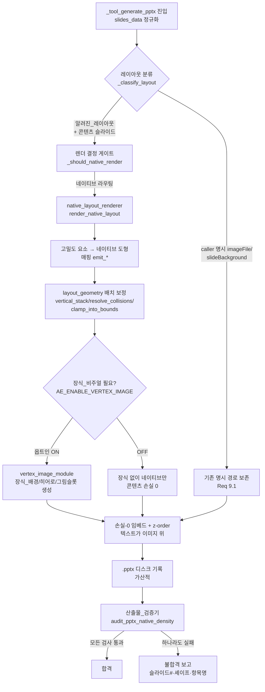

# Design Document — pptx-native-density-render

## Overview

이 설계는 PPTX 생성에서 **(a) 젠스파크급 고밀도 디자인 · (b) PowerPoint 편집가능 · (c) 도형/텍스트 겹침 0** 을 동시에 달성하기 위한 신규 경로를 정의한다. 핵심은 그동안 부재했던 조각, 즉 **`slide_templates`의 알려진 고밀도 레이아웃을 1920×1080 PNG로 굽지 않고 편집가능 네이티브 PPTX 도형(텍스트박스/표/오토셰이프)으로 직접 렌더하는 네이티브_렌더러**다.

### 근본 원인 요약 (코드 추적으로 입증)

`ai_engine/server.py`의 `_tool_generate_pptx`(디스크 기준 정의 `async def _tool_generate_pptx` ≈ 4415) 흐름을 추적한 결과:

1. **본문 HTML이 통짜 이미지로 베이크됨.** `_html_enabled`(≈4621에서 `True` 설정)이 참이면 본문 슬라이드를 `slide_templates.render_layout()`(≈2816) HTML로 만들고, 이를 `_render_html_slide_to_png`(≈1727)로 1920×1080 PNG로 구운 뒤 `sd["slideBackground"] = _sec_rel`(≈5157)로 풀블리드 배경에 깐다(`_rr_html_bg_set = True`, ≈5158). 콘텐츠가 픽셀에 묻혀 **편집 불가 통짜 이미지**가 된다.
2. **HTML→네이티브 변환기 부재.** `slide_templates.py`의 고밀도 요소 `_section_header_bar`(≈560)·`_contact_box`(≈586)·`_note_callout`(≈624)·`_numbered_list`(≈685)·`_figure_slots`(≈764)와 `render_layout`/`LAYOUT_REGISTRY`(≈2801)는 전부 PNG로 래스터화되어 끝난다. 이 HTML 구조를 편집가능 도형으로 옮기는 경로가 없다.
3. **화려함과 편집가능이 배타적.** 네이티브 경로(`native_diagram_pptx.build_native_cover` ≈1388 / `build_native_diagram` ≈291, server.py 네이티브 본문 `add_textbox`)는 `not _html_enabled`일 때만 동작한다(예: `AE_PREFER_EDITABLE_DIAGRAM` 게이트 ≈4854·4902, TOC ≈5066).
4. **직전 패치가 통짜 이미지를 확정.** `_suppress_native_body = bool(_rr_html_bg_set)`(≈5192)가 베이크 배경 채택 시 네이티브 본문 placeholder를 비우고(≈5196–5208) 네이티브 본문 방출을 차단해 통짜 이미지를 확정했다. 표지·특정 슬라이드는 억제 미적용으로 겹침 잔존.

### 해결 방향

`LAYOUT_REGISTRY`의 **알려진_레이아웃**(cover / section_divider / two_column / feature_grid / timeline / comparison / architecture)에 한해, HTML을 PNG로 굽는 대신 신규 모듈 **`ai_engine/native_layout_renderer.py`** 가 입력 `data`(dict)를 받아 python-pptx 네이티브 도형으로 직접 렌더한다. `_tool_generate_pptx`에 **렌더 결정 게이트**를 두어 본문 콘텐츠 슬라이드를 "콘텐츠 베이크" 대신 "네이티브_렌더러"로 라우팅하고, `_suppress_native_body`의 통짜 이미지 확정 로직을 정리한다. 배치 단계는 `layout_geometry`의 순수 기하 함수로 겹침<10%·경계 안·제목 1회를 구조적으로 보장한다. 풀블리드 배경은 **콘텐츠 텍스트 없는 장식_비주얼만** 허용하며, 옵트인 시 `vertex_image_module`로 초고퀄 장식을 생성한다. 합격 기준은 hermetic 단위 테스트가 아니라 **신규 산출물_검증기**(`scripts/audit_pptx_native_density.py`)가 실제 .pptx를 audit하는 통합 검증으로 정의한다.

### 스티어링 정합

- **project.md**: LLM/operation JSON 생성은 Bedrock_게이트웨이 경유만. 프론트엔드 변경은 Electron + Vanilla JS(이 기능은 백엔드 중심이라 프론트 변경 최소).
- **gateway.md**: 이미지 생성만 `vertex_image_module` 단일 모듈 예외(`AE_ENABLE_VERTEX_IMAGE=1` 옵트인). 추론/JSON은 게이트웨이 유지.
- **security.md**: 자격증명 비저장, 디스크 상태 기준 처리, 가산적 변경.

## Architecture

### 생성 흐름 (operation → 역할 분류 → 렌더 → 배치 보정 → 검증)



### 역할 분리 (콘텐츠 vs 장식)

| 역할 | 정의 | 렌더 주체 | 편집가능 |
|------|------|-----------|----------|
| 콘텐츠 텍스트 | 제목·본문·불릿·카드·번호목록·연락처·노트·다이어그램·표 텍스트 | `native_layout_renderer` (네이티브 도형) | O (필수) |
| 장식_비주얼 | 장식_배경·히어로_일러스트·그림슬롯·아이콘/엠블럼 | `vertex_image_module` (옵트인) 또는 비움 | X (래스터) |

핵심 불변식: **콘텐츠 텍스트는 절대 이미지에 베이크되지 않는다.** Vertex 이미지는 장식_비주얼 슬롯에만 임베드되며, 콘텐츠 텍스트 셰이프는 항상 그 이미지보다 앞선 z-order에 네이티브로 배치된다.

**Vertex 장식_비주얼 기본 권장 (초고퀄 목표 시).** 초고퀄("젠스파크급 비주얼") 목표 달성을 위해 Vertex 장식_비주얼(장식_배경/히어로_일러스트/그림슬롯 채움)을 **기본 활성 권장**한다(`AE_ENABLE_VERTEX_IMAGE=1`). 이는 콘텐츠 텍스트가 아닌 장식_비주얼 차원의 시각 완성도를 끌어올리는 보조 수단이며, 네이티브 콘텐츠와 분리된 z-order 하위 슬롯에만 채워진다. 단, 옵트인이 OFF(`AE_ENABLE_VERTEX_IMAGE != 1` 또는 자격증명 부재)여도 **편집가능 네이티브 콘텐츠는 손실 0으로 정상 생성(폴백)**된다 — 장식 슬롯만 비워지고 콘텐츠 텍스트 런은 전수 보존된다(Req 11.3과 정합, Property 17). 즉 Vertex 활성은 "더 아름답게"를 위한 권장 기본값일 뿐, 합격(편집가능·겹침0·경계안·밀도/스타일 품질)의 필요조건이 아니다.

### 모듈 구성

| 모듈 | 신규/기존 | 역할 |
|------|-----------|------|
| `ai_engine/native_layout_renderer.py` | **신규** | 알려진_레이아웃 data → 네이티브 도형 렌더 + 고밀도 요소 매핑 |
| `ai_engine/server.py` `_tool_generate_pptx` | 수정 | 렌더 결정 게이트, `_suppress_native_body` 정리 |
| `ai_engine/slide_templates.py` | 재사용 | `design_tokens_for_profile`(≈155), `LAYOUT_REGISTRY`(≈2801), data 스키마 출처 |
| `ai_engine/native_diagram_pptx.py` | 재사용 | `build_native_cover`(≈1388)/`build_native_diagram`(≈291) 및 `_card`/`_badge_in_gutter`/`_parse_*` 헬퍼 |
| `ai_engine/layout_geometry.py` | 재사용 | `vertical_stack`/`resolve_collisions`/`within_bounds`/`clamp_into_bounds`/`is_fullbleed`/`fit_within` |
| `ai_engine/vertex_image_module.py` | 재사용 | 장식_비주얼 이미지 생성 단일 모듈 |
| `scripts/audit_pptx_native_density.py` | **신규** | 산출물_검증기 — 기존 audit_* + parity_scorer 통합 합격 게이트 + 스타일 품질(`audit_style_quality`) |
| `scripts/parity_scorer.py` | 재사용/소폭확장 | `score(html, category)`(≈56) + 네이티브 셰이프 어댑터 |
| `scripts/visual_comparator.py` | 재사용 | 우리 렌더 vs 젠스파크 참조 side-by-side PNG 생성(육안 보조 산출물, Chrome 헤드리스) |

## Components and Interfaces

### 1. `native_layout_renderer.py` (신규)

알려진_레이아웃 `data`를 받아 슬라이드에 네이티브 도형을 추가한다. PNG 베이크 경로를 대체한다. LLM/네트워크 호출 없는 결정 함수(배치 보정은 `layout_geometry` 위임).

```python
# 슬라이드 경계 상수 (layout_geometry.SLIDE_RECT와 동일)
SLIDE_W_IN: float = 13.333
SLIDE_H_IN: float = 7.5

# 레이아웃명 → emit 함수 디스패치
NATIVE_LAYOUT_REGISTRY: dict[str, Callable]  # cover/section_divider/two_column/
                                             # feature_grid/timeline/comparison/architecture

def render_native_layout(
    slide,                 # python-pptx Slide
    prs,                   # python-pptx Presentation (cover에서 슬라이드 크기 참조)
    layout: str,           # LAYOUT_REGISTRY 키
    data: dict,            # slide_templates.render_layout과 동일 data 스키마
    tokens: dict,          # design_tokens_for_profile(profile) 결과 (색/여백/타이포)
    *,
    palette: list | None = None,
) -> RenderResult:
    """알려진_레이아웃을 편집가능 네이티브 도형으로 슬라이드에 렌더한다.

    반환 RenderResult:
      ok: bool                       # 렌더 성공 여부
      placed: list[PlacedShape]      # 배치된 셰이프 메타(역할/Rect/텍스트유무)
      title_count: int               # 방출된 제목 셰이프 수 (Req 4: 정확히 1 또는 0)
      unsupported: bool              # 변환 불가 → 폴백 트리거 (Req 1.4)
    미지원 레이아웃/필수필드 부재 시 ok=False, unsupported=True.
    """

def render_native_fallback(slide, data: dict, tokens: dict) -> RenderResult:
    """Req 1.4 — 변환 불가 시 콘텐츠 텍스트를 최소 편집가능 텍스트박스로 출력."""

# --- 고밀도 요소 → 네이티브 도형 매핑 (emit_*) ---
def emit_title(slide, text, tokens, region) -> PlacedShape          # Req 4: 제목 1회
def emit_section_header_bar(slide, no, title, tokens, region) -> list[PlacedShape]
def emit_contact_box(slide, contact, tokens, region) -> list[PlacedShape]
def emit_note_callout(slide, text, tokens, region) -> list[PlacedShape]
def emit_numbered_list(slide, items, tokens, region) -> list[PlacedShape]
def emit_card_grid(slide, cards, tokens, region) -> list[PlacedShape]
def emit_figure_slot(slide, region, image_path: str | None) -> PlacedShape  # 장식 채움(텍스트 X)

def apply_tokens_to_run(run, tokens, role: str) -> None:
    """design_tokens의 색/타이포를 네이티브 run 서식으로 적용 (Req 5.4: 신규 토큰 금지)."""

def finalize_placement(placed: list[PlacedShape]) -> list[PlacedShape]:
    """layout_geometry로 겹침<10%·경계 안 보정. 제목 중복 제거(Req 4.2)."""
```

`emit_*` 함수는 `native_diagram_pptx`의 `_card`/`_badge_in_gutter`/`_set_text`/`_shadow` 스타일 헬퍼를 재사용하여 시각 구조(테두리·배지·강조색·그림자)를 보존한다. cover/architecture/timeline/comparison/feature_grid는 `build_native_cover`/`build_native_diagram`을 우선 위임하고, two_column/section_divider와 고밀도 요소(section_header_bar/contact_box/note_callout/numbered_list/figure_slot)는 신규 `emit_*`로 처리한다.

### 2. `server.py` 렌더 결정 게이트 (수정)

`_tool_generate_pptx`의 본문 루프에 결정 함수를 도입한다. 기존 `_html_bake_eligible`(≈5117) 판정은 **콘텐츠 베이크 대신 네이티브 렌더로 라우팅**하도록 의미를 전환하고, `_suppress_native_body = bool(_rr_html_bg_set)`(≈5192)의 통짜 이미지 확정 로직을 제거/대체한다.

```python
def _should_native_render(sd: dict, layout: str, html_enabled: bool) -> bool:
    """본문 콘텐츠 슬라이드를 네이티브_렌더러로 라우팅할지 결정.

    True 조건:
      - layout in NATIVE_LAYOUT_REGISTRY (알려진_레이아웃)
      - caller가 imageFile/slideBackground를 명시하지 않음 (Req 9.1 명시 우선)
      - 슬라이드에 콘텐츠 텍스트가 존재
    False면 기존 명시 경로/폴백 보존 (additive, no-op).
    """
```

게이트 정리 원칙:
- **콘텐츠 베이크 제거(Req 1.5/5.1)**: `_should_native_render`가 True인 슬라이드는 `render_layout()`→`_render_html_slide_to_png`→`sd["slideBackground"]`(≈5157) 콘텐츠 베이크 경로를 타지 않는다. 대신 `render_native_layout()` 호출.
- **`_suppress_native_body` 대체**: 베이크 배경이 더 이상 콘텐츠를 담지 않으므로(장식 전용) `_suppress_native_body`로 네이티브 본문을 죽이던 로직(≈5192–5208)을 제거한다. 네이티브 본문은 항상 방출.
- **디스크 가산적 패치(Req 10.5)**: server.py는 에디터 버퍼가 STALE할 수 있으므로 디스크 라인 기준으로 grep 확인 후 가산적 수정한다. 기존 명시 경로/Vertex 임베드/네이티브 다이어그램 분기는 보존.

### 3. 산출물_검증기 `audit_pptx_native_density.py` (신규)

실제 생성된 .pptx를 입력으로 7개 합격 항목을 검사하는 통합 게이트. 기존 audit 스크립트의 순수 헬퍼를 import 재사용한다.

```python
def audit_native_density(pptx_path: str) -> AuditReport:
    """실제 .pptx를 audit. 모든 항목 통과 시에만 합격 (Req 8).

    검사 항목 (장식_배경=풀블리드는 (a)(b)(d)에서 제외):
      (a) 슬라이드별 편집가능 텍스트 런 ≥ 1            (Req 8.1)
      (b) 셰이프 쌍 겹침률 < 10%                        (Req 8.2)
          ※ 겹침 검사는 텍스트 보유 셰이프 쌍(텍스트↔텍스트,
            텍스트↔비배경 이미지)에만 적용하고, 텍스트 없는
            장식_배경_도형(섹션 헤더 막대/카드 배경 컨테이너)은
            제외한다(레이어드 디자인 정상 허용). 텍스트↔이미지
            가림은 z-order((g)/Property 13)가 보장한다.
      (c) 모든 셰이프 슬라이드_경계 안                  (Req 8.3)
      (d) 슬라이드별 제목 셰이프 == 1                   (Req 8.4)
      (e) 카테고리(cover/body) 밀도점수 ≥ 참조점수      (Req 8.5)
      (f) 풀블리드 배경 베이크 텍스트 미검출            (Req 8.8)
      (g) 텍스트가 겹치는 이미지보다 위 z-order         (Req 8.9)
      (h) 스타일 품질: audit_style_quality 통과         (Req 5.1, 5.3, 5.4)
          (라운드/그림자/accent색/타이포 계층/여백 토큰 적용 — 시각 품질 차원)
      (i) 시각 비교 산출물: visual_comparator로 우리 렌더 vs
          젠스파크 참조 side-by-side PNG 생성(육안 보조·회귀 추적)  (Req 5.1)

    반환 AuditReport:
      passed: bool
      failures: list[{check: str, slide: int(1-base), shapes: list[str], signal: str}]
    """
```

검사 항목 (h)·(i)의 위치/성격:
- **(h) 스타일 품질 (자동판정 포함).** `audit_style_quality(slide, tokens)`가 슬라이드별로 통과해야 한다. 이는 (a)~(g)의 "요소 존재/배치 정합" 차원과 **별개**인 "스타일 품질"(디자인 토큰이 실제 도형 서식에 적용됐는가) 차원이다. Req5(디자인 패리티)의 **시각 품질 차원**을 충족한다. 불합격 시 `failures`에 `check="style_quality"`, 슬라이드 번호, `missing_style` 항목을 신호로 기록한다. python-pptx만으로 동작하므로 Chrome 불필요 — **합격 자동판정의 일부**다.
- **(i) 시각 비교 산출물 (육안 보조).** `scripts/visual_comparator.py`로 우리 렌더(HTML)와 젠스파크 참조 PNG를 가로 side-by-side PNG(`.generated/_design_compare/`)로 남겨 육안 확인·회귀 추적에 쓴다. visual_comparator는 Chrome 헤드리스를 쓰므로(기존 demo와 동일 플래그) **합격 자동판정에는 포함하지 않고**(자동판정은 (a)~(h)의 python-pptx audit으로만 수행), 산출물 생성 자체를 합격 절차의 일부로 남긴다. Chrome 미가용/타임아웃 시 skip 가능하며 자동판정 결과에 영향을 주지 않는다(아래 Testing Strategy의 실행 환경 제약 참조).

재사용 매핑:
- (b) ← `audit_pptx_textbox_overlap.ov`(≈23) + `layout_geometry.overlap_area` (동일 정의), 임계 10%. 검사 범위는 텍스트 보유 셰이프 쌍(텍스트↔텍스트, 텍스트↔비배경 이미지)으로 한정하며, 텍스트 없는 장식_배경_도형(섹션 헤더 막대·카드 배경 컨테이너)은 제외한다(레이어드 디자인 정상 허용; 텍스트↔이미지 가림은 (g) z-order가 보장).
- (c) ← `layout_geometry.within_bounds`(SLIDE_RECT, eps=0.05).
- (f) ← `audit_pptx_baked_text.baked_text_score`(≈28), 판정 `pct>=6.0 or lines>=6`.
- (g) ← `audit_pptx_zorder_break`의 z-order/풀블리드 판정(`_fullbleed`≈57, `txt_img` pct>=8.0).
- (e) ← `parity_scorer.score`(≈56) + 네이티브 셰이프 어댑터(아래).

### 3-bis. 비주얼 품질 검증기 `audit_style_quality` (신규)

기존 밀도 채점(`parity_scorer.score`/`score_native_slide`)은 체크리스트 마커의 **존재 개수**만 센다(cover 7중 6, body 8중 6). 이는 "디자인 요소가 있는가"(요소 존재)만 측정하며, **"시각적으로 젠스파크급으로 아름다운가"(스타일 품질)는 측정하지 못한다.** "초고퀄 비주얼" 요건의 충분조건이 빠져 있으므로, 요소 존재와 **별개의 차원**인 스타일 품질을 검사하는 함수를 추가한다. `audit_pptx_native_density.py`(또는 별도 헬퍼)에 둔다.

```python
def audit_style_quality(slide, tokens: dict) -> StyleQualityReport:
    """네이티브 도형이 design_tokens 스타일을 실제 적용했는지 검사(요소 존재가 아니라 품질).

    검사 항목 (모두 기존 design_tokens 적용 여부 확인 — 신규 토큰 정의 아님):
      - 카드/박스 도형에 라운드 코너(ROUNDED_RECTANGLE 또는 adj > 0) + 그림자
        (또는 테두리 line) 적용 여부 — tokens['card_bg']/['card_shadow']/['border']
      - 섹션 헤더/배지에 design_tokens accent 색 적용 여부
        (tokens['accent']/['primary']/['secondary']; 기본 검정 #000000/흰색 #FFFFFF 아님)
      - 타이포 계층: 제목 폰트크기 > 본문 폰트크기 (계층 존재)
      - 본문 텍스트 여백(내부 마진, text_frame.margin_*)이 토큰 기반 값으로 적용됐는지
      - 슬라이드당 시각 요소(도형/배지/카드/구분선) 최소 개수 충족

    반환 StyleQualityReport:
      passed: bool          # 모든 항목 충족
      score: float          # 0.0~1.0 (충족 항목 비율)
      missing_style: list[str]  # 누락된 스타일 항목명(불합격 시 비어있지 않음)
    """
```

이 검사는 `parity_scorer`의 "요소 존재" 채점과 **직교(별개 차원)**이다. 둘 다 합격해야 "초고퀄"로 판정한다 — 밀도(요소 존재) AND 스타일 품질(토큰 실제 적용). 색·여백·타이포 기준값은 모두 `design_tokens_for_profile(profile)` 결과 dict(`primary`/`secondary`/`accent`/`card_bg`/`card_shadow`/`border`/`text_dark`/`text_light`/`font_heading`/`font_body` 등)에서만 읽으며 새 토큰을 신설하지 않는다(Req 5.4).

```python
@dataclass
class StyleQualityReport:
    passed: bool
    score: float            # 0.0~1.0
    missing_style: list[str]
```

### 4. `parity_scorer.py` 네이티브 어댑터 (소폭 확장)

기존 `score(html, category)`(≈56)는 HTML 마커를 센다. 네이티브 .pptx를 채점하려면 네이티브 셰이프 트리를 체크리스트 마커로 환산하는 얇은 어댑터가 필요하다. 신규 토큰/체크리스트는 만들지 않고 기존 `_CHECKLISTS`/`_REFERENCE_SCORES`(COVER=6, BODY=6, ≈42–43)를 재사용한다.

```python
def score_native_slide(slide, category: str) -> dict:
    """네이티브 셰이프 트리에서 시각 요소 존재를 검출해 score()와 동일 형식 반환.
       빈 입력/미지원 카테고리는 ValueError (Req 5.5)."""
```

## Data Models

### 레이아웃 data 스키마 (`slide_templates.render_layout` 주석 기준, ≈2818)

| 레이아웃 | 필수 필드 | 선택 필드 |
|----------|-----------|-----------|
| cover | `title` | `subtitle, eyebrow, footer, accent_color` |
| section_divider | `title` | `section_number, description` |
| two_column | `title, left_content, right_content` | `subtitle` |
| feature_grid | `title, features:[{icon,title,description}]` | `subtitle` |
| timeline | `title, steps:[{label,title,description}]` | `subtitle, orientation` |
| comparison | `title, left_label, left_items, right_label, right_items` | `subtitle, left_tone, right_tone` |
| architecture | `title, layers:[{name,description,items}]` | `subtitle` |

### PlacedShape / RenderResult / AuditReport

```python
@dataclass
class PlacedShape:
    role: str          # "title" | "body" | "card" | "badge" | "note" | "contact"
                       #  | "figure" | "decorative_bg" | "image"
    rect: tuple[float, float, float, float]  # (left, top, width, height) 인치
    has_text: bool     # 편집가능 텍스트 런 보유 여부
    text: str          # 정규화 텍스트(제목 중복 판정용)
    z: int             # z-order (작을수록 아래)

@dataclass
class RenderResult:
    ok: bool
    placed: list[PlacedShape]
    title_count: int
    unsupported: bool

@dataclass
class AuditReport:
    passed: bool
    failures: list[dict]   # {check, slide(1-base), shapes, signal}
```

### 고밀도_요소 → 네이티브 도형 매핑 표

| 고밀도_요소 (HTML 출처) | 네이티브 도형 구성 | design_tokens 적용 |
|--------------------------|--------------------|---------------------|
| `_section_header_bar`(≈560) | 다크 막대 오토셰이프(ROUNDED_RECTANGLE) + 번호 배지 oval + 제목 텍스트박스 | `header_bg`/`accent`/제목 타이포 |
| `_contact_box`(≈586) | 틴트 사각형 + 좌측 액센트 바(얇은 RECTANGLE) + 텍스트박스 | `tint`/`accent_border`/본문 타이포 |
| `_note_callout`(≈624) | 경고 틴트 사각형 + 좌측 보더 + 텍스트박스 | `warn_tint`/`warn_accent` |
| `_numbered_list`(≈685) | 항목별 (원형 배지 oval 1..n + 텍스트박스), 배지는 `_badge_in_gutter`로 거터 배치(겹침 0) | `accent`/번호 타이포 |
| `_figure_slots`(≈764) | 사각형 슬롯 + (옵트인) Vertex 장식 이미지 채움 + 캡션 텍스트박스(콘텐츠는 베이크 X) | `slot_border`/캡션 타이포 |
| 카드 그리드 | `native_diagram_pptx._card`(≈432) 재사용 — 라운드 사각형 + 그림자 + 제목/본문 run | `card_fill`/`card_edge` |
| 다이어그램(timeline/architecture) | `build_native_diagram`(≈291) — 노드/커넥터/배지 | 팔레트/`accent` |

색·여백·타이포는 모두 `design_tokens_for_profile(profile)`(≈155) 결과 dict에서만 읽는다(Req 5.4 신규 토큰 금지). `apply_tokens_to_run`이 run의 `font.size`/`font.color.rgb`/`font.bold`에 토큰 값을 매핑한다.

## Correctness Properties

*속성(property)은 시스템의 모든 유효한 실행에서 참이어야 하는 특성·동작이다 — 시스템이 무엇을 해야 하는지에 대한 형식적 진술이다. 속성은 사람이 읽는 명세와 기계로 검증 가능한 정확성 보증 사이의 다리 역할을 한다.*

아래 속성들은 prework 분석에서 PROPERTY로 분류된 수용 기준을 보편 정량화(for all/for any)로 변환하고 중복을 제거(Property Reflection)한 단일 목록이다. 각 속성은 향후 property-based test의 단일 대상이며 최소 100회 반복으로 실행한다. EXAMPLE/EDGE_CASE/INTEGRATION/SMOKE로 분류된 수용 기준(예: 5.4 토큰 재사용, 6.4 제외 사유 기록, 8.7 합격 게이트 절차, 9.3/9.4 선행 경로 회귀, 10.1–10.4 아키텍처/보안 제약, 11.1/11.5 Vertex 호출 경로)은 Testing Strategy의 단위·엣지·산출물 audit·정적 검증으로 다룬다.

### Property 1: 알려진 레이아웃 콘텐츠는 편집가능 네이티브 텍스트로 렌더된다

*For any* 알려진_레이아웃과 유효한 입력 `data`에 대해, `render_native_layout` 결과의 콘텐츠 단위(제목·본문·불릿·카드·번호목록·연락처·노트·그림슬롯·다이어그램)는 모두 비어있지 않은 텍스트 런을 가진 편집가능_네이티브 셰이프(`has_text=True`)로 존재하며, 각 고밀도_요소의 시각 구조(테두리·배지·강조색·정렬)가 대응 네이티브 셰이프로 보존되고, 어떤 콘텐츠 텍스트도 이미지로 베이크되지 않는다.

**Validates: Requirements 1.1, 1.2, 1.3, 11.2**

### Property 2: 변환 불가 입력도 편집가능 텍스트로 폴백된다

*For any* 변환 불가(미지원 레이아웃 또는 필수 필드 부재) 입력에 대해, `render_native_fallback`은 입력 콘텐츠 텍스트를 비어있지 않은 텍스트 런을 가진 편집가능_네이티브 셰이프 1개 이상으로 출력하며, 콘텐츠를 통짜 이미지로 대체하지 않는다.

**Validates: Requirements 1.4, 1.5**

### Property 3: 네이티브 라우팅 결정의 일관성

*For any* 슬라이드 입력 `sd`에 대해, `sd`가 알려진_레이아웃이고 caller가 `imageFile`/`slideBackground`를 명시하지 않았다면 `_should_native_render`는 True를 반환하여 콘텐츠 베이크 경로를 사용하지 않는다. caller가 `imageFile`/`slideBackground`를 명시한 경우에는 False를 반환하여 명시 경로를 주 렌더러로 보존한다.

**Validates: Requirements 1.5, 9.1**

### Property 4: 모든 셰이프 쌍의 겹침률은 10% 미만이다

*For any* 셰이프 Rect 집합(텍스트-텍스트, 텍스트-이미지/도형 쌍 포함)에 대해, `finalize_placement`(내부적으로 `layout_geometry.resolve_collisions` 사용) 적용 후 임의의 두 셰이프 `a,b`는 `overlap_area(a,b) < 0.10 * min(area(a), area(b))`를 만족한다(풀블리드 장식_배경 제외).

> **명확화 (검사 범위):** 겹침 검사는 **텍스트 보유 셰이프 쌍(텍스트↔텍스트, 텍스트↔비배경 이미지)에만** 적용하며, 텍스트 없는 장식_배경_도형(섹션 헤더 막대·카드 배경 컨테이너 등)은 제외한다(풀블리드 장식_배경 제외를 일반화). 장식_배경_도형 위에 텍스트·요소를 올리는 레이어드 디자인은 정상 허용이며, 텍스트↔이미지 가림은 본 속성이 아니라 z-order(Property 13/audit (g))가 보장한다.

**Validates: Requirements 2.1, 2.2, 2.3**

### Property 5: 보정 후 모든 셰이프는 슬라이드 경계 안에 있다

*For any* 셰이프 Rect 집합에 대해, 배치 보정(`resolve_collisions` 후 `clamp_into_bounds`) 적용 후 모든 셰이프는 `within_bounds(r, SLIDE_RECT, eps=0.05)`를 만족한다 — 즉 (0,0)–(13.333,7.5)인치 안에 0.05인치 허용오차 내로 포함된다. 경계 밖 셰이프는 먼저 평행이동되며, 폭/높이가 슬라이드_경계 크기(13.333×7.5)를 초과하여 평행이동만으로 들어올 수 없는 셰이프는 경계 크기 이하로 축소(`fit_within`)된 뒤 배치된다.

**Validates: Requirements 2.4, 3.1, 3.2, 3.3, 3.5**

### Property 6: 비결함 입력에 대한 no-op 보존

*For any* 이미 규칙을 만족하는(경계 안·겹침 임계 미만) 입력에 대해, 배치 보정 함수(`clamp_into_bounds`·`resolve_collisions`·`finalize_placement`)는 입력 좌표를 변경 없이 반환한다. 또한 기존 .pptx에 변경을 적용할 때 기존 셰이프의 바이트·구조는 보존되고 신규 셰이프만 가산적으로 추가된다.

**Validates: Requirements 3.4, 9.5, 10.5**

### Property 7: 제목 셰이프 수는 제목 유무에 정확히 일치한다

*For any* 입력 `data`에 대해, 제목 텍스트가 있으면 렌더 결과의 제목 역할 셰이프 수(`title_count`)는 정확히 1이고, 제목 텍스트가 없으면 0이다.

**Validates: Requirements 4.1, 4.4**

### Property 8: 중복 제목 제거 및 베이크 제목 미채택

*For any* 한 슬라이드에 정규화(앞뒤 공백 제거·대소문자 정규화) 후 동일한 제목 텍스트가 2개 이상 방출되려는 경우, `finalize_placement`는 편집가능_네이티브 제목 셰이프 1개만 남기고 나머지를 제거하며, 동일 제목이 풀블리드 배경에 픽셀로 구워지지 않는다(베이크 제목 미채택).

**Validates: Requirements 4.2, 4.3**

### Property 9: 네이티브만으로 밀도 패리티 합격

*For any* 알려진_레이아웃으로 네이티브 렌더된 슬라이드(카테고리 cover 또는 body)에 대해, `score_native_slide`의 `density_score`는 해당 카테고리의 `reference_score`(cover=6, body=6) 이상이며 `passed=True`이다 — 베이크_통짜이미지 없이 편집가능 셰이프만으로 합격한다.

**Validates: Requirements 5.1, 8.5**

### Property 10: 밀도 채점기의 결정성과 보고 완전성

*For any* 유효한 (입력, 카테고리) 쌍에 대해, `score`/`score_native_slide`는 `passed == (density_score >= reference_score)`를 보장하고, `passed=False`일 때 `missing` 목록이 비어있지 않으며 실제 누락된 체크리스트 항목과 일치한다.

**Validates: Requirements 5.2, 5.3**

### Property 11: 빈/미지원 입력은 ValueError를 발생시킨다

*For any* 빈 입력(None 또는 빈 문자열) 또는 미지원 카테고리(cover·body 외)에 대해, `score`/`score_native_slide`는 점수를 산출하지 않고 ValueError를 발생시킨다.

**Validates: Requirements 5.5**

### Property 12: 풀블리드 배경은 장식만 허용된다

*For any* 풀블리드 배경 후보 이미지에 대해, `baked_text_score`의 판정(텍스트추정행 비율 < 6% AND 추정 텍스트줄 < 6)을 만족하는 장식_배경만 풀블리드로 채택되고, 판정을 초과(비율 ≥ 6% OR 줄 ≥ 6)하는 이미지는 풀블리드로 채택되지 않으며 해당 슬라이드 콘텐츠는 편집가능_네이티브 셰이프로 렌더된다.

**Validates: Requirements 6.1, 6.3**

### Property 13: 콘텐츠 텍스트는 겹치는 이미지보다 앞 z-order에 있다

*For any* 장식_배경 또는 장식_비주얼(Vertex 포함)을 가진 슬라이드에 대해, 그 이미지와 겹치는 모든 편집가능_네이티브 콘텐츠 텍스트 셰이프는 이미지보다 앞선 z-순서(z가 더 큼)에 배치되어 가려지지 않는다.

**Validates: Requirements 6.2, 8.9, 11.4**

### Property 14: 모든 알려진 레이아웃에 4규칙이 동시에 성립한다

*For any* 알려진_레이아웃(cover·section_divider·two_column·feature_grid·timeline·comparison·architecture)과 유효 `data`에 대해, 네이티브 렌더 결과는 (편집가능 텍스트 런 ≥ 1) AND (셰이프 쌍 겹침 < 10%) AND (모든 셰이프 경계 안) AND (제목 셰이프 ≤ 1)을 동시에 만족한다.

**Validates: Requirements 7.1, 7.2, 7.3**

### Property 15: 산출물 검증기의 합격/불합격 결정성과 보고

*For any* 생성된 .pptx에 대해, `audit_native_density`는 7개 검사 항목 (a)편집가능 텍스트≥1 (b)겹침<10% (c)경계 안 (d)제목 1회 (e)밀도 합격 (f)베이크 텍스트 미검출 (g)z-order 위반 없음이 모두 통과할 때만 `passed=True`를 반환한다. 하나라도 실패하면 `passed=False`이며 `failures`에 실패 항목명·슬라이드 번호(1-base)·문제 셰이프 식별자(필요 시 검출 신호)를 포함한다.

> **명확화 ((b) 겹침 검사 범위):** (b) 겹침 검사는 텍스트 보유 셰이프 쌍(텍스트↔텍스트, 텍스트↔비배경 이미지)에만 적용하며, 텍스트 없는 장식_배경_도형(섹션 헤더 막대·카드 배경 컨테이너)은 제외한다(레이어드 디자인 정상 허용). 텍스트가 이미지/도형에 가려지는 가림은 (b)가 아니라 (g) z-order 검사(Property 13)가 보장한다.

**Validates: Requirements 8.1, 8.2, 8.3, 8.4, 8.6, 8.8, 8.10**

### Property 16: 이미지 손실-0 임베드와 장식-콘텐츠 경계 불변식

*For any* 슬라이드에 임베드되는 Vertex/명시 이미지에 대해, 임베드된 이미지 바이트는 원본과 동일하고(손실 0), 이미지 경계 사각형은 슬라이드_경계 안에 있으며, 그 이미지와 각 콘텐츠 텍스트 셰이프 사이의 겹침률은 10% 미만이고, 콘텐츠 텍스트 셰이프는 그 이미지보다 앞선 z-순서에 있다.

**Validates: Requirements 9.2, 11.4**

### Property 17: Vertex 옵트인 OFF 시 콘텐츠 손실 0

*For any* Vertex 옵트인이 비활성(`AE_ENABLE_VERTEX_IMAGE != 1` 또는 자격증명 부재)인 슬라이드에 대해, 장식_비주얼은 생성되지 않지만 입력 콘텐츠 텍스트 런은 전수 보존되어 편집가능_네이티브 셰이프로 렌더된다(콘텐츠 텍스트 손실 0).

**Validates: Requirements 11.3**

### Property 18: Vertex 장식 슬라이드의 베이크 미초과와 콘텐츠 공존

*For any* Vertex로 생성된 장식_비주얼을 포함하는 슬라이드에 대해, `audit_native_density`는 그 장식_비주얼이 `baked_text_score` 판정(비율 < 6% AND 줄 < 6)을 초과하지 않음을 확인하고, 동일 슬라이드에 비어있지 않은 텍스트 런을 가진 편집가능_네이티브 콘텐츠 셰이프가 1개 이상 공존함을 확인한다.

**Validates: Requirements 11.6**

### Property 19: 네이티브 도형은 design_tokens 스타일 품질을 충족한다

*For any* 알려진_레이아웃으로 네이티브 렌더된 콘텐츠 슬라이드에 대해, `audit_style_quality`는 (카드/박스 라운드 + 그림자/테두리) AND (섹션헤더/배지 accent 색 적용, 기본 검정/흰색 아님) AND (제목 폰트크기 > 본문 폰트크기 타이포 계층) AND (본문 여백 토큰 적용)을 만족하여 `passed=True`를 반환한다. 이 스타일 품질 차원은 밀도(요소 존재) 채점과 직교하며, 불합격 시 `missing_style`은 실제 누락된 스타일 항목과 일치한다.

**Validates: Requirements 5.1, 5.3, 5.4**

> **Edge cases (생성기에서 커버):** 보정 불가능한 조밀 입력(Req 2.5) → 슬라이드 식별자+위반 쌍 오류 반환; 슬라이드보다 큰 셰이프(Req 3.3) → 축소 후 배치(`fit_within`/`clamp_into_bounds`). 이 경계 조건들은 Property 4·5·15의 생성기 입력 분포에 포함되어 함께 검증한다.

## Error Handling

| 상황 | 처리 | 근거 |
|------|------|------|
| 변환 불가 레이아웃/필드 부재 | `render_native_fallback`(=`_fallback_native_text`)로 입력 콘텐츠 텍스트 전수를 편집가능 텍스트박스로 출력, 예외 전파 안 함. 슬라이드 생성은 계속 | Req 1.4 |
| 위치/크기 조정 후에도 겹침 10% 미만 해소 실패 | `OverlapError(slide_id, [(shape_a, shape_b)])`를 호출자에 반환(슬라이드 식별자 + 위반 쌍), 해당 슬라이드 생성 실패 처리 | Req 2.5 |
| 셰이프 폭/높이가 슬라이드_경계 초과 | `fit_within`→`clamp_into_bounds`로 경계 크기 이하 축소 후 배치(예외 아님) | Req 3.3 |
| 빈/미지원 카테고리 채점(`parity_scorer.score`에 None/빈 문자열/미지원 카테고리) | `ValueError` 발생(점수 산출 안 함) | Req 5.5 |
| 배경 후보 베이크 텍스트 임계 초과 | 풀블리드 미채택, 콘텐츠 네이티브 렌더로 전환, 제외 사유 + 슬라이드 위치를 검증 보고(AuditReport)에 기록 | Req 6.3, 6.4 |
| Vertex 옵트인 비활성/자격증명 부재 | 장식 생략, 콘텐츠 네이티브만 렌더(손실 0). 예외 아님 | Req 11.3 |
| Vertex 생성 실패(네트워크/쿼터) | 장식 슬롯 비움, 콘텐츠 네이티브 보존, 로그 기록 | Req 11.3, gateway.md |
| 산출물_검증기 검사 항목 실패 | `passed=False` + `failures`에 실패 항목명·슬라이드 번호(1-base)·셰이프 식별자 상세 보고, 합격 거부 | Req 8.6 |
| styleProfile 손상/형식 불일치 | 읽기·역직렬화 격리, 실패 시 ≤200자 로그 후 기본 토큰 폴백(절대 raise 안 함) | 기존 `_tool_generate_pptx` 패턴(≈4450) 보존 |
| 템플릿 placeholder 부재(title/body) | 기존 `_safe_set_title` 격리 패턴 유지. 슬라이드 자체는 유지 | Req 9.4 |

- 모든 에러 경로는 **콘텐츠 텍스트 손실 0**을 최우선 불변식으로 유지한다(통짜 이미지보다 폴백 텍스트가 항상 우선).
- 에러 발생 시에도 기존 .pptx 바이트는 가산적으로만 변경한다(Req 10.5).
- 오류 메시지·로그는 토큰/자격증명을 절대 노출하지 않으며(security.md), server.py 처리는 디스크 상태 기준이다(Req 10.4).

## Testing Strategy

합격 기준은 hermetic 단위 테스트가 아니라 **실제 생성된 .pptx에 대한 산출물 audit**다(Req 8.7). 세 계층으로 구성한다.

### 이중 테스트 접근 (3계층)

- **산출물 audit 통합 게이트(INTEGRATION)**: 합격 판정은 실제 생성된 .pptx를 `audit_pptx_native_density.audit_native_density`로 검사한다. 대표 덱(표지 + 7개 알려진_레이아웃 + Vertex 옵트인 ON/OFF 변형)을 생성→audit하여 (a)~(h) 항목 전수 통과를 합격 조건으로 한다((h) 스타일 품질 포함, python-pptx만 사용). 추가로 (i) `visual_comparator`로 우리 렌더 vs 젠스파크 참조 side-by-side PNG를 생성해 육안 보조·회귀 추적 산출물을 남긴다(Chrome 헤드리스, 자동판정 비포함·skip 가능). hermetic 단위 통과만으로는 합격 불가(Req 8.7).
- **속성 기반 테스트(PBT)**: Correctness Properties P1~P19를 모든 입력에 걸쳐 검증. 순수 기하/변환 로직(겹침 해소, 경계 클램프, 제목 정규화, 콘텐츠 보존, 채점, 스타일 품질 검사)이 PBT에 적합.
- **Hermetic 단위 테스트(EXAMPLE/EDGE_CASE)**: 특정 예시·경계·에러 조건. `_should_native_render` 분기(명시 imageFile/slideBackground 보존, 알려진 레이아웃 라우팅), `emit_*` 각 고밀도 요소의 기대 도형 종류·토큰 색(Req 1.3, 5.4), parity_scorer 회귀(5.2/5.3/5.4), 기존 다이어그램 경로 보존(9.3), Vertex 호출 mock(11.1), 과밀 입력 `OverlapError`(2.5), 빈 입력 `ValueError`(5.5).

### PBT 적용성 판정

이 기능은 순수 함수/명확한 입출력 변환(레이아웃 → 셰이프 rect 집합, `clamp_into_bounds`, `resolve_collisions`, 제목 정규화, 콘텐츠 텍스트 보존, 밀도 채점)에 보편 속성이 성립하므로 **PBT 적용 대상**이다. 입력 공간(레이아웃×data×rect 배치)이 넓어 100+ 반복이 엣지(과밀·경계 밖·중복 제목·대형 이미지·특수문자)를 드러낸다. 단, 실제 산출물 audit는 외부 .pptx I/O를 포함하므로 통합 테스트로 분리한다.

### PBT 구성

- 라이브러리: **Hypothesis**(Python). 직접 구현 금지.
- 각 Correctness Property는 **단일** property-based test로 구현하고 **최소 100회 반복**(`@settings(max_examples=100)`).
- 각 테스트에 설계 속성 참조 주석 태그:
  `# Feature: pptx-native-density-render, Property {number}: {property_text}`
- 생성기(generator):
  - 레이아웃 data 생성기(레이아웃별 필수/선택 필드, 한글·특수문자·빈문자열·초장문 포함).
  - Rect 집합 생성기(경계 안/밖, 겹침/비겹침, 슬라이드보다 큰 셰이프 등 edge case 포함).
  - 배경 후보 이미지 생성기(베이크 텍스트 판정 경계 ±포함), Vertex 옵트인 on/off.
- Property 4·5·6은 `layout_geometry`의 기존 PBT 대상 순수 함수를 직접 검증한다(이미 순수 함수).

### 실행 환경 제약 (Chrome/네트워크 hang 방지)

- **hermetic / 네트워크 0**: PBT는 Bedrock/Vertex 실호출 없이 mock으로 실행. LLM/operation JSON은 게이트웨이 mock, 이미지 생성은 `vertex_image_module` mock(Req 10.1, 10.2). 실제 Vertex 호출은 옵트인 통합 테스트에서만(`AE_ENABLE_VERTEX_IMAGE=1`).
- **테스트는 파일로 작성**해 단발 실행한다. heredoc/stdin 금지:
  ```
  ./venv/bin/python -m pytest <test_file> -p no:cacheprovider -q
  ```
- **watch 모드 금지**: 단일 실행만 사용. 개발 서버/워처는 사용자에게 수동 실행을 안내한다.
- **Chrome 불필요(자동판정)**: 네이티브_렌더러는 HTML→PNG 래스터화(`_render_html_slide_to_png`, Chrome/Electron 브리지)를 거치지 않으므로 Chrome 없이 .pptx 생성·검증이 가능하다. 산출물 audit((a)~(h), 스타일 품질 포함)도 python-pptx만으로 동작한다. 장식 이미지가 필요한 테스트는 Vertex를 mock하거나 로컬 픽셀 이미지를 사용한다.
- **visual_comparator (육안 보조, Chrome 헤드리스)**: (i) 시각 비교 PNG는 `scripts/visual_comparator.py`(Chrome `--headless=new`, 기존 demo와 동일 플래그)로 생성한다. 합격 **자동판정은 audit_native_density**(python-pptx만, Chrome 불필요)로만 수행하고, visual_comparator 산출물은 육안 보조다. hang 방지를 위해 Chrome subprocess에 타임아웃(기존 90초, 20초+ hang 방지)을 두며, Chrome 미가용/타임아웃/입력 누락(ValueError) 시 **skip 가능**하고 자동판정 결과에 영향을 주지 않는다. 네트워크 0(로컬 file:// 렌더만, LLM/게이트웨이/Vertex 호출 없음).

### 테스트 파일 매핑 (제안)

| 테스트 | 대상 속성/요구사항 | 종류 |
|---|---|---|
| `scripts/test_native_layout_render_pbt.py` | P1, P2, P3, P7, P8, P14 | PBT |
| `scripts/test_layout_geometry_bounds_pbt.py` | P4, P5, P6 (layout_geometry 재사용) | PBT |
| `scripts/test_native_density_scorer_pbt.py` | P9, P10, P11 | PBT |
| `scripts/test_native_vertex_decorative_pbt.py` | P12, P13, P16, P17, P18 (vertex mock) | PBT |
| `scripts/test_native_density_audit_pbt.py` | P15 (audit 결정성) | PBT |
| `scripts/test_native_style_quality_pbt.py` | P19 (스타일 품질) | PBT |
| `scripts/test_native_layout_render_units.py` | 5.2/5.3/5.4/9.3/11.1, 2.5/3.3/5.5 | 단위/엣지 |
| `scripts/test_pptx_native_density_audit_integration.py` | Req 8 전체, 5.1 스타일 품질(h), visual_comparator(i), 9.4, 10.x, 11.5/11.6 | 산출물 audit 통합 게이트 |

### 합격 게이트 정의 (Req 8)

1. 대표 콘텐츠 덱(알려진_레이아웃 전체 포함)으로 실제 .pptx 생성(네이티브 경로, Chrome 미사용).
2. `audit_native_density(pptx_path)` 실행 — (a) Req 8.1~8.5, 8.8, 8.9 + (h) 스타일 품질(`audit_style_quality` 통과: 라운드/그림자/accent색/타이포 계층/여백 토큰 적용, Req 5.1/5.3/5.4) 전부 통과 시에만 합격. (i) `visual_comparator`로 젠스파크 시각 비교 산출물 생성(육안 보조·회귀 추적, Chrome 헤드리스, skip 가능·자동판정 비포함).
3. PBT P1~P19 전부 통과(100+ 반복).
4. 선행 스펙(pptx-overlay-collision-fix / pptx-image-slot-placement-fix / pptx-design-density-parity / slide_templates 밀도) 스위트 회귀 0(Req 9.4).
5. 위 1~4를 모두 만족해야 기능 합격. hermetic 단위 통과만으로는 불합격(Req 8.7).

## 회귀 / 보존 전략 (Req 9)

1. **명시 우선순위 보존(9.1)**: caller가 `imageFile`/`slideBackground`를 지정하면 `_should_native_render`가 False를 반환해 기존 명시 경로를 주 렌더러로 유지한다. 네이티브 라우팅은 알려진_레이아웃 + 비명시 콘텐츠 슬라이드에만 적용.
2. **Vertex 손실-0(9.2)**: 기존 pptx-quality-vertex-images의 손실-0 임베드 경로를 그대로 사용(Property 16). 이미지 바이트 재인코딩 금지.
3. **네이티브 다이어그램 경로 보존(9.3)**: `AE_PREFER_EDITABLE_DIAGRAM` 활성 분기(server.py ≈4854·4902)와 `build_native_diagram`/`build_native_cover`는 보존하고, 신규 `native_layout_renderer`가 이를 위임 호출하여 동작을 공유한다.
4. **선행 스펙 회귀 없음(9.4)**: `layout_geometry`의 no-op 동등성(이미 PBT로 보장)·overlap 정의·풀블리드 판정을 변경하지 않고 재사용한다. `_suppress_native_body` 제거는 "콘텐츠 베이크 → 네이티브 렌더" 전환의 일부이며, 비결함 명시 경로에는 영향 없음.
5. **비결함 no-op(9.5)**: 이미 편집가능·겹침 없음·경계 안인 입력은 Property 6에 의해 추가 변형 없이 보존된다.

## 제약 준수 요약 (Req 10)

- LLM/operation JSON 생성은 Bedrock_게이트웨이 경유만(`_get_gw`). 네이티브 렌더러·기하는 네트워크 호출 0.
- 이미지 생성은 `ai_engine/vertex_image_module.py` 단일 모듈, `AE_ENABLE_VERTEX_IMAGE=1` 옵트인.
- 프론트엔드 변경 시 Electron + Vanilla JS만(이 기능은 백엔드 중심, 프론트 변경 없음/최소).
- server.py는 에디터 버퍼가 아닌 디스크 상태 기준 처리, 변경은 가산적이며 기존 바이트 보존.
