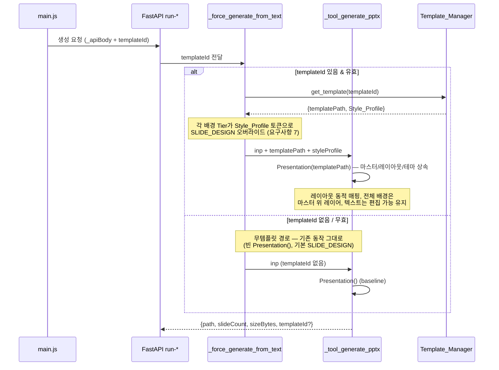

# 설계 문서: PPTX 템플릿 스타일링 (pptx-template-styling)

## 개요

이 기능은 사용자가 보유한 PowerPoint 템플릿(`.pptx`)을 한 번 등록해 두면, 이후 생성되는 PPTX가
그 템플릿의 슬라이드 마스터·레이아웃·테마와 색/폰트 스타일을 상속하도록 한다. 등록된 템플릿이
없거나 선택되지 않은 경우 현재 동작(빈 `Presentation()` + 단계별 배경 파이프라인)을 바이트 단위로
동일하게 유지한다.

설계의 핵심은 **기존 생성 경로에 비침투적으로(non-invasive) 얹는 것**이다. 현재 PPTX 생성은
`ai_engine/server.py`의 두 함수에 집중되어 있다.

- `_tool_generate_pptx(tool_input, project_path, ...)` — `Presentation()`을 빈 프레젠테이션으로
  열고 16:9로 리사이즈한 뒤, 표지 + 각 슬라이드를 추가한다. `LAYOUT_MAP = {"title": 0, "content": 1,
  "two-column": 3}`으로 레이아웃을 매핑하고, `slideBackground`가 있으면 1920×1080 전체 배경 이미지를
  `add_picture(... Inches(0),Inches(0), 13.333×7.5)` 후 `spTree.insert(2, ...)`로 뒤로 보낸다.
- `_force_generate_from_text(...)` — 단계별 배경 파이프라인(Tier 0 HTML → Tier 0.6 Vertex →
  Tier 0.7 Hero → Tier 1 Mermaid → Tier 2 matplotlib → Tier 3 python-pptx native)을 돌려
  `section_backgrounds`/`section_diagrams`를 채운 뒤, 그 결과를 `inp` 딕셔너리로 묶어
  `_tool_generate_pptx`에 전달한다.

따라서 템플릿 적용은 다음 4개 지점에만 개입한다.

1. `_tool_generate_pptx`가 `tool_input`에 `templateId`(또는 해석된 `templatePath`)가 있으면
   `Presentation()` 대신 `Presentation(template_path)`로 연다.
2. 레이아웃 매핑을 하드코딩된 인덱스 대신 템플릿이 제공하는 레이아웃 목록에 대해 동적으로 수행한다.
3. `_force_generate_from_text`의 각 배경 Tier가 `Style_Profile`의 색/폰트 토큰을 사용하도록
   `SLIDE_DESIGN` 기본값을 토큰 단위로 오버라이드한다.
4. 새 백엔드 모듈 `Template_Manager`(등록/조회/삭제)와 그 FastAPI 엔드포인트, 그리고
   프론트엔드 `<template-panel>` Web Component + preload/IPC 배선을 추가한다.

이 모든 처리는 요구사항 9의 **폴백 격리 원칙**을 따른다. 템플릿 단계(기준 `.pptx` 열기,
Style_Profile 로드, 토큰 적용)의 어떤 실패도 슬라이드 콘텐츠 생성으로 전파되지 않으며, 항상 모든
슬라이드 콘텐츠를 포함한 유효한 PPTX 산출을 완료한다.

### 설계 결정 및 근거

- **별도 신규 LLM 호출 경로 없음.** `gateway.md` 제약을 준수한다. Style_Profile 추출은 python-pptx의
  로컬 XML 파싱으로만 수행하고, 색/폰트 토큰은 기존 Mermaid 코드 생성(Bedrock Gateway 경유)과
  Vertex 이미지 프롬프트(이미 예외 허용된 단일 모듈)에 *데이터로만* 주입된다. 새로운 추론 호출은 없다.
- **저장은 `userData` 하위로만.** `_resolve_local_root()`/`AE_GENERATED_ROOT` 우선순위를 그대로 재사용해
  Template_Store 루트를 결정한다. 이는 30명 멀티유저 SSH 환경에서 OS user별 격리를 보장한다(요구사항 2).
- **Style_Profile은 결정론적 JSON.** 고정 키 순서 + `ensure_ascii=False` UTF-8 직렬화로 바이트 단위
  재현성을 확보한다(요구사항 3.5, 4.2, 4.4). 이는 property-based test의 핵심 대상이다.
- **하위 호환 절대 보존.** `templateId`가 없으면 코드 경로가 기존과 동일하게 흐르도록, 템플릿 분기는
  모두 "templateId 존재" 가드 안쪽에만 둔다(요구사항 5.2).

## 아키텍처

### 구성요소 배치도

```mermaid
graph TB
    subgraph Renderer["Renderer (Vanilla JS, contextIsolation)"]
        TP["&lt;template-panel&gt;<br/>등록·목록·미리보기·삭제 UI"]
        TS["Template_Selector<br/>(생성 시 활성 템플릿 선택)"]
        MAIN["main.js<br/>_apiBody() → templateId 주입"]
    end

    subgraph Preload["preload.js (contextBridge 화이트리스트)"]
        API["electronAPI.template*<br/>openFile / register / list / delete / get"]
    end

    subgraph Main["Electron Main (IPC 핸들러)"]
        FS["ipc-fs-handlers.js<br/>fs:open-file (재사용)"]
        TIPC["ipc-template-handlers.js<br/>template:* → FastAPI 프록시"]
    end

    subgraph Backend["AI_Engine (FastAPI, Python 3.11+)"]
        EP["FastAPI 엔드포인트<br/>/api/templates ..."]
        TM["Template_Manager<br/>register/list/get/delete"]
        EXTRACT["Style_Profile 추출<br/>(python-pptx theme XML)"]
        SER["Style_Profile_Serializer<br/>결정론적 JSON"]
        GENP["_tool_generate_pptx<br/>Presentation(template_path)"]
        PIPE["_force_generate_from_text<br/>배경 Tier들"]
    end

    subgraph Store["Template_Store (userData/templates/)"]
        DIR["{templateId}/<br/>base.pptx<br/>style_profile.json<br/>metadata.json"]
    end

    TP -->|click '+'| API
    TS -->|select templateId| MAIN
    MAIN -->|POST /api/agents/run-* (+templateId)| EP
    API --> FS
    API --> TIPC
    TIPC -->|HTTP| EP
    EP --> TM
    TM --> EXTRACT
    EXTRACT --> SER
    SER --> DIR
    TM --> DIR
    EP -->|templateId| GENP
    GENP -->|Style_Profile| PIPE
    GENP -->|open base.pptx| DIR
```

### 템플릿 등록 데이터 흐름

```mermaid
sequenceDiagram
    participant U as 사용자
    participant TP as &lt;template-panel&gt;
    participant PL as preload (electronAPI)
    participant IPC as ipc-template-handlers
    participant TM as Template_Manager
    participant ST as Template_Store

    U->>TP: '+' 클릭 (Template_Upload_Control)
    TP->>PL: openFile() — fs:open-file (.pptx 필터)
    PL-->>TP: 파일 경로 (취소 시 null)
    alt 취소됨
        TP-->>U: 상태 변경 없음 (요구사항 8.4)
    else 파일 선택됨
        TP->>U: 템플릿 이름 입력 받기
        TP->>PL: registerTemplate({filePath, name})
        PL->>IPC: template:register
        IPC->>TM: POST /api/templates
        TM->>TM: 확장자/크기/이름/중복 검증 (요구사항 1)
        alt 검증 실패
            TM-->>TP: {error: invalid-template | template-too-large | duplicate-name | invalid-name}
            TP-->>U: 에러 메시지 표시
        else 검증 통과
            TM->>ST: {templateId}/base.pptx 복사
            TM->>TM: Style_Profile 추출 (theme XML → 6토큰)
            TM->>ST: style_profile.json, metadata.json 저장
            TM-->>TP: {templateId, name, path, layoutCount}
            TP-->>U: 목록 갱신 + 미리보기 가능
        end
    end
```

### 템플릿 적용 생성 데이터 흐름



### 모듈 구성

신규 백엔드 모듈을 하나 추가하고, 기존 `server.py`의 두 함수에 최소 침투한다.

| 모듈/파일 | 책임 | 신규/수정 |
|---|---|---|
| `ai_engine/template_manager.py` | Template_Manager: 등록·조회·삭제·저장 격리, Style_Profile 추출 | 신규 |
| `ai_engine/style_profile.py` | Style_Profile 데이터 모델 + Style_Profile_Serializer(결정론적 JSON) | 신규 |
| `ai_engine/server.py` | FastAPI 엔드포인트 5종 추가, `_tool_generate_pptx`/`_force_generate_from_text` 템플릿 분기 | 수정 |
| `ai_engine/slide_templates.py` | `SLIDE_DESIGN` 토큰을 Style_Profile로 오버라이드하는 헬퍼 추가 | 수정(추가) |
| `ai_engine/vertex_image_module.py` | (호출부에서) 프롬프트에 색/폰트 주입 — 모듈 시그니처 변경 불필요 | 영향 없음/호출부 수정 |
| `electron/src/ipc-template-handlers.js` | `template:*` IPC → FastAPI 프록시 | 신규 |
| `electron/preload.js` | `electronAPI.template*` 화이트리스트 메서드 노출 | 수정(추가) |
| `electron/main.js` | `registerTemplateHandlers(mainWindow)` 등록 | 수정(추가) |
| `src/components/template-panel.js` | `<template-panel>` Web Component | 신규 |
| `src/main.js` | `_apiBody()`에 `templateId` 주입, 패널/셀렉터 배선 | 수정(추가) |

## 구성요소와 인터페이스

### 1. Template_Manager (`ai_engine/template_manager.py`) — 요구사항 1, 2, 3, 8

등록·조회·삭제와 저장 격리, Style_Profile 추출을 담당한다. python-pptx 의존성은 지연 import하여
미설치 시 `missing-dep`를 반환한다(요구사항 9.3).

```python
# 저장 루트 결정 — 기존 _resolve_local_root 우선순위 재사용 (요구사항 2.3, 2.4, 2.8)
def resolve_template_store_root() -> str | None:
    """userData 하위 templates/ 루트를 반환. 결정 불가 시 None.

    우선순위: AE_GENERATED_ROOT(Electron 주입 userData) → ~/.agentic-editor →
    (둘 다 불가 시) None → 호출자가 no-storage-root 에러 반환.
    """

def register_template(file_path: str, name: str, store_root: str) -> dict:
    """검증 → 복사 → Style_Profile 추출 → metadata 저장.

    Returns:
      성공: {templateId, name, path, layoutCount}
      실패: {error, ...}  # invalid-template / template-too-large /
            duplicate-name / invalid-name / no-storage-root /
            template-store-write-failed / missing-dep
    """

def list_templates(store_root: str) -> dict:
    """{templates: [{templateId, name, createdAt}, ...]} — 등록 시각 desc 정렬."""

def get_template(template_id: str, store_root: str) -> dict:
    """{templateId, name, templatePath(절대), styleProfile, createdAt} 또는 {error}.
    error ∈ {invalid-template-id, template-not-found}."""

def get_style_profile(template_id: str, store_root: str) -> dict:
    """style_profile.json 바이트를 매 호출 동일하게 반환 (요구사항 3.5)."""

def delete_template(template_id: str, store_root: str) -> dict:
    """{ok: true, templateId} 또는 {error: template-delete-failed | invalid-template-id |
    template-not-found}. 실패 시 디렉토리 보존 (요구사항 8.12)."""
```

**templateId 검증 (요구사항 2.7).** 모든 경로 조립 전에 다음을 강제한다.

```python
def _validate_template_id(tid: str) -> bool:
    # UUID v4 형식 권장이나 최소 강제 조건:
    # 1자 이상 128자 이하 AND '/'·'\\'·'..' 미포함
    return bool(tid) and 1 <= len(tid) <= 128 \
        and "/" not in tid and "\\" not in tid and ".." not in tid
```

저장 산출물 경로는 항상 `os.path.join(store_root, "templates", template_id, fname)`로 만들고,
`os.path.realpath` 결과가 `{templateId}` 디렉토리 prefix를 벗어나면 거부한다(요구사항 2.1).

**등록 검증 순서 (요구사항 1).** 짧은 작업 먼저, 디스크 쓰기는 마지막에 수행해 부분 산출물을 방지한다.

1. python-pptx import 가능 여부 → 불가 시 `missing-dep`
2. 이름 trim 후 길이 1–100 → 위반 시 `invalid-name` (요구사항 1.2, 1.7)
3. 파일 크기 ≤ 50MB → 초과 시 `template-too-large` (요구사항 1.4)
4. 확장자 `.pptx` AND `Presentation(file_path)`로 열림 → 실패 시 `invalid-template` (요구사항 1.3)
5. 이름 중복(trim + casefold 비교) → 중복 시 `duplicate-name` (요구사항 1.6)
6. store_root 결정 → 불가 시 `no-storage-root` (요구사항 2.4)
7. `{templateId}/` 생성 → base.pptx 복사 → Style_Profile 추출/저장 → metadata 저장. 중간 예외 시
   부분 산출물 정리 후 `template-store-write-failed` (요구사항 2.6)

### 2. Style_Profile 추출 (`template_manager.py` 내부) — 요구사항 3

기준 `.pptx`의 테마 XML에서 6개 토큰을 추출한다. python-pptx의 공개 API와 하위 XML을 함께 사용한다.

```python
def extract_style_profile(prs) -> StyleProfile:
    """python-pptx Presentation 객체에서 6토큰 추출.

    접근 경로:
      - 색상: prs.slide_masters[0].element 의 테마 part XML 내
        a:clrScheme (dk1/lt1/dk2/lt2/accent1..accent6) 를 파싱.
          primary    ← accent1
          secondary  ← accent2 (없으면 SLIDE_DESIGN['secondary'])
          accent     ← accent3 또는 accent1 보색 (없으면 SLIDE_DESIGN['accent'])
          text       ← dk1 (tx1)
          background ← lt1 (bg1)
      - 폰트: 동일 테마 part 의 a:fontScheme 에서
          fontHeading ← a:majorFont/a:latin@typeface (+ a:cs/a:ea fallback)
          fontBody    ← a:minorFont/a:latin@typeface
    sysClr(예: windowText/window)는 lastClr 속성으로, srgbClr는 val 속성으로 읽는다.
    """
```

**테마 part 접근 상세.** python-pptx는 테마를 직접 노출하지 않으므로 슬라이드 마스터의 part 관계를
통해 테마 part를 찾고 그 XML을 `lxml`로 파싱한다(python-pptx가 내부적으로 lxml 사용).

```python
from pptx.oxml.ns import qn  # a:, p: 네임스페이스 해석

def _theme_element(prs):
    master = prs.slide_masters[0]
    theme_part = master.part.part_related_by(
        "http://schemas.openxmlformats.org/officeDocument/2006/relationships/theme"
    )
    return theme_part._element  # a:theme 루트
```

**per-token 폴백 (요구사항 3.3).** 각 토큰을 개별적으로 검증한다. 색상은 `#RRGGBB`(대문자 6자리)로
정규화 가능해야 하고, 폰트는 1–64자 문자열이어야 한다. 어느 하나라도 부재/형식 불일치면 그 토큰만
`SLIDE_DESIGN`의 대응 기본값으로 채운다. 결과 Style_Profile의 6토큰은 항상 비어 있지 않다(요구사항 3.1).

| Style_Profile 필드 | 테마 소스 | SLIDE_DESIGN 폴백 키 |
|---|---|---|
| `primaryColor` | `a:accent1` | `primary` (`#0066FF`) |
| `secondaryColor` | `a:accent2` | `secondary` (`#00C896`) |
| `accentColor` | `a:accent3` | `accent` (`#FF6B35`) |
| `textColor` | `a:dk1`/`tx1` | `text_dark` (`#1A1A1A`) |
| `backgroundColor` | `a:lt1`/`bg1` | `bg_light` (`#FAFAFA`) |
| `headingFont` | `a:majorFont` | `font_heading` 의 첫 패밀리 |
| `bodyFont` | `a:minorFont` | `font_body` 의 첫 패밀리 |

> 참고: SLIDE_DESIGN의 `font_heading`/`font_body`는 전체 폰트 스택 문자열이다. 폴백 시 첫 번째
> 패밀리 토큰(`-apple-system`)이 아니라 의미 있는 CJK 패밀리(`Apple SD Gothic Neo`)를 선택하도록
> `_first_real_family()` 헬퍼로 스택을 파싱해 1–64자 단일 패밀리를 추출한다.

### 3. Style_Profile 데이터 모델 + Serializer (`ai_engine/style_profile.py`) — 요구사항 4

이 모듈은 PBT의 1순위 대상이다. 결정론적 직렬화와 왕복 보존을 보장한다.

```python
from dataclasses import dataclass

# 직렬화 키 순서를 명시적으로 고정 (요구사항 4.2) — dict insertion order에 의존하지 않음
STYLE_PROFILE_KEY_ORDER = (
    "primaryColor", "secondaryColor", "accentColor",
    "textColor", "backgroundColor",
    "headingFont", "bodyFont",
)
REQUIRED_FIELDS = ("primaryColor", "textColor", "headingFont", "bodyFont")  # 요구사항 4.6
COLOR_FIELDS = ("primaryColor", "secondaryColor", "accentColor", "textColor", "backgroundColor")

@dataclass(frozen=True)
class StyleProfile:
    primaryColor: str
    secondaryColor: str
    accentColor: str
    textColor: str
    backgroundColor: str
    headingFont: str
    bodyFont: str


def normalize_color(value: str) -> str | None:
    """'#1e1e1e' 또는 '1E1E1E' 등을 대문자 '#RRGGBB'로 정규화. 불일치 시 None.
    허용: 선택적 '#' + 정확히 6자리 16진수(대소문자 무관) (요구사항 3.2, 4.7)."""


def serialize(profile: StyleProfile) -> str:
    """결정론적 UTF-8 JSON 문자열 (요구사항 4.1, 4.2).

    json.dumps(ordered_dict, ensure_ascii=False, separators=(',', ':'), sort_keys=False)
    — 키는 STYLE_PROFILE_KEY_ORDER로 OrderedDict 구성, 공백 없는 고정 separator.
    동일 객체 → 매 호출 바이트 단위 동일.
    """


def deserialize(text: str) -> StyleProfile:
    """JSON → StyleProfile. 검증 순서:
      1. json.loads 실패 → ValueError('invalid-json')          (요구사항 4.5)
      2. REQUIRED_FIELDS 누락 → ValueError('invalid-style-profile', missing=[...])
         부분 객체 생성 안 함                                    (요구사항 4.6)
      3. 색상 필드 normalize_color 실패 → ValueError('invalid-color', field=...)
         첫 실패에서 즉시 중단                                    (요구사항 4.7)
    선택 필드(secondary/accent/background) 누락 시 SLIDE_DESIGN 기본값으로 채움.
    """
```

**왕복 보존 불변식 (요구사항 4.4):** 임의의 유효한 StyleProfile 객체 `p`에 대해
`serialize(p) == serialize(deserialize(serialize(p)))`가 바이트 단위로 성립해야 한다. 이는 아래
Correctness Properties의 Property 1로 형식화된다.

에러는 모듈 내부에서 `ValueError` 서브타입 또는 구조화된 예외로 발생시키고, 엔드포인트 레이어에서
`{error, field?, missing?}` JSON으로 변환한다.

### 4. PPTX 생성 — 템플릿 기반 (`_tool_generate_pptx` 수정) — 요구사항 5, 6, 9

기존 함수에 templateId 분기를 추가한다. 핵심은 `Presentation()` → `Presentation(template_path)`
교체와 **동적 레이아웃 매핑**이다.

```python
async def _tool_generate_pptx(tool_input, project_path, aws_profile='', bedrock_user=''):
    ...
    template_path = tool_input.get("templatePath", "")  # 호출부가 해석해 전달
    template_id   = tool_input.get("templateId", "")

    prs = None
    used_template = False
    if template_path:
        try:
            # 요구사항 6.1, 9.1 — 10초 타임아웃 + 예외 격리
            prs = _open_presentation_with_timeout(template_path, timeout=10)
            used_template = True
        except Exception as e:
            print(f"[generate_pptx] template open failed → no-template fallback: {str(e)[:200]}")
            prs = None  # 요구사항 6.9, 9.1
    if prs is None:
        prs = Presentation()                      # baseline 경로 (요구사항 5.2)
        prs.slide_width  = Inches(13.333)
        prs.slide_height = Inches(7.5)
        used_template = False
```

**동적 레이아웃 매핑 (요구사항 6.2, 6.3, 6.4).** 템플릿 사용 시 하드코딩된 `LAYOUT_MAP` 인덱스 대신
레이아웃 이름 기반 매칭 + 폴백 체인을 사용한다.

```python
def _resolve_layout(prs, layout_name: str):
    """layout_name("title"|"content"|"two-column") → slide_layout.

    1) 이름 기반 매칭: 템플릿 레이아웃의 .name 을 정규화해 의미 매핑
       (title→표지류, content→본문/제목+내용, two-column→2단/비교).
    2) 매칭 실패 → 첫 번째 '콘텐츠 레이아웃'(placeholder에 본문 body가 있는 레이아웃) (요구사항 6.3)
    3) 콘텐츠 레이아웃 없음 → prs.slide_layouts[0] (요구사항 6.4)
    무템플릿 경로는 기존 LAYOUT_MAP {title:0, content:1, two-column:3} 그대로 사용 (요구사항 5.2).
    """
```

**전체 배경 레이어 우선순위 (요구사항 6.5, 6.6).** `slideBackground`(1920×1080 전체 배경)가 있는
슬라이드는 기존 로직대로 `add_picture(0,0, 13.333×7.5)` 후 `spTree.insert(2, ...)`로 마스터 배경 위,
텍스트 placeholder 아래에 배치한다. 이 z-order 트릭이 마스터 배경을 가린다(전체 배경이 마스터 위
레이어). 전체 배경이 없으면 그림을 추가하지 않으므로 템플릿 마스터 배경이 그대로 보인다(요구사항 6.6).

**편집 가능 텍스트 유지 (요구사항 6.8).** 제목/본문은 템플릿 적용 여부와 무관하게 placeholder
text_frame에 텍스트로 채운다(이미지 래스터화 금지). 기존 코드가 이미 `shapes.title.text` /
`placeholders[1].text_frame`을 사용하므로 동작은 유지된다.

**성공 응답 (요구사항 6.7).** 템플릿 적용 성공 시 응답에 `templateId`를 포함한다.

```json
{"path": ".generated/deck-1779....pptx", "model": "python-pptx",
 "slideCount": 6, "sizeBytes": 245321, "templateId": "a1b2..."}
```

### 5. Style_Profile의 배경 파이프라인 전파 (`_force_generate_from_text` + `slide_templates.py`) — 요구사항 7

`_force_generate_from_text`는 templateId가 유효하면 시작 시 Style_Profile을 1회 로드해 각 Tier에
전달한다. 핵심 헬퍼는 `slide_templates.py`에 추가하는 토큰 오버라이드 함수다.

```python
# slide_templates.py — SLIDE_DESIGN을 Style_Profile로 per-token 오버라이드 (요구사항 7.1, 7.6)
def design_tokens_for_profile(profile: dict | None) -> dict:
    """SLIDE_DESIGN의 사본을 만들고, profile의 유효 토큰만 덮어쓴다.

    - profile is None → SLIDE_DESIGN 원본 그대로 (요구사항 7.5, baseline)
    - profile 토큰이 #RRGGBB로 해석되면 primary/text_dark/bg_light 등 매핑 키 교체
    - 특정 토큰 부재/무효 → 그 토큰만 SLIDE_DESIGN 유지, 나머지는 적용 (요구사항 7.6)
    매핑: primaryColor→primary, textColor→text_dark, backgroundColor→bg_light,
          headingFont→font_heading, bodyFont→font_body, accentColor→accent,
          secondaryColor→secondary.
    """
```

각 Tier의 주입 방식:

| Tier | 현재 동작 | Style_Profile 주입 (요구사항 7) |
|---|---|---|
| Tier 0 HTML 배경 | `render_*`가 `SLIDE_DESIGN` 사용 | `render_*`에 `design=design_tokens_for_profile(sp)`를 전달하도록 시그니처 확장. 주/텍스트/배경 색·폰트가 SP 값과 일치, 기본값 아님 (요구사항 7.1) |
| Tier 1 Mermaid | `_llm_generate_mermaid` 프롬프트의 `classDef fill:#...` 가이드 | 프롬프트에 SP primary/text 색을 명시 + 렌더 후 `%%{init: {'theme':'base','themeVariables':{'primaryColor':SP.primary,'textColor':SP.text}}}%%` 헤더 주입 (요구사항 7.2) |
| Tier 2 matplotlib | 기본 color cycle | `_tool_generate_native_diagram`에 팔레트 인자 추가 — SP.primary를 첫 항목으로 2색 이상 팔레트 적용 (요구사항 7.3) |
| Tier 0.6 Vertex | `_try_vertex_for_section`의 `_prompt` 고정 | 프롬프트 끝에 `Color palette: primary {SP.primary}, accent {SP.accent}. Typography style: heading {SP.headingFont}, body {SP.bodyFont}.` 추가 (요구사항 7.4) |

Vertex 프롬프트 주입 예 (호출부 `_try_vertex_for_section` 내부):

```python
_style_hint = ""
if style_profile:  # Active_Template 지정 + Vertex 활성 (요구사항 7.4)
    _style_hint = (
        f" Color palette: primary {style_profile['primaryColor']}, "
        f"accent {style_profile['accentColor']}. Typography style cues: "
        f"heading font \"{style_profile['headingFont']}\", body font \"{style_profile['bodyFont']}\"."
    )
_prompt = (f"Professional business infographic ... corporate presentation.{_style_hint}")
```

`style_profile`이 None(무템플릿)이면 모든 Tier가 기존 `SLIDE_DESIGN` 기본값으로 렌더링된다(요구사항 7.5).
토큰 적용 실패는 해당 토큰만 기본값으로 대체하고 렌더링은 중단 없이 계속한다(요구사항 7.6, 9.4).

### 6. 템플릿 선택 plumbing — 요구사항 5

`templateId`는 UI → 생성 요청 → 파이프라인 → `_tool_generate_pptx` 순으로 흐른다.

- **UI → 요청:** `src/main.js`의 `_apiBody(extra)`가 `state.activeTemplateId`를 읽어 페이로드에
  `templateId`를 추가한다("템플릿 없음"이면 빈 문자열/미포함 → 무템플릿).

```javascript
// _apiBody() 내부, projectPath 주입 직후
if (state.activeTemplateId) {
  body.templateId = state.activeTemplateId;   // 요구사항 5.1
}
```

- **요청 → 파이프라인:** `run-orchestrated`/`run-agent` 등 엔드포인트가 body에서 `templateId`를
  꺼내 `_force_generate_from_text(..., template_id=...)`로 전달한다.
- **파이프라인 → 생성:** 파이프라인이 시작 시 `get_template(template_id, store_root)`를 호출해
  `templatePath`와 `styleProfile`을 확보한 뒤, `inp["templatePath"]`/`inp["templateId"]`로
  `_tool_generate_pptx`에 전달하고, styleProfile을 각 Tier에 넘긴다.

**유효성/폴백 분기 (요구사항 5.3, 5.4, 5.5):**

```python
def _resolve_active_template(template_id, store_root):
    """Returns (template_path, style_profile, used) or fallback signal.
    - templateId 없음/"" → (None, None, False)                       # 요구사항 5.2
    - get_template == template-not-found → 로그 + (None, None, False) # 요구사항 5.4 (무템플릿 진행)
    - base.pptx 또는 style_profile 로드 실패 → 로그(≤200자) + (None, None, False) # 요구사항 5.5
    - 정상 → (abs_path, profile_dict, True)                          # 요구사항 5.3
    """
```

`template-not-found`는 호출자(엔드포인트)가 응답 메타에 함께 surfacing할 수 있으나, 생성 자체는
항상 무템플릿 경로로 끝까지 진행한다(요구사항 5.4).

### 7. UI: `<template-panel>` Web Component — 요구사항 8

`file-preview-panel.js`의 패턴(클래스 기반 customElement, `var(--color-*)` 토큰, `window.electronAPI`
호출, `apiBase()` fetch, CustomEvent)을 그대로 따른다. Shadow DOM은 사용하지 않는다(ui.md).

```javascript
class TemplatePanel extends HTMLElement {
  // 상태: _templates[], _selectedId, _previewProfile, _pendingDelete
  connectedCallback()        // _render() + _refresh()
  async _refresh()           // electronAPI.listTemplates() → 시각 desc 정렬, ≤200개 (요구사항 8.1)
  _renderList()              // 이름 + 'YYYY-MM-DD HH:mm' (24h) (요구사항 8.1)
  _renderUploadControl()     // 상단 '+' Template_Upload_Control (요구사항 8.2)
  async _onUploadClick()     // openFile(.pptx) → 이름 입력 → registerTemplate (요구사항 8.3, 8.4)
  _bindDragAndDrop()         // 보조 진입점: .pptx drop → 이름 입력 → register (요구사항 8.5)
  async _onSelect(id)        // get_style_profile → 색 견본 + 폰트 라벨 (요구사항 8.7)
  _renderSwatches(profile)   // primary/accent/text/background를 #RRGGBB 라벨 견본으로
  _confirmDelete(id, name)   // 이름 + 확정/취소 확인 단계 (요구사항 8.10)
  async _doDelete(id)        // deleteTemplate → 성공 시 목록 제거 (요구사항 8.11), 실패 시 유지+에러 (요구사항 8.13)
  _renderEmpty()             // "등록된 템플릿이 없습니다" + 업로드 컨트롤 (요구사항 8.9)
  // 선택 시 CustomEvent('template:selected', {detail:{templateId}}) 디스패치 → main.js가 수신
}
if (!customElements.get('template-panel')) customElements.define('template-panel', TemplatePanel);
```

**Template_Selector.** 별도 거대 컴포넌트 대신, 패널 목록의 선택 상태가 곧 Active_Template이다.
"템플릿 없음" 옵션을 목록 맨 위 기본 선택값으로 둔다(요구사항 5.6, 6.6). 선택 시
`document.dispatchEvent(new CustomEvent('template:selected', {detail:{templateId}}))`를 발생시키고,
`main.js`가 이를 받아 `state.activeTemplateId`에 반영한다.

**성능 목표.** 목록 표시 1초 이내(요구사항 8.1), 미리보기 0.5초 이내(요구사항 8.7), 삭제 후 갱신
0.5초 이내(요구사항 8.11)는 모두 로컬 IPC/파일 읽기라 충분히 충족된다.

### 8. preload + IPC 배선 — 요구사항 8, 보안(security.md)

`ipcRenderer`를 절대 노출하지 않고, 화이트리스트 메서드만 `contextBridge`로 추가한다.

```javascript
// electron/preload.js — 기존 electronAPI 객체에 추가
  // Templates (pptx-template-styling)
  registerTemplate: (payload) => ipcRenderer.invoke('template:register', payload),
  listTemplates:    () => ipcRenderer.invoke('template:list'),
  getTemplate:      (id) => ipcRenderer.invoke('template:get', id),
  getTemplateStyleProfile: (id) => ipcRenderer.invoke('template:get-style-profile', id),
  deleteTemplate:   (id) => ipcRenderer.invoke('template:delete', id),
  // 업로드 '+' 진입점은 기존 openFile()(fs:open-file) 재사용 — 신규 다이얼로그 핸들러 불필요
```

`fs:open-file`은 디렉토리 전용이 아닌 `openFile`이며 현재 필터가 없다. `.pptx` 필터(요구사항 8.3)를
위해 옵션을 받는 변형을 추가하거나, 기존 핸들러에 `filters` 인자를 선택적으로 받게 확장한다.

```javascript
// ipc-fs-handlers.js — 선택적 필터 지원 (하위호환: 인자 없으면 기존과 동일)
ipcMain.handle('fs:open-file', async (_, opts) => {
  const properties = ['openFile'];
  const filters = (opts && opts.filters) || [];
  const result = await dialog.showOpenDialog(mainWindow, { properties, filters });
  return result.canceled ? null : result.filePaths[0];
});
// preload: openFile: (opts) => ipcRenderer.invoke('fs:open-file', opts)
// 템플릿 패널 호출: openFile({ filters: [{ name: 'PowerPoint', extensions: ['pptx'] }] })
```

신규 `electron/src/ipc-template-handlers.js`는 `template:*`를 FastAPI 엔드포인트로 프록시한다.
백엔드는 `AE_GENERATED_ROOT`로 userData 루트를 이미 알고 있으므로, IPC 핸들러는 요청을 그대로
HTTP로 전달하고 응답 JSON을 반환한다(파일 바이트는 register 시 파일 경로만 넘긴다).

```javascript
// ipc-template-handlers.js (개략)
const API = () => process.env.AE_ENGINE_URL || 'http://127.0.0.1:8765';
ipcMain.handle('template:register', async (_, { filePath, name }) => {
  // multipart 업로드 대신 로컬 파일 경로를 백엔드에 전달 (백엔드가 같은 워크스테이션에서 실행).
  const r = await fetch(`${API()}/api/templates`, {
    method: 'POST', headers: { 'Content-Type': 'application/json' },
    body: JSON.stringify({ filePath, name }),
  });
  return await r.json();
});
ipcMain.handle('template:list',   async () => (await fetch(`${API()}/api/templates`)).json());
ipcMain.handle('template:get',    async (_, id) => (await fetch(`${API()}/api/templates/${encodeURIComponent(id)}`)).json());
ipcMain.handle('template:get-style-profile', async (_, id) =>
  (await fetch(`${API()}/api/templates/${encodeURIComponent(id)}/style-profile`)).json());
ipcMain.handle('template:delete', async (_, id) =>
  (await fetch(`${API()}/api/templates/${encodeURIComponent(id)}`, { method: 'DELETE' })).json());
```

> 보안 노트: 등록은 로컬 파일 경로 기반이다. 백엔드는 항상 store_root(userData 하위)로 **복사**하며,
> 원본 경로를 신뢰해 그 밖으로 쓰지 않는다. templateId 검증으로 경로 탈출을 차단한다(요구사항 2.7).

### 9. FastAPI 엔드포인트 계약 — 요구사항 1, 2, 3, 5, 8, 9

기존 라우트 스타일(`@app.post`/`@app.get`, `JSONResponse`)을 따른다. 모든 응답은 JSON이며, 실패는
`error` 필드에 요구사항이 명명한 에러 문자열을 담는다.

#### POST `/api/templates` — 템플릿 등록 (요구사항 1, 2, 3, 9.3)

요청:
```json
{"filePath": "/Users/jcg/Downloads/brand.pptx", "name": "회사 표준 템플릿"}
```

성공 응답 (요구사항 1.5):
```json
{"templateId": "a1b2c3d4-...", "name": "회사 표준 템플릿",
 "path": "templates/a1b2c3d4-.../base.pptx", "layoutCount": 11}
```

실패 응답 예 (요구사항 1.3/1.4/1.6/1.7, 2.4/2.6, 9.3):
```json
{"error": "invalid-template", "detail": "확장자가 .pptx가 아니거나 열 수 없습니다 (...≤200자)"}
{"error": "template-too-large", "maxBytes": 52428800}
{"error": "duplicate-name", "name": "회사 표준 템플릿"}
{"error": "invalid-name", "allowed": [1, 100]}
{"error": "no-storage-root"}
{"error": "template-store-write-failed", "detail": "...≤200자"}
{"error": "missing-dep", "lib": "python-pptx", "hint": "pip install python-pptx"}
```

#### GET `/api/templates` — 목록 (요구사항 8.1)
```json
{"templates": [
  {"templateId": "a1b2...", "name": "회사 표준 템플릿", "createdAt": "2026-06-01T09:30:00Z"},
  {"templateId": "f9e8...", "name": "제안서 다크",     "createdAt": "2026-05-28T14:02:11Z"}
]}
```
정렬은 `createdAt` 내림차순, 최대 200개.

#### GET `/api/templates/{templateId}` — 단건 조회 (요구사항 5.3)
```json
{"templateId": "a1b2...", "name": "회사 표준 템플릿",
 "templatePath": "/Users/jcg/Library/.../templates/a1b2.../base.pptx",
 "styleProfile": { ...7필드... }, "createdAt": "2026-06-01T09:30:00Z"}
```
실패: `{"error": "invalid-template-id"}` (요구사항 2.7) 또는 `{"error": "template-not-found"}` (요구사항 5.4).

#### GET `/api/templates/{templateId}/style-profile` — Style_Profile (요구사항 3.5, 8.7)

`style_profile.json`의 바이트를 그대로(결정론적) 반환한다. 매 호출 바이트 동일(요구사항 3.5).
손상 시 `{"error": "invalid-json"}` 또는 `{"error": "invalid-style-profile", "missing": [...]}`
(요구사항 4.5, 4.6) — 단, 생성 경로에서는 손상 시 기본값 폴백(요구사항 9.2).

#### DELETE `/api/templates/{templateId}` — 삭제 (요구사항 8.8, 8.12)
```json
{"ok": true, "templateId": "a1b2..."}
{"error": "template-delete-failed", "detail": "...≤200자"}   // 디렉토리 보존 (요구사항 8.12)
{"error": "invalid-template-id"}
{"error": "template-not-found"}
```

#### 에러 이름 ↔ 요구사항 매핑 (요약)

| 에러 문자열 | 발생 지점 | 요구사항 |
|---|---|---|
| `invalid-template` | 등록: 확장자/열기 실패 | 1.3 |
| `template-too-large` | 등록: >50MB | 1.4 |
| `duplicate-name` | 등록: 이름 중복(trim+casefold) | 1.6 |
| `invalid-name` | 등록: trim 길이 ∉ [1,100] | 1.2, 1.7 |
| `no-storage-root` | 저장 루트 결정 불가 | 2.4 |
| `template-store-write-failed` | 디렉토리/산출물 쓰기 실패 | 2.6 |
| `invalid-template-id` | tid 길이/경로문자/`..` | 2.7 |
| `template-not-found` | 조회/삭제/생성 시 부재 | 5.4, 8.x |
| `template-delete-failed` | 삭제 중 예외(디렉토리 보존) | 8.12 |
| `missing-dep` | python-pptx 미설치 | 9.3 |
| `invalid-json` | Serializer: JSON 파싱 실패 | 4.5 |
| `invalid-style-profile` | Serializer: 필수 필드 누락 | 4.6 |
| `invalid-color` | Serializer: 색상 형식 불일치 | 4.7 |

## 데이터 모델

### Style_Profile JSON 스키마

`style_profile.json`의 정규 형태. 키 순서는 `STYLE_PROFILE_KEY_ORDER`로 고정되고, 색상은 대문자
`#RRGGBB`, 폰트는 1–64자 문자열이다.

```json
{
  "primaryColor": "#0066FF",
  "secondaryColor": "#00C896",
  "accentColor": "#FF6B35",
  "textColor": "#1A1A1A",
  "backgroundColor": "#FAFAFA",
  "headingFont": "Apple SD Gothic Neo",
  "bodyFont": "Apple SD Gothic Neo"
}
```

| 필드 | 타입 | 제약 | 필수 | 출처(요구사항) |
|---|---|---|---|---|
| `primaryColor` | string | `#RRGGBB` 대문자 | ✅ | 3.1, 4.6 |
| `secondaryColor` | string | `#RRGGBB` 대문자 | (기본값 채움) | 3.1 |
| `accentColor` | string | `#RRGGBB` 대문자 | (기본값 채움) | 3.1 |
| `textColor` | string | `#RRGGBB` 대문자 | ✅ | 3.1, 4.6 |
| `backgroundColor` | string | `#RRGGBB` 대문자 | (기본값 채움) | 3.1 |
| `headingFont` | string | 1–64자 | ✅ | 3.1, 4.6 |
| `bodyFont` | string | 1–64자 | ✅ | 3.1, 4.6 |

### metadata.json 스키마

```json
{
  "templateId": "a1b2c3d4-e5f6-4a7b-8c9d-0e1f2a3b4c5d",
  "name": "회사 표준 템플릿",
  "createdAt": "2026-06-01T09:30:00Z",
  "basePptx": "base.pptx",
  "layoutCount": 11
}
```

| 필드 | 타입 | 제약 |
|---|---|---|
| `templateId` | string | UUID v4, 1–128자, 경로문자/`..` 불가 (요구사항 2.7) |
| `name` | string | trim 후 1–100자 (요구사항 1.2, 1.7) |
| `createdAt` | string | ISO 8601 UTC (요구사항 1.1) |
| `basePptx` | string | 항상 `"base.pptx"`(디렉토리 내부 상대) |
| `layoutCount` | int | 템플릿 슬라이드 레이아웃 수 (요구사항 1.5) |

### Template_Store 디렉토리 레이아웃

```
{store_root}/templates/
  └── {templateId}/                 # 요구사항 2.1 — 모든 산출물이 이 디렉토리 내부에만
        ├── base.pptx               # 기준 .pptx 복사본 (요구사항 2.2)
        ├── style_profile.json      # 결정론적 직렬화 (요구사항 3.4)
        └── metadata.json           # 요구사항 2.2
```

`store_root`는 `AE_GENERATED_ROOT`(Electron 주입 userData) → `~/.agentic-editor` 순으로 결정되며,
프로젝트/설치 폴더에는 절대 쓰지 않는다(요구사항 2.8). 디렉토리는 최초 등록 시 생성한다(요구사항 2.5).

### 생성 요청 페이로드 확장

기존 `_apiBody()` 페이로드에 `templateId` 한 필드만 추가된다(선택).

```json
{
  "awsProfile": "bedrock-gw",
  "bedrockUser": "...",
  "projectPath": "/Users/jcg/myproject",
  "prompt": "...",
  "templateId": "a1b2c3d4-..."   // 없거나 "" 이면 무템플릿 (요구사항 5.2)
}
```

### `_tool_generate_pptx` 입력 확장 (`tool_input`)

| 키 | 타입 | 의미 |
|---|---|---|
| `title`, `slides` | 기존 | 표지 제목 + 슬라이드 목록 |
| `coverBackground` | 기존 | 표지 전체 배경(상대/절대 경로) |
| `templateId` | 신규(선택) | 응답 메타용 식별자 (요구사항 6.7) |
| `templatePath` | 신규(선택) | 호출부가 해석한 base.pptx 절대 경로. 있으면 `Presentation(templatePath)` |
| `slides[].slideBackground` | 기존 | 1920×1080 전체 배경 → 마스터 위 레이어 (요구사항 6.5) |
| `slides[].layout` | 기존 | `title`/`content`/`two-column` → 동적 레이아웃 매핑 (요구사항 6.2) |
