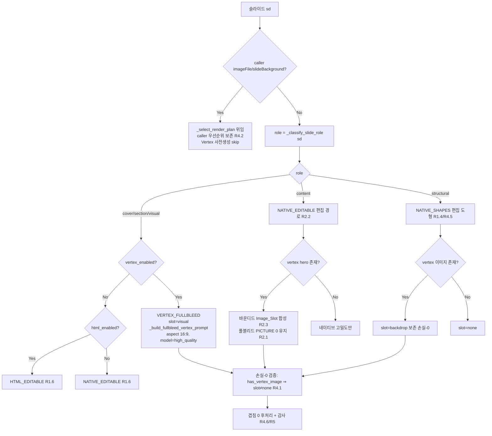

# Design Document

## Overview

본 설계는 `ai_engine/server.py`의 `_tool_generate_pptx`에 **슬라이드 역할 기반 하이브리드 렌더 라우팅**을 도입한다. 목표는 요구사항 도입부의 하드 트레이드오프 해소다: 지금까지 HTML-ON은 모든 슬라이드를 풀블리드 PNG로 구워 편집 불가, HTML-OFF는 편집 가능하나 시각 상한이 낮았다. 하이브리드 렌더는 슬라이드마다 역할(`Slide_Role`)을 판정해 **표지/섹션/사진 의도 슬라이드는 Vertex 초고품질 풀블리드**로, **고밀도 콘텐츠 슬라이드는 편집 가능 상태를 유지한 채 선택적 Vertex 히어로를 이미지 슬롯에 합성**하고, **구조형(흐름/트리/아키텍처) 슬라이드는 편집 가능 네이티브 도형으로 유지하되 생성 이미지를 손실 없이 backdrop으로 보존**한다.

핵심 설계 원칙은 **재사용·게이팅·보존**이다.

- **재사용**: 이미 완료·검증된 스펙(`pptx-quality-vertex-images`, `pptx-overlay-collision-fix`, `pptx-native-density-render`)의 seam을 재작업하지 않는다. `_classify_slide_role`(역할 판정), `_select_render_plan`(손실-0 순수 결정 함수), `_generate_html_slide_for_section`(HTML+이미지 슬롯 합성), `native_layout_renderer.render_native_layout`(편집 가능 고밀도), `_strip_text_over_fullbleed`, `vertex_image_module`를 그대로 조합한다.
- **게이팅**: 새 라우팅은 **기본 ON**(하이브리드가 표준 동작)이며, 미설정/`""`/`"1"`/인식 불가 값에서 활성화된다. `AE_HYBRID_RENDER == "0"`은 명시적 **킬스위치**로, 이 경우에만 현재(하이브리드 이전) 경로가 **바이트 단위로 동일하게** 유지된다.
- **보존**: 손실-0, 도형/텍스트 겹침 0, 게이트웨이 제약, caller 지정 우선순위, Vertex 비활성/실패 폴백을 회귀 방지 불변식으로 명시하고 기존 Property 1–5 PBT가 계속 통과함을 보장한다.

### 6개 요구사항 매핑 (요약)

| 요구사항 | 설계 대응 |
|---|---|
| **R1** 역할 기반 하이브리드 라우팅 | `_select_hybrid_render_plan`(신규 순수 함수)가 `_classify_slide_role` 결과 × Vertex/HTML 상태로 주 렌더러 1개 + vertex slot 배정. 모호/미정의는 `content`로 확정. |
| **R2** content 편집 가능성 + 고밀도 양립 | content는 풀블리드 PNG 굽기 금지, `render_native_layout` 편집 경로 + 바운디드 Image_Slot 합성. 측정 가능한 "편집 가능" 정의 도입. |
| **R3** Vertex 프롬프트/합성 품질 | `_build_fullbleed_vertex_prompt(role, title, bullets, style_profile)` 순수 결정 함수 — 역할별 템플릿, 16:9, no-text negative prompt, Style_Profile 팔레트 반영, 바이트 결정성. |
| **R4** 완료 스펙 동작 보존 | `_select_render_plan` 손실-0 위임 유지, caller 우선순위, Vertex-off 폴백, 게이트웨이 전용, 구조형 래스터화 0, 겹침 0. |
| **R5** 실제 산출물 감사 검증 | `audit_pptx_overlap.audit`, `audit_pptx_textbox_overlap.main`, `audit_pptx_native_density.audit_native_density` 통과 + 헤르메틱/자격증명 속성 분리. |
| **R6** 기본 ON + 킬스위치 | `_hybrid_render_enabled(env)` 파서로 플래그 게이팅(기본 ON), `"0"` 킬스위치 시 바이트 동일, 인식 불가 값 경고+기본 ON. |

## Architecture

### Feature Flag가 읽히는 위치

`AE_HYBRID_RENDER`는 `_tool_generate_pptx`(디스크 기준 `ai_engine/server.py:4522`) 진입부, `_html_enabled` 결정 블록(`:4691` 부근) 직후에서 **정확히 1회** 읽는다. 파싱은 순수 함수 `_hybrid_render_enabled(env: str) -> bool`로 분리해 단위 테스트 가능하게 한다.

```
_hybrid_on = _hybrid_render_enabled(os.environ.get("AE_HYBRID_RENDER", ""))
```

하이브리드는 **기본 ON**(표준 동작)이며, `"0"`만이 명시적 킬스위치다.

- `"0"` → `False` (명시적 킬스위치 / 하이브리드 이전 legacy 렌더로 롤백)
- `"1"` → `True`
- 미설정/`""` → `True` (DEFAULT ON — 하이브리드가 표준 동작)
- 그 외 인식 불가 값(`"2"`, `"true"`, `"on"` 등) → `True` + 경고 로그 1줄(R6.5). 파서는 결코 raise하지 않는다.

`_hybrid_on == False`는 오직 `AE_HYBRID_RENDER == "0"`(킬스위치)일 때만 성립하며, 이 경우 하이브리드 분기는 전부 no-op이 되어 기존 제어흐름·출력이 **바이트 단위로 동일하게** 유지된다(R6.1/6.6). 그 외 모든 값(미설정/`""`/`"1"`/인식 불가)에서는 `_hybrid_on == True`가 되어 역할 기반 라우팅(신규 분기)이 기본으로 활성화된다(R6.2/6.3).

### 라우팅이 기존 seam을 확장하는 방식

기존 루프(`:5519`~`:5560`)는 이미 슬라이드마다 `_classify_slide_role` → `_select_render_plan`을 호출해 **미디어 상태 기반** 손실-0 slot을 정한다. 하이브리드는 이 위에 **역할 기반 주 렌더러 선택** 레이어를 얇게 덧댄다. 기존 `_select_render_plan`은 손실-0 slot 계산기로 그대로 두고(회귀 0), 신규 `_select_hybrid_render_plan`이 그 위에서 역할을 반영해 최종 플랜을 산출한다.

```mermaid
flowchart TD
    A[_tool_generate_pptx 슬라이드 루프] --> B{_hybrid_on?}
    B -- False (AE_HYBRID_RENDER=="0" 킬스위치) --> C[기존 경로: _select_render_plan\n미디어 상태 기반 손실-0 slot\n출력 바이트 동일 R6.1/6.6]
    B -- True --> D[_classify_slide_role\nrole ∈ cover/section/structural/content/visual]
    D --> E{모호·미정의·복수후보?}
    E -- Yes --> F[role := content 결정론 확정 R1.8]
    E -- No --> G[role 확정]
    F --> H[_select_hybrid_render_plan]
    G --> H
    H --> I[primary 1개 + vertex_slot 배정]
    I --> J[손실-0 위임: _select_render_plan 으로\nslot 최종 검증 R4.1]
```

`_select_hybrid_render_plan`은 LLM/게이트웨이/네트워크 호출이 없는 **순수 함수**다(R3.7/R4.4 준수, 결정성 보장). 시그니처(제안):

```python
def _select_hybrid_render_plan(
    *, role: str, vertex_enabled: bool, html_enabled: bool,
    has_vertex_image: bool, has_native_diagram: bool,
    has_image_file: bool, has_slide_bg: bool,
) -> dict:
    # 반환: {"primary": "VERTEX_FULLBLEED"|"HTML_EDITABLE"|"NATIVE_EDITABLE"|"NATIVE_SHAPES",
    #        "vertex_slot": "visual"|"hero"|"backdrop"|"none",
    #        "editable": bool}
```

### 결정 테이블 (Slide_Role × Vertex enabled/disabled × HTML on/off)

caller가 `imageFile`/`slideBackground`를 명시한 경우는 **항상 최우선**으로 기존 `_select_render_plan` 경로에 위임한다(caller 우선순위 보존, R4.2). 아래 표는 caller 미지정 슬라이드에 적용된다.

| Slide_Role | Vertex | HTML | 주 렌더러(primary) | vertex_slot | editable |
|---|---|---|---|---|---|
| `cover` | enabled | on/off | `VERTEX_FULLBLEED` | `visual` | no |
| `cover` | disabled | on | `HTML_EDITABLE` | `none` | yes |
| `cover` | disabled | off | `NATIVE_EDITABLE` | `none` | yes |
| `section` | enabled | on/off | `VERTEX_FULLBLEED` | `visual` | no |
| `section` | disabled | on | `HTML_EDITABLE` | `none` | yes |
| `section` | disabled | off | `NATIVE_EDITABLE` | `none` | yes |
| `visual` | enabled | on/off | `VERTEX_FULLBLEED` | `visual` | no |
| `visual` | disabled | on | `HTML_EDITABLE` | `none` | yes |
| `visual` | disabled | off | `NATIVE_EDITABLE` | `none` | yes |
| `content` | enabled | on | `NATIVE_EDITABLE` + 바운디드 Image_Slot | `hero` | **yes** |
| `content` | enabled | off | `NATIVE_EDITABLE` + 바운디드 Image_Slot | `hero` | **yes** |
| `content` | disabled | on | `NATIVE_EDITABLE` | `none` | **yes** |
| `content` | disabled | off | `NATIVE_EDITABLE` | `none` | **yes** |
| `structural` | enabled | on/off | `NATIVE_SHAPES` | `backdrop` | yes |
| `structural` | disabled | on/off | `NATIVE_SHAPES` | `none` | yes |
| 모호→`content` | (content 행과 동일) | | | | |

설계 판단 근거:

- **`section` 역할**: `_classify_slide_role`의 현 휴리스틱은 `section`을 산출하지 않고 예약 상태다(코드 docstring 확인: "section 은 role 열거형의 일원이지만 현 휴리스틱 규칙에서는 산출하지 않는다"). 결정 테이블은 `section`이 산출될 경우를 대비해 `cover`와 동일한 풀블리드 취급으로 정의한다(R1.2). 현재는 도달 불가 경로지만 열거형 완전성을 위해 명시한다.
- **content-default 폴백(R1.8)**: 역할 분류가 예외/미정의/복수 후보이면 `_select_hybrid_render_plan` 진입 전에 `role := "content"`로 결정론적 확정. `_classify_slide_role`은 이미 마지막에 `return "content"`로 폴백하므로 추가 확정은 방어적 이중화다.
- **content가 항상 편집 가능(R2)**: HTML on이어도 content는 풀블리드 PNG로 굽지 않는다. HTML 경로(`_generate_html_slide_for_section`)는 슬라이드 전체를 단일 PNG로 굽는 특성상 content 편집성을 깨므로, content는 `render_native_layout` 편집 경로로 라우팅한다. Vertex 히어로가 있으면 슬라이드 전체가 아닌 **바운디드 영역**(예: 우측 컬럼)에 `add_picture`로 합성한다(R2.3). 표의 `HTML_EDITABLE`은 content 이외(cover/section/visual의 Vertex-off 폴백) 경로에서 고밀도 시각 상한을 위해 사용한다.
- **cover/section/visual의 Vertex-off 폴백(R1.6)**: Vertex 비활성이면 풀블리드 대신 편집 가능 고밀도(HTML on이면 HTML_EDITABLE, off이면 NATIVE_EDITABLE)로 강등한다.

### content 슬라이드 편집 가능 경로 (Editable-under-HTML-ON)

"편집 가능(`Editable_Native`)"의 **측정 가능한 정의**를 다음으로 고정한다.

> **Editable ≡ (편집 가능 텍스트 run 개수 ≥ 1) AND (슬라이드 전체 13.333in × 7.5in를 덮는 PICTURE 개수 == 0)**

content 렌더 절차:

1. HTML이 전역 on이어도 content 슬라이드는 `_generate_html_slide_for_section`의 풀블리드 PNG 바이크를 **우회**하고 `native_layout_renderer.render_native_layout(slide, prs, layout, data, tokens, palette=...)`로 편집 가능 네이티브 도형/텍스트를 방출한다(R2.2). 이 렌더러는 편집 가능 텍스트 run을 생성하므로 정의의 첫 항을 만족한다.
2. Vertex 히어로/액센트 이미지(`_vertex_pre[i]`)가 존재하면 **바운디드 Image_Slot**(레이아웃이 정의한 사각 영역, 예: two_column 우측/objective_detail 이미지 컬럼)에 `add_picture(rel, left, top, width, height)`로 합성한다 — width/height는 슬라이드 전체보다 작아 풀블리드 PICTURE가 되지 않으므로 정의의 둘째 항(풀블리드 PICTURE == 0)을 만족한다(R2.1/R2.3).
3. 레이아웃이 바운디드 Image_Slot을 호스팅할 수 없으면(R2.4) 이미지를 **on-slide 바운디드 레이어**(콘텐츠 뒤 back-most, 여전히 비풀블리드)로 보존해 보존 이미지 개수 ≥ 1을 유지한다. content에 한해 full-bleed backdrop은 R2.1을 위반하므로 채택하지 않고, 바운디드 보존을 택한다(설계 판단: R2.1 불변식 우선).
4. 렌더 후 `audit_native_density.audit_native_density(pptx_path, tokens)`가 failures 0 + 비텍스트 시각 요소 ≥ 2 + 5개 스타일 품질 검사 통과를 만족해야 한다(R2.5).

`native_layout_renderer`의 `maybe_add_decorative_background`(풀블리드 장식 배경 옵트인)는 content 경로에서 **사용하지 않는다** — 풀블리드 PICTURE를 만들어 R2.1을 깨기 때문이다. content의 Vertex 활용은 바운디드 슬롯으로 한정한다.

### Vertex 프롬프트 빌더

`_build_fullbleed_vertex_prompt(role, title, bullets, style_profile) -> (prompt, negative_prompt)`를 신규 순수 함수로 도입한다. `_gen_vertex_slide`(`:5094`) 내부의 인라인 프롬프트 문자열을 이 함수 호출로 대체한다(풀블리드 대상 = `cover`/`section`/`visual`).

- **역할별 템플릿**: `cover`/`section`/`visual`이 서로 다른 프롬프트 본문을 산출한다(R3.3). 예: cover는 "commercial-grade hero title background", section은 "chapter divider ambient background", visual은 "editorial photographic hero".
- **16:9 고정**: 프롬프트 문말에 `16:9` 명시, 호출부는 `aspect_ratio="16:9"`(R3.1).
- **no-text negative prompt**: 항상 길이 ≥ 1의 비어 있지 않은 negative_prompt 반환, 텍스트·문자·워터마크 억제 용어 포함(예: `"text, words, letters, captions, typography, watermark, fake logo, ..."`)(R3.2).
- **Style_Profile 팔레트 반영**: `_build_palette(style_profile)`(`:2242`) 결과에서 primary/secondary 색을 결정론적 팔레트 표현(예: `"palette anchored on #1F3A93 with #E8A postaccent"`)으로 삽입한다. 동일 프로파일 입력 → 동일 색상 표현(R3.4). 팔레트가 None이면 결정론적 기본 표현으로 폴백.
- **바이트 결정성**: 입력이 같으면 출력 문자열이 바이트 단위로 동일 — 난수/타임스탬프/사전 순서 비의존. dict 순회 대신 고정 키 순서를 사용한다(R3.6). 라이브 Vertex 없이 단위 테스트 가능.
- **model_class**: 호출부는 `model_class="image_generation_high_quality"`(R3.5).
- **게이트웨이 제약**: 함수는 순수 문자열 조립만 수행, LLM 호출 없음. 프롬프트 정제에 LLM이 필요하면 `_get_gw` 경유만(R3.7).

### 최상위 결정 흐름 다이어그램



## Components and Interfaces

### 신규 컴포넌트

| 이름 | 위치 | 종류 | 책임 |
|---|---|---|---|
| `_hybrid_render_enabled(env)` | `ai_engine/server.py` | 순수 함수 | `AE_HYBRID_RENDER` 파싱(기본 ON: `"0"`→False 킬스위치, `"1"`/미설정/`""`→True, 인식 불가→True+경고). 결정론적, raise 없음. |
| `_select_hybrid_render_plan(...)` | `ai_engine/server.py` | 순수 함수 | role × vertex/html 상태 → `{primary, vertex_slot, editable}`. caller 미지정 슬라이드의 주 렌더러 배정. 손실-0은 `_select_render_plan`에 위임/검증. |
| `_build_fullbleed_vertex_prompt(role, title, bullets, style_profile)` | `ai_engine/server.py` | 순수 함수 | 역할별 (prompt, negative_prompt) 반환. 16:9, no-text negative, 팔레트 결정성, 바이트 결정성. |
| `_render_content_editable(slide, prs, data, tokens, hero_rel, palette)` | `ai_engine/server.py`(또는 얇은 래퍼) | 조립 | content를 `render_native_layout`로 편집 렌더 + 바운디드 Image_Slot 합성/보존. 풀블리드 금지. |

### 재사용 컴포넌트 (인터페이스 불변)

| 이름 | 위치(디스크) | 역할 |
|---|---|---|
| `_classify_slide_role(slide, is_cover, doc_title="", *, bg_has_baked_text=False)` | `server.py:3094` | 역할 판정. 반환 `cover|section|structural|content|visual`. LLM 없음. |
| `_select_render_plan(*, has_vertex_image, has_native_diagram, has_image_file, has_slide_bg, role, html_enabled, bg_has_baked_text=False)` | `server.py:3158` | 손실-0 순수 결정 함수. `{primary, vertex_slot, body_separated}`. `has_vertex_image ⇒ slot≠"none"`. |
| `_generate_html_slide_for_section(gw, model_id, heading, body, ctx, project_path, style_profile=None, hero_image="", render_info=None)` | `server.py:2105` | HTML 레이아웃 렌더 + 이미지 슬롯 합성(cover→heroImage, two_column/objective_detail→image). content 이외 고밀도 경로. |
| `render_native_layout(slide, prs, layout, data, tokens, *, palette=None, aws_profile="", credentials=None)` | `native_layout_renderer.py:394` | 편집 가능 네이티브 고밀도 렌더. `RenderResult(ok, placed, title_count, unsupported)`. |
| `render_layout(layout, data)` / `design_tokens_for_profile(profile)` | `slide_templates.py:2816` / `:155` | HTML 레이아웃 문자열 / 디자인 토큰. |
| `_build_palette(profile)` / `_tpl_palette_for_native` | `server.py:2242` / `:4579` | Style_Profile → `[#RRGGBB,...]` 팔레트. |
| `_strip_text_over_fullbleed(slide)` | `server.py:3822` | 풀블리드 배경 위 겹침 편집 요소 제거(PICTURE 보존). |
| `VertexImageClient.generate(...)` / `get_vertex_image_client(...)` / `.enabled` / `.resolve_model_id` | `vertex_image_module.py:292` | 이미지 생성 단일 경로. `image_generation_high_quality`→`gemini-3-pro-image-preview`. |
| `_get_gw(aws_profile, bedrock_user)` | `server.py` | Bedrock Gateway 취득(LLM 유일 경로). |

### 감사 인터페이스 (검증)

| 스크립트 | 함수 | 반환/판정 |
|---|---|---|
| `scripts/audit_pptx_overlap.py` | `audit(path)` | 텍스트·이미지 겹침 슬라이드 목록, 편집 불가(래스터) 의심 슬라이드 목록. |
| `scripts/audit_pptx_textbox_overlap.py` | `main(path)` | 겹침 면적 0.05in² 초과 텍스트박스 쌍 목록. |
| `scripts/audit_pptx_native_density.py` | `audit_native_density(pptx_path, tokens)` | `AuditReport(passed: bool, failures: list)`. |

## Data Models

### RenderPlan (하이브리드)

`_select_hybrid_render_plan` 반환값:

```python
{
    "primary": str,       # "VERTEX_FULLBLEED" | "HTML_EDITABLE" | "NATIVE_EDITABLE" | "NATIVE_SHAPES"
    "vertex_slot": str,   # "visual" | "hero" | "backdrop" | "none"
    "editable": bool,     # content/structural/HTML·NATIVE 폴백 → True; VERTEX_FULLBLEED → False
}
```

불변식:
- `primary`는 정확히 1개(주 렌더러 유일성, R1.5).
- `has_vertex_image == True ⇒ vertex_slot != "none"`(손실-0, R4.1). 기존 `_select_render_plan`이 이 불변식의 최종 게이트.
- `primary == "VERTEX_FULLBLEED" ⇒ role ∈ {cover, section, visual} AND vertex_enabled == True`(R1.2).
- `role == "content" ⇒ editable == True AND primary ∈ {NATIVE_EDITABLE}`(R2.1/R2.2).
- `role == "structural" ⇒ primary == "NATIVE_SHAPES"`(R1.4/R4.5).

### VertexPrompt

`_build_fullbleed_vertex_prompt` 반환 `(prompt: str, negative_prompt: str)`:
- `len(negative_prompt) >= 1` 항상 참(R3.2).
- `negative_prompt`에 `{"text", "words", "letters", "watermark"}` 억제 용어 포함(R3.2).
- `role_a != role_b ⇒ prompt_a != prompt_b`(R3.3).
- 동일 `(role, title, bullets, style_profile)` → 동일 `(prompt, negative_prompt)` 바이트 단위(R3.4/R3.6).

### Slide_Role 열거형

`{cover, section, structural, content, visual}` — 정확히 이 5개. `section`은 현 휴리스틱 미산출(예약). 미정의/모호/복수 후보 입력 → `content`(R1.8).

### Style_Profile → 팔레트

`_build_palette(profile)`가 `[primaryColor, secondaryColor, accentColor]` 중 유효 `#RRGGBB`(2색 이상)만 추출, 없으면 None. 프롬프트 빌더·네이티브 팔레트가 공유 → 결정성 소스 단일화(R3.4).

## Correctness Properties

*프로퍼티(property)는 시스템의 모든 유효한 실행에서 참이어야 하는 특성 또는 동작으로, 시스템이 무엇을 해야 하는지에 대한 형식적 진술이다. 프로퍼티는 사람이 읽는 명세와 기계로 검증 가능한 정확성 보증 사이의 다리 역할을 한다.*

본 기능의 핵심 로직(역할 기반 라우팅, 프롬프트 빌더, 손실-0 결정)은 순수 결정 함수이고, 편집 가능성·합성·감사 불변식은 헤르메틱하게(Vertex 비활성, 네트워크 0) 실제 .pptx 산출물로 검증 가능하므로 property-based testing이 적합하다. 아래 프로퍼티는 prework 분석의 reflection 결과(중복 병합 후)를 반영한다.

### Property 1: 역할 판정의 전역성

*For any* slide dict(임의 구조·필드)와 `is_cover` 불리언에 대해, `_classify_slide_role`은 정확히 `{cover, section, structural, content, visual}` 집합의 원소 하나를 반환한다.

**Validates: Requirements 1.1**

### Property 2: 모호 입력의 content 결정론 폴백

*For any* 구조 신호(diagram kind)도 비주얼 신호(visual intent)도 없거나 분류 중 예외를 유발하는 slide dict에 대해, 최종 확정 role은 결정론적으로 `content`이며 동일 입력은 항상 동일 결과를 낸다.

**Validates: Requirements 1.8**

### Property 3: 풀블리드 라우팅 규칙

*For any* `role ∈ {cover, section, visual}` 이고 caller가 imageFile/slideBackground를 지정하지 않은 상태에서, `vertex_enabled == True`이면 `_select_hybrid_render_plan`은 `primary == "VERTEX_FULLBLEED"` 이고 `vertex_slot == "visual"` 인 플랜을 반환한다(주 렌더러는 정확히 하나).

**Validates: Requirements 1.2, 1.5**

### Property 4: Vertex 비활성 시 편집 경로 폴백

*For any* `role ∈ {cover, section, visual}` 이고 `vertex_enabled == False`인 caller-미지정 슬라이드에 대해, `_select_hybrid_render_plan`은 `editable == True` 이고 `primary ∈ {HTML_EDITABLE, NATIVE_EDITABLE}`(html on이면 HTML_EDITABLE, off이면 NATIVE_EDITABLE)인 플랜을 반환한다.

**Validates: Requirements 1.6, 1.5**

### Property 5: content 라우팅 규칙

*For any* `role == "content"` 인 caller-미지정 슬라이드에 대해, 모든 `vertex_enabled` / `html_enabled` 조합에서 `_select_hybrid_render_plan`은 `primary == "NATIVE_EDITABLE"` 이고 `editable == True` 인 플랜을 반환한다(주 렌더러는 정확히 하나).

**Validates: Requirements 1.3, 1.5**

### Property 6: structural 라우팅 + 손실-0 backdrop

*For any* `role == "structural"` 인 슬라이드에 대해, `_select_hybrid_render_plan`은 `primary == "NATIVE_SHAPES"` 를 반환하고, `has_vertex_image == True`이면 `vertex_slot == "backdrop"`, 아니면 `"none"` 을 반환한다.

**Validates: Requirements 1.4, 1.5, 4.5**

### Property 7: content 슬라이드는 항상 편집 가능

*For any* content 슬라이드(임의 title/bullets)를 헤르메틱하게(Vertex 비활성) 렌더한 산출물에 대해, html_enabled 값과 무관하게 편집 가능 텍스트 run 개수 ≥ 1 이고 슬라이드 전체(13.333in × 7.5in)를 덮는 풀블리드 PICTURE 개수 == 0 이다.

**Validates: Requirements 2.1, 2.2**

### Property 8: content 히어로의 바운디드 합성·보존

*For any* content 슬라이드와 유효한 히어로 이미지 rel에 대해, 렌더 산출물의 보존/합성 이미지 개수 ≥ 1 이고 그 이미지들 중 어느 것도 슬라이드 전체를 덮는 풀블리드 PICTURE가 아니다(바운디드 Image_Slot 또는 바운디드 on-slide 레이어). 슬롯 미지원 레이아웃에서도 이미지는 폐기되지 않는다.

**Validates: Requirements 2.3, 2.4**

### Property 9: content 산출물 밀도·스타일 감사 통과

*For any* content 슬라이드를 포함한 헤르메틱 렌더 산출물과 그 tokens에 대해, `audit_native_density(pptx_path, tokens)`는 `AuditReport.passed == True` 이고 `failures` 목록이 비어 있다(비텍스트 시각 요소 ≥ 2 및 5개 스타일 품질 검사 통과 포함).

**Validates: Requirements 2.5, 5.3**

### Property 10: 프롬프트 빌더의 no-text negative prompt

*For any* `role ∈ {cover, section, visual}` 과 임의 title/bullets/style_profile에 대해, `_build_fullbleed_vertex_prompt`가 반환하는 negative_prompt는 길이 ≥ 1 이고 텍스트·워터마크 억제 용어(`text`, `words`, `letters`, `watermark`)를 포함한다.

**Validates: Requirements 3.2**

### Property 11: 역할별 프롬프트 구별성

*For any* 서로 다른 두 풀블리드 역할 `role_a != role_b`(둘 다 `{cover, section, visual}`)와 동일한 title/bullets/style_profile에 대해, `_build_fullbleed_vertex_prompt`가 반환하는 prompt 문자열은 서로 다르다.

**Validates: Requirements 3.3**

### Property 12: 프롬프트 빌더의 바이트 결정성

*For any* 동일한 `(role, title, bullets, style_profile)` 입력에 대해, `_build_fullbleed_vertex_prompt`를 반복 호출하면 라이브 Vertex 호출 없이 바이트 단위로 동일한 `(prompt, negative_prompt)`(팔레트/색상 표현 포함)를 산출한다.

**Validates: Requirements 3.4, 3.6**

### Property 13: Vertex generate 호출 계약

*For any* 풀블리드 대상 슬라이드(caller 미지정, role ∈ {cover, section, visual}, vertex_enabled)에 대해, 이미지 생성 경로는 `VertexImageClient.generate`를 `aspect_ratio == "16:9"` 이고 `model_class == "image_generation_high_quality"` 로 정확히 1회 호출한다.

**Validates: Requirements 3.1, 3.5**

### Property 14: 손실-0 불변식 보존

*For any* SlideMediaState 조합에 대해, `has_vertex_image == True`이면 `_select_render_plan`(및 이를 위임받는 `_select_hybrid_render_plan`)이 반환하는 `vertex_slot`은 결코 `"none"`이 아니며, 성공적으로 생성된 Vertex 이미지의 폐기 개수는 0이다.

**Validates: Requirements 4.1**

### Property 15: caller 지정 미디어 우선순위 보존

*For any* caller가 `imageFile` 또는 `slideBackground`를 지정한 슬라이드에 대해, 주 렌더러는 caller 지정 미디어를 유지하고(기존 `_select_render_plan` 위임) 하이브리드 라우팅은 이를 덮어쓰지 않으며 Vertex 사전생성은 스킵된다.

**Validates: Requirements 4.2**

### Property 16: Vertex 비활성/실패 폴백의 손실-0

*For any* `vertex_enabled == False` 또는 `generate` 실패 모드에 대해, 렌더는 콘텐츠 손실 항목 개수 0으로 편집 가능 네이티브/HTML 폴백 경로로 전환하고 폴백 발생을 표시한다.

**Validates: Requirements 4.3, 6.5**

### Property 17: 게이트웨이 제약 — 이미지 외 Vertex 미호출

*For any* 이미지 생성 경로가 아닌 실행(라우팅 결정, 프롬프트 빌드, operation JSON 생성)에 대해, `VertexImageClient` 호출 개수는 0이고 모든 LLM 호출은 Bedrock_Gateway(`_get_gw`) 경유로만 발생한다.

**Validates: Requirements 3.7, 4.4, 6.5**

### Property 18: 겹침 0 산출물

*For any* 하이브리드 렌더로 생성한 슬라이드에 대해, 도형-도형 및 텍스트박스-텍스트박스 겹침 면적은 0 EMU이며 `audit_pptx_textbox_overlap.main(path)`가 판정한 겹침 면적 0.05in² 초과 텍스트박스 쌍 개수는 0이다.

**Validates: Requirements 4.6, 5.2**

### Property 19: 산출물 겹침·편집성 감사 통과

*For any* 하이브리드 렌더로 생성한 .pptx에 대해, `audit_pptx_overlap.audit(path)`가 판정한 "텍스트·이미지 겹침 슬라이드" 목록 개수 == 0 이고 "편집 불가(래스터) 의심 슬라이드" 목록 개수 == 0 이다.

**Validates: Requirements 5.1**

### Property 20: Feature Flag 파서의 결정성 (기본 ON + 킬스위치)

*For any* 환경변수 문자열 입력에 대해, `_hybrid_render_enabled`는 `"0"`(킬스위치)에 대해서만 `False`를 반환하고, 미설정/`""`/`"1"`/그 외 인식 불가 값 전부에 대해 `True`(기본 ON)를 반환하며(결정론적), 어떤 입력에도 예외를 던지지 않는다.

**Validates: Requirements 1.7, 6.1, 6.2, 6.3, 6.4**

### Property 21: 킬스위치 결정성 (기존 동작 보존)

*For any* 동일 입력 및 동일 seed/설정에서 `AE_HYBRID_RENDER == "0"`(킬스위치)일 때, 반복 렌더는 하이브리드 도입 이전과 바이트/구조적으로 동등한(슬라이드 수·도형·텍스트·이미지 배치가 동일한) 결정론적 산출물을 내고 하이브리드 라우팅 분기(하이브리드 플랜 선택기)는 호출되지 않는다.

**Validates: Requirements 6.6, 1.7**

## Error Handling

- **Feature Flag 파싱**: `_hybrid_render_enabled`는 순수 함수로 어떤 입력(None/공백/인식 불가 값)에도 raise하지 않는다. 기본 ON 계약: `"0"`(킬스위치)만 `False`, 그 외(미설정/`""`/`"1"`/인식 불가)는 `True`로 폴백한다. 인식 불가 값은 경고 로그 1줄(≤200자) 후 기본 ON 처리(R6.4).
- **역할 분류 실패**: `_classify_slide_role` 호출을 `try/except`로 감싸고 예외 시 `role = "content"`로 확정(R1.8). 기존 루프의 방어 패턴(`:5106`, `:5519`)을 재사용.
- **Vertex 생성 실패/타임아웃**: `_gen_vertex_slide`의 기존 `try/except`(예외·빈 이미지·저장 실패 시 빈 rel 반환) 유지. 실패 시 편집 가능 네이티브/HTML 폴백으로 콘텐츠 손실 0(R4.3/R16). 폴백 발생은 renderReport 관측 상태(`_rr_*`)에 표시.
- **Style_Profile 손상**: 기존 `style_profile` 로드 격리(`:4560` 부근) 유지 — 손상 시 None 폴백. `_build_palette`/`_build_fullbleed_vertex_prompt`는 None 프로파일에서 결정론적 기본 팔레트로 폴백(raise 없음).
- **감사 불가 환경(python-pptx 부재 등)**: 감사는 테스트/CI 산출물 검증 단계에서만 실행되며 런타임 생성 경로를 막지 않는다.
- **HTML 브리지 부재**: content는 네이티브 편집 경로를 사용하므로 HTML 브리지 없이도 렌더된다. cover/section/visual의 HTML_EDITABLE 폴백은 브리지 부재 시 NATIVE_EDITABLE로 자동 강등(기존 `_bridge_ok`/`_chrome_ok` 게이트 재사용).
- **바운디드 슬롯 합성 실패**: `add_picture` 실패 시 예외를 전파하지 않고 on-slide 바운디드 레이어 보존으로 폴백(R2.4, 손실 0).

## Testing Strategy

### 이중 테스트 접근

- **단위 테스트(example/edge)**: 프롬프트 빌더의 구체 문자열 스냅샷, 파서의 개별 입력값(`"1"`/`"0"`/`""`/`"true"`), 경고 로그 기록 관측, flag off no-op 스파이, 슬롯 미지원 레이아웃 폴백 등 특정 상호작용·경계.
- **프로퍼티 테스트(property)**: 위 Property 1–21의 보편 불변식. 무작위 입력으로 100회 이상 반복.

### 프로퍼티 테스트 구성

- 라이브러리: Python이므로 `hypothesis` 사용(기존 스펙 PBT와 동일 스택). 처음부터 구현하지 않는다.
- 반복: 각 프로퍼티 테스트 최소 100회 iteration.
- 태그: 각 property 테스트에 주석 태그 부착 — 형식 `Feature: pptx-ultra-quality-hybrid-render, Property {번호}: {property_text}`.
- 각 correctness property는 단일 property-based 테스트로 구현.

### 기존 회귀 방지 테스트 (계속 통과해야 함)

하이브리드 확장 후에도 아래 완료 스펙 PBT가 그대로 통과해야 한다(R4 보존):

- `scripts/test_pptx_quality_vertex_images_fix_pbt.py` — Property 3(손실-0 전역성/결정성), Property 4(HTML–Vertex 공존, structural backdrop).
- `scripts/test_pptx_quality_vertex_images_preservation_pbt.py` — pres1(structural 네이티브 도형), pres2(HTML 풀블리드 경로), pres3(Vertex 부재 폴백), pres4(Style_Profile 상속), pres5(caller 우선순위), prop5(게이트웨이 제약).
- `scripts/test_pptx_overlay_collision_preservation_pbt.py` / `test_pptx_fullbleed_native_overlay_preservation_pbt.py` — 겹침 0 보존.

본 기능의 Property 14/15/16/17/18은 위 기존 테스트를 재사용·확장하는 방식으로 검증한다(중복 구현 금지).

### 헤르메틱 vs 자격증명 환경 속성 구분 (R5.4)

**(a) 헤르메틱하게 증명 가능한 속성** — `VertexImageClient.enabled == False`, 외부 네트워크 호출 0, 동일 입력 결정론적 동일 출력, 감사 5.1–5.3 통과(R5.5 정의):

- Requirement 1 라우팅 전체(Property 1–6, 20)
- Requirement 2 편집성·합성·보존(Property 7, 8, 9)
- Requirement 3의 프롬프트 빌더 순수 속성 및 호출 계약(Property 10, 11, 12, 13[스파이], 17)
- Requirement 4 보존(Property 14, 15, 16, 17, 18)
- Requirement 5의 감사 속성(Property 9, 18, 19)
- Requirement 6 게이팅(Property 20, 21)

**(b) 자격증명 환경(`GOOGLE_APPLICATION_CREDENTIALS`)에서만 측정 가능한 속성** — 실제 Vertex 렌더의 시각 품질:

- Requirement 3의 실제 이미지 품질(젠스파크급 초고품질, 텍스트 없는 배경의 실제 렌더 결과). 프롬프트 계약(16:9, model_class, no-text negative)은 헤르메틱 스파이로 검증하되, 결과 이미지의 시각적 우수성은 자격증명 환경의 수동/시각 비교(`scripts/visual_comparator.py`, `scripts/demo_*`)로만 측정.

이 구분은 "된다고 주장"이 아니라 실측 감사로 헤르메틱 속성을 증명하고, 자격증명 전용 속성은 별도 환경에서 확인함을 보장한다.

### 산출물 감사 게이트

헤르메틱 렌더 산출물에 대해 다음을 CI 게이트로 실행:

- `audit_pptx_overlap.audit(path)` → 두 목록 길이 0 (Property 19)
- `audit_pptx_textbox_overlap.main(path)` → 초과 쌍 0 (Property 18)
- `audit_pptx_native_density.audit_native_density(pptx_path, tokens)` → `passed == True`, `failures == []` (Property 9)

## Requirements Traceability

| Acceptance Criterion | 설계 요소 | 검증 |
|---|---|---|
| 1.1 | `_classify_slide_role` 재사용, 5-값 열거형 | Property 1 |
| 1.2 | 결정 테이블 cover/section/visual + Vertex → VERTEX_FULLBLEED | Property 3 |
| 1.3 | 결정 테이블 content → NATIVE_EDITABLE | Property 5 |
| 1.4 | 결정 테이블 structural → NATIVE_SHAPES + backdrop | Property 6 |
| 1.5 | RenderPlan `primary` 단일성 불변식 | Property 3, 4, 5, 6 (공통 단언) |
| 1.6 | Vertex-off 폴백 (HTML_EDITABLE/NATIVE_EDITABLE) | Property 4 |
| 1.7 | `_hybrid_render_enabled` 게이팅(기본 ON), 킬스위치(`"0"`) no-op | Property 20, 21 |
| 1.8 | content-default 결정론 폴백 | Property 2 |
| 2.1 | content 편집성 정의(run≥1 ∧ 풀블리드 PICTURE 0) | Property 7 |
| 2.2 | content HTML-ON에서 풀블리드 바이크 우회, 네이티브 편집 | Property 7 |
| 2.3 | 바운디드 Image_Slot 합성 | Property 8 |
| 2.4 | 슬롯 미지원 시 바운디드 on-slide 보존 | Property 8 |
| 2.5 | `audit_native_density` 통과 | Property 9 |
| 3.1 | `generate(aspect_ratio="16:9")` 1회 | Property 13 |
| 3.2 | no-text negative_prompt | Property 10 |
| 3.3 | 역할별 프롬프트 구별성 | Property 11 |
| 3.4 | Style_Profile 색상 결정성 | Property 12 |
| 3.5 | `model_class="image_generation_high_quality"` | Property 13 |
| 3.6 | 프롬프트 빌더 바이트 결정성 | Property 12 |
| 3.7 | 프롬프트 빌더 LLM 미호출/게이트웨이 전용 | Property 17 |
| 4.1 | `_select_render_plan` 손실-0 위임 | Property 14 |
| 4.2 | caller 미디어 우선순위 위임 | Property 15 |
| 4.3 | Vertex-off/실패 폴백 손실-0 | Property 16 |
| 4.4 | 이미지 외 Vertex 미호출, 게이트웨이 전용 | Property 17 |
| 4.5 | structural 편집 도형 유지, 래스터화 0 | Property 6 |
| 4.6 | 도형/텍스트박스 겹침 0 | Property 18 |
| 5.1 | `audit_pptx_overlap.audit` 통과 | Property 19 |
| 5.2 | `audit_pptx_textbox_overlap.main` 통과 | Property 18 |
| 5.3 | `audit_native_density` 통과 | Property 9 |
| 5.4 | 헤르메틱/자격증명 속성 목록 명시 | Testing Strategy §헤르메틱 vs 자격증명 |
| 5.5 | 헤르메틱 정의 하 라우팅·합성·보존 검증 | Testing Strategy(하네스 조건) + Property 1–9, 14–21 |
| 6.1 | flag `"0"` → 하이브리드 미적용 / legacy 롤백 (킬스위치) | Property 20, 21 |
| 6.2 | flag 미설정/`""` → 기본 ON 적용 | Property 20 |
| 6.3 | flag `"1"` → 적용 | Property 20 |
| 6.4 | 인식 불가 값 → 기본 ON 적용 + 경고 1줄 | Property 20 + 단위 테스트(경고 로그 관측) |
| 6.5 | Vertex 비활성(`AE_ENABLE_VERTEX_IMAGE` off) 시 호출 0 | Property 16, 17 |
| 6.6 | flag `"0"` 시 바이트/구조 동일 | Property 21 |
