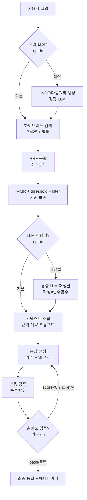

# Design Document

RAG Answer Quality (Ultra Production)

## Overview

현재 파이프라인은 `ai_engine/rag/`(indexer→hybrid_search→embedder=TF-IDF→context_builder)와 `ai_engine/server.py`의 다수 엔드포인트(single/parallel/orchestrated/workflow)로 구성된다. RAG 컨텍스트는 `build_system_prompt`로 주입된다. 병렬 경로에는 이미 `_sanitize_hallucination`이 존재한다.

본 설계는 **신규 무거운 의존성 없이** 근거강제·검증·검색정밀도를 올리는 계층을 추가하고, 임베딩은 교체 가능한 provider로 리팩터한다. 모든 신규 LLM 호출(검증/리랭크/확장)은 기존 GatewayClient를 재사용하며, 실패·타임아웃 시 비차단 폴백한다.

설계 원칙:
- **순수 함수 우선**: 파싱·융합·지표 계산은 LLM 없이 결정론적으로 분리 → 단위/속성 테스트 가능.
- **비차단 폴백**: 모든 부가 단계는 실패해도 원 응답/기존 순위로 폴백(가용성 우선).
- **플래그 게이트**: 각 단계는 환경변수/요청 플래그로 on/off. 전부 off면 기존 동작과 동일(무회귀).
- **보존**: 게이트웨이 전용 호출, secret-free, 오프라인 로컬 인덱스, 기존 엔드포인트 시그니처.

## Architecture



## Components and Interfaces

### 1. 근거 계약 프롬프트 (Req 1) — `context_builder.py`
- `build_system_prompt`의 하드코딩 지시에서 "거부 표현 절대 금지"를 제거.
- 근거 계약 블록 추가(요지): "제공된 컨텍스트/도구 결과에 근거해서만 사실을 서술. 근거가 부족하면 불확실성을 명시하거나 도구로 확인. 도구 사용·미디어 생성 지침은 유지."
- 순수 문자열 조립이므로 스냅샷/포함 문자열 단위 테스트로 검증.

### 2. 인용 검증 (Req 2) — 신규 `ai_engine/rag/citation.py`
- `parse_citations(answer:str) -> list[Citation]` : `파일:라인-라인` 패턴 추출(순수).
- `verify_citations(citations, retrieved_chunks) -> CitationReport` : 각 인용이 검색 청크의 (file, start~end) 범위에 포함되는지 대조(순수). 반환에 `verified/unverified` 목록.
- 응답 메타데이터에 `unverified_citations` 부착. 응답 차단 없음.

### 3. 충실도 검증 노드 (Req 3) — 신규 `ai_engine/rag/verifier.py`
- `build_verify_prompt(answer, context) -> messages` (순수).
- `parse_faithfulness(text) -> float` : `SCORE: X.X` 파싱(순수, 기본 0.5 폴백).
- `async verify_faithfulness(gw, model_id, answer, context, timeout) -> VerifyResult` : 경량 모델 호출. 타임아웃/오류 시 `degraded=True, score=None`.
- 호출부(server.py 채팅 경로)에서 score<threshold & retry>0이면 근거 강조 지시로 1회 재생성. threshold/재시도/타임아웃/활성은 env(`AE_VERIFY_*`).

### 4. RRF 융합 (Req 4) — `hybrid_search.py`
- 신규 순수 함수 `rrf_fuse(rank_lists: list[list[int]], k:int=60) -> list[(idx, score)]`.
- `HybridSearcher.search`에 `fusion="rrf"|"weighted"` 파라미터 추가(기본 "rrf"). RRF는 BM25 순위·벡터 순위를 각각 랭크 리스트로 만들어 융합. MMR/threshold/filter는 융합 후 기존 로직 재사용.
- 벡터 미사용 시 BM25 단일 랭크로 동작(예외 없음).

### 5. LLM 리랭커 (Req 5) — 신규 `ai_engine/rag/reranker.py`
- `build_rerank_prompt(query, candidates) -> messages` (순수). 후보는 인덱스+요약(파일:라인+첫 N줄).
- `parse_rerank_order(text, n_candidates) -> list[int]` : 유효 인덱스만, 중복 제거, 누락 인덱스는 원순서로 뒤에 append(순수).
- `async rerank(gw, model_id, query, candidates, timeout) -> list[int]` : 실패 시 원순서 반환.
- (쿼리, 후보 fingerprint) 캐시(메모리 LRU). env(`AE_RERANK_*`).

### 6. 쿼리 확장 (Req 6) — 신규 `ai_engine/rag/query_expand.py`
- `should_expand(query) -> bool` (순수, 토큰 수/모호성 휴리스틱).
- `async expand_query(gw, model_id, query, timeout) -> list[str]` : HyDE/동의 키워드. 실패 시 `[]`.
- context_builder에서 원쿼리+확장쿼리 각각 검색 → RRF 융합. 기본 비활성(`AE_QUERY_EXPAND=0`).

### 7. Pluggable EmbeddingProvider (Req 7) — `embedder.py` 리팩터
```python
class EmbeddingProvider(Protocol):
    def embed(self, text: str) -> Optional[np.ndarray]: ...
    def embed_batch(self, texts: list[str]) -> list[Optional[np.ndarray]]: ...
    @property
    def dimension(self) -> int: ...
    @property
    def is_ready(self) -> bool: ...
```
- `TfidfEmbeddingProvider` : 기존 `BedrockEmbedder`를 래핑(동작 보존, 기본값).
- `TitanGatewayEmbeddingProvider` : `gw.invoke_model("amazon.titan-embed-text-v2:0", ...)` 시도. 최초 probe 실패(권한/미허용) 시 `is_ready=False` → 상위에서 TF-IDF 폴백. 옵트인(`AE_EMBED_PROVIDER=titan`).
- `LocalOnnxEmbeddingProvider` : 인터페이스·플래그만 정의(스텁). 실제 모델 번들/PyInstaller 통합은 별도 태스크(용량·빌드 영향 격리). `AE_EMBED_PROVIDER=onnx`.
- `get_embedding_provider(env, gw)` 팩토리. context_builder는 이 팩토리를 통해 provider 취득. 기존 차원 가드(hybrid_search) 그대로 활용.

### 8. 평가 하네스 (Req 8) — 신규 `scripts/eval_rag_quality.py` + 지표 모듈 `ai_engine/rag/eval_metrics.py`
- `recall_at_k(relevant, retrieved, k) -> float`, `mrr(relevant, retrieved) -> float` (순수).
- `citation_coverage(report) -> float`, `unverified_ratio(report) -> float` (순수).
- golden set: 레포 기반 (질의, 정답 근거 파일/라인) YAML/JSON. 초기엔 소규모 수기 + 자동 후보 생성.
- pytest 파일: `scripts/test_rag_quality_metrics_pbt.py`(속성 테스트: recall/MRR 경계·단조성 등).
- baseline 대비 회귀 게이트: baseline JSON 저장 → 신규 점수가 baseline−ε 미만이면 실패.

### 9. 멀티에이전트 교차 검증 (Req 9) — server.py 합의 경로
- 합의 병합 전, 검증자 모델이 각 후보의 근거 충실도를 채점하고 충돌 사실을 표기. `verifier.py` 재사용.
- 옵트인(`AE_CONSENSUS_CROSSVERIFY=1`). 비활성 시 기존 합의 보존. 실패 시 폴백.

### 10. 성능·플래그 (Req 10)
- env 일괄: `AE_ANSWER_QUALITY=1`(마스터), 하위 `AE_VERIFY`, `AE_RERANK`, `AE_QUERY_EXPAND`, `AE_RRF`, `AE_CONSENSUS_CROSSVERIFY`, `AE_EMBED_PROVIDER`.
- 각 단계 타임아웃 env(`*_TIMEOUT_MS`). 전부 off면 기존 경로와 동일.

## Data Models

```python
@dataclass
class Citation:
    file: str
    start_line: int
    end_line: int
    raw: str

@dataclass
class CitationReport:
    verified: list[Citation]
    unverified: list[Citation]
    coverage: float  # 검증된 인용 / 전체 사실문장(근사)

@dataclass
class VerifyResult:
    score: Optional[float]   # None이면 검증 불가(degraded)
    degraded: bool
    feedback: str = ""
```

## Correctness Properties

(속성 기반 테스트(PBT) 대상)

### Property 1: RRF 결정론·단조성
동일 랭크 리스트 입력 → 동일 출력(결정론). 순위가 높을수록 RRF 기여도가 크다(단조).
**Validates: Requirements 4.1, 4.2**

### Property 2: RRF 스케일 불변성
BM25/벡터 점수에 임의의 양의 상수배를 해도 RRF 융합 순위는 불변(순위 기반이므로).
**Validates: Requirements 4.1**

### Property 3: 인용 검증 정확성
검색 청크의 (file, start~end) 범위에 포함된 인용만 verified, 벗어나면 unverified. 임의 문자열은 파싱에서 안전하게 무시된다.
**Validates: Requirements 2.2, 2.4**

### Property 4: 리랭크 파싱 안전성
리랭커가 범위 밖/중복/누락 인덱스를 반환해도 출력은 [0, n) 유효 인덱스의 순열이다(누락 인덱스는 원순서로 뒤에 append).
**Validates: Requirements 5.2, 5.5**

### Property 5: 폴백 불변식
검증/리랭크/확장 단계가 예외 또는 타임아웃이면 결과는 각각 원응답 / 원순위 / 원쿼리 결과와 동일하다.
**Validates: Requirements 3.5, 5.3, 6.3, 10.1**

### Property 6: 무회귀
모든 품질 플래그가 off이면 컨텍스트·순위·응답이 기존 구현과 동일하다(골든 스냅샷).
**Validates: Requirements 10.4**

### Property 7: recall@k 단조성
k가 커지면 recall@k는 비감소한다(0≤recall≤1).
**Validates: Requirements 8.2**

## Error Handling
- 모든 신규 LLM 호출: try/except + asyncio timeout → 폴백값 반환, degraded 플래그 기록, 서버 로그 남김(토큰/자격증명 미노출).
- 임베딩 provider probe 실패 → TF-IDF 폴백(기존 hybrid_search 차원 가드 유지).
- 인용/파싱 실패 → 빈 결과로 안전 처리, 응답 비차단.

## Testing Strategy
- 순수 함수(RRF/citation/verify 파싱/rerank 파싱/metrics)는 파일 기반 pytest + fast-check류 속성 테스트.
- 실행: `./venv/bin/python -m pytest <file> -p no:cacheprovider -q`.
- 통합: 플래그 off 시 골든 스냅샷으로 무회귀 검증. LLM 호출 단계는 목(mock) gateway로 폴백 경로 검증.
- 평가 하네스로 baseline 대비 recall@k·충실도 개선을 수치로 제시(울트라 프로덕션 근거).

## Deployment / Constraints
- 게이트웨이 경유 유지, secret-free, 오프라인 로컬 인덱스 유지.
- Phase 1~2(근거강제/검증/RRF/리랭커/평가)는 신규 의존성 0 → 즉시 동결 빌드 반영 가능.
- Phase 3(로컬 ONNX 임베딩)은 onnxruntime + 모델 파일 번들 필요 → 별도 태스크에서 PyInstaller/빌드 영향 검증 후 도입(모델 가중치는 repo 미커밋, 빌드시 다운로드).
