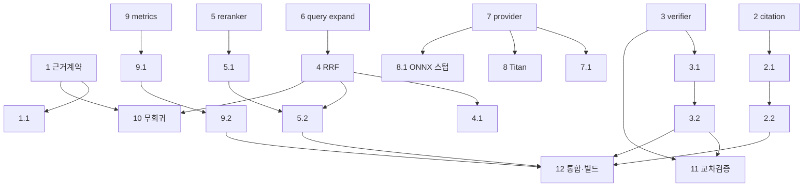

# Implementation Plan

RAG Answer Quality (Ultra Production).

## Overview

각 태스크는 신규 의존성 최소·비차단 폴백·플래그 게이트 원칙을 따르며, 순수 함수는 파일 기반 pytest로 검증한다. 실행: `./venv/bin/python -m pytest <file> -p no:cacheprovider -q`. 우선순위: Phase 1 → 2 → 4(평가로 수치화) → 3 → 5. Phase 1·2만으로도 할루시네이션·정밀도 체감 개선을 목표로 한다.

## Tasks

### Phase 1 — 근거 강제 & 검증 (신규 의존성 0, 최대 임팩트)

- [x] 1. 근거 계약 프롬프트로 교체 (anti-hallucination)
  - `context_builder.py`의 시스템 프롬프트에서 "거부 표현 절대 금지" 지시 제거
  - "제공된 컨텍스트/도구 결과에 근거해서만 서술, 부족하면 불확실성 명시 또는 도구 확인" 근거 계약 추가
  - 도구 사용·미디어 생성 지침은 보존
  - _Requirements: 1.1, 1.2, 1.3, 1.4, 1.5_

- [x] 1.1 근거 계약 프롬프트 포함/보존 단위 테스트
  - 근거 계약 문구 포함, "거부 금지" 문구 부재, 도구 지침 보존 검증 — `scripts/test_grounding_prompt.py`
  - _Requirements: 1.1, 1.4_

- [x] 2. 인용 파싱·검증 모듈 `ai_engine/rag/citation.py`
  - `parse_citations`, `verify_citations`, `CitationReport` 구현(순수)
  - _Requirements: 2.1, 2.2, 2.4_

- [x] 2.1 인용 검증 속성 테스트 (Property 3)
  - 범위 내만 verified, 범위 밖 unverified, 임의 문자열 무시 — `scripts/test_citation_verify_pbt.py`
  - _Requirements: 2.2, 2.3, 2.4, 2.5_

- [x] 2.2 채팅 경로에 인용 검증 배선 (비차단 메타데이터)
  - `answer_quality.enhance_answer` 오케스트레이터 + `route_openai_agent` 반환에 `answerQuality` 메타데이터 배선(플래그 게이트, additive). 백엔드 부팅 스모크 통과
  - (스트리밍 Bedrock 엔드포인트 + 청크 range 스레딩은 런타임 게이트 후속) — `scripts/test_answer_quality_orchestrator_pbt.py`
  - _Requirements: 2.1, 2.3, 2.5_

- [x] 3. 충실도 검증 모듈 `ai_engine/rag/verifier.py`
  - `build_verify_prompt`(순수), `parse_faithfulness`(순수), `verify_faithfulness`(async, 타임아웃/폴백)
  - _Requirements: 3.1, 3.2, 3.5, 3.6_

- [x] 3.1 충실도 파싱·폴백 단위 테스트
  - `SCORE:` 파싱 경계·결측 폴백(0.5)·degraded — `scripts/test_verifier_pbt.py`
  - _Requirements: 3.5, 3.6_

- [x] 3.2 검증 노드 채팅 경로 통합 (오케스트레이터 배선)
  - `enhance_answer`가 `AE_VERIFY` on + gw 제공 시 충실도 채점→`answerQuality.faithfulness` 부착, `faithfulness_below_threshold` 판단 순수함수 제공, 실패/타임아웃 비차단
  - `route_openai_agent`에 배선(플래그 게이트, 부팅 스모크 통과). 교정 재생성 루프·스트리밍 Bedrock 경로는 런타임 게이트 후속
  - _Requirements: 3.1, 3.3, 3.4, 3.5, 10.1_

### Phase 2 — 검색 정밀도 (신규 의존성 0)

- [x] 4. RRF 융합 순수 함수 + `search()` 배선 `hybrid_search.py`
  - `rrf_fuse`(k=60) 구현, `search(fusion="weighted"|"rrf")` 추가, MMR/threshold/filter 보존, 벡터 미사용 시 BM25 단독 순위 보존
  - 기본값은 안전상 `weighted` 유지(무회귀). rrf 기본 전환은 시맨틱 임베딩+평가로 정밀도 우위 실측 후 수행(설계 노트) — `scripts/test_search_fusion_noregression.py`
  - _Requirements: 4.1, 4.3, 4.4, 4.5_

- [x] 4.1 RRF 속성 테스트 (Property 1, 2)
  - 결정론·단조성·스케일 불변성 — `scripts/test_rrf_fusion_pbt.py` (rrf_fuse 구현 완료)
  - _Requirements: 4.1, 4.2_

- [x] 5. LLM 리랭커 모듈 `ai_engine/rag/reranker.py`
  - `build_rerank_prompt`(순수), `parse_rerank_order`(순수, 유효인덱스 순열), `rerank`(async, 폴백)
  - _Requirements: 5.1, 5.2, 5.3, 5.5_

- [x] 5.1 리랭크 파싱 속성 테스트 (Property 4)
  - 범위 밖/중복/누락 인덱스 → [0,n) 유효 순열 — `scripts/test_reranker_parse_pbt.py`
  - _Requirements: 5.2, 5.5_

- [x] 5.2 context_builder에 리랭커 배선 (opt-in, 폴백)
  - `retrieve_evidence_sync`를 `build_context`에 `AE_RETRIEVAL_PIPELINE` 게이트로 배선
    (기본 off=기존 searcher.search 무회귀). on + 게이트웨이 시 query확장→하이브리드→
    RRF→LLM리랭크 경로 사용, 파이프라인 예외 시 기존 검색으로 안전 폴백
  - `file_filter`를 rerank 이전에 적용하도록 `RetrievalConfig.file_filter`로 통과
  - 검증: `scripts/test_context_builder_pipeline_wiring.py`(기본 off/on/무게이트웨이/예외폴백),
    `scripts/test_retrieval_pipeline_pbt.py`(file_filter 단일·확장·noop)
  - _Requirements: 5.1, 5.3, 5.4, 10.1_

- [x] 6. 쿼리 확장 모듈 `ai_engine/rag/query_expand.py` (opt-in, 기본 off)
  - `should_expand`/`parse_expansions`(순수), `expand_query`(async, 폴백) — `scripts/test_query_expand_pbt.py`
  - 원+확장 결과 RRF 융합을 `retrieve_evidence`에 연결하고 `build_context` 배선 완료
    (`AE_QUERY_EXPAND` 게이트, file_filter 통과) — `scripts/test_retrieval_pipeline_pbt.py`
  - _Requirements: 6.1, 6.2, 6.3, 6.4_

### Phase 3 — 교체 가능한 임베딩 (인터페이스 우선, 모델 번들 격리)

- [x] 7. EmbeddingProvider 인터페이스 + TF-IDF 어댑터
  - Protocol 정의, 기존 `BedrockEmbedder`→`TfidfEmbeddingProvider` 래핑(동작 보존), `get_embedding_provider` 팩토리
  - (context_builder를 팩토리 경유로 전환하는 배선은 후속; 차원 가드 보존)
  - _Requirements: 7.1, 7.2, 7.5_

- [x] 7.1 TF-IDF 어댑터 무회귀 테스트
  - 어댑터 경유 임베딩이 원 BedrockEmbedder와 동일(차원·벡터 일치) — `scripts/test_embedding_provider_pbt.py`
  - _Requirements: 7.2, 7.5_

- [x] 8. Titan 게이트웨이 임베딩 provider (opt-in, 자동 폴백)
  - `TitanGatewayEmbeddingProvider` + probe, 미허용 시 `is_ready=False`→TF-IDF 폴백(팩토리)
  - (실 게이트웨이 probe는 라이브 자격증명 필요 — 기본 비활성/폴백 보장)
  - _Requirements: 7.3_

- [x] 8.1 로컬 ONNX provider 스텁 + 활성 플래그 (선택)
  - 팩토리에서 `onnx` 선택 시 TF-IDF 폴백(모델 번들/동결 통합은 별도 태스크)
  - _Requirements: 7.4_

### Phase 4 — 평가 하네스 & 품질 게이트

- [x] 9. 지표 순수 함수 `ai_engine/rag/eval_metrics.py`
  - `recall_at_k`, `mrr`, `citation_coverage`, `unverified_ratio`
  - _Requirements: 8.2, 8.3_

- [x] 9.1 지표 속성 테스트 (Property 7)
  - recall@k 단조성·경계, MRR 정의 — `scripts/test_rag_quality_metrics_pbt.py`
  - _Requirements: 8.2_

- [x] 9.2 평가 하네스 `scripts/eval_rag_quality.py` + golden set
  - golden 질의-근거 로드, recall@k/MRR 산출, baseline 저장·회귀 게이트(`--save-baseline`/`--gate`)
  - 실측: ai_engine/rag(99청크, golden 10) → recall@3=1.0, MRR=0.95 (baseline 저장) — `scripts/test_eval_harness.py`
  - _Requirements: 8.1, 8.4, 8.5_

- [x] 10. 무회귀 골든 스냅샷 테스트 (Property 6)
  - 기본 weighted 결정론·불변, rrf opt-in 유효성, BM25 단독 순위 보존 — `scripts/test_search_fusion_noregression.py`
  - 평가 하네스 회귀 게이트로 recall@3=1.0/MRR=0.95 baseline 유지 확인
  - _Requirements: 10.4_

### Phase 5 — 멀티에이전트 교차 검증 (opt-in)

- [x] 11. 합의 경로 교차 검증 배선
  - `ai_engine/rag/cross_verify.py` — `build_crossverify_prompt`/`parse_crossverify`(순수,
    방어적: 범위밖·중복 무시, 누락 default, 0~1 클램프), `cross_verify_consensus`(async, 폴백)
  - server.py 합의 경로(`_orchestrator_merge` 직전)에 `AE_CONSENSUS_CROSSVERIFY` 게이트로 배선.
    additive `cross_verify`/`crossVerify` 이벤트, 실패 시 비차단 폴백(merger 그대로 진행)
  - 검증: `scripts/test_cross_verify_pbt.py`(파싱 속성 + async 성공/폴백), server.py py_compile 통과
  - _Requirements: 9.1, 9.2, 9.3, 9.4_

- [x] 12. 통합 플래그 + 부팅 스모크 (부분)
  - `AE_ANSWER_QUALITY`(마스터)/`AE_VERIFY*`/`AE_EMBED_PROVIDER`/`AE_RERANK*`/`AE_QUERY_EXPAND` 플래그 정의
  - `AE_ANSWER_QUALITY=1`로 백엔드 기동 → `/health` 200 OK 실검증(기존 8765 무변경, 별도 8799)
  - server.py py_compile 통과, 신규 계층 임포트 그래프 정상
  - (대표 질의 end-to-end는 게이트웨이 자격증명 필요 — 런타임 게이트)
  - _Requirements: 10.2, 10.3, 10.4_

## Task Dependency Graph

```json
{
  "waves": [
    { "wave": 1, "tasks": ["1", "2", "3", "4", "5", "6", "7", "9"] },
    { "wave": 2, "tasks": ["1.1", "2.1", "3.1", "4.1", "5.1", "7.1", "8", "8.1", "9.1"] },
    { "wave": 3, "tasks": ["2.2", "3.2", "5.2", "9.2", "10"] },
    { "wave": 4, "tasks": ["11", "12"] }
  ]
}
```



## Notes

- Phase 3의 로컬 ONNX 임베딩(8.1)은 onnxruntime + 모델 가중치 번들이 필요하며, PyInstaller 동결/앱 용량 영향이 커 별도로 격리한다. 모델 가중치는 repo에 커밋하지 않고 빌드 시 다운로드한다.
- 게이트웨이 Titan 임베딩(8)은 BedrockUser 권한에 따라 미허용일 수 있어 항상 TF-IDF 폴백을 보장한다.
- 모든 신규 LLM 호출은 지연 예산·비차단 폴백을 지키며, 전 플래그 off 시 기존 동작과 동일(무회귀)해야 한다.
- 자격증명은 어떤 파일에도 저장하지 않으며, 로그에 토큰/키를 남기지 않는다.

### 런타임 게이트(라이브 백엔드+게이트웨이 필요) 잔여 작업
- ~~**5.2 리랭커 → context_builder 배선**~~ ✅ 완료: async `retrieve_evidence` + sync 어댑터
  (`retrieve_evidence_sync`, 러닝루프 내 별도 스레드)로 sync/async 충돌 해소. `build_context`에
  `AE_RETRIEVAL_PIPELINE` 게이트로 배선, 예외 시 기존 검색 폴백. 파일 테스트로 검증(라이브 불요).
- ~~**6(확장 결과 RRF 융합) context_builder 연결**~~ ✅ 완료: 다중 쿼리 RRF 융합 + file_filter 통과.
- ~~**11 합의 교차 검증**~~ ✅ 배선 완료: `cross_verify.py` + server.py 합의 경로
  `AE_CONSENSUS_CROSSVERIFY` 게이트(additive·비차단). 라이브 게이트웨이 end-to-end 채점은 런타임 게이트.
- ~~**스트리밍 Bedrock 엔드포인트(run_agent_stream/run_agent_with_tools) `answerQuality` 부착**~~ ✅ 완료:
  두 스트리밍 경로가 `build_system_prompt(return_evidence=True)`로 근거(chunks/context)를 재검색 없이
  캡처하고, `[DONE]` 직전 `enhance_answer`로 인용·충실도를 채점해 `answerQuality` SSE 이벤트를 1회 방출
  (`AE_ANSWER_QUALITY` 게이트, additive·비차단). 프론트(`src/main.js`)가 이벤트를 파싱해 본문 오염 없이
  품질 배지/라이브로그로 표시. 부팅 스모크 `/health` 200 OK(AE_ANSWER_QUALITY=1) 실검증.
  - 검증: `scripts/test_context_builder_evidence.py`(return_evidence 계약), import/boot 스모크
  - (교정 재생성 루프·라이브 게이트웨이 실채점 수치는 자격증명 주입 후 런타임 게이트)
- 진행 방법: 8765 dev 서버 정리 후 게이트웨이 자격증명 주입 상태로 기동 → 엔드포인트별 플래그 off 기본 → 스모크 → 점진 활성.
