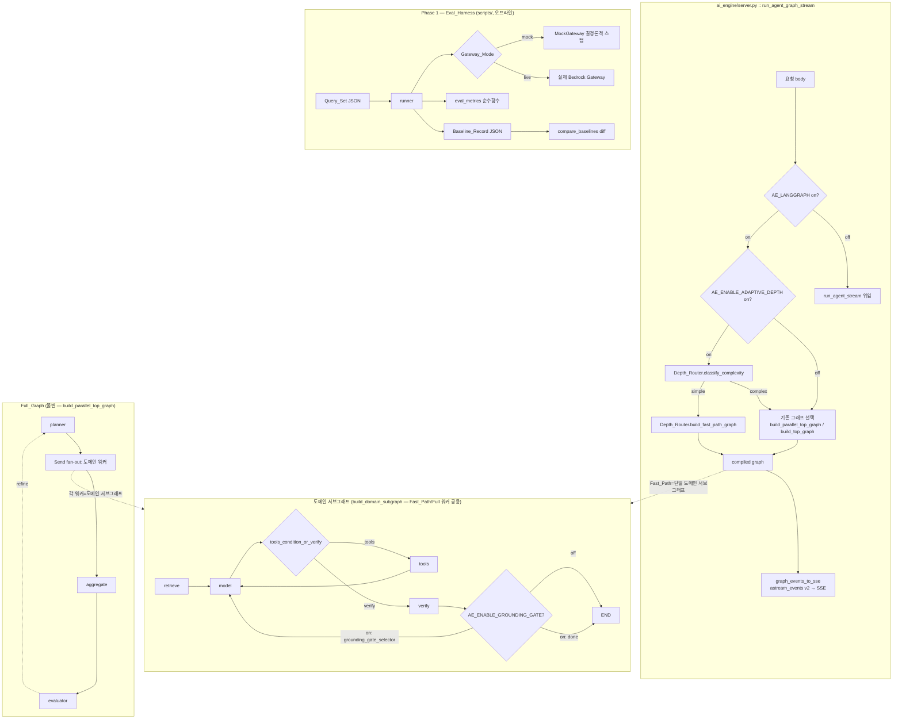

# Design Document

## Overview

이 설계는 요구사항 문서의 세 단계(Phase 1 Eval_Harness, Phase 2a Depth_Router/Fast_Path,
Phase 2b Grounding_Gate)를 **기존 LangGraph/RAG/vector 자산을 불변으로 보존하면서** 얹는
구조를 정의한다. 세 축 모두 전용 환경변수 플래그로 게이트되며, 플래그 off 시 기존
`build_parallel_top_graph`/`build_top_graph` 조립·`astream_events` 스트리밍 계약·deferred
근거성 로깅이 **바이트 동등하게** 동작한다(요구사항 10, 11).

핵심 설계 원칙:

1. **비침습(non-invasive) 삽입점 선택.** Depth_Router 는 `server.py` 의 `graph-stream`
   라우트에서 *어떤 컴파일된 그래프를 실행할지 선택하는 지점*에만 개입한다
   (`ai_engine/server.py` 약 9374행, `compiled = build_parallel_top_graph(deps) if _parallel_on
   else build_top_graph(deps)`). `build_parallel_top_graph` 내부(planner→workers→aggregate→
   evaluator)는 **한 줄도 수정하지 않는다.**

2. **기존 프리미티브 재사용(재구현 금지).** Fast_Path 는 `build_domain_subgraph`
   (`subgraphs/_common.py`)를, Grounding_Gate 는 `faithfulness_below_threshold` +
   `local_grounding_score` (`rag/answer_quality.py`, `rag/verifier.py`)를, Eval_Harness 는
   `eval_metrics.py` 의 순수 함수(`recall_at_k`/`mrr`/`context_precision`/`groundedness`/
   `unsupported_claim_rate`)를 그대로 호출한다.

3. **불변 제약 준수.** 모든 신규 LLM 호출은 Gateway(`GatewayChatModel`) 경유 전용, 자격증명은
   상태·체크포인트·Baseline_Record 어디에도 미저장, 개별 `ainvoke` await 하나만
   `asyncio.wait_for` 로 감싸고 스트림 소비 루프(`async for`)는 절대 감싸지 않는다
   (API_NOTES CRITICAL 2), reasoning 메타 노드는 Sonnet 계열(Opus 는 스트리밍 미지원),
   모델 학습 없음.

### 연구·근거 요약 (설계에 반영된 실측/공식문서 근거)

- **`astream_events(version="v2")` 이벤트 형태**: `on_chat_model_stream` 의 `data.chunk` 는
  `AIMessageChunk`(content=토큰 텍스트)이며, `on_chain_start`/`on_chain_end` 에 노드명(`name`)이
  실린다. StreamEvent 최상위 키는 `data/event/metadata/name/parent_ids/run_id/tags`.
  ([LangChain astream_events 레퍼런스](https://reference.langchain.com/python/langchain-core/runnables/base/Runnable/astream_events),
  API_NOTES.md 항목 5에서 실측 확정). 라이선스 준수를 위해 원문을 재구성했다.
- **`Send` 기반 map-reduce / conditional edges**: `add_conditional_edges(source, path_fn,
  path_map)` 의 `path_fn` 은 `Send` 리스트를 반환해 동일 노드를 서로 다른 substate 로 병렬
  호출할 수 있다([LangGraph Send 레퍼런스](https://reference.langchain.com/python/langgraph/types/Send)).
  기존 `plan_dispatch` 가 이미 이 패턴을 사용한다.
- **compiled subgraph as node**: `add_node(name, compiled_subgraph)` 는 유효하며 graph-of-graphs
  로 정상 실행된다([LangGraph subgraph 문서](https://docs.langchain.com/oss/python/langgraph/use-subgraphs),
  API_NOTES.md 항목 6). Fast_Path 는 이 패턴으로 단일 도메인 서브그래프를 top 그래프의 노드로
  얹어 SSE 계약을 동일하게 유지한다.
- **스트리밍 취소 hang**: astream/astream_events 소비 루프 전체를 `asyncio.wait_for` 로 감싸면
  Python 3.14 에서 취소 시 hang(API_NOTES CRITICAL 2). 신규 코드도 이 규칙을 그대로 따른다.

## Architecture

### 전체 구성도



### 세 축의 배치 요약

| 축 | 위치 | 플래그(기본) | 삽입 방식 |
|----|------|-------------|-----------|
| Eval_Harness | `scripts/eval_reasoning_perf.py`(신규) | 없음(오프라인 도구) | 응답 경로와 완전 분리, `eval_metrics.py` 재사용 |
| Depth_Router / Fast_Path | `ai_engine/agent_system/depth_router.py`(신규) + `server.py` graph-stream 선택 지점 | `AE_ENABLE_ADAPTIVE_DEPTH`(off) | 그래프 *선택* 지점에만 개입, `build_parallel_top_graph` 내부 불변 |
| Grounding_Gate | `build_domain_subgraph` 옵션 파라미터 + `nodes/verify.py` verify 경로 | `AE_ENABLE_GROUNDING_GATE`(off) | verify 경로에 bounded refine 루프(플래그 off 시 기존 `verify→END` 바이트 동등) |

### Phase 진행 게이트 (요구사항 12)

Phase 1 이 baseline 을 기록한 뒤에만 Phase 2a/2b 를 진행하고, 각 Phase 는 Eval_Harness 로
개선을 baseline 대비 수치 실증한다. 이는 프로세스 게이트이며 코드가 강제하지 않는다(문서·CI 관례).

## Components and Interfaces

### Phase 1 — Eval_Harness (`scripts/eval_reasoning_perf.py`)

응답 경로(`server.py`)와 분리된 오프라인 CLI. Query_Set 을 로드해 각 질의를 컴파일된 그래프로
실행하고, 지연/근거성/정확성/검색품질 지표를 산출한 뒤 Baseline_Record 로 저장한다.

주요 인터페이스(순수/오케스트레이션 분리):

```python
# ── 순수(결정론적, 테스트 용이) ──
def load_query_set(path: str) -> list[dict]:
    """Query_Set JSON 로드·검증. 각 항목: id/prompt/expected_evidence_refs/expected_answer_refs."""

def chunks_to_refs(evidence: dict) -> list[str]:
    """evidence.chunks[(chunk,score)...] → ["path:start-end", ...] 식별자(eval_metrics 대조용).
    recall_at_k/mrr 의 relevant/retrieved 식별자 규약(path:start-end 또는 파일경로)과 일치."""

def aggregate_metrics(per_query: list[dict]) -> dict:
    """질의별 지표 → 집계(평균·중앙값 지연, 평균 근거성/정확성/recall@k/mrr). 순수 함수."""

def build_baseline_record(active_flags: dict, per_query: list[dict], now: str) -> dict:
    """Baseline_Record dict 조립(자격증명 미포함, 질의 id·지표만 — 요구사항 3.3/3.4)."""

def compare_baselines(before: dict, after: dict) -> dict:
    """두 Baseline_Record 의 지연·근거성·정확성 delta 산출(요구사항 3.2). 순수 함수."""

# ── 오케스트레이션(그래프 실행/게이트웨이) ──
async def run_query(compiled_graph, query: dict, config: dict) -> dict:
    """단일 질의 실행 → {id, latency_ms, grounding, accuracy, recall_at_k, mrr, status}.
    실패 시 {id, status:"failed", error} 로 기록하고 예외 전파하지 않는다(요구사항 1.6)."""

async def run_eval(query_set: list[dict], gateway_mode: str, k: int) -> dict:
    """전체 Query_Set 실행 → Baseline_Record. mock 모드면 MockGateway, live 면 실제 Gateway."""
```

**지연 측정(요구사항 1.2/2)**: `run_query` 는 `time.perf_counter()` 로 질의 제출 직전부터 최종
응답(final_text) 완료까지를 밀리초로 측정한다. mock 모드는 결정론을 위해 `compiled_graph.ainvoke`
(비스트리밍)로 실행하고, live 모드도 동일 인터페이스로 실측한다(스트리밍 오버헤드 배제로 재현성 확보).

**근거성 집계(요구사항 1.3)**: 실행 결과 `state["answer_quality"]` 의 `faithfulness.score` /
`grounding.score` 를 취하고, citation 메타데이터에서 지원/미지원 주장 수를 세어 `eval_metrics`
순수 함수(`groundedness`, `context_precision`, `unsupported_claim_rate`)로 집계한다.

**검색품질(요구사항 1.4)**: `chunks_to_refs(evidence)` 로 얻은 retrieved 식별자와 Query_Set 의
`expected_evidence_refs`(relevant)를 `recall_at_k`/`mrr` 에 넣는다.

**MockGateway (요구사항 2.1/2.4)**: `converse`/`converse_stream_live`/`stream_sse_realtime` 를
구현하는 결정론적 스텁. 응답은 프롬프트(및 근거 컨텍스트)의 해시로 시드된 canned 텍스트로,
동일 Query_Set 에 대해 항상 동일 지표를 산출한다. Gateway 호출·비용·네트워크 없음.

**Gateway_Mode 선택(요구사항 2.3)**: 환경변수 `AE_EVAL_GATEWAY_MODE` 또는 CLI 인자
`--gateway-mode {mock,live}`, 기본 `mock`.

### Phase 2a — Depth_Router / Fast_Path (`ai_engine/agent_system/depth_router.py`)

```python
# 플래그(호출 시점 판독 — 테스트 토글 허용)
AE_ENABLE_ADAPTIVE_DEPTH  # 기본 off
AE_DEPTH_ROUTER_TIMEOUT   # LLM 분류 개별 wait_for 상한(초), 기본 60

def complexity_signals(prompt: str) -> dict:
    """휴리스틱 신호 집계(순수). 재사용: server._is_code_related, server._infer_file_intent_from_prompt.
    반환: {multi_domain: bool, needs_tool: bool, needs_evidence: bool, long: bool}.
    - multi_domain: 여러 도메인 키워드 동시 등장(예: 코드+PPT) 또는 접속 표현('그리고','그 결과로').
    - needs_tool: 파일/미디어 생성 의도(_infer_file_intent_from_prompt) 또는 셸/검색 요구.
    - needs_evidence: 명시적 근거/조사/출처 요구('근거','출처','조사','왜','분석').
    - long: 길이 임계 초과(장문은 복잡 가능성 — _is_code_related 관례와 정합)."""

def classify_heuristic(prompt: str) -> str:
    """신호 중 하나라도 complex 이면 'complex', 아니면 'simple'(요구사항 4.2)."""

async def classify_complexity(prompt: str, deps, *, use_llm: bool = False) -> str:
    """복잡도 분류 → 'simple' | 'complex'.
    1) 휴리스틱 우선(classify_heuristic).
    2) 휴리스틱이 simple 이고 use_llm=True 이면 Gateway LLM 로 1회 확인
       (GatewayChatModel(sonnet, prefer_streaming=True).bind_tools(select_depth, toolChoice)).
       개별 ainvoke 하나만 asyncio.wait_for(AE_DEPTH_ROUTER_TIMEOUT) 로 감싼다(스트림 아님).
    3) LLM 실패/타임아웃/불확실 → 'complex' (요구사항 4.3, fail-safe)."""

def pick_fast_domain(prompt: str, deps) -> str:
    """Fast_Path 단일 도메인 결정 — supervisor._heuristic_route 재사용(media/coding/chat 등)."""

def build_fast_path_graph(deps, domain: str):
    """Fast_Path 컴파일 그래프 반환. 단일 도메인 서브그래프를 top 그래프의 '노드'로 얹어
    SSE 계약(on_chain_start/on_chain_end 서브그래프명)을 Full_Graph 와 동일하게 유지한다:

        g = StateGraph(GraphState)
        g.add_node(domain, build_domain_subgraph(deps, tools=<domain tools>, model_id=...,
                                                 with_retrieve=(domain!='chat'), domain=domain))
        g.add_edge(START, domain)
        g.add_edge(domain, END)
        return g.compile(checkpointer=deps.checkpointer, store=deps.store)

    planner·Send fan-out·aggregate·evaluator 노드를 일절 추가하지 않는다(요구사항 5.2).
    model 왕복은 도메인 서브그래프의 기존 계약(retrieve→model→verify=model 1회, 도구 사용 시
    SUBGRAPH_RECURSION_LIMIT 이내)을 그대로 따른다(요구사항 5.3, 11.4)."""
```

**server.py 삽입(비침습)**: graph-stream 라우트의 그래프 선택 지점에서만 분기한다.

```python
# 기존: compiled = build_parallel_top_graph(deps) if _parallel_on else build_top_graph(deps)
# 신규(플래그 off 시 위 기존 라인과 바이트 동등한 경로):
if _adaptive_depth_on():                       # AE_ENABLE_ADAPTIVE_DEPTH
    depth = await classify_complexity(prompt, deps, use_llm=_depth_llm_on())
    if depth == "simple":
        compiled = build_fast_path_graph(deps, pick_fast_domain(prompt, deps))
    else:
        compiled = build_parallel_top_graph(deps) if _parallel_on else build_top_graph(deps)
else:
    compiled = build_parallel_top_graph(deps) if _parallel_on else build_top_graph(deps)
```

`initial_state`/`graph_config`/`graph_events_to_sse` 배선은 변경하지 않는다. Fast_Path 그래프도
동일한 `graph_events_to_sse(compiled, initial_state, graph_config, ...)` 로 흐르며,
`on_chat_model_stream`(토큰)·`on_chain_start`/`on_chain_end`(도메인명=SUBGRAPH_NAMES 원소) 이벤트가
그대로 방출되어 SSE 이벤트 키 집합이 동일하다(요구사항 5.4).

### Phase 2b — Grounding_Gate (`build_domain_subgraph` 옵션 + `nodes/verify.py`)

Grounding_Gate 는 **verify 경로**(통합 지점 (b))에 bounded refine 루프로 삽입한다. 근거는:

- verify 노드가 이미 `answer_quality`(faithfulness + local grounding)를 계산·부착한다.
- Fast_Path 와 Full_Graph 의 모든 도메인 워커가 `build_domain_subgraph` 를 공유하므로, verify
  경로에 게이트를 두면 두 경로 모두에 자동 적용되고 `build_parallel_top_graph` 내부는 손대지
  않는다(2a 불변 유지).

```python
# 플래그·임계값(호출 시점 판독)
AE_ENABLE_GROUNDING_GATE   # 기본 off
AE_VERIFY_THRESHOLD        # 근거성 임계값, 기본 0.7 (answer_quality 와 공유)
AE_MAX_REFINE              # 재생성 상한, 기본 1 (grounding 전용 카운터에 적용)
AE_GROUNDING_REJECT        # reject 모드 플래그, 기본 off

def grounding_below(answer_quality: dict, env=None) -> bool:
    """근거 미달 판정(순수). 재사용: faithfulness_below_threshold(); 보완: local grounding.
    - faithfulness.score 가 있고 not degraded 이면 faithfulness_below_threshold() 사용.
    - faithfulness 가 degraded/없음이고 grounding.score(로컬 임베딩)가 있으면 그 값 < threshold.
    - 둘 다 산출 불가(degraded) → False (요구사항 7.4 — 근거 컨텍스트 유무와 무관히 통과)."""

def grounding_gate_selector(state) -> str:
    """conditional edge — 'model' | 'done'.
    게이트 off → 'done'. messages 마지막이 refine 지시(HumanMessage)면 'model', 아니면 'done'.
    (verify 가 refine 을 유도할 때만 HumanMessage 를 append 하므로 무한 루프 없음)."""
```

**verify 노드 확장(`make_verify_node`)**: 게이트 on 일 때만 아래 로직을 추가한다(off 시 기존 반환 불변).

```
answer_quality 계산(기존) 후:
  g_rc = state.get("grounding_refine_count", 0)
  if grounding_below(answer_quality):
      if g_rc < AE_MAX_REFINE:
          # bounded refine 유도: 근거 강화 지시를 HumanMessage 로 추가, 카운터 +1
          return {..., "grounding_refine_count": g_rc + 1,
                  "messages": [HumanMessage("[근거 강화] 제공된 근거 범위 안에서만 답을 재작성하라 ...")]}
      else:
          # 상한 소진 & 여전히 미달 → 경고 표기(가용성 유지) 또는 reject 모드면 거절 응답
          if AE_GROUNDING_REJECT:
              final_text = "[근거 부족] 요청을 충분히 뒷받침할 근거를 찾지 못했습니다. ..."
          else:
              final_text = final_text + "\n\n> ⚠️ 근거 부족: 이 응답의 일부는 제공된 근거로 충분히 확인되지 않았습니다."
          return {"final_text": final_text, ...}
```

**build_domain_subgraph 배선(플래그 off ⇒ 바이트 동등)**: 조립 시점에 1회 플래그를 읽어 구조를 결정.

```python
if grounding_gate_on:            # AE_ENABLE_GROUNDING_GATE
    sg.add_conditional_edges("verify", grounding_gate_selector, {"model": "model", "done": END})
else:
    sg.add_edge("verify", END)   # 현행과 동일(무회귀)
```

refine 시 model 이 refine 지시(messages 말미 HumanMessage)를 받아 답을 재작성 → verify 재평가.
`grounding_refine_count` 는 monotonic MAX reducer(`_take_max_int`)로 echo/reset 면역이며 단조
증가하므로 최대 `AE_MAX_REFINE` 회로 유한 종료한다(요구사항 8, 11.5).

**Full_Graph 최종 응답에 대한 범위 명시**: 게이트는 도메인 서브그래프 verify(각 워커/Fast_Path)의
`final_text` 에 작용한다. Full_Graph 의 aggregate 종합 답변은 단일 evidence 컨텍스트가 없어 게이트
대상이 아니며, 근거성은 워커 단계에서 전이적으로 확보된다(요구사항 13 범위 한정과 정합).

## Data Models

### Query_Set (JSON, 입력)

```json
{
  "version": 1,
  "queries": [
    {
      "id": "q-001",
      "prompt": "이 프로젝트의 인증 흐름을 요약해줘",
      "project_path": "/abs/path/optional",
      "expected_evidence_refs": ["ai_engine/server.py:9287-9470", "ai_engine/agent_system/supervisor.py:1-60"],
      "expected_answer_refs": ["auth-flow-summary"]
    }
  ]
}
```

- `expected_evidence_refs`: `recall_at_k`/`mrr` 의 relevant 식별자. 규약 `"path:start-end"` 또는 파일경로.
- `expected_answer_refs`: 정확성 대조용 정답 참조(키/식별자). 프롬프트·정답 전문은 저장 대상 아님.

### Baseline_Record (JSON, 출력 — 요구사항 3)

```json
{
  "timestamp": "2026-07-01T12:00:00Z",
  "gateway_mode": "mock",
  "active_flags": {
    "AE_ENABLE_ADAPTIVE_DEPTH": false,
    "AE_ENABLE_GROUNDING_GATE": false,
    "AE_LANGGRAPH_PARALLEL": true,
    "AE_MAX_REFINE": 1,
    "AE_VERIFY_THRESHOLD": 0.7
  },
  "aggregate": {
    "latency_ms_mean": 0.0, "latency_ms_median": 0.0,
    "grounding_mean": 0.0, "accuracy_mean": 0.0,
    "recall_at_k_mean": 0.0, "mrr_mean": 0.0, "k": 5,
    "n_queries": 1, "n_failed": 0
  },
  "per_query": [
    {"id": "q-001", "latency_ms": 0.0, "grounding": 0.0, "accuracy": 0.0,
     "recall_at_k": 0.0, "mrr": 0.0, "status": "ok"}
  ]
}
```

**보안 불변식(요구사항 3.3/3.4, 11.2)**: Baseline_Record 는 `accessKeyId`/`secretAccessKey`/
`sessionToken` 등 자격증명 키를 **어떤 깊이에서도 포함하지 않는다.** 질의 식별자(`id`)와 지표만
저장하며 프롬프트 전문·대화 원문·`aws_profile`/`bedrock_user` 값을 담지 않는다.

### GraphState 확장 (`agent_system/graph_state.py`)

기존 채널은 불변. Grounding_Gate 전용으로 단일 채널만 추가한다(evaluator 의 `refine_count` 와
분리해 상호 간섭 방지).

```python
# ── 신규: Grounding_Gate bounded refine 카운터 ──
# monotonic MAX reducer(_take_max_int) 재사용 — Send fan-out echo/reset 면역, 0→1→… 단조 증가.
# verify 경로 게이트에서만 증가하며 evaluator 의 refine_count 와 독립적이다.
grounding_refine_count: Annotated[int, _take_max_int]
```

- `depth` 분류 결과는 그래프 조립 *이전*(server.py)에서 결정되므로 상태 채널이 불필요하다.
- 자격증명 필드는 추가하지 않는다(요구사항 11.2 — 기존 정책 유지).

### 신규 환경변수 플래그 요약

| 변수 | 기본값 | 의미 |
|------|--------|------|
| `AE_ENABLE_ADAPTIVE_DEPTH` | off | 적응형 깊이 라우팅 마스터 스위치(요구사항 10.1) |
| `AE_DEPTH_ROUTER_TIMEOUT` | 60 | Depth_Router LLM 분류 개별 wait_for 상한(초, 요구사항 4.5) |
| `AE_DEPTH_ROUTER_LLM` | off | 휴리스틱이 simple 일 때 LLM 확인 사용 여부(옵션) |
| `AE_ENABLE_GROUNDING_GATE` | off | 근거 강제 게이트 마스터 스위치(요구사항 10.2) |
| `AE_VERIFY_THRESHOLD` | 0.7 | 근거성 임계값(answer_quality 와 공유, 요구사항 7.3) |
| `AE_MAX_REFINE` | 1 | grounding refine 상한(요구사항 8.2) |
| `AE_GROUNDING_REJECT` | off | reject 모드(요구사항 9.3) |
| `AE_EVAL_GATEWAY_MODE` | mock | Eval_Harness Gateway_Mode(요구사항 2.3) |

기존 `AE_LANGGRAPH`/`AE_LANGGRAPH_PARALLEL`/`AE_ENABLE_EVALUATOR`/`AE_ENABLE_DAG_PLANNER` 계약은
변경하지 않는다.

## Correctness Properties

*A property is a characteristic or behavior that should hold true across all valid executions of a system — essentially, a formal statement about what the system should do. Properties serve as the bridge between human-readable specifications and machine-verifiable correctness guarantees.*

아래 속성들은 prework 분석에서 PROPERTY 로 분류된 수용 기준을 보편 정량화(universal quantification)
문장으로 변환한 것이다. 중복은 Property Reflection 단계에서 포괄 속성으로 통합했다. 근거성 산출
실패(degraded)·순수함수 경계 등은 생성기(generator)가 다루는 edge case 로 반영한다.

### Property 1: 복잡 질의는 절대 Fast_Path 로 라우팅되지 않는다

*For any* 프롬프트에 대해, `complexity_signals` 중 하나 이상(multi_domain / needs_tool /
needs_evidence)이 True 이거나 LLM 분류가 실패·불확실하면, `classify_complexity` 는 반드시
`'complex'` 를 반환한다(따라서 Full_Graph 로 진행하며 Fast_Path 로 가지 않는다).

**Validates: Requirements 4.2, 4.3, 6.1**

### Property 2: 분류 결과는 항상 두 값 중 하나다

*For any* 프롬프트에 대해, `classify_complexity` 의 반환값은 반드시 `{'simple', 'complex'}` 중
하나다(미정의·예외 전파 없음).

**Validates: Requirements 4.1**

### Property 3: Fast_Path 는 planner·aggregate·evaluator 를 포함하지 않는다

*For any* 도메인 라벨(coding/media/research/ops/chat)에 대해, `build_fast_path_graph(deps, domain)`
가 만든 컴파일 그래프의 노드 이름 집합은 `{'planner', 'aggregate', 'evaluator'}` 및 병렬 fan-out
디스패치와 교집합이 공집합이며, 정확히 하나의 도메인 서브그래프 노드만 포함한다.

**Validates: Requirements 5.1, 5.2**

### Property 4: Fast_Path 실행은 유한하며 model 왕복이 최소다

*For any* simple 질의에 대해, 도구 호출이 없으면 Fast_Path 의 model 노드는 정확히 1회 호출되고,
도구가 사용되어도 model↔tool 왕복은 `SUBGRAPH_RECURSION_LIMIT` 이내로 유한 종료한다.

**Validates: Requirements 5.3, 11.4**

### Property 5: 신규 플래그가 모두 off 면 그래프 구조·경로가 기존과 동등하다 (무회귀)

*For any* 프롬프트와 플래그 조합에 대해, `AE_ENABLE_ADAPTIVE_DEPTH` 와 `AE_ENABLE_GROUNDING_GATE`
가 모두 off 이면 (a) 그래프 선택은 항상 Full_Graph(`build_parallel_top_graph`/`build_top_graph`)이고
Fast_Path 는 절대 선택되지 않으며, (b) `build_domain_subgraph` 가 만든 그래프의 노드·엣지 집합이
게이트 미적용 기존 구조와 동일하다(`verify → END`).

**Validates: Requirements 6.2, 6.3, 10.1, 10.3**

### Property 6: Grounding_Gate 판정은 임계 비교와 degraded 통과를 정확히 만족한다

*For any* `answer_quality` 메타데이터와 임계값 `t` 에 대해, faithfulness 점수 `s` 가 존재하고
degraded 가 아니면 `grounding_below == (s < t)` 이고, 근거성 산출이 degraded(점수 부재)이면
근거 컨텍스트 유무와 무관하게 `grounding_below == False`(통과)이다.

**Validates: Requirements 7.2, 7.4**

### Property 7: Grounding_Gate refine 는 유한하고 단조적이다

*For any* 지속적으로 근거 미달인 응답에 대해, `grounding_refine_count` 는 실행에 걸쳐 단조 비감소하며
`AE_MAX_REFINE` 를 초과하지 않고, 게이트로 인한 model 재호출 총 횟수는 `AE_MAX_REFINE` 이하로
유한 종료한다.

**Validates: Requirements 8.1, 8.2, 8.3, 11.5**

### Property 8: 상한 소진 후 미달이면 경고를 부가하되 본문을 보존한다 (가용성)

*For any* `AE_MAX_REFINE` 소진 후에도 근거 미달인 응답에 대해(reject 모드 off), 최종 `final_text`
는 원본 응답 본문을 부분 문자열로 보존하면서 근거 부족 경고 마커를 포함한다.

**Validates: Requirements 9.1, 9.2**

### Property 9: Baseline_Record 는 자격증명·프롬프트 전문을 포함하지 않는다

*For any* Query_Set 과 플래그 구성으로 생성한 Baseline_Record 에 대해, 재귀적으로 스캔했을 때
`accessKeyId`/`secretAccessKey`/`sessionToken` 키가 어떤 깊이에도 존재하지 않으며, 입력 프롬프트
전문 문자열이 직렬화 결과에 등장하지 않는다(질의 id·지표만 저장).

**Validates: Requirements 3.3, 3.4, 11.2**

### Property 10: mock 모드 지표는 결정론적으로 재현된다

*For any* Query_Set 에 대해, `run_eval(..., gateway_mode='mock')` 을 두 번 실행하면 산출된 질의별·
집계 지표가 동일하다.

**Validates: Requirements 2.4**

### Property 11: recall@k 는 k 에 대해 단조 비감소한다

*For any* relevant 식별자 집합과 retrieved 시퀀스, 그리고 `k1 <= k2` 에 대해,
`recall_at_k(relevant, retrieved, k1) <= recall_at_k(relevant, retrieved, k2)` 이다.

**Validates: Requirements 1.4**

### Property 12: 근거성 집계 지표는 유효 범위와 경계 규약을 지킨다

*For any* 음이 아닌 정수 지원/전체 주장 수에 대해, `groundedness` / `context_precision` /
`unsupported_claim_rate` 의 반환값은 `[0.0, 1.0]` 범위이며, 분모가 0인 경계에서 각 함수의 명시된
관례(`groundedness`=1.0, `unsupported_claim_rate`=0.0, `context_precision`(k<=0)=0.0)를 따른다.

**Validates: Requirements 1.3**

### Property 13: Baseline 비교 delta 는 성분별 차이이며 자기비교는 0이다

*For any* 두 Baseline_Record `before`, `after` 에 대해, 공통 지표 `m` 에 대해
`compare_baselines(before, after)[m] == after[m] - before[m]` 이고,
`compare_baselines(x, x)` 의 모든 지표 delta 는 0 이다.

**Validates: Requirements 3.2**

### Property 14: 개별 질의 실패는 격리되고 나머지는 완주한다

*For any* 일부 질의가 실행 중 예외를 던지는 Query_Set 에 대해, 결과 per-query 항목 수는 입력 질의
수와 같고, 실패 질의는 `status == "failed"` 로 기록되며 나머지 질의는 정상 실행되어 집계의
`n_failed` 와 실제 실패 수가 일치한다.

**Validates: Requirements 1.6**

## Error Handling

모든 신규 동작은 **비차단(가용성 우선)** 을 원칙으로 하며, 기존 코드의 폴백 관례
(`verify.py`, `answer_quality.py`, `supervisor.py`)와 정합한다.

### Depth_Router

- **휴리스틱 예외**: `_is_code_related`/`_infer_file_intent_from_prompt` import·호출 실패는
  `try/except` 로 감싸고 신호를 보수적으로 처리한다(불확실 → complex, 요구사항 4.3).
- **LLM 분류 실패/타임아웃**: `asyncio.wait_for(llm.ainvoke(...), AE_DEPTH_ROUTER_TIMEOUT)` 의
  `TimeoutError`/`GatewayModelError`/기타 예외는 모두 잡아 `'complex'` 로 폴백한다(fail-safe).
  스트림 소비 루프는 감싸지 않는다(API_NOTES CRITICAL 2).
- **그래프 선택 단계 실패**: `build_fast_path_graph` 조립 예외 시 Full_Graph 로 폴백하고, 그마저
  실패하면 기존 `run_agent_stream` 위임(요구사항 7.4 스타일 무회귀 안전장치).

### Grounding_Gate

- **answer_quality 부재/degraded**: `grounding_below` 는 점수 부재·degraded 시 `False`(통과) 반환
  → 게이트가 응답을 차단하지 않는다(요구사항 7.4). 이는 기존 `faithfulness_below_threshold` 의
  비차단 계약을 그대로 승계한다.
- **refine 중 model 타임아웃**: 도메인 model 노드의 기존 `MODEL_NODE_TIMEOUT` 폴백
  (`[모델 응답 시간 초과]` + tool_calls 없음)을 그대로 사용해 verify 로 진행, 이후 상한 판정으로
  유한 종료한다.
- **상한 소진**: `grounding_refine_count >= AE_MAX_REFINE` 이면 추가 refine 을 유도하지 않고
  경고 부가(또는 reject 모드 시 사유 명시 거절)로 종료(요구사항 8.3/9).

### Eval_Harness

- **개별 질의 실패**: `run_query` 는 예외를 잡아 `{status:"failed", error}` 로 기록하고 다음 질의로
  계속한다(요구사항 1.6). 하네스 전체는 중단되지 않는다.
- **지표 산출 부분 실패**: 근거성·검색품질 지표 중 일부가 산출 불가(evidence 없음 등)면 해당 지표만
  중립값으로 기록하고 나머지는 계속(비차단).
- **저장 실패**: Baseline_Record 파일 쓰기 실패는 로그 후 진행(오프라인 도구, 재실행 가능).

### 불변 제약 위반 방지

- Gateway 전용: 신규 모듈은 `boto3`/`anthropic`/`openai` 를 import 하지 않고 `GatewayChatModel`
  (또는 Eval_Harness 의 MockGateway/실 Gateway)만 사용한다(요구사항 11.1).
- 자격증명 미저장: GraphState 신규 채널·Baseline_Record 에 자격증명을 담지 않는다(요구사항 11.2).
- wait_for 규칙: 개별 `ainvoke` await 하나만 감싸고 `async for` 스트림 루프는 감싸지 않는다(11.3).

## Testing Strategy

### 이중 테스트 접근

- **단위(예시) 테스트**: 구체 시나리오·설정 파싱·경계·통합 지점 검증(예: Gateway_Mode 기본값,
  임계 기본 0.7, SSE 이벤트 키 부분집합, reject 모드 문구, degraded 통과 예시).
- **속성(property) 테스트**: 위 Correctness Properties 1~14 를 입력 전반에 걸쳐 검증.

이 기능은 순수 함수(eval_metrics 집계·비교, `grounding_below`, `classify_heuristic`), 구조 불변성
(그래프 노드/엣지 집합), 유한·단조 카운터(refine) 등 **보편 정량화가 가능한 로직**이 핵심이므로
PBT 가 적합하다. 반면 실제 Gateway 왕복(live 모드)·SSE end-to-end·시간 지연 측정은 통합/예시
테스트로 다룬다.

### 속성 기반 테스트 (PBT) 구성

- **라이브러리**: Python `hypothesis` (프로젝트 `scripts/` 의 기존 `*_pbt.py` 관례와 정합).
  직접 구현하지 않는다.
- **반복 횟수**: 각 property 테스트는 최소 100회 반복(`@settings(max_examples=100)` 이상).
- **태그 형식**: 각 테스트 주석에 다음 형식으로 설계 속성을 참조한다 —
  `# Feature: reasoning-perf-reliability, Property {number}: {property_text}`.
- **속성당 단일 테스트**: 각 Correctness Property 는 하나의 property 기반 테스트로 구현한다.
- **생성기(generator)로 edge case 포섭**:
  - 프롬프트: 빈 문자열·공백·한/영 혼합·장문·다도메인 접속 표현·형식 키워드(pptx/pdf 등) 포함.
  - 점수: 0.0/1.0 경계·임계 근방·`None`(degraded).
  - 지표 카운트: 분모 0·지원>전체(방어)·큰 값.
  - Query_Set: 빈 집합·실패 주입 질의·중복 evidence 식별자.
  - k: 0·음수·retrieved 길이 초과.

### 테스트 대상별 매핑

| 대상 | 테스트 유형 | 비고 |
|------|-------------|------|
| `recall_at_k`/`mrr`/집계 순수함수 | PBT (Property 11, 12, 13) | 기존 `eval_metrics.py` 재사용, 결정론 |
| `classify_complexity`/`complexity_signals` | PBT (Property 1, 2) | 휴리스틱 결정론, LLM 분기는 모킹 |
| `build_fast_path_graph` 노드 집합 | PBT (Property 3) | 컴파일 그래프 구조 introspection |
| Fast_Path 유한 실행 | PBT (Property 4) | MockGateway 로 model 호출 카운트 |
| 그래프 무회귀(구조 스냅샷) | PBT (Property 5) | 플래그 off ↔ 기존 구조 노드/엣지 비교 |
| `grounding_below` | PBT (Property 6) | 순수함수, degraded edge |
| refine 유한·단조 | PBT (Property 7) | `grounding_refine_count` MockGateway 반복 |
| 경고 부가·본문 보존 | PBT (Property 8) | 지속 미달 mock |
| Baseline_Record 자격증명 부재 | PBT (Property 9) | 재귀 키 스캔 |
| mock 결정론 | PBT (Property 10) | 2회 실행 지표 동일 |
| 실패 격리 | PBT (Property 14) | 예외 주입 질의 |
| live Gateway 왕복 | INTEGRATION (옵트인) | 수동/CI 별도, 1~3 예시 |
| SSE 스트리밍 계약 | INTEGRATION (Property 인접) | `graph_events_to_sse` emit 키 부분집합 검증 |
| Gateway 전용·wait_for 규칙·Sonnet 기본 | SMOKE (정적) | import 부재·모델 id·코드 구조 검사 |

### 무회귀 검증 (요구사항 10, 12)

- 두 신규 플래그 off 상태에서 기존 그래프 스냅샷 테스트(노드/엣지 집합)와 SSE 이벤트 키 집합이
  변하지 않음을 확인한다(Property 5).
- Phase 진행 게이트(요구사항 12)는 Eval_Harness 로 Phase 별 baseline 을 기록하고 `compare_baselines`
  로 지연 감소(2a)·근거성 개선(2b)을 수치 실증한 뒤 다음 Phase 로 진행한다(운영 관례).
