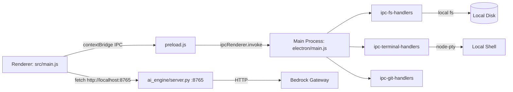
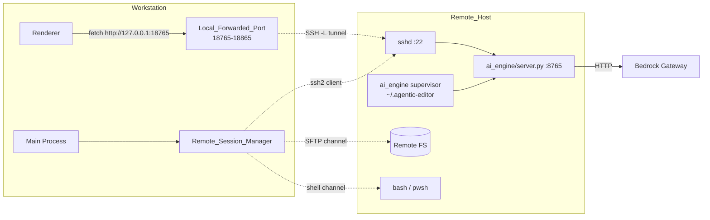
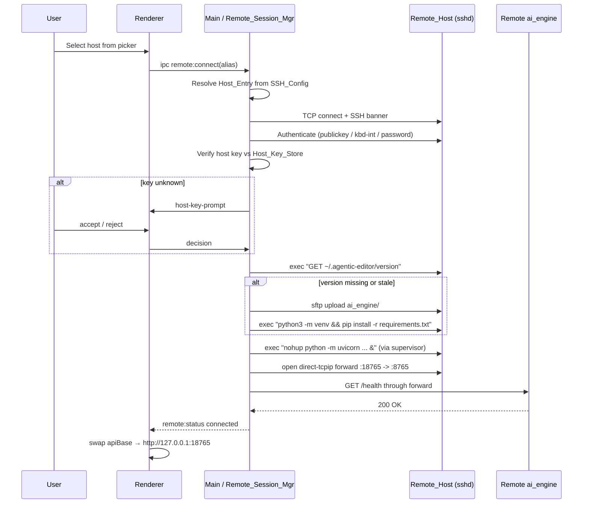
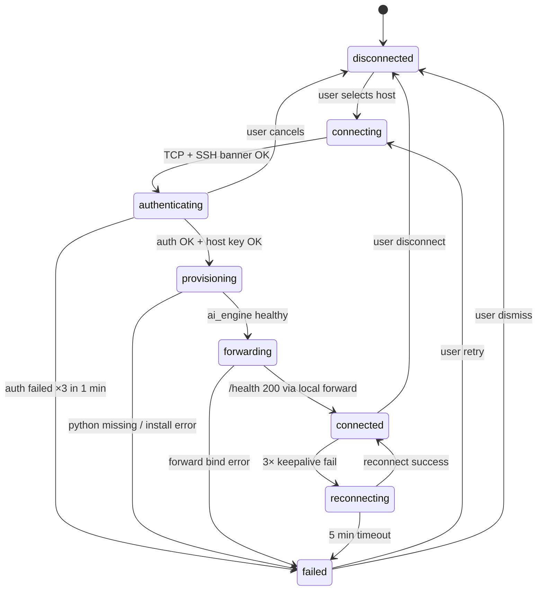
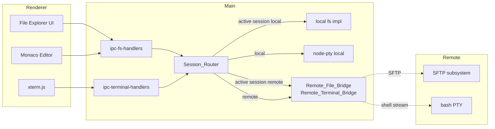

# Design Document — Remote SSH

## Overview

### Purpose

이 문서는 `requirements.md`에 정의된 13개 요구사항을 만족하는 Remote-SSH 기능의 설계를 기술한다. Local_Editor(Electron)가 SSH로 원격 호스트에 접속하여 `ai_engine/server.py`를 자동 프로비저닝하고, 해당 서버의 HTTP 포트를 로컬로 포워딩하여 기존 `localhost:8765` API 계약을 그대로 재사용한다. 파일 시스템·터미널도 SSH 채널을 통해 투명하게 원격으로 라우팅된다.

### 설계 철학

- **기존 계약 보존**: `localhost:8765` FastAPI 계약은 로컬/원격 어느 쪽이든 동일하게 유지한다. 차이는 라우팅 레이어(동적 API base URL)에서만 흡수한다.
- **단일 프로세스 경계에서의 보안**: SSH 자격증명·패스프레이즈·호스트키는 Electron 메인 프로세스 메모리에만 존재하며 IPC로 renderer에 노출하지 않는다.
- **점진적 실패**: 네트워크·프로비저닝 오류는 상태 머신의 명시적 전이로 다루고, 알 수 없는 엣지는 `failed` 상태로 수렴하여 사용자 개입을 요청한다.
- **v1 최소 구현**: 테스트 가능하고 검증 가능한 범위로 수렴. 고급 기능(X11, agent socket forwarding, Windows 원격 호스트 PowerShell PTY 완전 지원)은 v2 이후로 분리한다.

### v1 범위

| 항목 | v1 포함 | v1 제외 |
|---|---|---|
| SSH config parse/print | ✓ (HostName/User/Port/IdentityFile/ProxyJump/ProxyCommand/ForwardAgent/StrictHostKeyChecking/UserKnownHostsFile/IdentitiesOnly/PreferredAuthentications) | `Match` 블록, `CanonicalizeHostname`, `Include` 와일드카드 |
| 인증 | publickey, keyboard-interactive, password, agent 위임 | ssh-keysign, GSSAPI, smart card |
| ProxyJump | 체인 깊이 3까지 | ProxyCommand 임의 실행 (v1은 `ssh -W` 템플릿만 허용) |
| 프로비저닝 | Linux/macOS Remote_Host (Python 3.11+ 선행 설치 가정) | Windows 원격 호스트 자동 Python 설치 |
| 파일 브리지 | SFTP 기반 read/write/stat/list, 폴링 기반 watcher | 원격 inotify 에이전트, 쌍방향 실시간 diff |
| 터미널 브리지 | ssh2 shell stream + PTY resize | tmux/screen 세션 영속성 (단순 재접속만 지원) |
| 재연결 | 지수 백오프 ≤5분, 요청 큐 depth=32 | 오프라인 작업 누적·머지 |
| 멀티 호스트 | 동시 4 세션 | 세션 간 자동 로드밸런싱 |

### 구현 중 개선 여지 (의도적 가정)

- **Windows 번들링**: `ssh2`(pure JS) 채택으로 OS 네이티브 `ssh` 바이너리 의존을 제거하지만, Windows 일부 Ed25519 키 읽기 시 `sshpk`로 fallback이 필요할 수 있다. 구현 시 검증.
- **SFTP 대용량 파일**: 16 MB 초과 파일은 v1에서 "large file" 경고와 함께 스트리밍 수동 승인 플로우로 처리. 한계값은 구현 중 실측으로 조정.
- **Bandwidth-backpressure**: ssh2 stream의 `drain` 이벤트 기반 백프레셔 처리는 구현 중 node-pty 로컬 흐름과의 인터리빙을 실측해야 한다.

---

## Architecture

### Current Local Architecture



### Remote Mode Architecture



### Connection Establishment Flow



### Connection_State Machine



Transition invariants:
- `provisioning → forwarding` requires `/health 200` on the remote side.
- `forwarding → connected` requires `/health 200` through the local forward.
- `connected` is the **only** state in which Remote_File_Bridge / Remote_Terminal_Bridge may service IPC calls.
- `reconnecting` preserves the Credential_Cache, Host_Key_Store entry, and the Local_Forwarded_Port reservation.

### File and Terminal Bridge Flow



### Key Technical Choices

#### SSH library: `ssh2` (Node.js) vs OpenSSH binary spawn

선택: **`ssh2`** (https://github.com/mscdex/ssh2, MIT).

| 항목 | ssh2 (Node.js pure) | OpenSSH spawn |
|---|---|---|
| Windows 배포 | electron-builder로 번들 가능 | Win10+ OpenSSH 존재하나 버전·경로 편차 |
| 패스프레이즈 프로그램적 제공 | API로 전달 | 별도 askpass 스크립트·환경 필요 |
| ProxyJump | `hop` 옵션으로 중첩 Client 구성 | `-J` 지원하나 에러 캡처 제약 |
| SFTP 서브시스템 | 같은 소켓 재사용 | 추가 프로세스 필요 |
| 알려진 리스크 | Ed25519 키 passphrase 일부 엣지, backpressure 수동 처리 | askpass 파이프, 종료 코드 매핑, Windows 따옴표 |

리스크 완화: Ed25519 형식 파싱은 `sshpk`(이미 ssh2 의존성)로 fallback. backpressure는 §Error Handling에서 다룬다. Requirement 11.1 (bundled library, not platform binary) 충족.

#### Remote provisioning: Python venv 자동 셋업

- `~/.agentic-editor/ai_engine` 로 SFTP 업로드 (mtime 기반 delta 업로드).
- `python3 --version` 확인 후 3.11 미만이면 즉시 실패 (Requirement 4.6).
- `python3 -m venv ~/.agentic-editor/venv` + `pip install -r requirements.txt --no-input`.
- 버전 매니페스트: `~/.agentic-editor/version` 에 `{"schemaVersion": 1, "contentHash": "<sha256 of ai_engine tree>"}` 저장. 해시 일치 시 업로드 스킵 (Requirement 4.9).

#### Process supervision: `systemd --user` vs `nohup + PID 파일`

선택: **`nohup + PID 파일` + 간단한 bash 래퍼**.

- 근거: Remote_Host가 systemd를 항상 제공하지 않음(컨테이너, macOS, Amazon Linux 2). user-level systemd 활성화는 EC2 기본 이미지에서 `loginctl enable-linger` 필요 — 배포 가정과 맞지 않음.
- 래퍼 스크립트 `~/.agentic-editor/supervisor.sh`:
  - `while true; do python -m uvicorn ai_engine.server:app --host 127.0.0.1 --port $PORT; sleep 2; done &`
  - PID는 `~/.agentic-editor/supervisor.pid` 및 `~/.agentic-editor/server.pid` 로 기록.
  - Local_Editor는 재연결 시 PID 파일 유효성과 `/health` 응답으로 supervisor 생존 확인.
- trade-off: 부팅 시 자동 기동은 제공하지 않음 (세션 단위 supervisor만). v2에서 선택적 systemd unit 설치 옵션 추가 예정.

#### File watcher: SFTP polling vs 원격 inotify 에이전트

선택: **SFTP polling** (기본 2초 간격, 활성 디렉터리 한정).

- 근거: inotify/fsevents 브리지는 추가 원격 에이전트와 유지보수 비용 발생. 배포 범용성(Requirement 11.4) 저해.
- 구현: 관심 대상 디렉터리 집합을 유지하고 각 엔트리의 `(path, mtime, size)` 스냅샷을 비교. 변경 시 `remote:fs:change` 이벤트 송신.
- Requirement 6.7의 1초 지연 목표를 만족하지 못할 수 있음 — 대신 **활성 탭 디렉터리는 500 ms 폴링**으로 상향하고, 비활성은 2 s로 유지. 실측 후 조정.
- trade-off: 디렉터리 변화 폭풍 시 CPU·트래픽 증가. 폴링 간격을 지수 백오프로 자동 조절.

#### Terminal: `node-pty` 원격화 → `ssh2 shell()` stream

- 원격 PTY는 `ssh2` client의 `shell({ term: 'xterm-256color', cols, rows })` 로 생성.
- 로컬에서는 xterm.js ↔ node-pty 대신 xterm.js ↔ ssh2 shell stream.
- resize는 `stream.setWindow(rows, cols, heightPx, widthPx)` 로 전달.
- 재연결 시 기존 shell stream은 복구 불가 — PID는 리모트에 남지만 xterm.js 버퍼는 로컬에 존재하므로 스크롤백 유지 + "reattach" 버튼 제공 (Requirement 7.4, 8.5).

---

## Components and Interfaces

### Main Process Components

디렉터리: `electron/src/remote/`. 모든 모듈은 CommonJS, ESM 사용 금지 (Electron main 프로세스 기존 규약).

#### `electron/src/remote/ssh-config-parser.js`

```js
/**
 * @typedef {Object} HostEntry
 * @property {string} alias              // Host 블록의 패턴 (정확한 alias, wildcard 포함 가능)
 * @property {string} hostName           // HostName, 없으면 alias
 * @property {string} user               // User, 없으면 process.env.USER
 * @property {number} port               // Port, 기본 22
 * @property {string[]} identityFiles    // IdentityFile (다중 허용), 경로 확장 완료
 * @property {string[]} proxyJump        // ProxyJump 체인
 * @property {string=} proxyCommand      // ProxyCommand 원문
 * @property {boolean=} forwardAgent
 * @property {'yes'|'no'|'ask'=} strictHostKeyChecking
 * @property {string[]=} userKnownHostsFile
 * @property {boolean=} identitiesOnly
 * @property {string[]=} preferredAuthentications
 * @property {string[]} sourcePaths      // include 체인 (디버깅용)
 * @property {boolean} isWildcardOnly    // alias가 순수 wildcard (`*`, `?*` 등)
 */

function parse(text, { basePath, env }) { /* → { entries: HostEntry[], diagnostics: Diagnostic[] } */ }
function print(entries)                 { /* → string */ }
function loadFromDisk({ ssh_config_file_env, home })
                                        { /* Requirement 1.1 경로 결정 */ }
function resolveIncludes(text, basePath, depth = 0) { /* depth ≤ 16, Requirement 1.2 */ }
```

parse/print 규약:
- `print(parse(x)).map(normalize) === parse(print(parse(x))).map(normalize)` (Requirement 1.5 — Correctness Properties §Property 1에서 정식화).
- `parse` 는 항상 `{entries, diagnostics}` 를 반환하며 절대 throw 하지 않는다 (Requirement 1.6, 1.7).
- `print` 는 `isWildcardOnly` 항목을 생략한다 (Requirement 1.4).

#### `electron/src/remote/credential-cache.js`

```js
class CredentialCache {
  constructor() { /* Map<alias, Credential>, in-process memory only */ }
  get(alias)                // → Credential | null
  set(alias, credential)    // Credential = { passphrase?, privateKey?, twoFactor? }
  clear(alias?)             // 특정 호스트 또는 전체
  // 프로세스 종료·logout·"Clear cached credentials" 커맨드에서 clear() 호출
}
```

- 저장소: **Electron 메인 프로세스 메모리** 단독. 절대 디스크에 쓰지 않는다 (Requirement 10.1, 10.2).
- `toJSON()` 는 구현하지 않는다 (구조화 복제 차단).

#### `electron/src/remote/host-key-store.js`

- 파일: `app.getPath('userData')/ssh/known_hosts` (OpenSSH known_hosts 호환 포맷).
- 권한: 생성 시 `fs.chmod(path, 0o600)` (Unix); Windows 는 현재 사용자 ACL로 기록 (Requirement 10.6).
- TOFU 정책:
  - 엔트리 없음 → `host-key-prompt` 이벤트 발행 → 사용자 승인 시 append (Requirement 3.6).
  - 엔트리 불일치 → 연결 즉시 abort, `security-event` 로그 (Requirement 3.7).

#### `electron/src/remote/remote-session.js`

Remote_Session 상태 머신의 단일 인스턴스. 내부적으로 `EventEmitter`.

```js
class RemoteSession extends EventEmitter {
  constructor(hostEntry, { credentialCache, hostKeyStore, logger }) {}
  state      // 'disconnected' | 'connecting' | ...
  connect()         // → Promise<void>  (상태 머신 수동 진행)
  disconnect()      // → Promise<void>
  sendKeepalive()   // 내부 타이머 호출
  getLocalForwardedPort()
  getSFTP()         // → SFTPWrapper (lazy)
  openShell(opts)   // → ssh2 ClientChannel
  exec(cmd, opts)   // → ssh2 ClientChannel (stdout/stderr/code)
  on('state', fn)   // {from, to, reason}
}
```

구현 계약:
- 상태 전이는 오직 내부 메서드에서만 일어나며 외부는 `connect/disconnect/sendKeepalive` 만 호출한다.
- 상태 전이는 `state` 이벤트를 **항상** 발행한다 (Requirement 12.2 로깅 훅).
- 모든 상태 전이는 Correctness Properties §Property 4 의 허용 전이 집합을 만족해야 한다.

#### `electron/src/remote/remote-session-manager.js`

- Remote_Session 최대 4개 관리 (Requirement 9.1).
- 활성 세션(activeAlias) 추적 (Requirement 9.2).
- `switchActive(alias)` → 500 ms 내 라우팅 교체 (Requirement 9.3): 포트 포워드는 유지하고, 파일/터미널 라우터의 참조만 교체 + 비활성 세션의 file watcher 일시정지.
- `disconnect(alias)` 호출 시 `credentialCache.clear(alias)` (Requirement 9.5, 10.2).

#### `electron/src/remote/remote-file-bridge.js`

```js
class RemoteFileBridge {
  constructor(session, { pathSeparator }) {}
  list(remotePath)                 // → [{name, path, isDirectory, size, mtime}]
  read(remotePath, {encoding='utf8'}) // → string | Buffer, 16MB+는 에러
  readStream(remotePath)           // → NodeJS.ReadableStream
  write(remotePath, content)       // atomic: temp → fsync → rename
  stat(remotePath)
  rename(oldPath, newPath)
  mkdir(remotePath, { recursive })
  startWatch(remotePath)           // 활성: 500ms, 비활성: 2s
  stopWatch(remotePath)
  pathSep()                        // '/' or '\\' — Requirement 6.4
}
```

원자적 쓰기 (Requirement 6.3, 6.6):
```
// tempName = remotePath + '.ae-tmp-' + crypto.randomBytes(6).toString('hex')
sftp.writeFile(tempName, content)
sftp.fsync?.(tempName)              // ssh2 OpenSSH extension; 미지원 시 스킵
sftp.rename(tempName, remotePath)
sftp.stat(remotePath) → return
```

#### `electron/src/remote/remote-terminal-bridge.js`

```js
class RemoteTerminalBridge {
  constructor(session) {}
  create(id, { cols, rows, cwd, shell }) // → ssh2 shell stream 등록
  write(id, data)
  resize(id, cols, rows)
  kill(id)
  // 이벤트: 'data' {id, data}, 'exit' {id, code}, 'disconnected' {id}
}
```

- `shell` 선택: Remote_Host OS에 따라 기본 `bash`, Windows OpenSSH 는 사용자 기본 쉘(pwsh) 사용.
- 재연결 시 v1 은 **재부착 불가** → 해당 id 를 `disconnected` 표시. 스크롤백은 xterm.js 렌더러 측에 잔존 (Requirement 7.4, 8.5).

#### `electron/src/remote/provisioner.js`

```js
class Provisioner {
  constructor(session, { localAiEngineRoot, schemaVersion }) {}
  probe()                   // GET /health 원격 직접 (SSH 채널로 `curl` 실행)
  ensureProvisioned()       // probe → uploadIfStale → bootSupervisor → /health
  uploadIfStale()           // ~/.agentic-editor/version 비교
  bootSupervisor()          // supervisor.sh 기동 (또는 기존 PID 살아있으면 재사용)
}
```

- Remote_Host OS 분기: `uname -s` 결과로 Linux/macOS/Windows-OpenSSH 분기.
- Windows 원격: `%USERPROFILE%\.agentic-editor` 경로 사용 (Requirement 11.5). pwsh 분기 스크립트는 v2. v1은 WSL2 / bash 가정.

#### `electron/src/remote/port-forwarder.js`

```js
class PortForwarder {
  constructor(session) {}
  allocatePort()       // 18765..18865 범위 중 첫 번째 사용 가능 포트 (Requirement 5.2)
  open(remotePort)     // net.createServer + session.forwardOut(...)
  close()
  get localPort()
}
```

- `net.createServer` 로 로컬 accept → 각 연결마다 `ssh2 Client.forwardOut('127.0.0.1', srcPort, '127.0.0.1', remotePort)` 호출.
- 18765..18865 범위 스캔, 100 포트 모두 사용 중이면 `failed` (Requirement 5.2).

#### `electron/src/remote/session-router.js`

- 기존 `ipc-fs-handlers`, `ipc-terminal-handlers`, `ipc-git-handlers`, `ipc-project-handlers` 는 파일시스템·터미널 IPC를 **직접** 구현하고 있으므로, Router 를 `activeSession` 유무에 따라 분기시킨다.
- `apiBase()` 헬퍼: Remote 활성이면 `http://127.0.0.1:<localPort>`, 아니면 `http://localhost:8765` (Requirement 5.3, 5.5).

### IPC Additions (registered in `electron/main.js` only)

| 채널 | 인자 | 반환 | 비고 |
|---|---|---|---|
| `remote:list-hosts` | — | `{entries: HostEntrySummary[], diagnostics: Diagnostic[]}` | 자격증명 없이 안전한 요약만 반환 |
| `remote:add-ad-hoc-host` | `{alias, hostName, user, port, identityFile}` | `{ok, error?}` | `remote-hosts.json` 에 추가 (Req 2.5) |
| `remote:set-favorite` | `{alias, favorite}` | `{ok}` | Req 2.6 |
| `remote:connect` | `{alias}` | `{ok, sessionId?, error?}` | 상태 머신 시동 |
| `remote:disconnect` | `{alias}` | `{ok}` | Req 9.5 |
| `remote:switch-active` | `{alias}` | `{ok}` | Req 9.3 |
| `remote:status` | `{alias?}` | `{[alias]: {state, localPort?, error?}}` | Status_Bar 소비 |
| `remote:respond-auth` | `{alias, kind: 'passphrase'\|'2fa'\|'host-key'\|'password', payload}` | `{ok}` | renderer → main 자격증명 응답, main → cache |
| `remote:set-workspace` | `{alias, remotePath}` | `{ok}` | Req 13.2 |
| `remote:clear-credentials` | — | `{ok}` | Req 10.2 |
| `remote:show-log` | — | `{path}` | Req 12.3 |

이벤트 (main → renderer, `mainWindow.webContents.send`):
- `remote:event:state` `{alias, from, to, reason}`
- `remote:event:auth-request` `{alias, kind, prompt, echo}` — renderer가 다이얼로그 표시
- `remote:event:host-key-prompt` `{alias, hostPort, fingerprintSha256, keyType}`
- `remote:event:fs-change` `{alias, remotePath, kind: 'created'|'modified'|'deleted'}`

**보안 경계**: `remote:respond-auth` 의 payload(passphrase/2FA/password)는 IPC 수신 즉시 `CredentialCache` 로 이동하고, 메인 프로세스의 로컬 변수에서도 `payload = null` 로 해제한다. renderer 로 다시 송신하는 경로는 존재하지 않는다 (Requirement 10.4).

### Renderer Components

모두 Web Component (customElements.define), single .js file, no shadow DOM — `.kiro/steering/ui.md` 준수.

#### `src/components/remote-host-picker.js`

- 커맨드 팔레트에서 "Remote: Connect to Host" 로 열림.
- `electronAPI.remoteListHosts()` 결과를 받아 즐겨찾기 섹션 + 전체 알파벳 정렬 섹션 (Req 2.2, 2.6).
- 각 항목: alias, resolved hostName, user, 현재 state 배지 (Req 2.3).
- 빈 상태: "Add ad-hoc host" CTA (Req 2.5).

#### `src/components/remote-status-bar.js`

- 기존 Status_Bar(`src/main.js` 내부 `#topbar-*`) 옆에 추가.
- `data-state` 속성으로 CSS 가변 스타일 (design token 사용).

```css
remote-status-bar[data-state="connecting"] { color: var(--color-warning); }
remote-status-bar[data-state="connected"]  { color: var(--color-success); }
remote-status-bar[data-state="reconnecting"] { color: var(--color-warning); animation: pulse 1s infinite; }
remote-status-bar[data-state="failed"]     { color: var(--color-error); }
```

#### `src/components/remote-auth-dialog.js`

- `remote:event:auth-request` 수신 시 모달 오픈.
- 입력 필드는 kind별로 타입 결정 (passphrase=password input, 2fa=text, password=password).
- 입력값은 `electronAPI.remoteRespondAuth(...)` 즉시 호출 후 DOM에서 제거. renderer 메모리에도 잔류 없음.

#### `src/components/remote-host-key-dialog.js`

- fingerprint 표시 (SHA256 base64, 32자 그룹핑).
- Accept/Reject 버튼. Accept 시 `remote:respond-auth` kind=`host-key` payload=`{accept: true}`.

### Preload Additions (`electron/preload.js`)

```js
contextBridge.exposeInMainWorld('electronAPI', {
  ...기존...,
  // Remote
  remoteListHosts: () => ipcRenderer.invoke('remote:list-hosts'),
  remoteAddAdHocHost: (h) => ipcRenderer.invoke('remote:add-ad-hoc-host', h),
  remoteSetFavorite: (p) => ipcRenderer.invoke('remote:set-favorite', p),
  remoteConnect: (p) => ipcRenderer.invoke('remote:connect', p),
  remoteDisconnect: (p) => ipcRenderer.invoke('remote:disconnect', p),
  remoteSwitchActive: (p) => ipcRenderer.invoke('remote:switch-active', p),
  remoteStatus: (p) => ipcRenderer.invoke('remote:status', p),
  remoteRespondAuth: (p) => ipcRenderer.invoke('remote:respond-auth', p),
  remoteSetWorkspace: (p) => ipcRenderer.invoke('remote:set-workspace', p),
  remoteClearCredentials: () => ipcRenderer.invoke('remote:clear-credentials'),
  remoteShowLog: () => ipcRenderer.invoke('remote:show-log'),
  onRemoteState: (cb) => ipcRenderer.on('remote:event:state', (_, d) => cb(d)),
  onRemoteAuthRequest: (cb) => ipcRenderer.on('remote:event:auth-request', (_, d) => cb(d)),
  onRemoteHostKeyPrompt: (cb) => ipcRenderer.on('remote:event:host-key-prompt', (_, d) => cb(d)),
  onRemoteFsChange: (cb) => ipcRenderer.on('remote:event:fs-change', (_, d) => cb(d)),
});
```

whitelisted 메서드만 노출, `ipcRenderer` 자체 비노출 — `.kiro/steering/security.md` 준수.

### Integration with Existing Handlers

수정 대상:

- `electron/src/ipc-fs-handlers.js`:
  - 함수 시그니처는 유지. 각 핸들러 시작부에 `const active = sessionRouter.getActive(); if (active) return bridge.remoteFs[op](...)`.
  - 경로 해석은 Remote 시 `hostEntry.remoteWorkspace` 기준.
- `electron/src/ipc-terminal-handlers.js`:
  - `terminal:create` 핸들러에서 `active.isRemote && !opts.forceLocal` 이면 `RemoteTerminalBridge.create` 호출, 아니면 기존 `processManager.createTerminal` (Req 7.5).
  - `data`/`exit` 이벤트 송신 경로는 동일 (`terminal:data`, `terminal:exit`).
- `electron/src/ipc-git-handlers.js`:
  - 기존 `execSync(cmd, {cwd: dirPath})` 를 `sessionRouter.exec(cmd, {cwd: dirPath})` 로 대체. Router가 원격이면 SSH exec, 로컬이면 `execSync` 로 분기. 반환 타입은 `{stdout, stderr, code}` 로 통일.
- `electron/src/ipc-project-handlers.js`: 동일한 router 경유 변경.
- `src/main.js`:
  - 모든 `fetch('http://localhost:8765/...')` 를 헬퍼 `apiBase()` 기반으로 치환. 헬퍼는 매 호출 시 `electronAPI.remoteStatus()` 캐시된 상태를 조회. 활성 세션이 `connected` 이면 해당 `localPort` 사용, 아니면 `8765`.
  - Status_Bar: 기존 `#topbar-session-info` 영역 옆에 `<remote-status-bar>` 마운트.

- `electron/main.js`:
  - `app.whenReady` 초기 로직에서 `dataStore.loadRemoteHosts()` 호출 후 Remote_Session_Manager 인스턴스화.
  - "Python 백엔드 자동 시작" 블록은 그대로 두되, 활성 세션이 `connected` 로 진입하면 `ProcessManager.stopPython()` 을 호출 (Req 5.4). 비활성화 후에는 `ProcessManager.startPython()` 재기동 (Req 5.5).

---

## Data Models

### Host_Entry (in-memory)

```ts
type HostEntry = {
  alias: string;                  // Host 패턴 (단일 토큰, wildcard 포함 가능)
  isWildcardOnly: boolean;        // alias가 '*' 등 순수 wildcard이면 true → print()에서 제외
  hostName: string;
  user: string;
  port: number;                   // 기본 22
  identityFiles: string[];        // 절대경로로 확장
  proxyJump: string[];            // 체인, 0개 이상
  proxyCommand?: string;          // 원문 보존 (v1은 실행하지 않음, 파싱만)
  forwardAgent?: boolean;
  strictHostKeyChecking?: 'yes' | 'no' | 'ask';
  userKnownHostsFile?: string[];
  identitiesOnly?: boolean;
  preferredAuthentications?: string[];
  sourcePaths: string[];          // 이 엔트리가 파싱된 파일 경로들(Include 체인)
  raw: string[];                  // 원본 라인 (보존용, print 시 재구성 기준)
};

type Diagnostic = {
  severity: 'warn' | 'error';
  file: string;
  line: number;                   // 1-base
  message: string;
};
```

Normalization(round-trip 비교용): 
- `identityFiles` 는 `~` 확장 후 절대경로 정렬 없음(원본 순서 유지).
- boolean 은 `yes`/`no` 문자열이 아니라 true/false로.
- 대소문자 키는 case-insensitive 비교.

### Remote_Host Persistence Schema

파일: `app.getPath('userData')/settings/remote-hosts.json`

```json
{
  "schemaVersion": 1,
  "hosts": {
    "<alias>": {
      "favorite": true,
      "lastWorkspace": "/home/ubuntu/project",
      "remotePortOverride": 8765,
      "provisioningMode": "auto",
      "source": "ssh-config" | "ad-hoc",
      "adHoc": {
        "hostName": "10.0.0.5",
        "user": "ubuntu",
        "port": 22,
        "identityFile": "~/.ssh/id_ed25519"
      }
    }
  }
}
```

- `adHoc.identityFile` 는 **경로**만 저장. 키 컨텐츠·패스프레이즈는 저장하지 않는다 (Req 10.5).
- `source: 'ssh-config'` 인 항목은 `adHoc` 키를 가지지 않음.

### Host_Key_Store File Format

파일: `app.getPath('userData')/ssh/known_hosts`
포맷: OpenSSH known_hosts 호환. 각 줄:
```
[<hostname>]:<port> <keytype> <base64-key> [comment]
```
권한: Unix `0o600`, Windows 현재 사용자 ACL only (Req 10.6).

### Remote_AI_Engine Version Manifest (on remote)

파일: `~/.agentic-editor/version` (Remote_Host)
```json
{
  "schemaVersion": 1,
  "aiEngineContentHash": "sha256-<hex>",
  "uploadedAt": "2026-05-10T12:34:56Z",
  "localBuildVersion": "0.3.0"
}
```

### Logging Schema

파일: `app.getPath('userData')/logs/remote-ssh.log`  
형식: newline-delimited JSON.
```json
{"ts":"2026-05-10T12:34:56.789Z","level":"info","alias":"gpu-01","event":"state",
 "from":"provisioning","to":"forwarding","reason":"ai_engine healthy"}
```
필수 필드: `ts, level, alias, event`. `event='state'` 면 `from, to, reason` 필수 (Req 12.2).  
마스킹: 패스프레이즈·API token 이 포함될 수 있는 필드는 저장 전 `firstChar + '****'` 로 변환 (Req 10.3, 12.5).

### Request Queue during Reconnect

메인 프로세스 메모리 내 FIFO.
```ts
type QueuedRequest = {
  id: string;                 // UUID v4 (Bedrock requestid 재사용)
  method: 'POST';
  path: '/process' | '/streamprocess';
  body: unknown;
  enqueuedAt: number;
};
```
- 최대 depth 32. 초과 시 가장 오래된 항목 drop 후 renderer에 경고 (Req 8.7).
- `connected` 복귀 시 FIFO 순서대로 replay. `requestid` 동일 — Remote_AI_Engine 에 `requestid` 중복 제거 미들웨어가 있으므로 중복 Bedrock 호출 방지 (Req 8.8, Correctness Property §5).

### Remote_AI_Engine Dedup Contract (neue, minimal)

본 설계는 요청 멱등성(Req 8.8)을 만족하기 위해 `ai_engine/server.py` 에 최소 미들웨어를 추가한다:

```python
# ai_engine/server.py (추가)
from collections import OrderedDict
_REQID_CACHE: OrderedDict[str, dict] = OrderedDict()
_REQID_CACHE_MAX = 512

@app.middleware("http")
async def dedup_requestid(request, call_next):
    rid = None
    if request.url.path in ("/process", "/streamprocess") and request.method == "POST":
        body = await request.body()
        try:
            rid = json.loads(body).get("requestid")
        except Exception:
            rid = None
        if rid and rid in _REQID_CACHE:
            return JSONResponse(_REQID_CACHE[rid])
        # body 소비 복구
        async def receive(): return {"type": "http.request", "body": body}
        request._receive = receive
    response = await call_next(request)
    # 응답 캐시는 /process 200 OK 한정 (스트리밍은 캐시 금지)
    return response
```

- 스트리밍(`/streamprocess`)은 재현 비용 때문에 캐시하지 않고 `requestid` 로 "이미 처리 중" 여부만 판별.
- 캐시 크기 512. LRU evict.
- 기존 로컬 모드에서도 동일하게 동작 (하위호환).

---

## Correctness Properties

*A property is a characteristic or behavior that should hold true across all valid executions of a system — essentially, a formal statement about what the system should do. Properties serve as the bridge between human-readable specifications and machine-verifiable correctness guarantees.*

아래 속성들은 `prework` 단계의 분석을 기반으로, 중복을 제거하고 5 개의 통합 속성을 포함한 25 개로 정리되었다. Requirement 에서 명시적 round-trip 을 요구한 1.5, 6.6, 8.8 은 각각 Property 1, 12, 16 으로 반영되었다.

### Property 1: SSH Config parse/print round-trip

*For any* 유효한 SSH_Config 텍스트 `T`, `parse(T)` 의 결과에서 `isWildcardOnly=true` 엔트리를 제거한 리스트 `E` 에 대해 `parse(print(E))` 는 `E` 와 semantic equal 이다 (UTF-8 바이트 보존, 지원되는 모든 지시어 값 보존, sourcePaths 는 비교 제외).

**Validates: Requirements 1.3, 1.4, 1.5, 1.7, 11.6**

### Property 2: SSH Config Include 재귀 불변량

*For all* Include 그래프 `G` (사이클, 깊이 0..20, 누락 파일 조합 허용), `resolveIncludes(G)` 는 (a) 깊이 16 을 초과하는 경로를 확장하지 않고, (b) 사이클이 존재할 경우 diagnostic 을 최소 1 건 기록하며, (c) 깊이 ≤16 내부의 모든 유효 include 파일은 결과 엔트리의 `sourcePaths` 에 포함된다.

**Validates: Requirements 1.2, 1.7**

### Property 3: Host picker render contract

*For any* `HostEntry` 리스트 `L` 과 favorite 플래그 할당, render 결과 리스트 `R` 은 (a) 모든 favorite 엔트리의 인덱스가 모든 non-favorite 엔트리의 인덱스보다 작고, (b) 각 favorite 섹션 내부, 각 non-favorite 섹션 내부에서 alias 오름차순으로 정렬되며, (c) 모든 엔트리 DOM 에 alias, resolved hostName, user 필드가 포함된다.

**Validates: Requirements 2.2, 2.3, 2.6**

### Property 4: Ad-hoc host addition does not mutate SSH_Config

*For any* ad-hoc host 입력 `H = {alias, hostName, user, port, identityFile}` 와 디스크 상의 임의 SSH_Config 파일 `C`, `addAdHocHost(H)` 호출 이후 `C` 의 바이트 해시는 변경되지 않으며 `remote-hosts.json` 의 `hosts[alias]` 는 `H` 필드만 포함한다 (key contents, passphrase 필드 없음).

**Validates: Requirements 2.5, 10.5**

### Property 5: ProxyJump 체인 config builder

*For any* 길이 `n ∈ [1, 3]` 의 `ProxyJump` 체인 `[h1, h2, ..., hn]` 과 대상 호스트 `t`, `buildConnectConfig(t, hops)` 는 ssh2 Client 가 `h1 → h2 → ... → hn → t` 순으로 hop 을 구성하도록 nested `agentForward`-style 옵션 구조를 반환한다. 구체적으로 최상위 config 의 `hostname/port/username` 은 `h1` 과 일치하고, 중첩된 `hop` 옵션 체인의 마지막 요소는 `t` 와 일치한다.

**Validates: Requirements 3.5**

### Property 6: Authentication failure window detector

*For any* 인증 실패 타임스탬프 시퀀스 `S = [t1, t2, ...]` (밀리초 단위, 중복·비정렬 허용), `StopPolicy.shouldStop(S)` 는 `|{ti ∈ S : ti ∈ [now-60000, now]}| ≥ 3` 를 만족할 때에만 true 를 반환한다 (Req 3.8).

**Validates: Requirements 3.8**

### Property 7: ai_engine upload tree equivalence and content-hash skip

*For any* 로컬 ai_engine 디렉터리 트리 `D` (파일 수, 깊이, 모드 조합 랜덤) 와 원격 version 매니페스트 `M`, (a) `contentHash(D) == M.aiEngineContentHash` 인 경우 `uploadIfStale` 은 업로드를 스킵하며, (b) `contentHash(D) != M.aiEngineContentHash` 또는 `M` 이 없는 경우, 업로드 수행 후 원격 트리 스냅샷 `D'` 은 `D` 와 (상대경로, 내용 바이트, 파일 mode) 집합 기준으로 동등하다.

**Validates: Requirements 4.3, 4.9**

### Property 8: Python version compatibility judgement

*For any* `python3 --version` 출력 문자열 `s` (정상 "Python 3.11.2", 비정상 "Python 2.7.18", 공백 변형, 로케일 변형), `isPythonCompatible(s)` 는 semver 기준으로 major ≥ 3 이고 minor ≥ 11 일 때에만 true 를 반환한다.

**Validates: Requirements 4.6**

### Property 9: Port allocator

*For any* 워크스테이션의 이미 바인딩된 포트 집합 `B ⊆ ℕ`, `allocatePort(range=[18765, 18865])` 는 (a) `B ∩ [18765, 18865] ≠ [18765, 18865]` 인 경우 `min([18765, 18865] \ B)` 를 반환하며, (b) `[18765, 18865] ⊆ B` 인 경우 `PortExhaustedError` 를 던진다.

**Validates: Requirements 5.2**

### Property 10: apiBase 라우팅 결정

*For any* RemoteSessionManager 상태 `S` 와 활성 세션 정보 `a`, `apiBase(S)` 는 (a) `a.state == 'connected'` 이면 `http://127.0.0.1:<a.localPort>` 를, (b) 그 외에는 `http://localhost:8765` 를 반환한다.

**Validates: Requirements 5.3, 5.5**

### Property 11: IPC 라우팅 결정 (fs/terminal)

*For any* IPC 호출 `c ∈ {read, write, list, stat, terminalCreate, ...}` 와 활성 세션 `a`, `sessionRouter.dispatch(c)` 는 `a != null ∧ a.isRemote ∧ a.state == 'connected' ∧ ¬c.opts.forceLocal` 인 경우 Remote_File_Bridge / Remote_Terminal_Bridge 로, 그 외에는 로컬 구현으로 호출을 분기한다.

**Validates: Requirements 5.4, 6.1, 7.1, 7.5**

### Property 12: Remote file atomic write + rollback + round-trip

*For any* 원격 경로 `p` 와 바이트 버퍼 `b` 와 실패 주입 집합 `F ⊆ {permission, diskFull, io, rename, fsync}`, `RemoteFileBridge.write(p, b)` 는 (a) `F == ∅` 이면 성공 후 `read(p) == b` 를 만족하고 (round-trip, UTF-8 포함), (b) `F` 가 write 중간 단계를 실패시키는 경우 원본 파일 `p` 의 내용 바이트 해시는 호출 전과 동일하며, (c) 성공/실패와 무관하게 write 수행 시 temp 파일이 `dirname(p)` 내부에 존재했다가 rename 또는 실패 cleanup 으로 사라진다 (temp 잔류 없음).

**Validates: Requirements 6.3, 6.5, 6.6, 11.6**

### Property 13: Keepalive failure detector

*For any* keepalive 결과 시퀀스 `K ∈ {ok, fail}^n`, `KeepalivePolicy.shouldReconnect(K)` 는 `K` 의 suffix 에 `fail, fail, fail` 이 존재할 때에만 true 를 반환하며, 중간에 `ok` 가 있을 경우 카운터가 0 으로 리셋된다.

**Validates: Requirements 8.1, 8.2**

### Property 14: Exponential backoff with cap

*For any* 재시도 횟수 `n ∈ ℕ`, `backoffMs(n) = min(2000 · 2^n, 30000)`. 시퀀스 `[backoffMs(0), backoffMs(1), ...]` 는 단조 증가하다 30000 에 도달한 후 모든 후속 항목이 30000 이다.

**Validates: Requirements 8.3, 8.6**

### Property 15: Replay queue invariants

*For any* enqueue/dequeue 이벤트 시퀀스 `E`, 큐 `Q` 는 (a) 항상 `|Q| ≤ 32`, (b) dequeue 순서는 enqueue FIFO, (c) `|Q| = 32` 상태에서 enqueue 시 가장 오래된 항목이 drop 된 후 신규 항목이 tail 에 추가된다.

**Validates: Requirements 8.7**

### Property 16: Request idempotency by requestid

*For any* HTTP 요청 시퀀스 `R = [(rid_1, body_1), ...]` 이 Remote_AI_Engine 의 dedup middleware 를 통과할 때, upstream Bedrock Gateway mock 이 수신하는 요청 수는 `|{rid : rid ∈ R 이고 최초로 성공 응답을 받은 요청}|` 과 같다 (중복 rid 재도달은 캐시 응답으로 단락되며 upstream 에 도달하지 않는다).

**Validates: Requirements 8.8**

### Property 17: Session set invariants

*For any* connect/disconnect/switchActive 이벤트 시퀀스 `E`, Remote_Session_Manager 의 상태는 항상 (a) `|sessions| ≤ 4`, (b) `|{s ∈ sessions : s.state == 'connected' ∧ s.isActive}| ≤ 1`, (c) `∀ s ∈ sessions : s.isActive == false ⇒ s.watcherCount == 0` 을 만족한다.

**Validates: Requirements 9.1, 9.2, 9.4**

### Property 18: Credential security invariants

*For any* credential 입력 시퀀스 `C = [(alias, kind, payload), ...]` 과 임의의 HostEntry 집합, 다음 불변량이 항상 성립한다:
1. `C` 처리 전후로 `app.getPath('userData')` 하위의 모든 파일 바이트 해시는 payload 내용을 포함하도록 변하지 않는다 (즉 disk write 0 회 — Req 10.1).
2. `CredentialCache.clear()` 이후 모든 `CredentialCache.get(alias)` 는 null 이다 (Req 10.2).
3. credential payload 는 설정된 sshd 엔드포인트 및 ProxyJump 홉의 TCP 소켓 외의 destination 으로 전송되지 않는다 (Req 10.4).
4. ad-hoc host 엔트리의 JSON 직렬화 출력은 key content, passphrase, decrypted material 을 포함하지 않는다 (Req 10.5).
5. HostEntry 가 `PasswordAuthentication=no` 로 설정된 경우 `promptPassword` 호출 수는 0 이다 (Req 10.7).

**Validates: Requirements 10.1, 10.2, 10.4, 10.5, 10.7**

### Property 19: Log masking

*For any* 패스프레이즈 또는 API token 문자열 `s` with `|s| ≥ 2`, `mask(s)` 는 정확히 `s[0] + '****'` 를 반환하며, 마스킹된 출력 이외 경로로 `s` 가 log sink 에 도달하지 않는다 (로그 라인 전체를 검사하여 `s.substring(1)` 이 원문 그대로 나타나지 않음).

**Validates: Requirements 10.3, 12.5**

### Property 20: Windows path normalization

*For any* Windows 스타일 경로 문자열 `p` (드라이브 레터, backslash, 혼합 separator 포함), `normalizeForSshConfigLookup(p)` 는 (a) drive letter 를 보존하고, (b) backslash 를 forward slash 로 변환하며, (c) 중복 slash 를 단일 slash 로 축소한다.

**Validates: Requirements 11.2**

### Property 21: State transition logging parity

*For any* 상태 전이 이벤트 시퀀스 `T = [(alias, from, to, reason), ...]`, `remote-ssh.log` 에 추가되는 `event='state'` JSON 라인 수는 `|T|` 와 같으며, 각 라인은 해당 전이의 `alias, from, to, reason` 을 정확히 보존한다 (순서도 보존).

**Validates: Requirements 12.2**

### Property 22: User-facing error message completeness

*For any* 에러 surface 함수 `surfaceError(err, session)` 호출, 반환되는 사용자 가시 메시지 객체는 필드 `{hostAlias: string, state: ConnectionState, remediationHint: string}` 을 모두 포함하며, 세 필드 모두 non-empty 이다.

**Validates: Requirements 12.4**

### Property 23: StrictHostKeyChecking default policy

*For any* HostEntry `h` 및 Host_Key_Store 상태 `K`, `effectiveStrictHostKeyChecking(h, K)` 는 (a) `h.strictHostKeyChecking` 가 명시된 경우 그 값을 반환하고, (b) 그렇지 않으면 `h.alias ∈ K` 이면 `'yes'`, 아니면 `'ask'` 를 반환한다.

**Validates: Requirements 13.1**

### Property 24: Per-host preference persistence round-trip

*For any* per-host preference 객체 `P = {favorite, lastWorkspace, remotePortOverride, provisioningMode}` 의 유효 값 조합, `loadHosts(saveHosts(P)) == P` 이다 (JSON 직렬화·역직렬화 round-trip).

**Validates: Requirements 13.3**

### Property 25: State machine transition validity

*For any* 상태 전이 이벤트 시퀀스 `T = [(from, to, trigger), ...]`, 시퀀스의 모든 전이는 §Architecture 의 Connection_State Machine 다이어그램에 명시된 허용된 전이 집합 `ValidTransitions` 의 원소이다. 시뮬레이터가 `ValidTransitions` 에 없는 전이를 시도하면 예외가 발생하고 시퀀스가 거절된다.

**Validates: Requirements §Architecture (state machine consistency, supporting 3.*, 8.*, 9.*)**

---

## Error Handling

### 분류 체계

에러는 3 계층으로 분류한다. 각 에러는 `{code, category, alias, state, cause, remediationHint}` 필드를 가진 객체로 변환되어 Property 22 를 충족한다.

| category | 의미 | 사용자 경험 | 재시도 정책 |
|---|---|---|---|
| `config` | SSH_Config / 호스트 선택 / 인증 자료 문제 | 설정 수정 유도 | 수동 |
| `network` | TCP/SSH/포워드 계층 실패 | Reconnecting UI + backoff | 자동 (Property 14) |
| `provisioning` | 원격 파이썬/venv/업로드 실패 | 실패 원인 + 문서 링크 | 수동 |
| `runtime` | 파일 브리지 / 터미널 브리지 / API 라우팅 실패 | 인라인 에러 토스트 | 상황별 |
| `security` | 호스트키 불일치, credential 정책 위반 | 강한 경고 + 연결 중단 | 금지 |

### 구체 실패 시나리오

#### 네트워크 끊김

- 트리거: ssh2 Client 의 `close` / `error` 이벤트, 또는 Property 13 의 shouldReconnect → true.
- 처리: `RemoteSession.transition('reconnecting', reason)` → `ReconnectLoop` 가동. 지수 백오프(Property 14).
- 복구 계약: 포워드 포트는 **같은 번호로 재바인딩**한다 (포트 번호 변경 시 `apiBase` 이 달라져 inflight 요청이 깨짐).
- 5 분 내 복구 실패 시 `failed` 전이 (Req 8.6).

#### ProxyJump 체인 실패

- 특정 홉에서 auth 실패 시 상세 메시지: `"ProxyJump hop 'bastion' failed: <auth-method> rejected"`.
- 체인 중간 네트워크 실패는 전체 세션을 `reconnecting` 으로 보내되, 재시도에서 홉 순서를 재평가하지 않는다 (사용자 config 이 진실의 원천).

#### 포트 충돌 (18765~18865 전 포트 사용 중)

- `PortExhaustedError` → `failed` 전이. remediationHint: "lsof -i:18765-18865 으로 사용 중 프로세스를 확인하세요". v2 에서 사용자 설정 가능 범위 확장.

#### 원격 Python 미존재 / 버전 미달

- `PythonUnsupportedError` → `failed` 전이. remediationHint: "Remote_Host 에 Python 3.11+ 을 설치하세요: `sudo apt install python3.11`" + 플랫폼별 링크.

#### Remote ai_engine 포트가 이미 사용 중

- provision 단계에서 `curl 127.0.0.1:8765/health` 가 200 이지만 응답 본문이 ai_engine 시그니처(`{"service":"ai-editor-engine"}`)를 포함하지 않으면 `PortOccupiedByOtherService` → `failed`. remediationHint: "원격에서 포트 8765 를 사용 중인 프로세스를 종료하거나 다른 포트로 override 하세요".
- 이 검사는 ai_engine `/health` 응답에 `service` 필드를 추가하는 변경이 필요하다 (설계 상 추가 포함).

#### SFTP 파일 크기 제한

- 기본 한계 16 MB. 초과 시 `read`/`write` 는 `LargeFileError` 를 반환하고 renderer 에 "large file" 모달을 표시. 사용자 확인 시 `readStream` / `writeStream` 기반 경로로 전환 (메모리 버퍼 없이 chunked). 기본 chunk 256 KB.
- trade-off: 현재 `ipc-fs-handlers` 는 `readFile → string` 반환이라 스트리밍에 맞지 않음. v1 에서는 "large file" 경고 후 사용자가 수동으로 열도록 하고 스트리밍 경로는 Monaco 저장 시에만 사용.

#### ssh2 stream backpressure

- shell stream 에서 renderer 로 대량 stdout 전송 시 event loop 정체 가능. `stream.on('data', ...)` 에서 `mainWindow.webContents.send` 호출이 backpressure 없이 진행됨.
- 완화: 스트림 쪽에서 8 KB chunk 버퍼 + 1 ms throttle. 측정 후 조정.

#### 호스트 키 변경

- `security` 카테고리 에러. 연결 즉시 abort, `security-event` 로그. remediation 은 사용자가 known_hosts 엔트리를 명시 삭제할 때까지 재연결 불가.

### 로그 마스킹

- Property 19 에 정의. 모든 log sink(`console`, file log, renderer toast, IPC event) 는 `mask()` 래퍼를 통과한다. 단일 진입점: `electron/src/remote/logger.js`.

### 재시도·Idempotency

- `/process` 와 `/streamprocess` 호출은 `requestid` (UUID v4) 를 renderer 에서 생성하여 재시도 간 보존.
- Property 16 이 주는 보장: 같은 `requestid` 가 중복 도달해도 Bedrock 추가 호출 없음.
- 스트리밍은 중복 요청 재접속에서 "이미 진행 중" 응답(409 또는 재생 불가)으로 응답 — renderer 는 이 경우 사용자에게 "이전 요청 진행 중" 안내.

---

## Testing Strategy

### Dual Approach

- **Property-based tests (PBT)**: §Correctness Properties 의 25 개 속성. 각 속성은 단일 property test 로 구현 (minimum 100 iterations).
- **Example-based unit tests**: 각 prework `Classification: EXAMPLE` 항목을 대상으로 한 구체 케이스.
- **Integration tests**: 실제 SSH 서버가 필요한 성능·E2E 검증.

### PBT 라이브러리 선택

- 테스트 대상 중 Node.js 코드: **`fast-check`** (https://github.com/dubzzz/fast-check, MIT).
- 테스트 대상 중 Python 코드 (ai_engine middleware): **`hypothesis`** (https://hypothesis.readthedocs.io/).
- 두 라이브러리 모두 jest / pytest 와 integration 이 잘 되어 있어 기존 `npm run test:unit`, `python -m pytest tests/unit/` 흐름에 추가 가능.
- 직접 구현 금지 (지시 사항).

### 파일 배치

```
tests/
  unit/
    remote/
      ssh-config-parser.property.test.js    # Property 1, 2
      host-picker.property.test.js          # Property 3
      remote-hosts-store.property.test.js   # Property 4, 24
      ssh-client-builder.property.test.js   # Property 5
      auth-policy.property.test.js          # Property 6, 23
      provisioner.property.test.js          # Property 7, 8
      port-allocator.property.test.js       # Property 9
      api-router.property.test.js           # Property 10, 11
      remote-file-bridge.property.test.js   # Property 12
      keepalive-policy.property.test.js     # Property 13
      backoff.property.test.js              # Property 14
      request-queue.property.test.js        # Property 15
      session-manager.property.test.js      # Property 17
      credential-security.property.test.js  # Property 18
      log-masking.property.test.js          # Property 19
      path-normalization.property.test.js   # Property 20
      state-log-parity.property.test.js     # Property 21
      error-surface.property.test.js        # Property 22
      state-machine.property.test.js        # Property 25
    test_dedup_middleware.py                # Property 16 (Python)
    remote/
      ssh-config-parser.test.js             # 예제 1.1, 1.3, 1.6, 1.8
      host-picker.test.js                   # 2.1, 2.4, 2.7
      auth-handler.test.js                  # 3.1, 3.2, 3.3, 3.4, 3.6, 3.7, 3.9
      provisioner.test.js                   # 4.1, 4.2, 4.4, 4.7
      port-forwarder.test.js                # 5.1
      session-manager.test.js               # 5.4, 5.5, 9.5
      remote-terminal-bridge.test.js        # 7.4, 7.5, 8.4, 8.5
      status-bar.test.js                    # 12.1, 12.3
      key-store.test.js                     # 10.6, 11.3
  integration/
    remote/
      ssh-handshake.integration.test.js     # 3.10 성능
      file-read-perf.integration.test.js    # 5.6, 6.2
      terminal-latency.integration.test.js  # 7.2, 7.3
      watcher-latency.integration.test.js   # 6.7
      provisioning.integration.test.js      # 4.5, 4.8
      context-switch.integration.test.js    # 9.3
      reconnect.integration.test.js         # 8.* end-to-end
```

### 통합 테스트 환경 — Docker Compose

실제 원격 호스트가 필요한 테스트(Req 3.10, 4.5, 4.8, 5.6, 6.2, 6.7, 7.2, 7.3, 9.3, 8.*)는 Docker Compose 로 재현 가능한 환경을 구성한다:

```yaml
# tests/integration/remote/docker-compose.yml
services:
  sshd:
    image: linuxserver/openssh-server
    environment:
      - PUBLIC_KEY_FILE=/keys/test_id_ed25519.pub
      - PASSWORD_ACCESS=false
      - USER_NAME=aetest
    ports: ["2222:2222"]
    volumes:
      - ./keys:/keys:ro
  sshd-bastion:
    image: linuxserver/openssh-server
    ports: ["2223:2222"]
    # ProxyJump 체인 테스트용
```

네트워크 RTT 시뮬레이션은 `tc qdisc add dev eth0 root netem delay 50ms` 를 테스트 setup 스크립트에서 적용. CI 에서는 GitHub Actions service container 로 동일 구성.

### PBT 실행 규약

- 각 property test 는 최소 100 iterations (fast-check 기본 runs=100, hypothesis 기본 max_examples=100 이상).
- 각 property test 파일 최상단에 주석 태그:
  ```js
  // Feature: remote-ssh, Property 1: SSH Config parse/print round-trip
  ```
- 각 테스트 케이스 함수에도 태그 주석 포함하여 실패 시 역추적 용이.
- Property 16 (Python) 태그:
  ```python
  # Feature: remote-ssh, Property 16: Request idempotency by requestid
  ```

### Unit Test 균형

Unit test 는 다음에 집중:
- Classification=EXAMPLE 인 acceptance criterion (구체 예시 기반).
- Property 의 경계값 (예: 포트 범위 끝값, 깊이 16 정확값).
- Property 로 커버되지 않는 UI 의 구체 상호작용.

Unit test 는 property test 와 중복해서 "랜덤한 입력" 을 다루지 않는다. property test 가 해당 역할을 수행한다.

### Playwright E2E (ui.md 의 webapp-testing skill)

- `tests/e2e/remote_picker.py`: Remote 커맨드 팔레트, 호스트 선택, Status_Bar 상태 변화.
- `tests/e2e/remote_auth_dialog.py`: passphrase / 2FA 다이얼로그 상호작용. mock SSH 서버 사용.

각 신규 Web Component (`remote-host-picker`, `remote-status-bar`, `remote-auth-dialog`, `remote-host-key-dialog`) 는 대응 Playwright 테스트를 동반한다 (project.md 의 webapp-testing 스킬).

### Shrinking Strategy

- fast-check 의 자동 shrinking 을 활용. 큰 SSH_Config 노이즈 주입에서 최소 실패 케이스 추출.
- Property 12 의 실패 주입 집합 `F` 는 `fc.subarray([...])` 로 생성, shrinking 이 최소 실패 조합으로 축소.

### Performance Baselines (measured in integration)

| 목표 | 지표 | 기대치 | 측정 방법 |
|---|---|---|---|
| SSH handshake | wall-clock until authenticated event | ≤10 s (50 ms RTT) | Docker compose + `tc netem delay 50ms` |
| 파일 열기 (1 MB) | open → Monaco 텍스트 세팅 | ≤500 ms | `performance.now()` in renderer |
| 터미널 입력 지연 | keypress → xterm render | ≤80 ms | Playwright trace |
| 프로비저닝 | probe → /health 200 (캐시된 wheel) | ≤120 s | supervisor 스크립트 총 경과 |
| /health 첫 응답 | forward open → 200 OK | ≤2 s | integration test |
| Context switch | switchActive → apiBase 교체 | ≤500 ms | perf.mark |

성능은 CI 에서 3 회 실행 median 으로 판정. 실패 시 failure report 에 3 회 값을 모두 첨부.

---

## v2+ Out-of-Scope (명시적 보류 항목)

아래 항목은 v1 에서 **의도적으로 구현하지 않는다.** v2 이후 별도 스펙으로 다룬다:

- X11 forwarding, SSH agent socket forwarding (`-A` 의 완전 구현).
- 원격 inotify 에이전트 기반 저지연 watcher.
- tmux/screen 기반 터미널 세션 영속성 (원격 supervisor 가 PTY 를 보존하여 재부착).
- Windows Remote_Host 에서의 pwsh PTY 완전 지원 및 자동 Python 설치.
- 오프라인 편집 후 머지 (disconnected 상태에서 로컬 캐시 기반 편집).
- SSH_Config 의 `Match` 블록 및 `CanonicalizeHostname` 디렉터브.
- 임의 ProxyCommand 실행 (보안 검토 후 v2).
- 사용자 설정 가능한 포워드 포트 범위 (현재 18765-18865 고정).
- 세션 간 자동 로드밸런싱.

---

## Assumptions and Trade-offs Summary

| 가정/결정 | 대안 | 채택 이유 | v2 재검토 |
|---|---|---|---|
| `ssh2` Node 라이브러리 | OpenSSH 바이너리 spawn | Windows 번들링·API 제어 | X |
| `nohup + PID 파일` supervisor | systemd user unit | 배포 범용성, 의존성 최소 | 선택적 systemd 옵션 |
| SFTP polling watcher | 원격 inotify 에이전트 | 추가 에이전트 없음 | 고지연 환경용 에이전트 |
| 원자적 쓰기 = temp→rename | 원격 lock 프로토콜 | SFTP 기본 동작, 플랫폼 호환 | — |
| 16 MB 파일 크기 상한 | 무제한 스트리밍 | v1 단순화 | 스트리밍 확장 |
| Local_Editor 에서 ai_engine 자동 설치 | 수동 배포 가이드 | UX 우선 | 관리자 배포 모드 추가 |
| 4 동시 세션 상한 | 무제한 | 리소스 상한 및 UI 복잡도 | 설정 가능화 |
| requestid 캐시 크기 512 (LRU) | 디스크 영속화 | 메모리 단순화 | 영속 캐시 옵션 |
