# Mogam Works

> 다중 모델 AI 코드 에디터 — 병렬 추론, 합의 엔진, 프로젝트 인식 RAG, 멀티에이전트 오케스트레이션, 미디어 생성. AWS Bedrock Gateway 기반.

- 제품명: Mogam Works
- 저장소: `jangkops/Agentic-Editor`
- 플랫폼: macOS (Apple Silicon)

---

## Overview

Mogam Works는 AWS Bedrock Gateway를 통해 90여 개의 LLM을 단일/병렬로 호출하고, 합의를 도출하며, 프로젝트 코드를 인식하는 데스크톱 코드 에디터입니다. 코드 작성뿐 아니라 이미지 생성/편집과 문서(PPTX/PDF/DOCX/XLSX) 생성까지 하나의 워크스페이스에서 수행합니다.

핵심 특징
- 단일/병렬 호출로 여러 모델 답변을 동시에 비교
- 고차원 모델(Opus)이 병렬 응답을 분석해 합의 도출, 합의 모델로 대화 이어가기
- 에이전트 모드: LLM이 파일 읽기/쓰기, 명령 실행, 검색, 이미지 생성/편집 도구를 자율 사용
- 멀티에이전트 오케스트레이션: Coordinator → Planner → Generator → Evaluator (LangGraph)
- 하이브리드 RAG: 신경망 임베딩(fastembed, 다국어) + BM25 키워드 검색
- 대화 요약 체크포인트로 장기 맥락 유지
- 원격 SSH 세션(파일/터미널 브리지)과 통합 터미널(node-pty)
- AWS SSO + BedrockUser assume-role 기반 사용자별 인증/과금

---

## Architecture

전체 스택(Electron 프론트엔드 · FastAPI 백엔드 · AWS Bedrock Gateway 인프라)은 모두 **동일 운영자가 직접 구축·운영**합니다. 이 저장소는 에디터(Electron + Python 백엔드)를 담고, 게이트웨이 인프라 코드(API Gateway/Lambda/ECS 워커/IAM, Terraform, `handler.py`)는 별도의 인프라 저장소에서 관리됩니다.

```
┌───────────────────────────────────────────────────────────────────────┐
│                        Electron (Frontend)                             │
│                                                                        │
│  Renderer (src/)                          Main process (electron/)      │
│  ├─ 파일 탐색기 / Monaco 에디터           ├─ IPC 핸들러                  │
│  ├─ AI 패널: 단일 / 병렬 / 합의           │   (fs·git·project·sso·        │
│  ├─ 통계 · 검색 · Git Graph               │    terminal·remote)          │
│  ├─ 통합 터미널 (xterm)                   ├─ ProcessManager             │
│  ├─ 미디어 / 템플릿 패널                  │   (백엔드 수명주기 + PTY)    │
│  └─ 모델 추천                             ├─ node-pty (로컬 PTY)         │
│                                           ├─ AWS SSO Manager            │
│                                           └─ Remote SSH 브리지          │
│                                               (파일 / 터미널)           │
└───────────────────────────────┬───────────────────────────────────────┘
                                │ IPC(preload contextBridge)
                                │ HTTP + SSE  (localhost:8765)
┌───────────────────────────────▼───────────────────────────────────────┐
│                       FastAPI Backend (ai_engine/)                     │
│                                                                        │
│  API: /api/agents/{run-stream, run-agent, run-parallel}                │
│       /api/models · /api/quota · /api/rag/{index,status}               │
│                                                                        │
│  ┌─ 멀티에이전트 (LangGraph) ─────────────────────────────────────┐    │
│  │  Coordinator → Planner(Opus) → Generator(Sonnet) → Evaluator(Opus) │
│  │  grounding gate · depth router · checkpoint store              │    │
│  └───────────────────────────────────────────────────────────────┘    │
│  ┌─ Agent Tools ─┐  ┌─ RAG ──────────────┐  ┌─ Media ────────────┐     │
│  │ read/write/   │  │ indexer · fastembed │  │ 이미지(Stability/  │     │
│  │ list/run/     │  │ (ONNX MiniLM 384d)  │  │  Nova/Titan/Vertex)│     │
│  │ search +      │  │ + BM25 하이브리드   │  │ PPTX/PDF/DOCX/XLSX │     │
│  │ generate_image│  │ · verifier          │  │ 네이티브 다이어그램 │     │
│  │ /edit_image   │  └─────────────────────┘  └────────────────────┘     │
│  └───────────────┘  대화 메모리(요약 체크포인트)                        │
│                                                                        │
│  Gateway 클라이언트 (gateway_module.py):                                │
│    SigV4 서명 · BedrockUser assume-role · 자격증명 캐시 ·               │
│    재시도/폴백 · invoke-job 비동기 폴링                                 │
└───────────────────────────────┬───────────────────────────────────────┘
                                │ SigV4 서명 HTTPS (execute-api / lambda)
┌───────────────────────────────▼───────────────────────────────────────┐
│         AWS Bedrock Gateway  (동일 운영자 구축·운영, 별도 인프라 저장소) │
│                                                                        │
│  API Gateway                                                            │
│   ├─ POST /converse            논스트리밍 Converse (비동기는 S3 job 폴링)│
│   ├─ POST /invoke              InvokeModel (이미지 모델 등)             │
│   ├─ POST/GET /invoke-jobs/*   비동기 잡 제출/폴링/취소                 │
│   └─ POST /openai/responses*   OpenAI Responses 동기/비동기 라우트      │
│  Lambda Function URL           SSE 실시간 스트리밍                       │
│  ECS 워커 → Bedrock Runtime                                             │
│  IAM: BedrockUser-{name} 역할 · 사용자별 rate limit / quota / 과금       │
└─────────────────────────────────────────────────────────────────────────┘
```

LLM/추론/문서 JSON 생성은 전부 Bedrock Gateway 경유입니다. 이미지 생성은 Bedrock 이미지 모델을 기본으로 하되, 텍스트 정확도가 필요한 경우 `AE_ENABLE_VERTEX_IMAGE=1` 옵트인 시 Vertex AI를 예외적으로 사용합니다.

---

## Screenshots

애플리케이션 화면(에디터, AI 패널, 설정, 통계, 병렬 호출 등). 전체 이미지는 `docs/screenshots/`에 있습니다.

| | | |
|---|---|---|
| 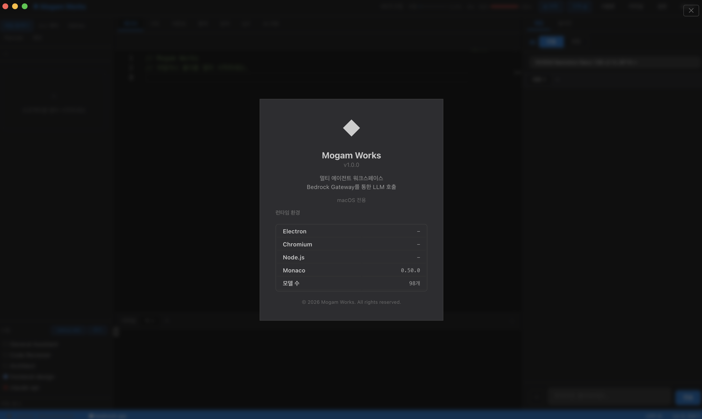 | 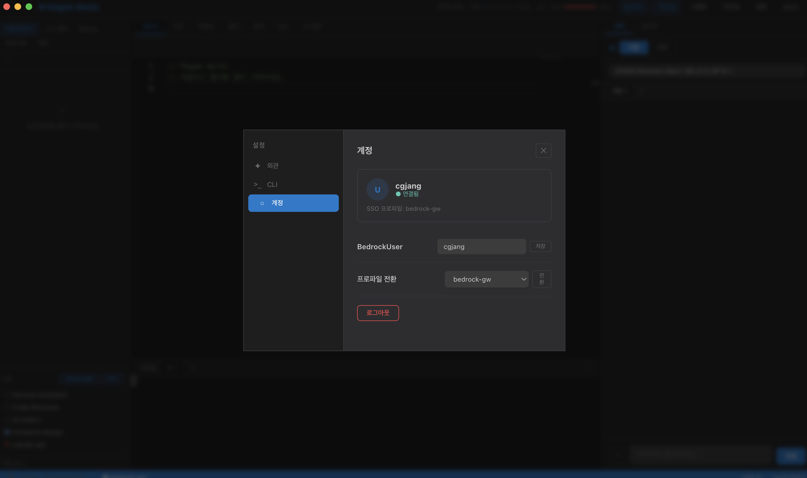 | 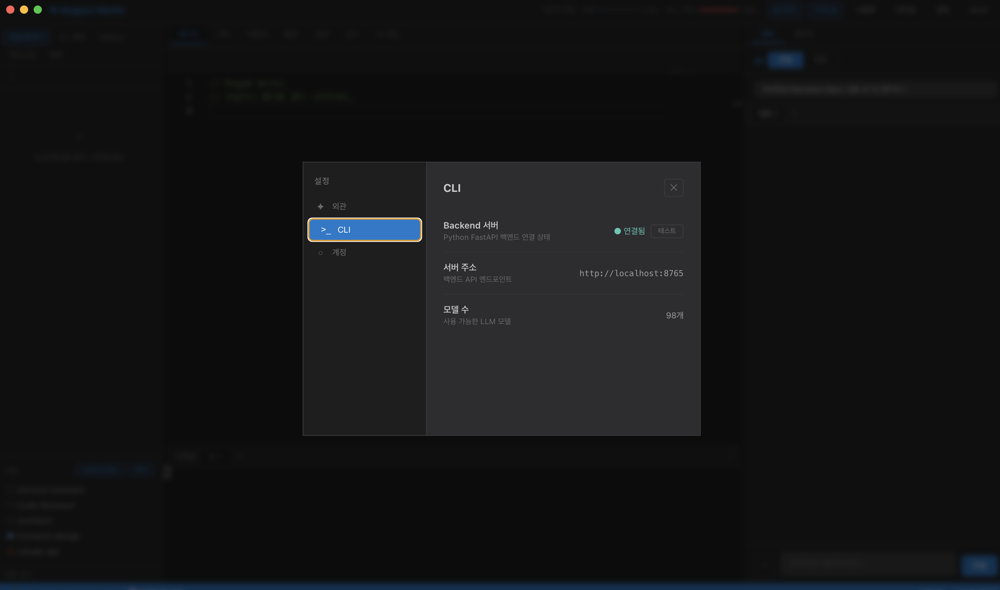 |
| 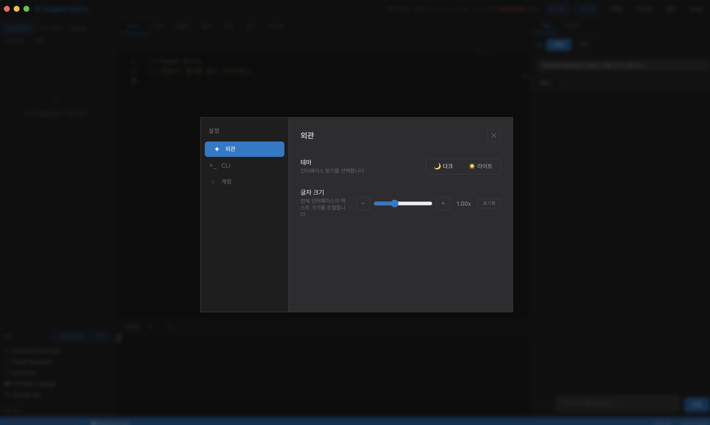 | 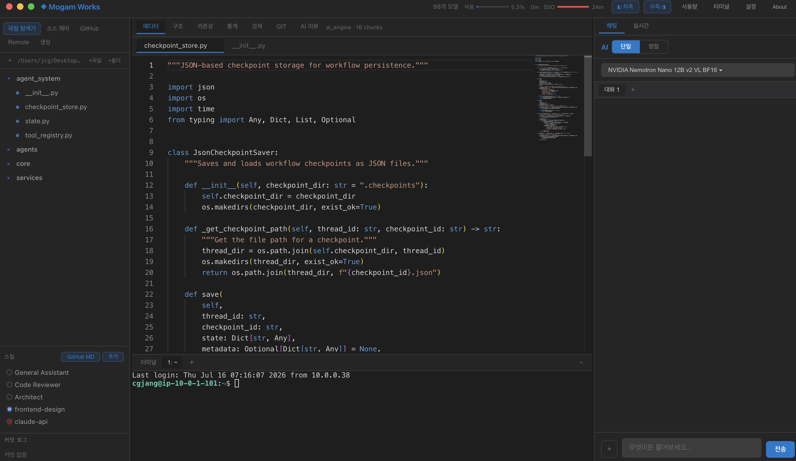 | 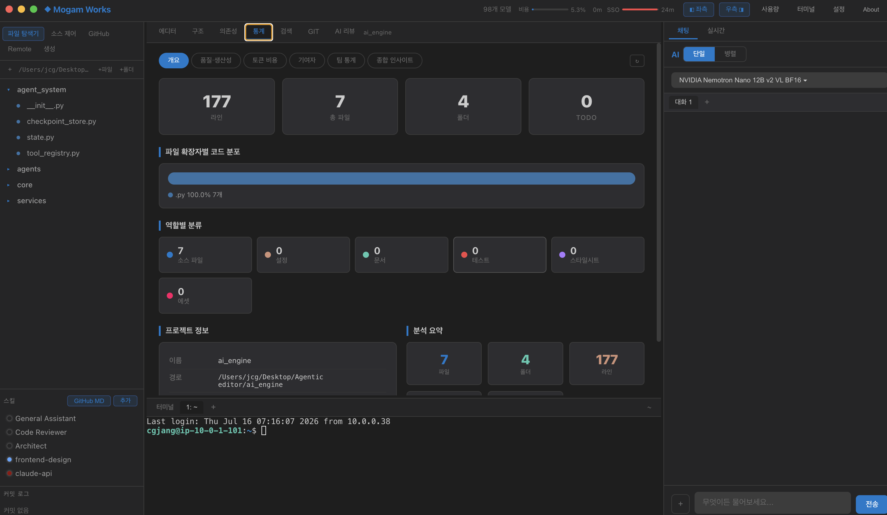 |
| 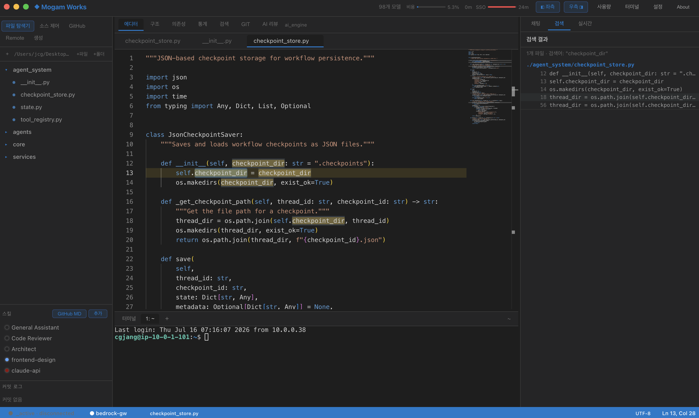 | 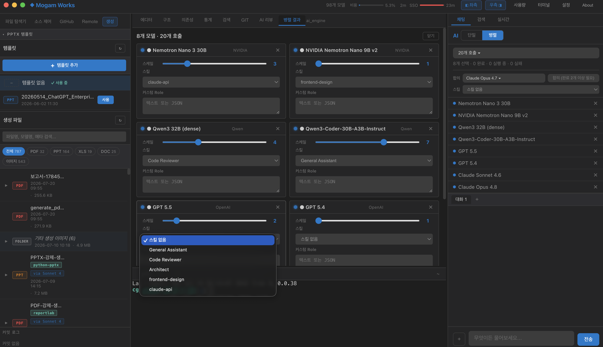 | 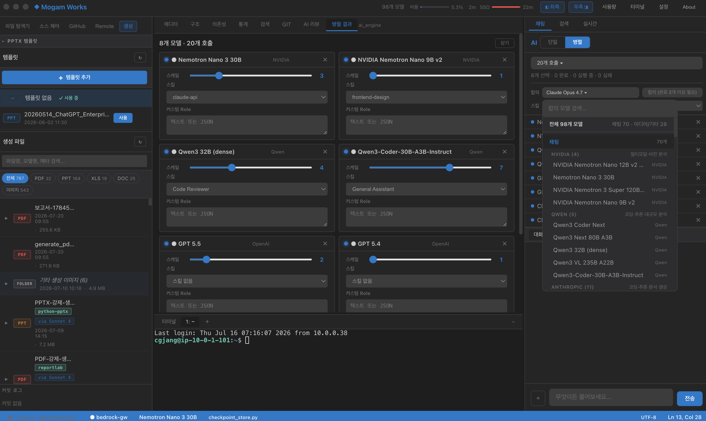 |
| 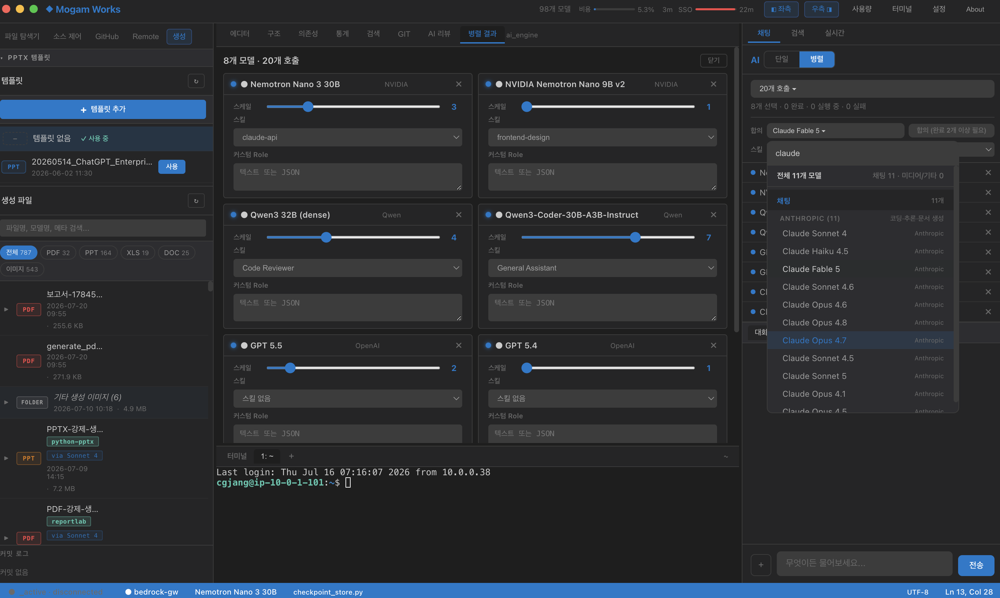 | 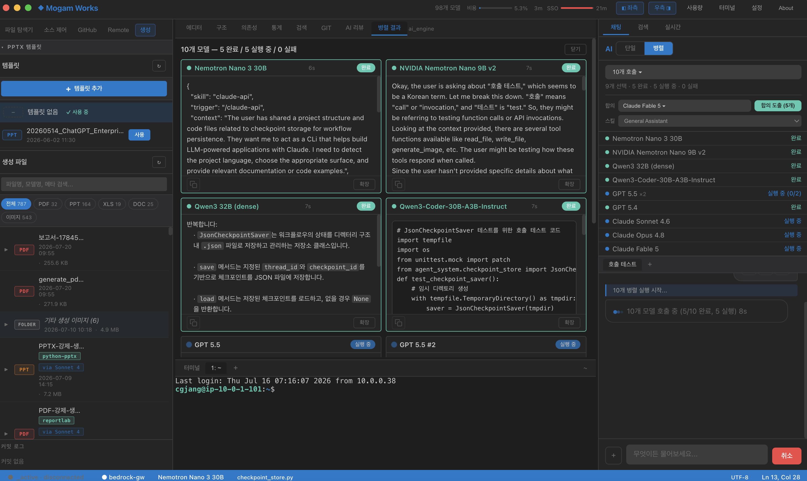 | 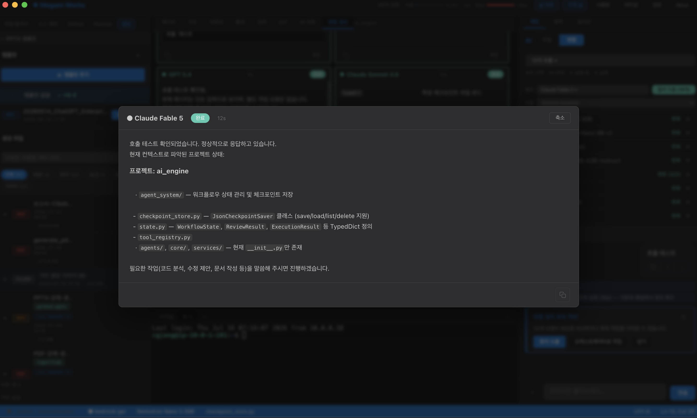 |
| 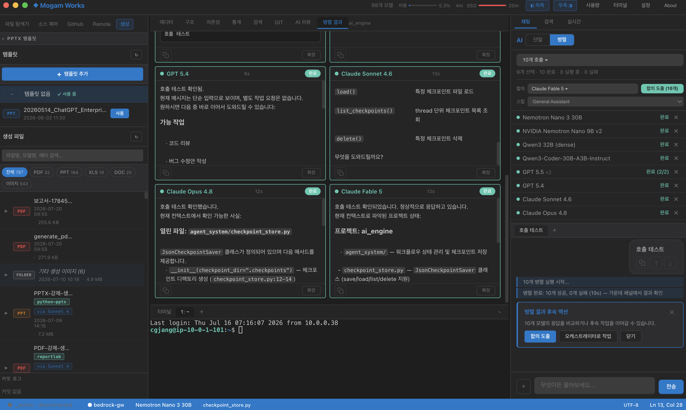 | 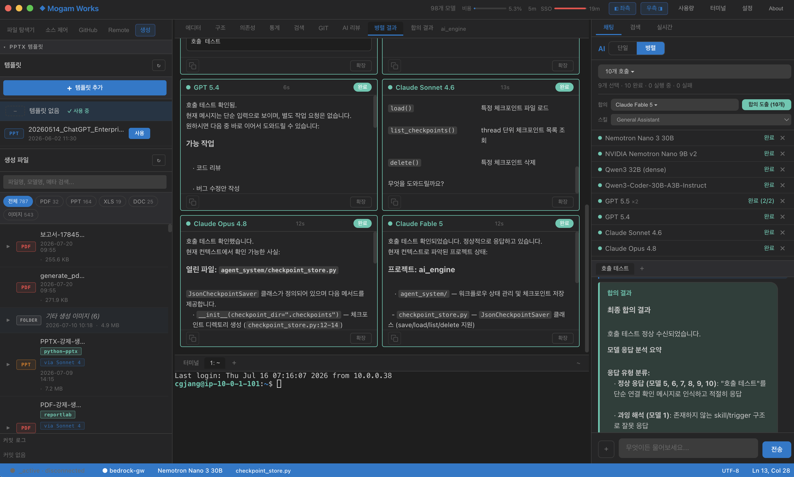 | |

---

## Features

### Editor
- Monaco Editor(VS Code 엔진) — 구문 강조, 자동완성, 미니맵
- 파일 탐색기 — 인라인 생성/수정/삭제
- 프로젝트 전체 코드 검색 — 결과 클릭 시 해당 라인 이동 및 강조
- 파일 저장(Cmd+S), 수정 표시
- 다크/라이트 테마, 글자 크기 조절
- 통합 터미널(node-pty) — 실제 셸(PTY) 기반 입출력

### AI Chat
- 에이전트 모드 — LLM이 도구를 자율 사용해 작업 수행(도구 루프)
- 단일 호출 — 도구 사용 가능한 단일 모델 호출
- 병렬 호출 — 여러 모델 동시 호출, 가운데 패널 카드로 결과 비교
- 합의 도출 — 고차원 모델이 병렬 응답을 분석해 최종 합의, 합의 모델로 대화 이어가기
- 대화 히스토리 — 세션별 격리, 모드 전환 시 맥락 유지
- 스트리밍 fast-path — 토큰 단위 in-place 갱신(깜빡임 최소화)

### Agent Tools (서버 측)
에이전트 모드에서 LLM이 자율 호출하는 도구:

| 도구 | 설명 |
|------|------|
| `read_file` | 파일 내용 읽기 |
| `write_file` | 파일 생성/덮어쓰기 |
| `list_directory` | 디렉토리 목록 |
| `run_command` | 셸 명령 실행 |
| `search_files` | 프로젝트 텍스트 검색(grep) |
| `generate_image` | 텍스트 프롬프트로 이미지 생성(Stability SD3.5 / Stable Image Core / Amazon Titan Image v2), PNG를 `.generated/`에 저장 |
| `edit_image` | 기존 이미지 편집. 모드 10종: inpaint, outpaint, upscale, remove-background, erase, search-replace, recolor, style-transfer, control-sketch, control-structure |

### Multi-Agent Orchestration
- LangGraph 기반 계층형 오케스트레이션: Coordinator → Planner(Opus) → Generator(Sonnet) → Evaluator(Opus)
- 워크플로당 반복 상한과 체크포인트 저장(재개 가능)
- grounding gate, depth router 등으로 응답 신뢰도/깊이 조절

### Media Generation
- 이미지 생성/편집: Bedrock 이미지 모델(Stability / Nova Canvas / Titan) 경유
- 이미지 생성 예외: 텍스트 정확도가 필요한 경우 `AE_ENABLE_VERTEX_IMAGE=1` 옵트인 시 Vertex AI 사용(사용자 결정 예외)
- 문서 생성: PPTX / PDF / DOCX / XLSX (네이티브 다이어그램 PPTX 포함)

### RAG (Retrieval-Augmented Generation)
프로젝트 코드를 인식한 답변을 위한 하이브리드 검색 파이프라인.

- 인덱싱: 함수/클래스 경계 기반 스마트 청킹, 파일 해시 변경 감지, 대용량 파일 스킵
- 임베딩: fastembed(ONNX, PyTorch 불필요) 다국어 모델 `paraphrase-multilingual-MiniLM-L12-v2`(384차원)로 한국어 질의 ↔ 영문 코드 교차언어 검색
  - fastembed 미가용 시 LSA(의미 검색)로 폴백, 명시 설정 시 어휘 TF-IDF 폴백
  - 오프라인 배포용으로 빌드 시 실행파일 옆 `fastembed_models/`에 모델 사전 번들
- 하이브리드 검색: 벡터 코사인 유사도 + BM25 키워드 가중 결합
- 컨텍스트 빌더: 열린 파일/프로젝트 경로 인식 후 시스템 프롬프트에 근거 주입

### Conversation Memory
- 일정 메시지 누적 시 자동 요약(빠른 모델 사용), 세션별 JSON 체크포인트 저장
- 요약 + 최근 원본 메시지 + 현재 질문으로 토큰 한도 내 맥락 유지
- Bedrock user/assistant 교대 규칙 자동 정리

### Remote SSH
- 원격 호스트에 파일/터미널 브리지로 접속(SSH config 파싱, 포트 할당, 자격 캐시)
- 로컬/원격 터미널 IPC 채널 동일 — 렌더러는 전송 방식에 무관

### Source Control / Analytics
- Git Graph, 브랜치 드롭다운 전환, dirty 체크
- 통계(개요, 품질/생산성, 토큰 비용, 기여자, 팀), AI 코드 리뷰(정적 분석), 의존성 분석, 실시간 모니터

### Infrastructure
- AWS SSO 인증 + BedrockUser assume-role
- 월간 사용량/한도 게이지, SSO 세션 만료 게이지
- 스킬 관리(영속성, GitHub MD import)
- 대화 세션 및 병렬/합의 결과 로컬 저장
- SSE idle timeout으로 스트림 끊김 자동 감지

---

## Tech Stack

| Layer | Technology |
|-------|-----------|
| Frontend | Electron + Vanilla JS + HTML + CSS |
| Editor | Monaco Editor |
| Terminal | node-pty (PTY) |
| Backend | Python 3.11+ / FastAPI / Uvicorn |
| LLM Gateway | AWS Bedrock Gateway (SigV4) + Lambda Function URL (SSE) |
| Orchestration | LangGraph 멀티에이전트 |
| RAG 임베딩 | fastembed(ONNX) 다국어 MiniLM (384d), LSA/TF-IDF 폴백 |
| 검색 | 벡터 코사인 + BM25 하이브리드 |
| Auth | AWS SSO + BedrockUser IAM Role (assume-role) |
| Storage | Electron userData(JSON) + localStorage |
| HTTP Client | httpx / urllib (비동기 SSE) |
| Packaging | electron-builder(DMG) + PyInstaller(동결 백엔드) |

---

## Quick Start (개발)

### Prerequisites
- Node.js 18+
- Python 3.11+
- AWS SSO 접근 권한(조직 SSO + `BedrockUser-{이름}` IAM role)

### Installation
```bash
git clone https://github.com/jangkops/Agentic-Editor.git
cd Agentic-Editor
npm install
python3 -m venv ai_engine/.venv
source ai_engine/.venv/bin/activate
pip install -r ai_engine/requirements.txt
```

### AWS SSO
```bash
aws sso login --profile bedrock-gw
```
로그인 후 앱에서 프로파일 선택 + BedrockUser 이름(예: `cgjang`)을 입력하면 모델 목록이 로드됩니다. 자격증명은 어떤 파일에도 저장하지 않고 런타임에 주입/assume-role로만 사용합니다.

### Run
```bash
npm run dev
```
`concurrently`로 Python 서버(uvicorn, 8765)와 Electron을 동시 실행합니다. 프론트엔드(`src/`, `electron/`) 수정은 Cmd+R 새로고침으로 반영되고, Electron 메인/Python 변경은 앱/서버 재시작이 필요합니다.

### Development Notes
- 서버는 `--reload --reload-dir ai_engine`로 실행되어 `ai_engine/*.py` 변경 시에만 리로드됩니다.
- `src/`, `electron/` 등 프론트엔드 수정은 서버에 영향이 없습니다(Cmd+R 새로고침).
- `NO_RELOAD=1 npm run dev`로 서버 auto-reload를 완전히 비활성화할 수 있습니다.

### Keyboard Shortcuts
`src/main.js`에 구현된 전역 단축키(실측):

| 단축키 | 동작 |
|--------|------|
| `Cmd/Ctrl+S` | 현재 파일 저장 |
| `Cmd/Ctrl+Shift+F` | 프로젝트 검색 |
| `Cmd/Ctrl+Shift+G` | Git 뷰 |
| `Cmd/Ctrl+Shift+S` | 통계 뷰 |
| `Cmd/Ctrl+Shift+L` | 원격 로그 열기(Show Remote Log) |
| `Cmd/Ctrl+B` | 사이드 패널 토글(Alt 조합 시 오른쪽) |
| `Esc` | 에디터로 복귀 |

---

## macOS 배포 (무서명 사내 배포)

이 빌드는 유료 Apple Developer 서명/공증을 사용하지 않는 사내 배포입니다.

### 빌드
```bash
npm run build:python                              # PyInstaller 동결 백엔드
npx electron-builder --mac --arm64 --publish never # arm64 DMG
```
- node-pty는 네이티브 모듈이라 대상 아키텍처(arm64)로 리빌드되어야 하며, 패키징 시 `asarUnpack`으로 asar 밖에 풀립니다.
- 현재 호스트에서 정상 빌드 가능한 대상은 Apple Silicon(arm64)입니다. Intel(x64)은 별도 Intel 러너에서 백엔드를 빌드해야 합니다.

### 설치 (수신자)
DMG와 `scripts/install-mac.command`를 같은 폴더에 두고 스크립트를 실행하면 DMG 마운트 → `/Applications` 복사 → quarantine 제거 → ad-hoc 서명이 자동 수행됩니다. 미서명 빌드라 첫 실행 시 Gatekeeper 경고가 있을 수 있어 스크립트로 우회합니다.

메신저 전달 시 주의: 파일을 개별로 전송하고, 폴더째/DMG를 zip으로 다시 압축하지 않습니다(한글 zip 압축 해제 실패 및 번들 손상 방지).

---

## Project Structure

```
agentic-editor/
├── electron/                     # Electron main process
│   ├── main.js                   # 윈도우, IPC 등록
│   ├── preload.js                # contextBridge API
│   ├── core/
│   │   ├── aws-sso-manager.js     # SSO 로그인/자격증명
│   │   ├── process-manager.js     # Python 백엔드 + 로컬 PTY
│   │   └── pty-worker.js          # PTY 워커(ABI 우회 대안)
│   └── src/
│       ├── ipc-terminal-handlers.js  # 터미널 IPC(로컬/원격 공통)
│       ├── ipc-*-handlers.js         # fs/git/project/sso/remote 핸들러
│       └── remote/                   # 원격 SSH 브리지(파일/터미널/큐/포트)
├── src/                          # Renderer(frontend)
│   ├── index.html
│   ├── main.js
│   ├── center-views.js
│   ├── components/               # web components
│   └── styles/                   # variables/layout/components.css
├── ai_engine/                    # Python backend
│   ├── server.py                 # FastAPI 엔드포인트, 에이전트 도구
│   ├── gateway_module.py         # Bedrock Gateway 클라이언트(SigV4, SSE, invoke-job 폴링)
│   ├── native_diagram_pptx.py    # 네이티브 다이어그램 PPTX
│   ├── slide_templates.py        # 슬라이드 템플릿
│   ├── agent_system/             # LangGraph 멀티에이전트
│   │   ├── supervisor.py
│   │   ├── graph_state.py
│   │   ├── deps.py
│   │   ├── grounding_gate.py
│   │   ├── checkpoint_store.py
│   │   ├── nodes/                # tool_node 등
│   │   └── subgraphs/            # coding/ops 등
│   └── rag/
│       ├── indexer.py            # 스마트 청킹/인덱싱
│       ├── embedder.py           # fastembed + LSA/TF-IDF 폴백
│       ├── hybrid_search.py      # 벡터 + BM25
│       ├── context_builder.py    # 시스템 프롬프트 주입
│       ├── verifier.py           # grounding 검증
│       └── eval_metrics.py
├── scripts/
│   ├── start_server.py           # uvicorn 시작
│   ├── setup-venv.js             # venv 자동 설정
│   ├── build-python.js           # PyInstaller 빌드 + 임베딩 모델 번들
│   └── install-mac.command       # macOS 설치 도우미
├── package.json
├── electron-builder.yml
└── README.md
```

---

## Key API Endpoints

| Method | Path | Description |
|--------|------|-------------|
| GET/HEAD | `/health` | 백엔드 헬스 체크 |
| GET/POST | `/api/models` | 사용 가능한 모델 목록 |
| POST | `/api/agents/run-stream` | 단일 모델 SSE 스트리밍 |
| POST | `/api/agents/run-agent` | 에이전트 모드 SSE(도구 실행 루프) |
| POST | `/api/agents/run-parallel` | 병렬 모델 SSE 스트리밍 |
| GET | `/api/quota` | BedrockUser별 월 사용량/한도 |
| POST | `/api/rag/index` | 프로젝트 인덱싱 트리거 |
| GET | `/api/rag/status` | RAG 인덱스 상태 |

### SSE Event Types (run-agent)

| Event | Format | Description |
|-------|--------|-------------|
| text delta | `{"text": "..."}` | LLM 응답 텍스트 조각 |
| tool start | `{"tool": "read_file", "input": {...}, "status": "running"}` | 도구 실행 시작 |
| tool done | `{"tool": "read_file", "output": "...", "status": "done"}` | 도구 실행 완료 |
| error | `{"error": "..."}` | 에러 메시지 |
| stream end | `[DONE]` | 스트림 종료 |

---

## Configuration

### Settings (`userData/settings/settings.json`)
```json
{
  "awsProfile": "bedrock-gw",
  "bedrockUser": "cgjang"
}
```
자격증명(accessKeyId/secretAccessKey)은 절대 저장하지 않습니다. 프로파일 이름과 게이트웨이 설정만 저장합니다.

### 주요 환경 변수
```bash
GATEWAY_URL=https://5l764dh7y9.execute-api.us-west-2.amazonaws.com/v1  # 게이트웨이(오버라이드 가능)
AWS_REGION=us-west-2
AE_EMBED_PROVIDER=fastembed        # RAG 임베딩 provider(기본 fastembed)
AE_ENABLE_VERTEX_IMAGE=1           # 이미지 생성 시 Vertex AI 옵트인(선택)
NO_RELOAD=1                        # 서버 auto-reload 비활성화(선택)
```

---

## License

Internal use only.
